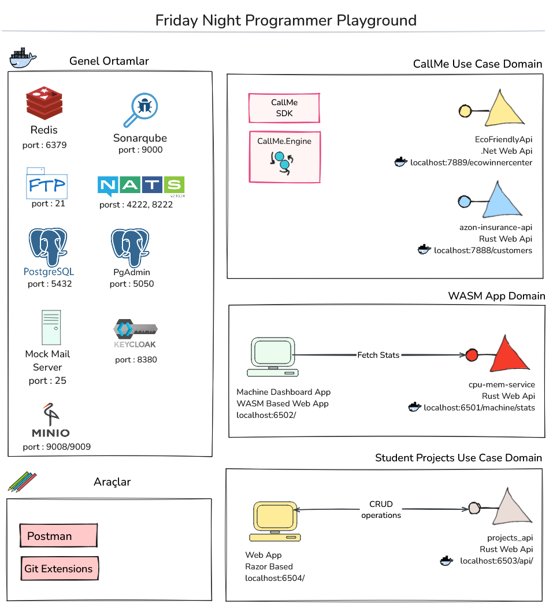

# Friday Night Programmer

Bu sene boyunca yapacağımız Friday Night Programmer çalışmalarını toplayacağımız genel repodur.

- [Friday Night Programmer](#friday-night-programmer)
  - [Önsöz](#önsöz)
  - [Oyun Sahası Hakkında](#oyun-sahası-hakkında)
  - [Yardımcı Dokümanlar](#yardımcı-dokümanlar)
  - [Chapter 00 - Hello World](#chapter-00---hello-world-3-0cak-2025-cuma-2130---2230)
  - [Chapter 01 - A New Hope](#chapter-01---a-new-hope-10-ocak-2025-cuma-2130---2230)
  - [Chapter 02 - War Games](#chapter-02---war-games-17-ocak-2025-cuma-2130---2230)
  - [Chapter 03 - Ready, Player One](#chapter-03---ready-player-one)
  - [Chapter 04 - Enemy at the Gates](#chapter-04---enemy-at-the-gates)
  - [Chapter 05 - Back to the Future](#chapter-05---back-to-the-future)
  - [Chapter 06 - Memento](#chapter-06---memento)
  - [Chapter 07 - Johnny Mnemonic](#chapter-07---johnny-mnemonic)
  - [Chapter 08 - Return of the King](#chapter-08---return-of-the-king)

## Önsöz

Yeni yıl planlarım arasında yer alan ve çok uzun zamandır gerçekleştirmek istediğim bir canlı yayın serisi var. Her cuma gecesi kendimi geliştirmek, tecrübelerimi aktarmak, bilgilerimi pekiştirmek ve tartışmak için çalışma masamın başında olmayı planlıyorum. Programın misyonu ve içeriği aşağıdaki gibidir.


## Oyun Sahası Hakkında

Friday Night Programmer uzun soluklu bir çalışma alanı. Tek bir proje değil de birden fazla konuyu ele almak için, çeşitli pratikler ve kod antrenmanları yapmak için kullandığım bir alan. Bu oyun sahasında zaman içerisinde birçok eklenti, yardımcı araç veya fikir gündeme gelecek. Bu eklemeler yeni ihtiyaçları da beraberinde getirecek. Örneğin sisteme eklediğim bağımsız servis sayısı arttıkça bunların kolayca keşfedilmesini sağlamak için _(Service Discovery)_ Consul aracına ihtiyaç olacak. Ya da genel bir ftp ortamı için bir docker imajı gerekecek. Dolayısıyla oyun sahası zamanla genişleyecek. İçeriye alınan enstrümanları göz önüne aldığımızda aşağıdaki gibi bir High Level Diagram göz önüne alabiliriz.



Genel Ortamlar başlığı altında yer alan enstrümanlar docker-compose üzerinden kullanılır. [docker-compose.yml](docker-compose.yml) dosyasını inceleyebilirsiniz. Docker içeriklerini ayağa kaldırmak için aşağıdaki komutu çalıştırmak yeterlidir. Elbette sistemde docker'ın yüklü olduğunu varsayıyorum.

```shell
docker-compose up -d
```

Bununla birlikte servislerin sayısı arttıkça onları nasıl çağırdığımızı da unutabiliriz. Var olan ve ilerleyen zamanlarda eklenemsi düşünülen servisler için bir Postman koleksiyonundan yararlanılması iyi olacaktır. İlgili dosyaya [buradan](Friday%20Night%20Programmer.postman_collection.json) ulaşabilirsiniz.

## Yardımcı Dokümanlar

Sezon boyunca yardımcı olabilecek bazı dokümanlar, araçlar, gereçler...

- Bölümlerde ele alınacak ana senaryolar [Use Cases](./documents/UseCases.md) isimli dokümanda yer almaktadır.
- Sezon boyunca birçok dummy uygulamaya ihtiyacımız olacak. Dummy servisler, veritabanları, docker imajları vs Bunlara ait özet bilgileri [Utilities](./documents/Utilities.md) dokümanında bulabilirsiniz.

Diğer yandan bazı işlerimizi kolaylaştıracak rehber niteliğindeki how to dokümanları da aşağıdaki listede toplanabilir.

- [Pub/Sub mesajlaşma için Nats Kullanımı(Rust ile)](./documents/HowToNats.md)
- [Rust ile WASM Kullanımında İkinci Round](./documents/RustAndWasmRoundTwo.md)
- [Rust ile WASM Kullanımı](./documents/RustAndWasm.md)
- Popüler **git branch** stratejilerinden olan git flow hakkında bilgi almak için [GitFlowIntroduction](./documents/GitFlowIntroduction.md) isimli dokümana bakabilirsiniz.

## Chapter 00 - Hello World _(3 0cak 2025 Cuma, 21:30 - 22:30)_

[Yayın Linki](https://www.youtube.com/live/K8ygZKn5zGQ?si=YqwmemtXDX4JOxp_)

Bu ilk yayınımız tanışma ile geçti. Yayın sırasında aşağıdaki başlıklara değindiğimiz oldu.

- [Northwind veritabanı](https://support.content.office.net/en-us/media/559a04f2-11b2-44b8-ae4a-92284d1576bd.png) Hatta Microsoft github reposunda çalışabileceğimiz popüler veritabanları için script'ler de yer alıyor. [Northwind](https://github.com/microsoft/sql-server-samples/blob/master/samples/databases/northwind-pubs/instnwnd.sql), [Contoso](https://github.com/microsoft/sql-server-samples/blob/master/samples/databases/contoso-data-warehouse/load-contoso-data-warehouse-to-sql-data-warehouse.sql), [pubs](https://github.com/microsoft/sql-server-samples/blob/master/samples/databases/northwind-pubs/instpubs.sql)
- İlk paramı kazandığım zamanının ötesinde olan geliştirme aracı [Delphi](https://winworldpc.com/product/delphi/2x)
- Yayın sırasında önerdiğim [Mark J.Price'ın Tools and Skills for .NET 8 kitabı](https://www.amazon.com/Tools-Skills-NET-practices-solutions/dp/183763520X)

Yayının ilerleyen kısımlarında şu konu üzerinde durmaya çalıştık. Managed/Unmanaged ortamlar ve burada Rust'ın konumu. C# ve Java gibi managed environment'ler üzerinde koşan diller esasında line of business diye ifade edebileceğimiz iş çözümlerinin hızlı, az hatayla geliştirilmesinde endüstriyel olarak kendilerini kanıtlamış diller. Bu ortamlar belleği bizim için yönetir ve GC _(Garbage Collector)_ gibi mekanizmalar kullanılmayan referansların bellekten düşürülmesini unutmamızı engeller _(en basit anlamda)_ Java ve C# kodları derlendiğinde bir ara kod çıktısı oluşur ve bir çalışma zamanı _(runtime)_ bu kodları yürütür. Bu çalışma zamanı olası program çökmelerine karşı istisnaları _(exception)_ yönetmemizi de sağlar. Tür güvenliği _(type safety)_ söz konusudur, geniş kütüphane desteği ile birçok işlevi kolayca gerçekleştirmemizi sağlarlar.


Ancak uzaya gönderdiğimiz bir mekiğin yörünge hesaplama modülü ve bağlı sistemlerinde, ya da az enerji tüketimi ile yüksek hesaplama sürelerine çıkmamız beklenen akıllı bir donanım modülünde, gömülü sistemlerin çoğunda, makinelerin programlamasında pek fazla tercih edilmezler. Burada devreye unmanaged ortamlarda koşan C, C++ gibi diller giler. Ne varki bu dillerde kodlama yapmak epey külfetli olabilir. Memory optimazasyonunu çok ileri seviyede yapabilsekde referansların yönetimi kolay değildir. Kullanılmayan bir referansı bellekte düşürmeyi unutmaya görün veya boşaltılmış bir bellek alanına referans eden başka bir atamayı gözden kaçırmaya görün... Olaylar karışabilir ve aşağıdaki gibi bir çok sorun tarihe altın harflerle kazınabilir.


Görsel DevNot Summit 2023'te yaptığım Rust dili sunumuna aittir. İşte tam bu notkada hızlı geliştirme yapmamızı sağlayan güvenli ortamlarla, yüksek hız ve performansa kavuşabildiğimiz ama geliştirmenin görece zor olduğu ortamlar arasında kalırız. Rust tam orta noktada her iki tarafın ihtiyaçlarını giderebilecek kadar güçlü çözümlerle gelir. Unmanaged ortamlarda karşılaşabileceğimiz ve yukarıdaki görselde ifade edilen birçok hatayı henüz derleme _(compile time) aşamasında engeller. Rust dilinin Sustainability Software Engineering tarafında da önemli bir yeri vardır hatta bu konuyu ilk olarak Amazon [şu makalesinde](https://aws.amazon.com/blogs/opensource/sustainability-with-rust/) ele almıştır. Diğer yandan rust dilinin yazılım güvenliği açısından birçok açığa karşı etkili bir çözüm olduğu ifade edilebilir.

_Yayın sırasında Rust programlama dilinin bu kadar çok reklamını yapmadım elbette._

İlk programımız bu şekilde sonlandı diyebilirim. Yayın sırasında her ne kadar sürçü lisan ettiysem affola diyeyim. Bir sonraki canlı yayında görüşmek ümidiyle.

## Chapter 01 - A New Hope _(10 Ocak 2025 Cuma, 21:30 - 22:30)_

[Yayın Linki](https://youtube.com/live/h5H11RjS298)

Bu programda aşağıdaki konulardan bahsettik.

- 20 Nisan 2025'te Rust Türkiye konferansı gerçekleştirilecek. Uluslararası diğer konferansları da takip etmek için [bu adrese](https://corrode.dev/blog/rust-conferences-2025/#rust-konf-turkiye) bakabilirsiniz.
- Özellikle yurt dışında Rust diliyle ilgili farklı ve heves uyandıran iş ilanları var. [Burada uydu sistemleri için](https://lynk.world/careers/?ashby_jid=9e9385e1-a6e5-4ccb-8cb7-6d3b9af1cd88), [şurada NASA'nın çekirdek uçuş yazılım çatısı için](https://stemgateway.nasa.gov/s/course-offering/a0BSJ000000KS9p2AG/flight-software-in-rust) ilgili ilanlar bulunuyor. Ayrıca [MIT tarafında](https://careers.ll.mit.edu/search/?createNewAlert=false&q=rust) da epeyce Rust geliştiricisi aranmakta. _(Yalnız şunu belirtmek isterim. İlanlar güncelliğini yitirebilir ve sayfalara ilerleyen zamanlarda erişilemeyebilir)_
- [Rust In Space! How Rust is powering next-generation space mission simulators](https://www.howtocodeit.com/articles/rust-in-space) isimli oturum hakkında bilgiler verildi.
- Doom oyununu uzayda bir uyduda çalıştırdılar :) [Bu keyifli sunumu](https://www.youtube.com/watch?v=GPHDbVPlmMk) kaçırmayın derim.
- Bu bölüm tavsiye ettiğim kitap Karel Çapek'ten Rossum'un Uluslararası Robotları.
- Akışın kalan kısmında Git Flow stratejisinden bahsettik. Bu konu ile ilgili [Git Flow Introduction](GitFlowIntroduction.md) dokümanına bakabilirsiniz.
- Son bölümde Çağrı Merkezi vakasını ele almaya başladık. Geliştirmeleri genel olarak call-me-sdk isimli feature üstünde yapacağız.

## Chapter 02 - War Games _(17 Ocak 2025 Cuma, 21:30 - 22:30)_

[Yayın Linki](https://youtube.com/live/Pe0iihvA6QE)

Bu programda aşağıdaki konulardan bahsettik.

- Tavsiye edeceğim kitap Harry Harrison'dan Yer Açın! Yer Açın! Hatta 1973 yılında [Soylent Green](https://www.imdb.com/title/tt0070723/) olarak da sinemaya uyarlanmış.
- Bahsettiğimiz 1984 Eylül tarihli Sinclair Programs dergisi için [şu adrese](https://ia601006.us.archive.org/2/items/sinclair-programs-23/SinclairPrograms23-Sep84.pdf) uğrayabilir ve derginin tamamına ulaşabilirsiniz.
- Dotty The Kangroo isimli oyun üzerine güzel bir video ve Ian McTavish'i bulma macerası için [şu videoya](https://www.youtube.com/watch?v=EbFN5dS_iuU) bakılabilir. İlgili oyunu oynamak isterseniz de [buradaki](https://spectrumcomputing.co.uk/entry/40761/ZX-Spectrum/Dotty_the_Kangaroo) emulatorlerden yararlanabilirsiniz.
- Rust'ı 100 örnek ile öğrenmek isterseniz güzel bir doküman var. [İşte burada](https://rust-exercises.com/100-exercises/)
- Google'ın Android takımı için hazırladığı [Rust eğitim dokümanı](https://google.github.io/comprehensive-rust/bare-metal.html) oldukça doyurucu.
- Google'ın kapattığı projeleri öğrenmek isterseniz bir [mezarlık](https://killedbygoogle.com/) var.
- Web sitelerinde kullanıcıların en sevmediği şey sanırım 404 hatası almak. Ancak bunu da [kullanıcı dostu hale](https://www.creativebloq.com/web-design/best-404-pages-812505) getiriyorlar.
- Readme dokümanlarını hazırlarken yazı stillerini düzenlemekte kullanabileceğimiz kavramların özetine [buradan](https://docs.github.com/en/get-started/writing-on-github/getting-started-with-writing-and-formatting-on-github/basic-writing-and-formatting-syntax) ulaşabilirsiniz.
- .Net platformu için kullanılabilecek araçların [derlenmiş bir listesi](https://github.com/quozd/awesome-dotnet?tab=readme-ov-file#tools) Arada sırada güncellense de topluca türlü bilgilere ulaşabileceğimiz bir alan.

## Chapter 03 - Ready, Player One

## Chapter 04 - Enemy At The Gates

## Chapter 05 - Back to the Future

## Chapter 06 - Memento

## Chapter 07 - Johnny Mnemonic

## Chapter 08 - Return of the King
