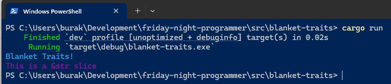
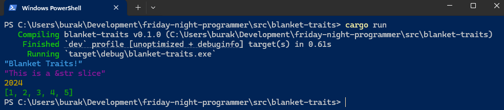

# Blanket Trait Kavramı

Rust dilinde trait kullanarak türler için genel davranışlar tanımlayabiliriz. Ancak bazı durumlarda belli özelliklere sahip tüm türler için ortak bir trait uygulamak da isteyebiliriz. Bu gibi durumlarda **Blanket Trait** 'ler kullanılabilir. Blanket Trait, belirli bir trait'i uygulayan tüm türler için otomatik olarak uygulanır. Örneğin, Rust'ın standart kütüphanesinde bulunan **Clone** trait'i, **Copy** trait'ini uygulayan tüm türler için otomatik olarak uygulanır. Bu sayede, bir tür **Copy** trait'ini uyguladığında, aynı zamanda **Clone** trait'ini de kazanır.

Konuyu biraz daha iyi anlamak için önce basit trait tanımlayıp kullanalım.

```rust
trait ColorizedPrint {
    fn colorized_print(&self, color_code: &str) -> String;
}

impl ColorizedPrint for String {
    fn colorized_print(&self, color_code: &str) -> String {
        format!("\x1b[{}m{}\x1b[0m", color_code, self)
    }
}

impl ColorizedPrint for &str {
    fn colorized_print(&self, color_code: &str) -> String {
        format!("\x1b[{}m{}\x1b[0m", color_code, self)
    }
}

fn main() {
    let message = String::from("Blanket Traits!");
    println!("{}", message.colorized_print("36"));

    let slice = "This is a &str slice";
    println!("{}", slice.colorized_print("35"));
}
```

Bu basit ve anlamsız örnekte String ve &str türlerine uygulanan **ColorizedPrint** isimli bir trait var. Trait, bir metnin belli bir renk formatında yazdırılmasını sağlayacak davranışını tanımlıyor. Daha sonra bu trait'i String ve &str türlerine uyguluyoruz. İşte blanket trait kullanarak bu işlemi generic tür üzerinden genelleştirebiliriz. Tek yapmamız gereken hangi ortak davranış için bu trait'in uygulanacağını belirtmek. Yani yukarıdaki örneği aşağıdaki hale çevirmek.

```rust
trait ColorizedPrint {
    fn colorized_print(&self, color_code: &str) -> String;
}

impl<T> ColorizedPrint for T
where
    T: AsRef<str>,
{
    fn colorized_print(&self, color_code: &str) -> String {
        format!("\x1b[{}m{}\x1b[0m", color_code, self.as_ref())
    }
}

fn main() {
    let message = String::from("Blanket Traits!");
    println!("{}", message.colorized_print("36"));

    let slice = "This is a &str slice";
    println!("{}", slice.colorized_print("35"));
}
```

Burada impl bloğunda `AsRef<str>` trait'ini uygulayan tüm türler için ColorizedPrint trait'ini uygulamış olduk. Böylece **String** ve **&str** türleri için ayrı ayrı **impl** blokları yazmamıza gerek kalmadı. Blanket trait'ler, kod tekrarını azaltır ve bakımını kolaylaştırır. Ancak dikkat edilmesi gereken nokta, blanket trait'lerin aşırı kullanımı karmaşıklığa yol açabilir ve derleme zamanını artırabilir. Her iki örneğin de çalışma zamanı çıktısı aşağıdakine benzer olacaktır.



Bu örneği biraz daha farklılaştırabiliriz. Örneğin Debug trait'ini uygulayan tüm türler için ColorizedPrint trait'ini uygulayabiliriz. Tek yapmamız gereken kodu aşağıdaki gibi değiştirmektir.

```rust
trait ColorizedPrint {
    fn colorized_print(&self, color_code: &str) -> String;
}

impl<T> ColorizedPrint for T
where
    T: std::fmt::Debug,
{
    fn colorized_print(&self, color_code: &str) -> String {
        format!("\x1b[{}m{:?}\x1b[0m", color_code, self)
    }
}

fn main() {
    let message = String::from("Blanket Traits!");
    println!("{}", message.colorized_print("36"));

    let slice = "This is a &str slice";
    println!("{}", slice.colorized_print("35"));

    let number = 2024;
    println!("{}", number.colorized_print("33"));

    let numbers = vec![1, 2, 3, 4, 5];
    println!("{}", numbers.colorized_print("32"));
}
```

Bu kodun çalışma zamanı çıktısı aşağıdaki gibi olacaktır.



Özetle, blanket trait'leri birçok farklı tür için aynı davranışı yazmak istediğimizde kullanabiliriz. Hatta bu konuda da güzel bir söz vardır. "Aynı implementasyon bloğunu birçok tip için kopyalayacağım yahu". İşte bunu dememek için blanket trait'ler ele alınabilir. Yine de ortada bir soru işaret vardır. Blanket Trait yerine neden generic bir fonksiyon kullanmayalım? Yani yukarıdaki işlevselliği pekala aşağıdaki gibi de yazabilirdik.

```rust
fn colorized_print<T>(item: &T, color_code: &str) -> String
where
    T: std::fmt::Debug,
{
    format!("\x1b[{}m{:?}\x1b[0m", color_code, item)
}

fn main() {
    let message = String::from("Blanket Traits!");
    println!("{}", colorized_print(&message, "36"));

    let slice = "This is a &str slice";
    println!("{}", colorized_print(&slice, "35"));

    let number = 2024;
    println!("{}", colorized_print(&number, "33"));

    let numbers = vec![1, 2, 3, 4, 5];
    println!("{}", colorized_print(&numbers, "32"));
}
```

Değil mi? :D Sonuçta aynı işi görüyor gibi duruyor. Tabii burada bir tipin arkasına nokta ifadesinden sonra ilgili davranışın gelmesi yerine bir fonksiyon çağrısı ile bu gerçekleştiriliyor. Açıkçası bu tip bir ihtiyaç için ben blanket trait kullamayı tercih edebilirim zira kod okunurluğunu artırma noktasına daha iyi duruyor. Ama asıl nedeni henüz cevaplayamadığımı da belirtmek isterim.
