# Pi Sayısını Hesaplama Yolunda (Draft)

[Güncel Makale için şöyle buyrun](https://buraksenyurt.github.io/2026/03/26/pi-sayisini-hesaplama-yolunda/)

Matematiksel yöntemlerden bazılarını ele alarak belli bir basamağa kadar **pi *(π)*** sayısını hesaplamaya çalışacağım. Doğru bir basamak değerine ulaşmak ve burada yüksek sürate çıkmak hedeflerim arasında. Önce en amele yöntemlerden başlayarak daha sonra daha karmaşık yöntemlere geçmek niyetindeyim ama yol beni farklı bir rotaya sürükledi diye de özet geçeyim :D Diğer modellere geçemeden kendimi diller arasında performans hesaplamaları, optimizasyonlar ve senkronizasyon sorunlarıyla uğraşırken buldum. O yüzden bu yazıda sadece Monte Carlo yöntemini ele alacağım.

Kapsam

- [x] Dart oynamayı severiz. Monte Carlo ile başlayalım.
- [x] Paralel hesaplama yöntemlerini kullanarak performansı artırmaya çalışalım.
- [x] Race Condition'ları ve diğer senkronizasyon sorunlarını ele alarak kodumuzu optimize edelim.
- [ ] Chudnovsky algoritması ve ardından Gauss-Legendre algoritmasını deneyelim.

## Sistem

Çalışmadaki deneyleri aşağıdaki özelliklere sahip bir sistemde gerçekleştirdim.

| Donanım | Detaylar |
| ------- | ------- |
| İşlemci | 12th Gen Intel(R) Core(TM) i7-1255U, 1700 Mhz, 10 Core(s), 12 Logical Processor(s) |
| Bellek | 32 GB |
| İşletim Sistemi | Windows 11 Pro |

## Önce Kısa bir Matematika ve Monte Carlo Seyahati

**Pi *(π)***, bir dairenin çevresinin çapına oranı olarak ifade edilebilir. Yaklaşık olarak ve genelde ezberlediğim değeri *3.14159* olarak bilinir ancak aslında sonsuz bir ondalık dizisine sahiptir ve tam değeri bilinmemektedir. **Pi *(π)*** sayısını kutlamak için özel bir gün bile vardır: 14 Mart, yani 3/14...

Bir çılgınlık yaparak kodlarımızı deterministik olmayan bir metodoloji ile yazabiliriz. **Monte Carlo** yöntemine göre pi sayısının hesaplanması için bir çembere ve rastgele iki double değere ihtiyacımız var. Rastgele değerlerin bir bileşimi çemberin içine düşerse, **pi *(π)*** sayısının yaklaşık değeri için bir tahmin yapılabilir. Tabii burada kullanmamız gereken bir formül ve iterasyon sayısı var. Öyleyse vakit kaybeden kodlamaya başlayalım.

## Temiz, Sequential Versiyon

İşte en amatöründen bir **C#** kod örneği.

```csharp
using System.Diagnostics;

public class Program
{
    public static void Main()
    {
        long totalIterations = 100_000_000;
        Stopwatch stopwatch = Stopwatch.StartNew();
        for (int i = 0; i < 10; i++)
        {
            stopwatch.Restart();
            int inCircle = (int)PiEstimatorV1(totalIterations);
            Console.WriteLine($"Estimated value of π: {4.0 * inCircle / totalIterations} in {stopwatch.ElapsedMilliseconds} ms");
        }
    }

    public static long PiEstimatorV1(long iterations)
    {
        long inCircle = 0;
        var random = new Random();

        for (int i = 0; i < iterations; i++)
        {
            double x = random.NextDouble();
            double y = random.NextDouble();
            if (x * x + y * y <= 1.0)
            {
                inCircle++;
            }
        }
        return inCircle;
    }
}
```

Kendi sistemimde normal **dotnet run** koşusuyla elde ettiğim sonuçlar şöyle *(Özellikle dotnet run komutuna dikkat çekmek isterim. İlerleyen bölümlerde release modun nasıl farklar yarattığını göreceğiz)*:

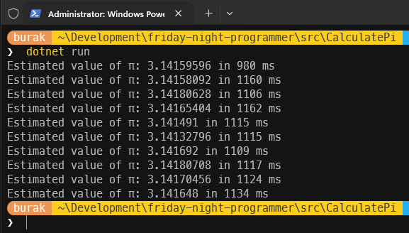

Yaklaşık **1000 milisaniye** civarında bir sürede **3.14** etrafında dolandığımızı söyleyebilirim. Burada gayet senkron bir şekilde tek thread kullanarak hesaplama yapıyoruz. Devam etmeden önce rastgele değerlerin çember içerisinde kalıp kalmama formüllerini daha şık yazabilirmiyim diye düşündüm ve **Math** sınıfının **Pow** metodunu kullanarak kodu biraz daha okunabilir hale getirdim.

```csharp
if (Math.Pow(x, 2) + Math.Pow(y, 2) <= 1.0)
{
    inCircle++;
}
```

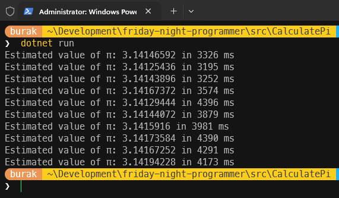

Biraz göreceli de olsa **Math** sınıfının statik **Pow** metodunu kullanmak kodun okunabilirliğini artırıp amacını daha şık ifade etse de süreler neredeyse üç kata kadar arttı. Yol yakınken geri dönme vakti.

### Iterasyon Sayısı Artıyor, Paralel Çalışma Geliyor

İlk metodolojimize göre 100 milyon iterasyon bu sistemde kabul edilebilir bir ortalama çalışma süresi yakaladı ancak daha yüksek ve tutarlı bir hesaplama için iterasyon sayısını artırmak yerinde olur. Bu yüzden 1 milyar iterasyonu deneyebiliriz. İşte sonuçlar.

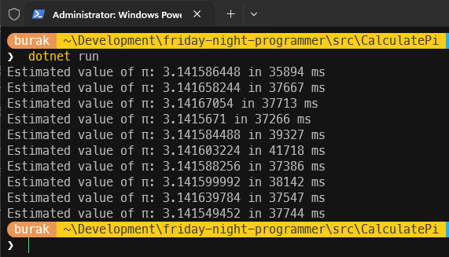

"Gerçekten bu kadar süre bekledin mi?" diye sorabilirsiniz. Evet, bekledim :D İterasyon sayısının büyümesi hesaplama süresini çok daha dramatik olarak artırdı(ama hala dotnet'i debug modda işletiyoruz onu da belirtelim)* Dolayısıyla bir şeyleri paralel hale getirmenin ve pek tabii bunu da güvenli *(thread-safe)* ve *race condition* sorunlarından kaçınarak yapmanın zamanı geldi. Aslında **for** döngüsünü paralel hale getirebiliriz ve tahminen oluşabilecek **race condition** sorununu da **Interlocked** sınıfını kullanarak çözebiliriz. İşte paralel hale getirilmiş ve güvenli bir şekilde sayaç artırdığını düşündüğüm kod parçası.

```csharp
public static long PiEstimatorV2(long iterations)
{
    long inCircle = 0;
    var random = new Random();

    Parallel.For(0, iterations, i =>
    {
        double x = random.NextDouble();
        double y = random.NextDouble();

        if (x * x + y * y <= 1.0)
        {
            Interlocked.Increment(ref inCircle);
        }
    }
    );
    return inCircle;
}
```

Japon bir kılıç ustasının sakince kata yaparken ki ruh haline bürünüp sabırla beklesem de ilk iki çalışma süresini görünce programın çalışmasını sonlandırdım.

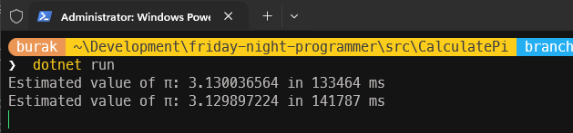

Bir şeylerin ters gittiği hatalı kodlama yaptığım gün gibi ortada. Hatta işin çok daha enterasan yani paralel for döngüsünü bir kenara bırakıp sadece **Interlocked** nesnesini kullanınca ortaya çıktı.

```csharp
public static long PiEstimatorV3(long iterations)
{
    long inCircle = 0;
    var random = new Random();

    for (int i = 0; i < iterations; i++)
    {
        double x = random.NextDouble();
        double y = random.NextDouble();

        if (x * x + y * y <= 1.0)
        {
            Interlocked.Increment(ref inCircle);
        }
    }
    return inCircle;
}
```

Şaşılacak şey ama sadece **Interlocked** sınıfını kullanarak sayaç artırmaya çalışmak daha iyi sonuçlar verdi. Fakat bu sefer de paralel çalışmanın avantajını tam olarak kullanmadık/kullanamdık.

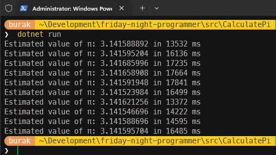

### Thread-Local Random ve Daha İyi Paralel Çalışma

Sanki doğru yolda ilerliyor gibiyim ama tam olarak değil. **Interlocked** sınıfı thread'ler arası güvenli bir şekilde sayacı artırmamızı sağlasa da, paralel çalışacak her bir iterasyonda bu işlemi yapmak ciddi bir performans kaybına neden oluyor gibi. Çünkü her bir thread'in sayaç değerini güncellemesi gerektiğinde diğer thread'lerin de bu değere erişmeye çalışması bir tür beklemeye sebep oluyor. Dolayısıyla her bir thread'in kendi sayaç değerini tutması ve en sonunda bu değerleri birleştirmek daha doğru olacak. O zaman birde aşağıdaki kod parçasını deneyelim.

```csharp
public static long PiEstimatorV4(long iterations)
{
    long inCircle = 0;
    using var tlRandom = new ThreadLocal<Random>(() => new Random());

    Parallel.For(
        0L,
        iterations,
        () => 0L,
        (_, _, localCount) =>
        {
            var rng = tlRandom.Value!;
            double x = rng.NextDouble();
            double y = rng.NextDouble();
            return x * x + y * y <= 1.0 ? localCount + 1 : localCount;
        },
        localCount => Interlocked.Add(ref inCircle, localCount)
    );

    return inCircle;
}
```

**tlRandom** isimli **ThreadLocal** sınıfını kullanarak her bir thread'in kendi rastgele sayı üreteci örneğine sahip olmasını sağlıyoruz. Bu sayede her bir thread'in kendi sayaç değerini tutması ve sonunda bu değerleri güvenli bir şekilde birleştirmesi mümkün hale geliyor. **Paralel for** döngüsü bu örnekte tam beş parametre almakta. Dile kolay tam beş, iki tane daha alsa **Sonarqube**'e takılır herhalde :D

İlk iki parametre iterasyon aralığını tanımlarken *(0'dan maksimum iterasyon değerine kadar)*, üçüncü parametre her bir thread için hesaplama değerinin başlangıç değerini belirliyor. Dördüncü parametre her bir iterasyonda çalışacak olan metodu temsil ediyor ki burada **Monte Carlo** simülasyonu yapılmakta ve bu metod her bir thread'in kendi sayaç değerini güncelliyor. Son parametre ise tüm thread'lerin sayaç değerlerini güvenli *(thread-safe)* bir şekilde birleştirmek için kullanılan metodu işaret ediyor.

Peki ya çalışma zamanı çıktısı...

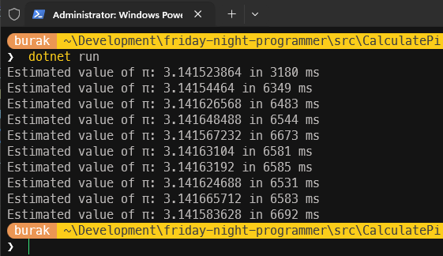

### Gerçek Çekirdek Sayısına Göre Bölme

Not bad, not bad! Hesaplama süreleri daha makul bir noktaya geldi. Ancak daha şık bir tasarıma veya modele gidebilir miyiz diye de düşünüyorum. Paralel for döngüsünde kalıp makinedeki çekirdek sayısını da hesaba katarak ilerlemek mantıklı olabilir. Yani her çekirdeğin kendi sayaç değerini tutması ve sonunda bu değerlerin birleştirilmesi gibi bir yaklaşım daha verimli olabilir. Bu amaçla aşağıdaki kod parçasını ele alabiliriz.

```csharp
public static long PiEstimatorV5(long iterations)
{
    int coreCount = Environment.ProcessorCount;
    long chunkSize = iterations / coreCount;
    long inCircle = 0;

    var tasks = Enumerable.Range(0, coreCount).Select(id => Task.Run(() =>
    {
        var rng = new Random();
        long localCount = 0;
        long start = id * chunkSize;
        long end = id == coreCount - 1 ? iterations : start + chunkSize;

        for (long i = start; i < end; i++)
        {
            double x = rng.NextDouble();
            double y = rng.NextDouble();
            if (x * x + y * y <= 1.0)
                localCount++;
        }

        Interlocked.Add(ref inCircle, localCount);
    })).ToArray();

    Task.WaitAll(tasks);
    return inCircle;
}
```

Bu sefer işlemcideki çekirdek sayısına göre iterasyonları bölüyor ve her çekirdek için ayrı bir görev nesnesi *(Task)* oluşturuyoruz. Her görev kendi rastgele sayı üretecine sahip ve kendi sayaç değerini tutuyor. Görevler tamamlandığında sayaç değerleri güvenli bir şekilde toplanıyor. Bu, bir önceki versiyona göre performansı biraz daha artırdı diyebilirim. İşte sonuçlar,

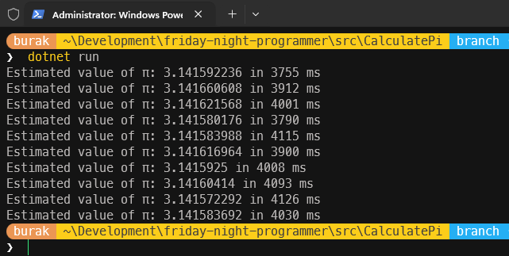

Tabii burada **"attığımız taş ürküttüğümüz kurbaya değdi mi?"** özlü sözünü hatırlamakta fayda var. En başta senkron olarak çalışan versiyonu bu son iterasyon sayısı ile tekrar denediğimde aşağıdaki sonuçlara ulaştım. Evet paralel çalışmada sonuçlar daha iyi ama bu sanki yüksek iterasyon sayıları için geçerli bir durum. Düşük aralıklarda bu maliyete girmeyebiliriz de ve hatta daha kısa sürmesi gerekirken daha uzun çalışma süreleri de ortaya çıkabilir.

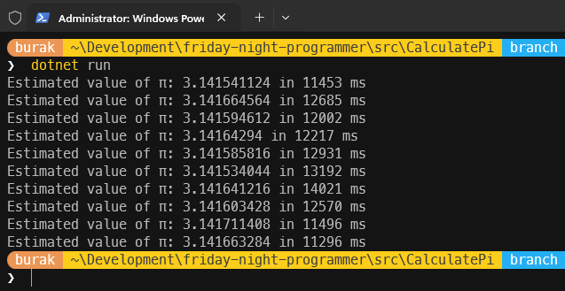

## Monte Carlo C# Turunun Değerlendirmesi

Buraya kadarki örnek kod versiyonlarını daha iyi karşılaştırmak için aşağıdaki tabloyu ele alabiliriz.

| Kriter | V0 | V1 | V2 | V3 | V4 | V5 |
| ------- | ---- | ---- | ---- | ---- | ---- | ---- |
| **Paralellik** | Yok | Yok | Var | Yok | Var | Var |
| **Thread-Safe Random** | Var | Var | Yok ve race-condition riski var | Var | ThreadLocal ile Var | Var(kendi instance'ı üzerinden) |
| **Math.Pow Lüksü** | Yok | Çok yavaş | Çok yavaş | Yok | Yok | Yok |
| **Iterasyon başına Interlocked** | Yok | Yok | Var | Var | Yok | Yok |
| **Çekirdek sayısına göre bölme** | Yok | Yok | Yok | Yok | Yok | Var |
| **Lock-free döngü** | Var | Var | Yok | Yok | Var | Var |

ve şu ana kadar ki Monte Carlo uyarlamaları için şunları da söyleyebiliriz:

- **V0:** Basit, hızlı ama tek thread ile çalışıyor. Iterasyon sayısı arttıkça süreler dramatik şekilde artıyor.
- **V1:** Math.Pow kullanımı performansı ciddi şekilde düşürüyor. Okunabilirlik artarken süreler kabul edilemez seviyelere çıkıyor.
- **V2:** Paralel for döngüsü içeriyor ama iki kritik sorunu var. Random paylaşımlı olduğu için *race condition* riski var ve her iterasyonda Interlocked kullanımı ciddi performans kaybına neden oluyor.
- **V3:** Interlocked.Increment ilginç bir şekilde sıralı bir döngüye ekleniyor gibi. Hesaplama V0 gibi hızlı olsa da paralel çalışmanın avantajını tam olarak kullanamıyor.
- **V4:** ThreadLocal kullanarak her thread'in kendi Random örneğine sahip olması ve sayaç değerlerini güvenli bir şekilde birleştirmesi performansı önemli ölçüde artırıyor. Ancak paralel for döngüsünün getirdiği bir yük hala var gibi görünüyor.
- **V5:** Çekirdek sayısına göre iterasyonları bölerek her çekirdeğin kendi görevini yapması ve sonunda güvenli bir şekilde birleştirmesi performansı daha da artırıyor.

## Peki Ya Aynı Paralel Çalışmayı Rust Dili ile Yapsaydık?

Pek tabii bu tip yüksek performans gerektiren hesaplamalar söz konusu olunca aklıma ilk gelen **Garbage Collector** mekanizmasını aradan çıkarmak hatta **managed environment** kullanmayan bir dilde ilerlemek oluyor. Birkaç yıl olsa da ilgilenme fırsatı bulduğum **rust** ve çok kısa bir süre baktığım **zig** ile aynı senaryoyu deneyebiliriz. Önce **rust** tarafı ile başlayalım.

İşlemci çekirdeklerinden maksimum fayda sağlamak adına **rayon** küfesi biçilmiş kaftan. Tabii rastgele sayı üretimi için de **rand** küfesini *(crate)* kullanmayı tercih edeceğim. Bunları projeye **cargo** ile ekleyebiliriz.

```bash
cargo add rayon rand
```

main.rs dosyasına da aşağıdaki kod parçasını ekleyerek devam edelim.

```rust
use rand::rngs::SmallRng;
use rand::RngExt;
use rayon::prelude::*;

fn main() {
    let total_iterations = 1_000_000_000;

    for _ in 0..10 {
        let start_time = std::time::Instant::now();
        let pi_estimate = calculate_pi(total_iterations);
        let elapsed = start_time.elapsed();
        println!("Estimated Pi: {} in {:?}", pi_estimate, elapsed);
    }
}

fn calculate_pi(total_iterations: u64) -> f64 {
    let in_circle: u64 = (0..total_iterations)
        .into_par_iter()
        .map_init(
            || rand::make_rng::<SmallRng>(),
            |rng, _| {
                let (x, y): (f64, f64) = rng.random();

                if x * x + y * y <= 1.0 {
                    1_u64
                } else {
                    0_u64
                }
            },
        )
        .sum();

    4.0 * (in_circle as f64) / (total_iterations as f64)
}
```

**calculate_pi** metodunu 10 kez çalıştırıp süre ölçümlemesi yaptırmaktayız. **into_par_iter()** ile paralel bir iterasyon ve devamında kullanılan **map_init** ile her bir **thread** için ayrı bir rastgele sayı üreteci oluşturuluyor. **map_init** kod bloğunda **f64** türünden rastgele x ve y değerleri üretiliyor ve çember içinde olup olmadıkları kontrol ediliyor. En sonunda da **sum** yardımıyla **in_circle** sayısı toplanarak **pi** değer tahmini yapılıyor ve bulunan sonuç döndürülüyor. Öncelikle bu kodu derleme modunda çalıştırarak süreleri gözlemleyelim.

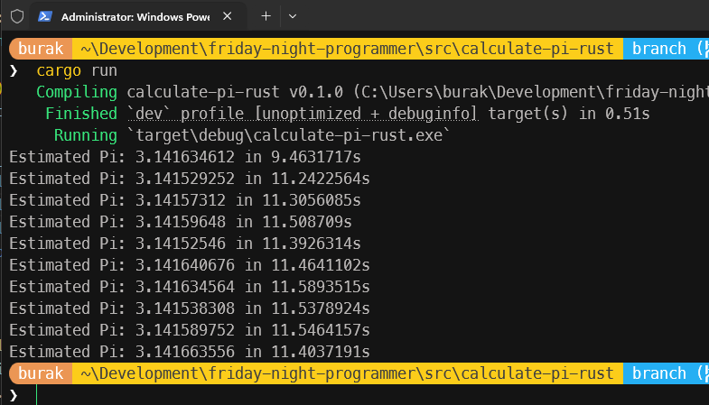

**C#** programımıza göre çok daha kötü bir performans sergileniyor. Aslında bu sonucu normal karşılamak gerekir zira **cargo run** komutu varsayılan olarak **debug** modunda çalışır ve bu mod cidden yavaş çalışır. Yani **release** modda çalıştırıp bir kıyaslama yapmak daha doğru olur *(Evet kabul ediyorum nitro modunu açtık ve bir hile yaptık)*

```bash
cargo run --release
```

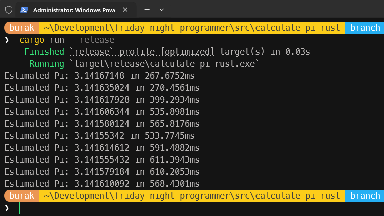

"Hımmm... Ama hile yapıyorsun hocam oldu mu şimdi?"" :D .Net tarafında yazdığımız son paralel kodu da **release** modda çalıştırarak bir kıyaslama yapmak şimdi çok daha doğru olacak. Öyleyse...

```bash
dotnet run -c Release
```

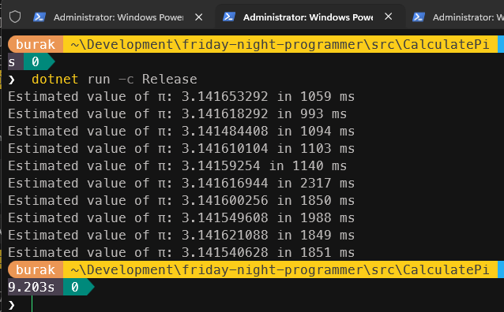

**dotnet run** ile doğrudan çalıştırdığımıza göre daha iyi sonuçlar aldık ama **rust** tarafına nazaran o kadar da iyi sayılmaz. Fakat şartlar yine eşit değil! Burada **Just-in Time** derleyicisinin optimizasyonları ile bir performans artışı sağlandı. Lakin .Net 8 sonrası gelen **Native AOT** desteği ile **rust** tarafına daha yakın sonuçlar elde etmek mümkün olabilir. O zaman programımızı birde **Native AOT** ile çalıştıralım. Bu amaçla ben aşağıdaki komutu denedim. Hem işlemci mimarisi hem de işletim sistemine uygun bir **release** çıktısı hazırlanıyor. Sonrasında tabii bu exe'yi çalıştırmamız gerekiyor.

```bash
dotnet publish -c Release -r win-x64 --self-contained true /p:PublishAot=true
cd .\bin\release\net10.0\win-x64\publish\
.\CalculatePi.exe
```

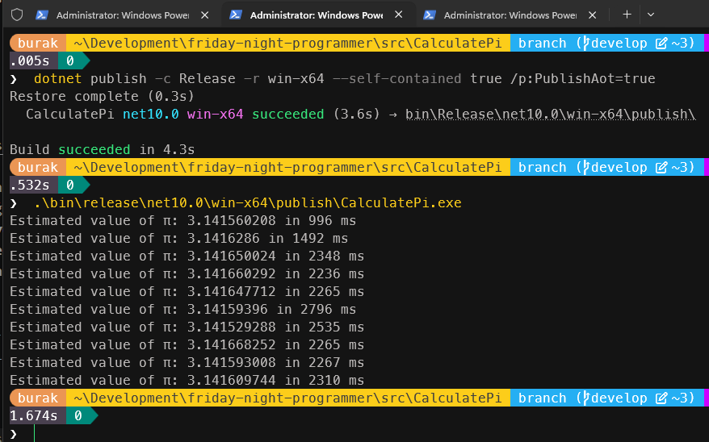

İyileşme olmadığı gibi süreler bir noktadan sonra uzayıp aynı seyirde devam etti gibi. Belki ilk çalışmaya başladığında işlemci ısındı ve donanımın bir gerçeği olarak süreler uzayıp aynı seyirde kaldı. Bunu ölçümlemek için daha iyi bir monitoring sistemi kurgulamak gerekiyor ama bu beni şu an için aşacak gibi duruyor. Kod tarafında kesin atladığım bir şey var ve emin olmak adına **C#** uygulamasını belki de **SIMD *(Single Instruction, Multiple Data)*** desteği ekleyerek denemek daha doğru olur. **SIMD** konusunu da kısaca izah etmek isterim, en azından anladığım kadarıyla.

> Monte Carlo yönteminde çembere isabet etme durumunu tespit edereken bir formül kullanıyoruz. `x*x + y*y <= 1.0` şeklinde. İşlemcinin her bir sayı çifti için tek tek bu işlemi yaptığını düşünelim. Ancak SIMD desteği ile işlemcinin bazı register'larını kullanıp aynı anda 4 double veya 8 float işlemin tek bir saat vuruşunda *(clock cycle)* yapılması sağlanabilir. Yani tek bir işlemle 4 veya 8 sayı çifti için `x*x + y*y <= 1.0` kontrolü yapılabilir. İşin matematiği beni şu an için aşıyor ancak .Net'in **System.Runtime.Intrinsics** kütüphanesinde yer alan `Vector256`, `Vector<T>` gibi türler ile bu tür bir optimizasyonu deneyebiliriz. Tür adlarından da anlaşılacağı üzere burada hesaplamaların vektör karşılıklarının bulunduğu bir senaryo var. Ancak işimizi zorlaştıracak bir kısım var ki o da rastgele sayı üretimi. **NextDouble** metodunun tekil *(kaynaklarda scalar olarak ifade ediliyor)* çalıştığı ve SIMD ile doğrudan vektör halinde çalışacak bir karşılığının olmadığı iddia ediliyor. Bu, rastgele sayıları bu şekilde kullanırsak donanımsal avantajlardan yararlanamayacağımız anlamına gelmekte. Genellikle **XorShift**, **PCG *(Permuted Congruential Generator)*** gibi algoritmaların kullanılması ya da rastgele sayıları önce devasa bir diziye doldurup SIMD ile bu diziden vektörler halinde çekilmesi gibi yöntemler öneriliyor. Bunun kodunu yazmak için biraz daha araştırma yapmam şart ki repoda denemesini yapacağım.

Tekrardan rust tarafına dönelim ve uygulama kodumuzu aşağıdaki gibi değiştirelim.

```rust
use rand::rngs::SmallRng;
use rand::RngExt;
use rayon::prelude::*;

fn main() {
    let total_iterations = 1_000_000_000;

    for _ in 0..10 {
        let start_time = std::time::Instant::now();
        let pi_estimate = calculate_pi(total_iterations);
        let elapsed = start_time.elapsed();
        println!("Estimated Pi: {} in {:?}", pi_estimate, elapsed);
    }
}

fn calculate_pi(total_iterations: u64) -> f64 {
    let chunk_size = 4; // SIMD için 4'lü gruplar halinde işlem yapacağız
                        // çünkü AVX2 256-bit genişliğinde ve 4 adet f64 (64-bit) değeri aynı anda işleyebilir.
    let loop_count = total_iterations / chunk_size;

    let in_circle: u64 = (0..loop_count)
        .into_par_iter()
        .map_init(
            || rand::make_rng::<SmallRng>(),
            |rng, _| {
                let x_values: [f64; 4] = rng.random(); // random'un güzel yanlarından birisi. Tek çağrıda arka arkaya 4 sayı üretip diziye atar.
                let y_values: [f64; 4] = rng.random();

                get_circle_value(&x_values, &y_values)
            },
        )
        .sum();

    4.0 * (in_circle as f64) / (total_iterations as f64)
}

// x_values ve y_values elemanları 4 boyutlu dizi olduğunda derleyici bunların kesinlikle sabit boyutlu olduğunu bilecek.
// Buna göre kod doğrudan AVX2 SIMD komutuna çevrilebilir.
#[inline(always)]
// Bunu eklediğimiz için derleyici bu fonksiyonu çağırmak yerine doğrudan kodun içerisine gömer.
pub fn get_circle_value(x_values: &[f64; 4], y_values: &[f64; 4]) -> u64 {
    let mut count = 0;

    for i in 0..4 {
        if x_values[i] * x_values[i] + y_values[i] * y_values[i] <= 1.0 {
            count += 1;
        }
    }

    count
}
```

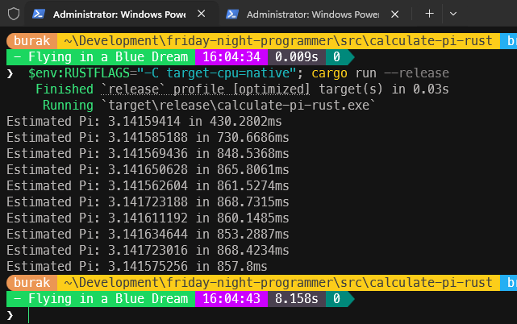

Haydaaa! :D **SIMD** dedik daha hızlı çalışır dedik ancak bir önceki rust kodumuza göre neredeyse **3.5** kat daha yavaş çalışma zamanı süreleri gördük, oldu mu şimdi! Aslında elde ettiğimiz süreler iki uygulama biçimi içinde oldukça iyi. Milisaniyeler mertebesinde 1 milyarlık iterasyonları tamamladık. Hatta ilk rust kodumuz gayet sade ve anlaşılır. Yine de **SIMD** metodolojimiz beklediğimiz şekilde çalışmadı. Buradaki kritik nokta maliyetin nerede olduğunu tespit edebilmek. Büyük ihtmalle rastgele sayı üretimi işi beklenenden uzun sürüyor ve doğru şekilde bir vektörleme gerçekleşmiyor. SIMD için **"veriler zaten devasa bir dizide ve bellekte hazır bekliyorsa"** gibi bir durum olduğu ifade ediliyor *(Yani böyle bir hazırlık sonrası daha çok işe yarar deniyor)* Lakin bizim örneğimizde veriyi her adımda sıfırdan üretiyoruz ve üretim maliyeti hesaplama maliyetinin üzerine çıkıyor. Dikkat edelim rastgele sayı üretiminden 4 elemanlık bir dizi çıkartmayı kolaylaştırdık kolaylaştırmasına ama 4erli gruplama için altına girdiğimiz bu maliyet hesaplama süresini ciddi şekilde artırdı. Ciddi şekilde dediğime bakmayın, .Net kodumuza nazaran burada milisaniyeler mertebesinde konuşabiliyoruz *(Tabii C# program kodumuzu da SIMD ile çalışır hale getirip bir değerlendirme yapmamız lazım)*

## O Zaman Kontrolü Biraz Daha Elimize Alalım. Zig ile Deneyelim

Zig programlama dili, gizli ya da bilinçsiz kontrol akışlarına müsama göstermiyor. Yani bildiğim kadarı ile hazır bir Paralle.For elimizde yok, threar'leri ve bellek tahsislerini doğrudan bizim yapmamız lazım ki bellek tahsisi *(allocation)* konusunda da çok hassas bir dil. Buna göre her thread'in kendi yerel sayacını artıracağı, işi bitince bu değerleri ana sayaca ekleyeceği bir akış kurgulamak gerekiyor. Aşağıdaki kod parçası ile başlayalım öyleyse. Eğer çok iyi süreler elde edersek belki de daha da iyileştirmeye çalışmayız :P

```zig
const std = @import("std");

// Monte Carlo yöntemiyle Pi değeri hesaplanan fonksiyon
// ilk parametre iterasyon sayısını alır ki bizim örneğimizde 1 milyar / işlemci-çekirdek sayısı kadardır.
// İkinci parametre pointer olarak gelir ve in_circle değişkenine atomik olarak ekleme yapar.
// Atomik seviyede ekleme yapmak hızlıdır çünkü doğrudan işlemci instruction'larıyla yapılır ve kilitlenmeye gerek kalmaz.
fn monteCarloCalculation(iterations: usize, result: *usize) void {
    var seed: u64 = undefined;
    std.crypto.random.bytes(std.mem.asBytes(&seed)); // Rastgele bir seed oluşturuyoruz, böylece her çalıştırmada farklı sonuçlar elde edebiliriz.

    // Xoshiro256 türünden bir PRNG-Pseudo Random Number Generator- başlatıyoruz
    // Bu epey hızlı çalışır
    var rng = std.Random.DefaultPrng.init(seed);
    const random = rng.random();

    var localCount: usize = 0;
    var i: usize = 0;

    // normal iterasyon döngümüz
    while (i < iterations) : (i += 1) {
        // f64 yerine f32 kullanarak işlemci üzerindeki yükü yarı yarıya düşürebiliriz.
        const x = random.float(f32);
        const y = random.float(f32);
        // çember içinde olup olmadığını kontrol ediyoruz
        if (x * x + y * y <= 1.0) {
            localCount += 1;
        }
    }

    // İşlem bitince tek bir atomik yazma işlemi
    // İlk parametre veri türü, ikinci parametre hedef değişken,
    // üçüncü parametre çağırılacak instruction komutu,
    // dördüncü parametre eklenecek değer
    // ve en nihayetinde beşinci parametre bellek sıralama türü
    _ = @atomicRmw(usize, result, .Add, localCount, .monotonic);
}

pub fn main() !void {
    const totalIterations: usize = 1_000_000_000;
    const threadCount = try std.Thread.getCpuCount(); // işlemci çekirdek sayısını alıyoruz

    const iterPerThread = totalIterations / threadCount; // thread başına iterasyon değeri

    // Allocator'sız olmaz :D GPA nispeten daha iyi performans gösterir
    var gpa = std.heap.GeneralPurposeAllocator(.{}){};
    defer _ = gpa.deinit(); // tedbir amaçlı deinit çağırıyoruz, böylece program sonunda kaynaklar düzgün şekilde serbest bırakılır
    const allocator = gpa.allocator();

    // thread'ler için bellek ayırıyoruz, her thread monteCarloCalculation fonksiyonunu çalıştıracak
    const threads = try allocator.alloc(std.Thread, threadCount);
    defer allocator.free(threads); // Yine tedbir amaçlı thread'ler için ayrılan belleği serbest bırakıyoruz

    // Standart deney döngümüz. 10 kez çalıştırılacak
    for (0..10) |_| {
        var in_circle: usize = 0;

        const start = std.time.nanoTimestamp();

        // Her test adımında thread'ler oluşturup, monteCarloCalculation fonksiyonunu çalıştırıyoruz
        for (threads) |*thread| {
            thread.* = try std.Thread.spawn(
                .{},
                monteCarloCalculation,
                .{ iterPerThread, &in_circle },
            );
        }

        // Burada thread'lerin bitmesini bekliyoruz,
        // her thread'in join edilmesi gerekiyor ki sonuçlar doğru şekilde toplanabilsin
        // Burası aynı zamanda en son çalışma zamanının neden yüksek çıktığının bir sebebi olabilir
        for (threads) |thread| {
            thread.join();
        }

        const elapsed_ns = std.time.nanoTimestamp() - start;
        const elapsed_ms = @divTrunc(elapsed_ns, std.time.ns_per_ms);

        const pi = 4.0 * @as(f64, @floatFromInt(in_circle)) / @as(f64, @floatFromInt(totalIterations));
        std.debug.print("Pi = {d:.6}  ({d} ms)\n", .{ pi, elapsed_ms });
    }
}
```

Uygulamayı aşağıdaki gibi cpu'nun tüm yeteneklerini de işin içerisine dahil ederek release modda çalıştırabiliriz.

```bash
zig run .\program.zig -O ReleaseFast -mcpu=native
```

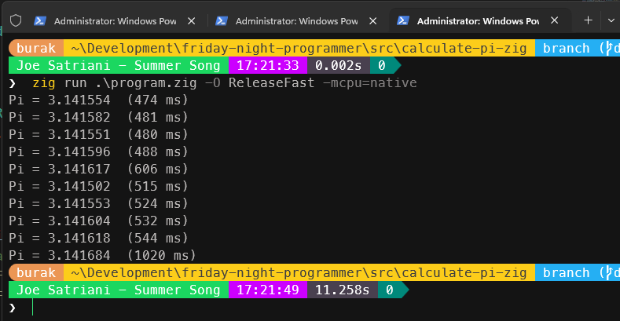

**Rust**'ın ilk versiyonundaki **release** moddaki sürelere ulaşamadık belki ama yine de hızlı çalıştı diyebiliriz. Dikkat çekici noktalardan birisi ilk başlangıçtaki sürenin sonradan yükselmesi, belli bir ortalamada devam etmesi ve en sonda neredeyse iki katı kadar yavaş tamamlanması. Son süre ölçümünün bu kadar yüksek çıkmasının bir sebebi kuvvetle muhtemele paralel çalışan thread'lerin tamamının bitmesini bekleyen **join** çağrıları olsa gerek.

Diğer yandan **for** döngümüz her adımda işletim sisteminden yeni thread'ler talep edip sonrasında bunları yok etmekte. İşletim sistemi bu **talep et-yürüt-yok et** sürecinde yorulabilir ve bellek üzerinde parçalanmalar *(fragmentation)* oluşabilir. Bu parçalanmalar yeni thread'ler için alan tahsislerini geciktirebilir. Aslında burada bir **thread-pool** yapısı kurgulamadığımız için de böyle bir durum oluşuyor diye düşünüyorum.

Zig kodu çok daha iyi yazılabilir belki de ancak kaynaklardan öğrenebildiğim şimdilik bu kadar.

## Sonuç Değerlendirmesi

Aslında bu çalışmada amacım **Pi *(π)*** sayısını hesaplarken **monte carlo** yöntemi ile ilerlemek ve sonrasında daha tutarlı sonuçlara ulaşmak için farklı matematik yöntemlere geçmekti. Bunu yaparken en çok aşina olduğum programlama dili **C#** ile işe başlamak istedim. Küçük iterasyonlarda hızlı sonuçlar aldım ama yüksek iterasyonlara gelince hesaplama süreleri ciddi anlamda uzamaya başladı. Dolayısıyla yöntem değişikliklerine gitmem yeni şeyler keşfetmem gerekti.

Özellikle çok yüksek iterasyonlarda paralel çalışmanın fark yarattığını gözlemedim. Derken **rust** ve **zig** dillerini işin içerisine katmak istedim. Release modda rust'ın epey iyi sonuçlar aldığını belirtmem lazım ki fark bu kadar açılınca release derlemeleri ve hatta AOT *(Ahead-Of-Time)* eklemeleri ile .net kodumuzu daha da hızlandırmaya çalıştım. Burada tek açık kapı .Net kodunu **SIMD *(Single Instruction, Multiple Data)*** desteği ile işletip süre hesaplaması yapmamış olmam.

**Monte carlo** doğru pi rakamlarına ulaşmak için iyi bir tercih değil. Bunu değiştirip farklı bir matematik model ile ilerlemek lazım ama tüm kodlarımız için şu anda aynı yöntem söz konusu. Dolayısıyla çalışma sürelerini kıyaslamak ve bir özet tablo hazırlamak iyi olabilir.

Ortalık tabii çok karıştı. Hatta çalışma sırasında C# metodunun eski versiyonunu tekrar çalıştırdığımı fark ettim. Dolayısıyla üç dilinde en son karar kıldığım kod versiyonlarını aynı iterasyonlar sayıları ile ve release modda derleyerek çalıştırmaya karar verdim.

Süreler milisaniye cinsindendir ve toplamda 10 çalıştırma üzerinden ortalama süreler hesaplanmıştır.

| Dil | Yöntem | Komut | İlk Süre | Son Süre | En Çabuk Süre | En Yavaş Süre | Ortalama Süre |
| --- | --- | --- | --- | --- | --- | --- | --- |
| C# | Paralel for, Task, Çekirdek Sayısı kadar, | dotnet run -c Release | 1029 ms | 2252 ms | 1029 ms | 3103 ms | 2119.1 ms |
| Rust | Rayon | cargo run --release | 255.427 ms | 254.023 ms | 247.887 ms | 257.314 ms | 251.564 ms |
| Zig | std.Thread | zig run .\program.zig -O ReleaseFast -mcpu=native | 474 ms | 1097 ms | 474 ms | 1121 ms | 637 ms |
