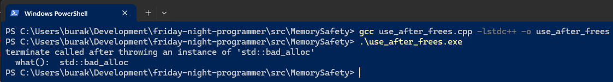
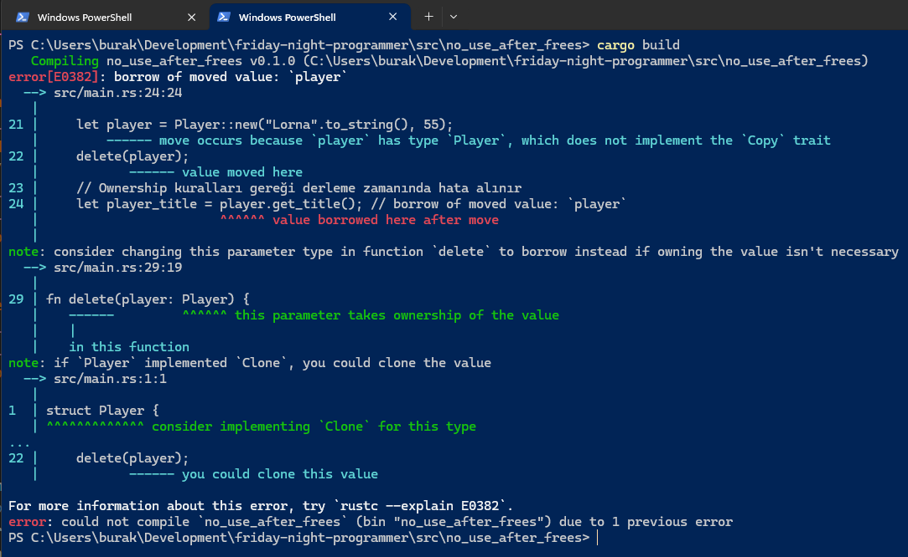
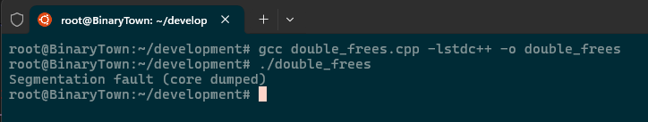
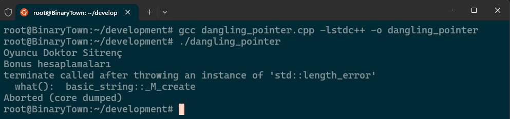
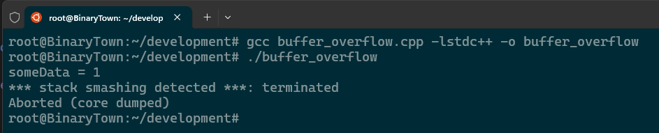
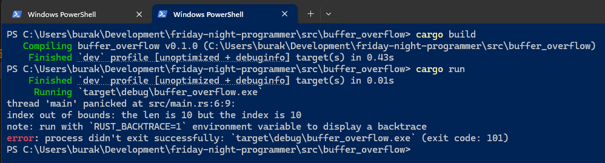

# Rust ve Bellek Güvenliği

Bir sistem programlama dili olarak tanınan Rust genellikle C veya C++ dillerinde kritik hatalar sebep olan bazlı programcı hatalarını henüz derleme aşamasında engellemesi ile öne çıkmaktadır. Rust'ın kendine has bellek yönetim mekanizması esas itibariyle de bu tip hataların önüne geçebilmek üzerine tasarlanmıştır. Kaynaklarda bu konuyla ilgili olarak Use Aftre Frees, Double Frees, Dangling Pointer, Buffer Overflow gibi problemelere rastlamaktayız. Esasında bunlar gerçekten de zaman içerisinde büyük problemlere neden olan açıkların tanımlarıdır. Internet kaynaklarında geçen bazı tarihi olaylar aşağıdaki gibidir.

- **Use After Frees :** Bellekten silinmiş bir değerin referansına silme işleminden sonra tekrardan erişmeye çalışmak.
  - 2014 yılında OpenSSL kütüphanesindeki Use After Free açığı istismar edilerek saldırılar gerçekleşmiş. SSL/TLS kullanan birçok web sitesi bundan etkilendi ve kullanıcıların özel bilgilerine ulaşılabildiği ortaya çıktı. Heartbleed.
  - 2010 yılında ise Windows işletim sistemini hedef alan ve Use After Frees hatasını kullanan Stuxnet isimli bir solucan peydahlandı. Bu solucan İran'ın nükleer santral santrifüjünün zarar görmesine neden olmuş. Böylece endüstriyel kontrol sistemlerinin siber saldırılardan nasıl etkilenebileceği de görülmüş oldu.
- **Double Frees :** Serbest bırakılmış bir bellek bölgesini tekrardan serbest bırakmaya çalışmak.
  - 2011 yılında Apache sunucularında Range başlığını içeren isteklerdeki Double Free hatası tetiklenerek saldırılar gerçekleştirilmiş. Saldırı apache kullanan sunucuların devre dışı kalmasına neden oluyordu. Hizmet kesintisi yaşayan sunucular oldu. Apache Killer.
  - 2008 yılında Windows işletim sisteminin RPC işlevindeki Double Free hatası istismar edilerek saldırılar gerçekleştirilmiş. MS08-067.
- **Dangling Pointer:** Bir işaretçinin(pointer) referans ettiği bellek adresi ve içeriği artık kullanılmıyordur ancak işaretçi, program içinde aktif kalmaya devam etmiştir.
  - 2020 Apple'ın safari ve bazı uygulamalarında kullanılan WebKit paketinde bu açık görülmüş. Kötü niyetli kod yürütülmesine sebebiyet verebilirdi.
  - 2015 Internet Explorer'daki bu açıktan faydalanan bir web sitesi uzaktan kod yürütmeye yönelik girişimlerde bulundu.
- **Buffer Overflow:** Genellikle belli boyuttaki bir dizinin index dışındaki bir alanına erişip değer atamaya çalıştığımızda karşılaştığımız türden bir hata olduğunu söyleyebiliriz.
  - Bu hata ile ilgili olarak kaynaklarda geçen bir solucan var. Morris solucanı olarak bilinen saldırı sonrası solucan 1988'de Internetteki 60bin makineye bulaşmış. Internetin büyük bölümü birkaç günlüğüne kapanmış. Morris, bazı Unix sistemlerindeki buffer overflow açığını kullanmış. Ama nasıl kullanmış henüz aklım almadı :D

Şimdi bu durumları göstermeye çalışalım. Bu amaçla herbir vakanın C++ ve Rust ile yazılmış versiyonlarını kıyaslayacağız.

## Use After Frees

Bellekten silinmiş bir değerin referansı eğer unutulursa sonradan bu referansı kullanarak bellekteki bir veri kümesini ele geçirmek mümkün olabilir. Bir başka deyişle bu sorun dinamik olarak tahsis edilen bir bellek bölgesinin serbest bırakıldıktan sonra tekrar kullanılmasıyla ortaya çıkar. Bu durum uygulamada çökmelere, bellek bozulmalarına veya güvenlik açıklarına sebep olur. Konuyu aşağıdaki C++ kodu ile değerlendirmeye çalışalım.

```c++
#include <iostream>
#include <string>

class Player
{
public:
    void SetTitle(const std::string &newTitle)
    {
        title = newTitle;
    }

    void SetPoint(int newPoint)
    {
        point = newPoint;
    }

    std::string GetTitle()
    {
        return title;
    }

    int GetPoint()
    {
        return point;
    }

private:
    std::string title;
    int point;
};

int del(Player *player)
{
    delete player;
    return 0;
}
int main()
{
    Player *player = new Player();
    player->SetTitle("Champion");
    player->SetPoint(1000);

    del(player);

    std::string playerTitle = player->GetTitle(); // Use After Free
    int playerPoint = player->GetPoint();         // Use After Free

    std::cout << "Player Title: " << playerTitle << std::endl;
    std::cout << "Player Point: " << playerPoint << std::endl;

    return 0;
}
```

Buradaki durumu analiz edelim. main metodunda heap üzerinde bir Player nesnesi örnekliyoruz. Sonrasında title ve point gibi alanlarına bazı değerler veriyoruz. del fonksiyonuna yapılan çağrıyla da player nesnesini C++'ın delete metodu ile açıkça serbest bırakıyoruz. Kod bundan sonra ilginçleşiyor. Zira del çağrısı sonrası main metodunda halen duran player nesne referansını kullanarak Title ve Point bilgilerini çekmeye çalışıyoruz. Oysaki az önceki metot çağrısında bu referansa ait veri bellekten düşürüldü. Yani player referansının işaret ettiği bellek bölgesinde artık geçerli bir veri yok. Bellek yönetim sistemi, söz konusu alanı başka bir işlem veya başka bir veri için tahsis edebilir. Bu da belirsiz davranışlara neden olur. Program çökebilir, program eski veriler üzerine yazmaya çalışıp verinin tutarlılığını bozabilir ama daha da kötüsü saldırganlar serbest bırakılan belleği kullanarak programımız içerisinde art niyetli kodlar çalıştırabilir. Pek tabii burada elimiz kolumuz bağlı değil. Programcı olarak del fonksiyonu içinde player pointer'ına null ataması yapıp main içerisinde de null check yaparak ilerlenebilir ya da smart pointer kullanılabilir... Ancak tüm bunlar tahmin edeceğiniz gibi programıcının sorumluluğundadır. İşte managed dillerin bu gibi durumlara karşı sağladığı bellek güvenliği o dilleri çekici kılar. Ne var ki onun da bir maliyeti vardır. Rust bu maliyete girmeden sorunu derleme aşamasında çözmeyi vaat eder. Benzer bir durumu rust ile denemeden önce bu kodun çalışma zamanındaki davranışına bir bakalım.

```bash
# Örneği çalıştırmak için general c compiler aracından yararlanabiliriz
gcc use_after_frees.cpp -lstdc++ -o use_after_frees

# Çalıştırmak içinse sistemde oluşan binary'yi çağırmak yeterli
# Windows için bu bir exe dosyası olacaktır.
```

Çalışma zamanı sonucu aşağıdaki gibidir.



Şimdi benzer senaryo için aşağıdaki rust kodunu ele alabiliriz.

```rust
struct Player {
    title: String,
    point: i32,
}

impl Player {
    fn new(title: String, point: i32) -> Self {
        Self { title, point }
    }

    pub fn get_title(&self) -> &String {
        &self.title
    }

    pub fn get_point(&self) -> i32 {
        self.point
    }
}

fn main() {
    let player = Player::new("Lorna".to_string(), 55);
    delete(player);
    // Ownership kuralları gereği derleme zamanında hata alınır
    let player_title = player.get_title(); // borrow of moved value: `player`
    let player_point = player.get_point(); // borrow of moved value: `player`
    println!("{player_title}({player_point})");
}

fn delete(player: Player) {
    let point = player.point;
    let title = player.title;
    println!("{title}{point}");
}
```

Yine başrollerde Player isimli bir nesne var ve struct olarak tasarlanmış halde. player değişkeni bazı ilk değerler ile tanımlandıktan sonra delete isimli bir fonksiyona gönderiliyor. Rust'ın sahiplik ilkesi _(ownership)_ gereği ve RAII'den _(Resource Acquisition is Initialization)_ gelen scope mantığına göre delete metodunun son satırına gelindiğinde player referansı işaret ettiği veri ile birlikte otomatik olarak bellekten düşer. Buna göre main fonksiyonunda delete çağrısı sonrası player nesnesi artık geçersiz olur çünkü ortada yoktur. Bu Rust tarafında derleme zamanında aşağıdaki yorumlanır.



## Double Frees

Zaten serbest kalmış bir bellek bölgesini tekrardan serbest bırakmaya çalışmak olarak yorumlanabilir. Bu durumu analiz etmek için aşağıdaki C++ kodunu ele alalım.

```c++
#include <iostream>
#include <string>

class Player {
public:
    Player(const std::string& title, int point) : title(title), point(point) {}

private:
    std::string title;
    int point;
};

void del(Player* player){
    delete player;
}
int main() {
    Player* player = new Player("Şarlotte", 91);
    del(player);

    // Belleği tekrar serbest bırakmaya çalışmak "Double Free" durumunun oluşmasına sebebiyet verir.
    // Kod derlenir ama çalışma zamanında Segmentation Fault hatası alınır.
    del(player);

    return 0;
}
```

Kahramanımız player nesnesi için bir pointer tanımlanmış sonrasında delete fonksiyonunu çağıran del metodu arka arkaya iki kez tetiklenmiştir. Bu kod derlenir ancak çalışma zamnında hata üretir.

```bash
gcc double_frees.cpp -lstdc++ -o double_frees
./double_frees.exe
```

Burada biraz duralım. Normalde bu kod Linux üzerine segmentation fault hatasına giderken Windows 11 de bu sorun oluşmadı. Bunun sebebi Windows Heap Manager'ın ikinci serbest bırakma girişimini tespit edip sessizce bu durumu bertaraf etmesi. Elbette runtime hatası alınmaması çift serbest bırakma operasyonunun riskini gizlediğinden bu daha büyük bir problem olarak da düşünülebilir. Dolayısıyla örneği dilerseniz Windows sistemlerde WSL _(Windows Subsystem for Linux)_ üzerinden de yorumlayabilirsiniz. Aşağıdaki gibi hata almanız gerekir.



Birde benzer kodu Rust tarafında ele alalım.

```rust
struct Player {
    title: String,
    point: i32,
}

impl Player {
    fn new(title: String, point: i32) -> Self {
        Self { title, point }
    }
}

fn main() {
    let player = Player::new("Dolares".to_string(), 67);
    do_something(player);

    do_something(player);
}

fn do_something(player: Player) {
    println!("{}-{}", player.title, player.point);
}
```

Açıkça bir delete operasyonu kullanmasak da Rust'ın sahiplikleri ve değerlerini scope dışına çıkınca düşürmesi aynı senaryoyu işletmemizi sağlayacaktır. Bu kod tahmin edeceğiniz üzere derlenmez.


Durum değerlendirmesi yapalım. player değişkeni do_something metoduna ilk gönderildiği anda sahipliği ile birlikte taşınır. do_something metodunun sonuna gelindiğinden ise bellekten düşer ve main fonksiyonundaki player değişkeni artık kullanım dışı kalır. Dolayısıyla ikinci do_something çağrısına aynı player değişkeni tekrar gönderilemez. Bu da derleme zamanı hatası anlamına gelir. Tabii şunu unutmayalım. Burada aynı referansı metoda taşımak veya metotdan yeni bir Player nesnesi ile geri dönmek gibi yollarla bu sağlanabilir fakat dikkatinizi çekerim. Bir verinin t anında sadece tek bir sahibi olabilir ilkesi bu yöntemlerde ihlal edilmez ;)

## Dangling Pointers

Bir işaretçinin(pointer) referans ettiği bellek adresi ve içeriği artık kullanılmıyordur ancak işaretçi, program içinde aktif kalmaya devam etmiştir. Bu durumda işaretçi rastgele bir veri içeriğini tutabilir şeklinde düşünülebilir. Konuyu C++ tarafında aşağıdaki kod parçası ile irdeleyelim.

```c++
#include <iostream>
#include <string>

class Player {
public:
    Player(const std::string& name,int level) : name(name) {}

    std::string GetName() {
        return name;
    }

    int GetLevel(){
        return level;
    }

private:
    std::string name;
    int level;
};

void calc_bonus(Player* player){
    std::cout << "Bonus hesaplamaları" << std::endl;
    // Başka bir fonksiyondan gelen player referansı ile bir şeyler yapılıyor
    // ve bellekten atılıyor
    delete player;
}

int main() {
    Player* player = new Player("Doktor Sitrenç",400);
    Player* danglingPlayer = player; // player başka bir işaretçiye atanıyor
    std::cout << "Oyuncu " << player->GetName() << std::endl;
    calc_bonus(player);
    // danglingPointer, bellekten atılmış pointer'ın işaret ettiği veriyi
    // referans etmeye devam ediyor.
    std::cout <<"Danling pointer için oyuncu " << danglingPlayer->GetName() << std::endl;

    return 0;
}
```

Öncelikle örnek kodda neler yaptığımız bakalım. player nesnesi örneklendikten sonra onu danglingPointer isimli başka bir referansa daha atıyoruz. Dolayısıyla her iki değişkenin Doktor Sitrenç'i işaret ettiğini söyleyebiliriz. Ardından calc_bonus fonksiyonuna ilk player nesne referansımızı gönderiyoruz. Kasıtlı olarak calc_bonus sonunda player nesnesini bellekten düşürüyoruz. Bu durumda ortada Doktor Sitrenç'i referans eden bir değişken kalmıyor ancak main metodunda yer alan danglingPlayer değişkeni bellekteki aynı bölgeyi ilk referans bağı kopsa da işaret etmeye devam ediyor. Sonuçta program bu noktaya kadar çalışıp ardından çakılıyor.



Çok daha büyük çapta bir projede böyle bir hata noktasına gelindiğini düşünün. Şimdi benzer senaryoyu birde Rust tarafında deneyimlemeye çalışalım.

```rust
struct Player {
    name: String,
    level: i32,
}

impl Player {
    fn new(name: String, level: i32) -> Self {
        Self { name, level }
    }

    fn get_name(&self) -> &str {
        &self.name
    }
}

fn main() {
    let player = Player::new("Doktor Acayip".to_string(), 400);
    let dangling_player = &player;
    calc_bonus(player);
    println!("İşlemleri yapılan oyuncu {}", dangling_player.get_name());
}

fn calc_bonus(player: Player) {
    let player_name = player.get_name();
    println!("{player_name} için bonus hesaplamaları.");
}
```

C++ kod örneğindekine benzer şekilde dangling_pointer isimli değişken player nesnesinin referansını taşıyor. Kod derlendiğinde aşağıdaki hatayı alırız.


Derleme mesajlarını sırasıyla dikkatli bir şekilde okumanızı tavsiye ederim. Özetle calc_bonus fonksiyonunun player nesnesinin sahipliğini aldığını, işleyişini tamamladığında da onu bellekten düşürdüğünü ve bu yüzden başka bir nesnenin onu referans etmesine müsaade edemeyeceğini söyler. Kibarca... Çünkü t anından bir değerin tek bir sahibi olabilir. Fakat yine vurgulamak isterim ki calc_bonus metodunun parametrik yapısı referans taşıma haline getirilebilir veya dönüşü yeni bir Player nesne örneği olarak ele alınabilir. Yani kodda örneğin aşağıdaki gibi bir değişiklik ihlali ortadan kaldırır ve bellek güvenli bir şekilde programın çalıştırılmasını sağlar.

```rust
fn main() {
    let player = Player::new("Doktor Acayip".to_string(), 400);
    let dangling_player = &player;
    calc_bonus(&player); // nesne referansını gönderdik
    println!("İşlemleri yapılan oyuncu {}", dangling_player.get_name());
}

fn calc_bonus(player: &Player) { // player değişkeninin sahipliğini almak yerine referansını kullanır
    let player_name = player.get_name();
    println!("{player_name} için bonus hesaplamaları.");
}
```

## Buffer Overflow

Genellikle belli boyuttaki bir dizinin index dışındaki bir alanına erişip değer atamaya çalıştığımızda karşılaştığımız türden bir hata olduğunu söyleyebiliriz. Şu C++ kodunu göz önüne alalım.

```c++
#include <iostream>
using namespace std;

int main(void){
    int someData=1;
    int buffer[10];

    for(int i=0;i<=11;i++){
        buffer[i]=5;
    }

    cout << "someData = " << someData << endl;

    return 0;
}
```

Kod oldukça basit esasında. On byte'lık bir buffer ayarlanıyor ve bir for döngüsü yardımıyla içerisine veri aktarılıyor. Sorun şu ki döngü on birinci bir elemanı da yazmaya çalışıyor. Program kodu başarılı bir şekilde derlense de doğal olarak çalışma zamanında kırılacaktır. Burada sıkıntı taşma hatasına sebep olacak for döngüsünden önce atanan someData değişkeninin for döngüsünden sonraki kod satırı ile terminale çıktı olarak yazılmış olmasıdır. Yani kodun belli kısımlarının çalıştığını ve herhangibir noktada, ancak for döngüsü kullanıldığında hata alınarak sonlandığını söyleyebiliriz.



Saldırganlar genellikle bu tip buffer bölgelerine fazladan veri yazarak zarar vermeye çalışabilir. Benzer senaryoyu birde Rust tarafında ele almaya çalışalım.

```rust
fn main() {
    let some_data = 1;
    let mut buffer = [0; 10]; // 10 elemanlı bir dizi oluşturuluyor

    for i in 0..=11 {
        buffer[i] = 5; // Dizi sınırlarını aşma girişimi, Rust derleyicisi tarafından yakalanır
    }

    println!("some_data = {}", some_data);
}
```

Neredeyse aynı kodun yazıldığını söyleyebiliriz. Hatta rust derleyicisi de hata vermeden bu programı derleyecektir. Ne var ki çalışma zamanında söz konusu taşma algılanmış ama kodun kalan kısımları işletilmemiştir.



Bu arada Rust bazı hallerde derleme zamanında da bu taşmayı yakalayabilir _(Gerçi bunu C++' ta yakaladı)_ Son olarak aşağıdaki kod parçasını ele alalım.

```rust
fn main() {
    let mut buffer = [0u8; 8]; // 8 byte uzunluğunda bir dizi

    buffer[10] = 1; // Rust buradaki sorunu derleme zamanında fark ederek hata verir.

    match buffer.get_mut(10) {
        Some(byte) => *byte = 1,
        None => println!("Kapasite sınırı aşılmaya çalışıldı"),
    };

    println!("Buffer: {:?}", buffer);
}
```

Burada buffer[10] = 1 ile açıkça bir buffer overflow ihlali söz konusu. Rust derleyicisinin bu koda tepkisi aşağıdaki gibi olacaktır.


Bu örnekler aslında Rust'ın daha güvenli bellek yönetimine ihtiyaç duyan ve bunu yaparken managed environment'a ihtiyaç duyulmaması gereken performans kritik senaryolar için neden tercih edildiğinin minik bir gösterimidir. Rust bilindiği üzere ownership, borrow checker, lifetime mekanizmaları yanında RAII modelini baz alan bir bellek yönetimi sunar. Birçok olası hata yukarıdaki örneklerden de görüldüğü üzere derleme zamanında tespit edilir ve ihlal edilmesi önlenir. Buffer Overflow gibi masumane görünen ama stack corruption, code execution gibi saldırıların önünü açan durumlara karşı daha güçlü bir savunma mekanizması sağlar.

Son olarak bu özetin amacının C++ veya C gibi tarihe damga vurmuş ve halen daha geçerliliklerini koruyan dilleri kötülemek olmadığını belirtmek isterim. Esas amaç bu hatalar karşı Rust'ın nasıl bir tutum sergilediğini ve programcıyı korumakla kalmayıp runtime maliyetlerini en aza indirgediğini betimlemektir.
