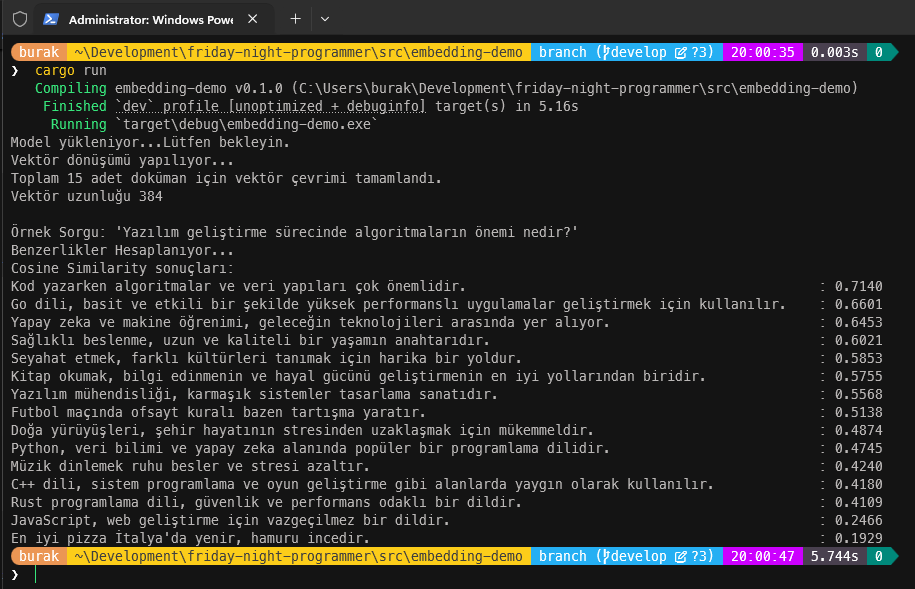

# Embedding Denilen Kavram

Embedding, genellikle doğal dil işleme (NLP) ve makine öğrenimi alanlarında kullanılan bir teknik. Bir kelime, cümle veya belge gibi metinsel verilerin sayısal  formata dönüştürülmesinde ele alınıyor. Bu sayısal format, genellikle vektörler şeklinde temsil ediliyor ve bazı hesaplama teknikleri yardımıyla aradaki benzerlikler ve ilişkiler yakalanabiliyor. Cosine Similarity veya Euclidean Distance gibi yöntemler kullanılarak bu vektörler arasındaki benzerlik ölçülebiliyor.
Bunu **Rust** tarafında deneyimlemek istedim. Bu konuda destek olabilecek güzel bir crate buldum; [fastembed](https://crates.io/crates/fastembed). Hatta text dışında image embedding opsiyonları da var.

Çalışma prensibi oldukça basit. Öncelikle bu embedding işlemini gerçekleştirecek bir model seçiliyor. Program çalışırken bu modelde sisteme indiriliyor. Sonrasında model yardımıyla metinsel ifadelerin vektör dönüşümleri gerçekleştiriliyor. Ardından hesaplama fonksiyonları ile ilişki değerleri çıkarılıyor. İşte bu işlemin arkasından bir Agent devreye sokulup daha tutarlı sonuçlar çıkartılması sağlanabilir. *Retrieval Augmented Generation* konusunda bilinmesi gereken konulardan birisi bu diye düşünüyorum. Örnek rust kodlarımıza gelince;

```rust
use anyhow::Result;
use fastembed::{EmbeddingModel, InitOptions, TextEmbedding};
use serde::{Deserialize, Serialize};
use std::fs;
use std::path::Path;
/*
    Bu örnekte RAG(Retrieval-Augmented Generation) konusunun
    önemli bir parçası olan Embedding kısmını ele almaya çalışıyorum.

    Büyük dil modelleri bağlamları kurarken vektör ilişkilerine bakıyor.
    Burada embedding devreye giriyor. Embedding, kelimeleri veya cümleleri
    sayısal vektörlere dönüştürerek, dil modellerinin bu ilişkileri anlamasına yardımcı oluyor.

    İşin temelinde biraz matematik var. Cosine similarity (Açısal benzerlik) veya
    Euclidean distance (Öklid uzaklığı) gibi yöntemlerle bu vektörler arasındaki benzerlikleri ölçüyoruz.

    Projece hata yönetimini kolaylaştırmak için anyhow,
    Embedding değerlerini oluşturmak için fastembed,
    JSON verimiz ile kolayca çalışmak için serde, serde_json küfelerini (crates) kullanıyoruz.
*/
fn main() -> Result<()> {
    let file_path = Path::new("data.json");
    let content = fs::read_to_string(file_path)?;
    let documents: Vec<Document> = serde_json::from_str(&content)?;
    let texts: Vec<String> = documents.iter().map(|d| d.text.clone()).collect();

    println!("Model yükleniyor...Lütfen bekleyin.");
    let mut model = TextEmbedding::try_new(
        InitOptions::new(EmbeddingModel::AllMiniLML12V2).with_show_download_progress(true),
    )?;

    println!("Vektör dönüşümü yapılıyor...");
    let embeddings = model.embed(texts, None)?;

    println!(
        "Toplam {} adet doküman için vektör çevrimi tamamlandı.",
        embeddings.len()
    );
    println!("Vektör uzunluğu {}\n", embeddings[0].len());

    let query_text = "Yazılım geliştirme sürecinde algoritmaların önemi nedir?";
    println!("Örnek Sorgu: '{}'", query_text);

    // Sorgunun da vektöre çevrilmesi gerekiyor ki karşılaştırma mümkün olsun
    let query_embedding = model.embed(vec![query_text.to_string()], None)?;
    let q_vec = &query_embedding[0];

    println!("Benzerlikler Hesaplanıyor...\nCosine Similarity sonuçları:");

    // Sıralamadan önce her doküman için sorgu vektörü ile benzerlik skorunu hesaplıyoruz
    // Örnekte Cosine Similarity kullanarak benzerlik skorunu hesaplıyoruz
    let mut scored_docs: Vec<(&Document, f32)> = documents
        .iter()
        .zip(embeddings.iter())
        .map(|(doc, doc_vec)| (doc, cosine_similarity(q_vec, doc_vec)))
        .collect();

    scored_docs.sort_by(|a, b| b.1.partial_cmp(&a.1).unwrap());

    for (doc, score) in scored_docs {
        println!("{:<100} : {:.4}", doc.text, score);
    }


    Ok(())
}

// Burada kosinüs benzerliğini hesaplıyoruz
fn cosine_similarity(a: &[f32], b: &[f32]) -> f32 {
    let dot_product: f32 = a.iter().zip(b).map(|(x, y)| x * y).sum();
    let magnitude_a: f32 = a.iter().map(|x| x * x).sum::<f32>().sqrt();
    let magnitude_b: f32 = b.iter().map(|x| x * x).sum::<f32>().sqrt();

    if magnitude_a == 0.0 || magnitude_b == 0.0 {
        0.0
    } else {
        dot_product / (magnitude_a * magnitude_b)
    }
}

#[derive(Debug, Serialize, Deserialize)]
struct Document {
    id: u32,
    text: String,
}
```

Program `data.json` dosyasını kobay olarak kullanmakta. İlk denemede elde edilen sonuçlar aşağıdaki gibi.



Dikkat edileceği üzere kod içerisinde sorulan soru ile en ilişkili olan cümlenin benzerlik skoru en yükseği.

```text
Soru: Yazılım geliştirme sürecinde algoritmaların önemi nedir?
En yüksek skor : 0.7140
İlişkili cümle : Kod yazarken algoritmalar ve veri yapıları çok önemlidir.
En düşük skor  : 0.1929
En alakasız cümle : En iyi pizza İtalya'da yenir, hamuru incedir.
```
