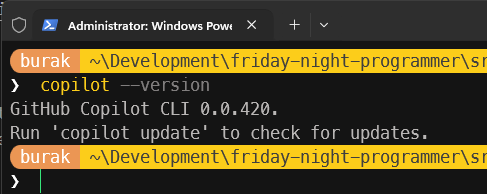
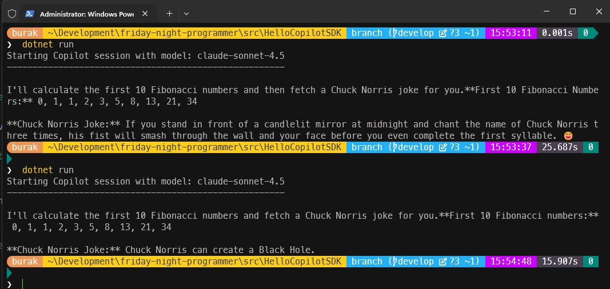
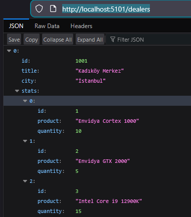

# Copilot-SDK - Hello World Uygulaması

VS Code'un chat penceresi, Claude veya Copilot'ın CLI araçları gibi dil modelleri ile konuşan kendi terminal uygulamalarımız yazmak için **Copilot-SDK**'yi kullanabiliriz. Bu çalışmada SDK'nın nasıl kullanılabileceğine dair birkaç basit örnek yapmaya çalışıyoruz.

- [Referans](https://github.com/github/copilot-sdk)

## Motivasyon

**Copilot-SDK**'yi bir .Net console uygulamasında basitçe kullanmak ama asıl hedef olarak bir **MCP Server** ile entegre etmek.

## Adımlar

Öncelikle sistemde Github Copilot CLI'ın yüklü olması gerekiyor. Bunu öğrenmek için,

```bash
copilot --version
```



> Eğer sisteminizde yüklü değilse, işte uğramanız gereken yer [Github Copilot CLI](https://docs.github.com/en/copilot/how-tos/copilot-cli/set-up-copilot-cli/install-copilot-cli)

```bash
# Console projesinin oluşturulması
dotnet new console -n HelloCopilotSDK
cd HelloCopilotSDK
# Copilot SDK Nuget paketinin projeye eklenmesi
dotnet add package GitHub.Copilot.Sdk
```

## Örnek 1, Streaming Kullanarak Tek Bir Soru Sormak

Resmi kaynaktaki ilk örnekte 2+2 işlemi OpenAI'ın gpt-4.1 modeline yaptırılmış. Hiç olmazsa daha farklı bir hello world uygulaması yapalım. Bu amaçla program kodlarını aşağıdaki gibi değiştirelim.

```csharp
using GitHub.Copilot.SDK;

await using var client = new CopilotClient();

var modelName = "claude-sonnet-4.5";
var intro = $"Starting Copilot session with model: {modelName}";
Console.WriteLine(intro);
Console.WriteLine(new string('-', intro.Length));
Console.WriteLine();

await using var session = await client.CreateSessionAsync(
    new SessionConfig
    {
        Model = modelName,
        OnPermissionRequest = PermissionHandler.ApproveAll,
        Streaming = true
    }
);

session.On(e =>
{
    switch (e)
    {
        case AssistantMessageDeltaEvent messageEvent:
            Console.Write(messageEvent.Data.DeltaContent);
            break;
        case SessionIdleEvent messageEvent:
            Console.WriteLine("");
            break;
    }
});

await session.SendAndWaitAsync(
    new MessageOptions
    {
        Prompt = "Give me the first 10 Fibonacci numbers and then find the related Norris Joke."
    }
);
```

Kodda neler yaptığımız şöyle bir bakalım. Bu console uygulaması ile **Anthropic**' in **Claude Sonnet 4.5** modelini kullanarak bir konuşma gerçekleştirmek istiyoruz. Sorumuz da oldukça basit ama birbirleriyle tamamen alakasız iki parçadan oluşuyor :D

Öncelikle bir **CopilotClient** nesnesi örnekliyoruz ve bu nesne yardımıyla asenkron bir oturum *(Session)* başlatıyoruz. Malum istemci olarak bizim ve modelin arasında bir ağ trafiği söz konusu - tipik bir Client-Server tasarım diyebiliriz. **SessionConfig** sınıfını da kullanarak oturum için gerekli bazı ayarlamaları yapıyoruz. Hangi modelle çalışacağımız dışında birde tüm yetki taleplerini kabul ediyoruz. Bunu sadece geliştirme aşamasında yaptığımızı belirtmek isterim. Normal şartlarda güvenlik gereği bir yetki *(Authorize)* alarak ilgili modele gidilmesi gerekir. Ben şimdilik kolaya kaçtım zira bunu yapmadığım takdirde bir çalışma zamanı hatası almaktayım.

Diğer yandan açılan oturum sırasında modelden gelen bilgilerin anlık olarak da görünmesini sağlayabiliriz. Tahmin edileceği üzere **Streaming** özelliğine **true** değeri verilmesinin sebebi bu. **Streaming** kullanmadığımız takdirde cevabı yine alırız ancak cevabın tamamı gelene kadar beklemek gerekir. Oysa **Streaming** ile cevabın parçalar halinde gelmesini sağlayarak cevabın o anki parçasını ekrana yazdırabiliriz. Takibimiz kolaylaşır.

Devam eden kısımda ise oturum sırasında gerçekleşen olayları *(events)* dinlediğimiz bir metod bloğu var. **On** metodu ile oturum sırasında gerçekleşen olayları dinliyoruz ki bu örnekte iki olayı ele almaktayız. Bunlardan birisi modelden gelen cevabın parçalarını temsil eden **AssistantMessageDeltaEvent** türünden olan. Bu olay gerçekleştiğinde cevabın o anki parçasını ekrana yazdırma şansımız da var. Diğer yandan **SessionIdleEvent** türünden bir olay da var ki bu da model cevabı tamamen gönderdikten sonra gerçekleşiyor. Bu olay gerçekleştiğinde de terminalde bir alt satıra geçip cevabın tamamlandığını belirtmiş oluyoruz.

Son olarak da **SendAndWaitAsync** metodu yardımıyla modele sormak istediğimiz soruyu gönderiyoruz. Bu metodun asenkron olduğunu ve oturumun sonlanmasını beklediğini de belirtelim. Bir başka deyişle cevap gelene kadar uygulama sonlanmayacaktır. İşte ilk örneğimizin çalışma zamanına ait bir çıktı.



## Örnek 2, Tool Kullanımı

SDK'nin sunduğun güçlü fonksiyonelliklerden birisi de model ile başlatılan oturuma bir araç dahil edebilmek. Resmi dokümanda bir şehir için rastgele hava sıcaklığı üreten bir fonksiyon kullanılmış. Yine basit ama farklı bir örnekle gidelim. Örneğin bilgisayar sarf malzemeleri ile ilgili stok bilgisi veren bir araç ekleyelim. Bu araç bize stokta bulunan ürünlerin isimlerini ve adetlerini verecek. Hatta bunu bayii bazlı yapalım. Şuna benzer sorular sorabiliriz:

- "Ankara bayimizde stokta kalan ürünler hangileri?"
- "Şişli bayisinde Envidya GTX 2000 ekran kartlarından kaç adet kaldı?"
- "Hangi bayilerde 32 GB RAM var?"

Burada senaryoyu renklendirmek adına bayi istatistiklerini yine .Net ile yazacağımız basit bir Web API üzerinden çekelim. Örneğin aşağıdaki koda sahip minimal bir Web API kullanabiliriz.

```csharp
using Microsoft.AspNetCore.Http.HttpResults;
using System.Text.Json.Serialization;

var builder = WebApplication.CreateSlimBuilder(args);

builder.Services.ConfigureHttpJsonOptions(options =>
{
    options.SerializerOptions.TypeInfoResolverChain.Insert(0, AppJsonSerializerContext.Default);
});

builder.Services.AddOpenApi();

var app = builder.Build();

if (app.Environment.IsDevelopment())
{
    app.MapOpenApi();
}

Dealer[] data = StockStatsApi.SeedData.GetDealers();

var dataApi = app.MapGroup("/dealers");
dataApi.MapGet("/", () => data)
        .WithName("GetAllStats");

dataApi.MapGet("/{id}", Results<Ok<Dealer>, NotFound> (int id) =>
    data.FirstOrDefault(a => a.Id == id) is { } dealer
        ? TypedResults.Ok(dealer)
        : TypedResults.NotFound())
    .WithName("GetDealerById");

app.Run();

public record Dealer(int Id, string Title, string City, List<Stats> Stats);
public record Stats(int Id, string Product, int Quantity);

[JsonSerializable(typeof(Dealer[]))]
internal partial class AppJsonSerializerContext : JsonSerializerContext
{

}
```

Servisimiz localhost, 5101 nolu porttan ulaşılabilir durumda. Aşağıdaki ekran görüntüsünde örnek bir çıktıyı görebilirsiniz.



Şimdi gelelim **Copilot SDK** kullanan istemci uygulama tarafına. Bu API'yi çağıran başka bir metodu **tool** olarak oturuma dahil edeceğiz.

```csharp

```
