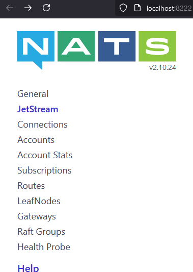
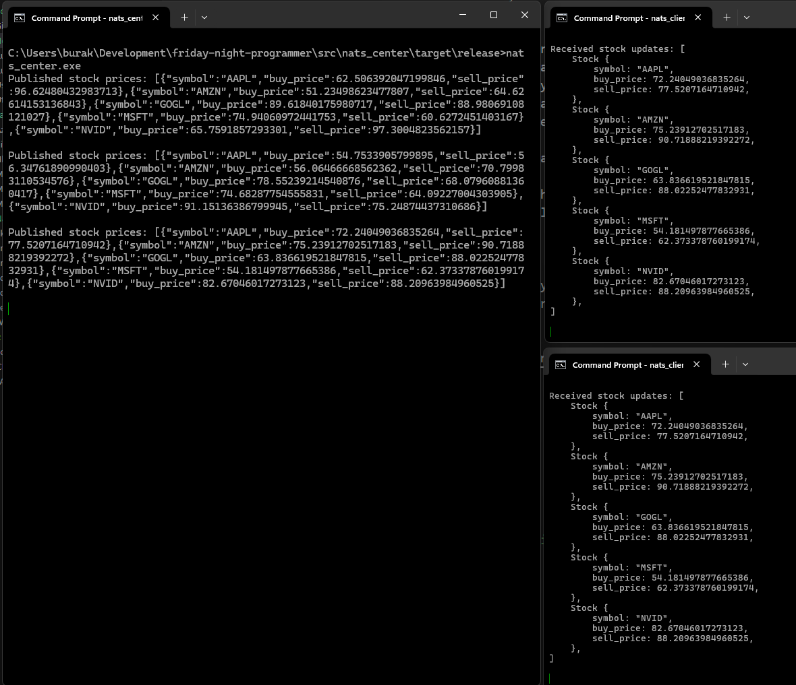

# Nats Pub Sub Kullanımı

Hafifsiklet sayılabilecek mesajlaşma araçlarından biriside [Nats](https://docs.nats.io/) olarak bilinmektedir. Özellikle mikro servisler arası haberleşmelerde yüksek performanslı bir açık kaynak çözüm olarak da karşımıza çıkıyor. Bu repoda yer yer asenkron çalışacak mesaj kuyruklarına ihtiyacım olacak ve publisher/subscriber gibi modelleri kullanmam da gerekecek. Genelde bunun için Rabbit MQ öncelikli tercihim ancak farklı alternatifleri de denemek lazım. Apache Kafka, ActiveMQ, Mosquitto _(Özellikle IoT cihazlarının olduğu senaryolarda)_ ve hatta Redis bunlar arasında yer alıyor. Bu kısa dokümanda ise NATS'ı basit bir senaryoda Rust ile kullanmaya çalışacağız.

Senaryomuzda merkezde yer alan uygulamamız hayali olarak birkaç hisse senedi için rastgele değişimleri simüle ediyor olacak. Hazırlanan JSON bilgiler NATS aracılığı ile abone olan istemcilere aktarılacak.

## Ön Hazırlıklar

[Docker-Compose](../docker-compose.yml) dosyamızda NATS servisi için bir tanımlama yer alıyor. Dolayısıyla docker-compose up -d komutu sonrası localhost:8222 adresine gittiğimizde aşağıdakine benzer bir arabirimle karşılaşmamız lazım.



## Publisher Projesinin Yazımı

Publisher projemizi oluşturabiliriz.

```bash
cargo new nats_center
cd nats_center

# Rust tarafında nats kullanımı için gerekli crate
cargo add nats

# ve diğerleri
cargo add rand serde_json
cargo add serde -F derive
```

ve kaynak kodlarımız

```rust
use rand::Rng;
use serde::Serialize;
use std::error::Error;
use std::thread;
use std::time::Duration;

#[derive(Serialize)]
struct Stock<'a> {
    symbol: &'a str,
    buy_price: f64,
    sell_price: f64,
}

fn get_stocks<'a>() -> Vec<Stock<'a>> {
    let symbols = vec!["AAPL", "AMZN", "GOGL", "MSFT", "NVID"];
    let mut rng = rand::thread_rng();

    symbols
        .into_iter()
        .map(|symbol| Stock {
            symbol,
            buy_price: rng.gen_range(50.0..100.0),
            sell_price: rng.gen_range(50.0..100.0),
        })
        .collect()
}

fn main() -> Result<(), Box<dyn Error>> {

    let nats_conn = nats::connect("127.0.0.1:4222")?;
    let subject = "stocks.update";

    loop {
        let stocks = get_stocks();
        let message = serde_json::to_string(&stocks)?;

        nats_conn.publish(subject, &message)?;
        println!("Published stock prices: {}\n", message);

        thread::sleep(Duration::from_secs(10));
    }
}
```

## Subscriber Projesinin Hazırlanması

Subscriber tarafını da Rust ile geliştirebiliriz. _(Elbette gerek subscriber gerek publisher tarafları farklı dillerle de geliştirilebilir)_

```bash
cargo new nats_client
cd nats_client

# Diğer projede olduğu gibi gerekli crate eklenir
cargo add nats

# ve diğer gerekli crate'ler
cargo add serde_json
cargo add serde -F derive
```

ve kod içeriği

```rust
use serde::Deserialize;
use std::error::Error;

#[derive(Deserialize, Debug)]
struct Stock<'a> {
    symbol: &'a str,
    buy_price: f64,
    sell_price: f64,
}

fn main() -> Result<(), Box<dyn Error>> {

    let nats_conn = nats::connect("127.0.0.1:4222")?;
    let subject = "stocks.update";
    let subscription = nats_conn.subscribe(subject)?;

    println!("Listening for stock updates on '{}'", subject);

    for msg in subscription.messages() {
        let stocks: Vec<Stock> = serde_json::from_slice(&msg.data)?;
        println!("Received stock updates: {:#?}\n", stocks);
    }

    Ok(())
}
```

## Çalışma Zamanı ve Test

Yazılan rust projelerinin release versiyonlarını oluşturup ilerleyebiliriz. Bunun için ilgili proje klasörlerinde aşağıdaki komutları çalıştırmak yeterli olacaktır.

```bash
cargo build --release
```

Bu işlem target/release klasörüne derlemenin yapıldığı sistem için kullanılabilecek binary içeriklerin çıkartılmasını sağlayacaktır.

Publisher rolünü üstlenen sunucu uygulamasını çalıştırdıktan sonra farklı terminal pencerelerinden birden fazla subscriber uygulaması da başlatabiliriz. Üzerinde çalıştığım Windows 11 sisteminde bununla ilgili olarak aşağıdaki gibi bir çıktıya ulaştım.


