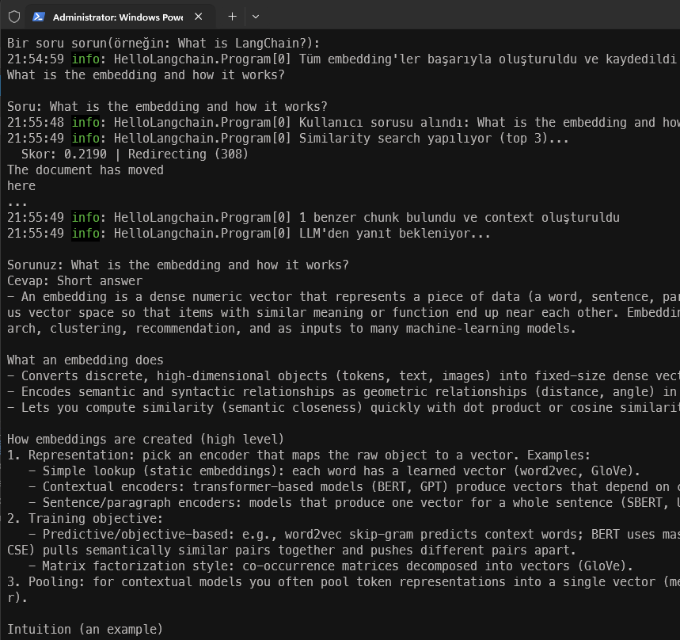

# C# Tarafında Langchain Kullanımı

DotNet tarafında bir başka RAG - Retrieval-Augmented Generation düzeneği kurmak için Langchain'den yararlanacağım bir örnek geliştirmek istedim. Amacım Langchain ile ilgili bilgilerin verildiği web sayfası içeriğini okumak, sonrasında vektor tabanlı bir veritabanına kayıt ettirmek ve kullanıcının sorduğu soruya en yakın metin parçalarının bulunarak büyük dil modeline context olarak yollanmasını sağlamak. Yine bir chat istemcisi ile modele soru soracağız ancak bu sefer soruyu doğrudan modele göndermek yerine önce benzer metin parçalarını bulup onlarla birlikte göndermek istedim. Böylece modelin daha alakalı ve doğru yanıtlar üretmesini sağlamayı hedefliyorum. Adım adım belli bir domain'e özgü bir bilgi tabanı oluşturup onu LLM ile kullanarak nasıl daha iyi sonuçlar alınabileceğini öğrenmeye çalışıyorum. Program kodu [burada](../src/HelloLangchain/Program.cs) yer alıyor.

## Çalışma Adımları

Kod akışını kabaca aşağıdaki gibi özetleyebiliriz;

### 1. OpenAI İstemci Nesnelerinin Oluşturulması

- **ChatClient**: Projede chat fonksiyonelliği için **gpt-5-mini** modeli kullanılıyor. OpenAI ile üretilen API key ile bu istemci oluşturulur.
- **EmbeddingClient**: Örneğimizde **text-embedding-3-small** modeli ile metin parçalarını 1536 boyutlu vektorlere dönüştürmek için kullanılır.

### 2. Web Sayfa İçeriğinin Yüklenmesi

**LangChain.DocumentLoaders.Html** paketi aracılığıyla LangChain dokümantasyon sayfası [buradan](https://python.langchain.com/docs/get_started/introduction) HTML olarak indirilir ve metin içeriğine dönüştürülür.

### 3. Prompt Şablonunun Tanımlanması

**LangChain.Prompts.PromptTemplate** paketini kullanıp `{question}` ve `{context}` yer tutucularını içeren bir şablon tanımlanıyor. Bu şablon, arama sonuçlarından elde edilen bağlamla birlikte LLM'e *(Büyük dil modeline)* gönderilecek sistem mesajını üretmek için kullanılmakta.

### 4. Doküman Parçalama (Chunking)

Yüklenen doküman metni 500 karakterlik parçalara bölünür. Bu parçaların her biri vektör veritabanında saklanacak.

### 5. Embedding Üretimi ve Vektör Deposuna Kayıt

Her metin parçası için seçtiğimiz **OpenAI text-embedding-3-small** modeli üzerinden embedding vektörü üretilir. Elde edilen vektör ve metin **InMemoryVectorStore** içerisindeki koleksiyona **DocumentChunk** nesnesi olarak kaydedilir.

> **InMemoryVectorStore**, python örneklerinde sıklıkla kullanılan Facebook'un **FAISS *(embeddings)*** kütüphanesinin .Net karşılığı olarak kullanıldı. Üretim ortamında bu bileşenin yerine **Qdrant**, **Azure AI Search** veya **Pinecone** gibi kalıcı depolama çözümleri kullanılabilir; model sınıfı ve arama çağrısı aynı kalır.

### 6. Benzerlik Arama *(Similarity Search)*

Belki de işin en can alıcı kısmıdır diyebiliriz. Konsol uygulamamız kullanıcıdan bir soru bekler. Soru metni için de embedding dönüşümü yapılır ve vektör deposunda **cosine similarity** ile ona en yakın 3 parça bulunur. Her sonucun benzerlik skoru ve metin ön izlemesi konsola yazdırılır.

### 7. LLM ile Yanıt Üretimi

Bulunan metin parçaları birleştirilir ve **PromptTemplate.FormatAsync** nesnesi ile sistem mesajına enjekte edilir. Bu mesaj ve kullanıcının sorusu **ChatClient** aracılığıyla OpenAI'a gönderilir ve modelin yanıtı konsola yazdırılır. Bir başka deyişle, kullanıcının sorusu doğrudan LLM'e gönderilmez, önce benzer metin parçaları bulunur ve bu parçalar bağlam olarak sunularak daha doğru ve alakalı yanıtlar alınması sağlanır.

## Kullanılan Paketler

| Paket | Sürüm | Açıklama               |
|-------|-------|------------------------|
| dotenv.net | 4.0.0 | .env dosyasından ortam değişkeni yüklemek için kullanılır; örneğimizde OpenAI API anahtarı bu şekilde yükleniyor |
| LangChain.Core | 0.17.0 | Prompt şablonları ve temel LangChain altyapısı |
| LangChain.DocumentLoaders.Html | 0.17.0 | HTML sayfalarından doküman yükleme |
| Microsoft.Extensions.VectorData.Abstractions | 9.7.0 | Vektör deposu soyutlama katmanı |
| Microsoft.SemanticKernel.Connectors.InMemory | 1.70.0-preview | Bellek içi vektör deposu (FAISS alternatifi) |
| OpenAI | 2.8.0 | OpenAI API istemcisi (Chat ve Embedding) |

İşte çalışma zamanından örnek bir çıktı:



## Mimari Özet

Kodun çalışma zamanındaki akışını şöyle yavan bir diagramla özetleyebiliriz.

```text
.env (API Key)
     |
     v
Program.cs
     |
     +--> HtmlLoader ---> Web sayfası içeriğini yükle
     |
     +--> Chunking -----> Metni 500 karakterlik parçalara böl
     |
     +--> EmbeddingClient -> Her parça için vektör üret
     |
     +--> InMemoryVectorStore -> Vektörleri depola
     |
     +--> Kullanıcı sorusu --> Embedding --> Similarity Search (top 3)
     |
     +--> PromptTemplate.FormatAsync --> Sistem mesajı oluştur
     |
     +--> ChatClient --> OpenAI'dan yanıtla
```
