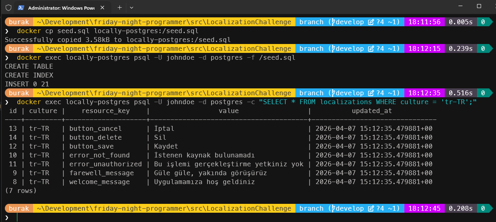
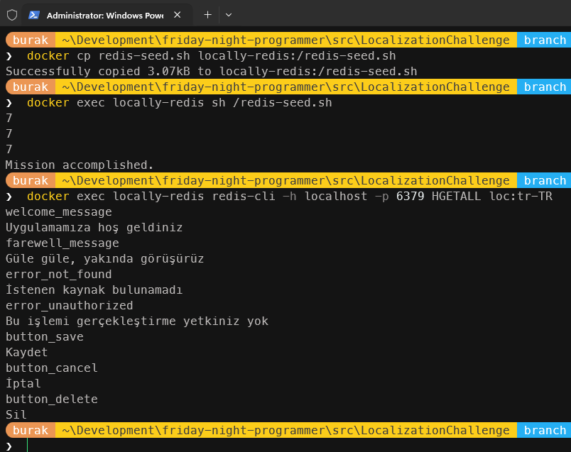
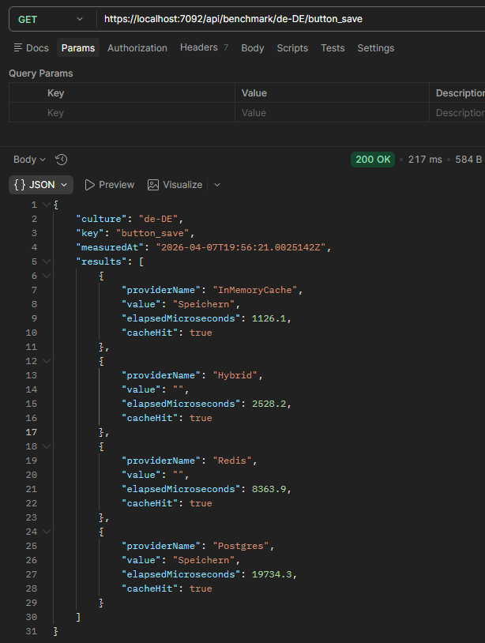

# Hangi Localization Tekniği

Tartışmanın konusu çooooook uzun zamandır dünyamızda var alan çoklu dil desteği. Kimi zaman veritabanı üzerinden kimi zaman fiziki dosyalardan *(resx gibi)* yönetmeye çalıştığımız bir mevzu. Sürekli değişip genişleyebilenler bir yana nadiren değişip genellikle statik kalanlar da işin bir başka yanı. Aslında temel amaç bir program arayüzünün veya kullanıcı ile etkileşimde olan taraflarının farklı dillere de destek vermesini sağlamak. Teori basit; değişmez sabit bir kavram *(key diyelim)* karşılığında kullanılan dile göre farklı değerler tutulmasını sağlamak.

Örneğin müşteri bilgilerini kaydetme ekranında kullandığımız **button** kontrolünün başlığını **save_button** şeklinde bir **key** ile sabitleyip değerlerini ana dilimizde *kaydet*, İngilizce'de *save*, İspanyolca' da *Ahorrar* şeklinde tutabiliriz. Bunun için ister tablo tasarımı kullanalım ister bir **key:value** koleksiyon verinin okunması, değiştirilmesi, aynı anda erişilmesi gibi konular başka soruları da gündeme getirir. Nerede tutsak iyi olur, hangi teknik bizi ne kadar yavaşlatır/hızlandırır, eş zamanlı *(concurrent)* çağrılarda değişenlerin güncelliğini nasıl koruruz, **race-condition** oluşur mu, ön belleğe *(cache)* alsak ne zaman tazelemek gerekir, koca veriyi ön belleğe alma maliyeti nedir vb.

Çoklu dil desteği aslında çözülmemiş bir problem değil. Birçok yazılım firması zaten çoktandır ideal çözümler üzerinden ilerlemekte. Bu çalışmadaki amacım veritabanı *(kuvvetle muhtemel Postgresql)*, **redis**, **in-memory cache** veya hibrit çözümler arasında bir benchmark ölçümü yapmak. Neticede aşağıdaki tabloda belirtilen sonuçları ispatlamaya ya da gerçeği yansıtıp yansıtmadığını bulmaya çalışacağız.

| **Yaklaşım** | **Read** | **Cold Start** Maliyeti | **Hot Read** Maliyeti |
| --- | --- | --- | --- |
| **PostgreSQL** *(doğrudan kullanım)* | Network + Disk | High | High |
| **Redis** | Network + RAM | Medium | Low |
| **IMemoryCache** *(in-process)* | RAM | Low (after warmup) | Lowest |
| **JSON** *(resx gibi dosyalarda)* | Disk | Low | Very Low |
| **Hybrid** *(DB → Redis → MemCache)* | Layered | Warm on demand | Lowest after L1 |

## Hazırlıklar

Öncelikle birkaç yaklaşımız olduğunu belirtelim. Çoklu dil desteği için dikeyde büyüyen bir tabloyu **PostgreSQL** üzerinde tutacağız. Bir diğer yaklaşımda dağıtık sistemlerin en karizma caching ürünlerinden olan **Redis** ile ilerleyeceğiz. .Net'in dahili bellek kullanımı da yabana atılır türden değil. Dolayısıyla o da işin içerisine giriyor. Bir başka tercih de içeriği disk üzerinde **JSON** veya **YAML** gibi bir formatta tutmak ama bunu bu senaryoda ele almayacağım. Elbette hibrit olarak en hızlıdan en yavaşa doğru farklı seviyleri ele alan hibrit bir modelimiz de olacak.

### Docker Setup

Düzeneğimizi `**.Net 10** platformunda kurgulayabiliriz. **PostgreSQL** ve **Redis** enstrümanları için her zaman olduğu gibi bir **docker-compose** dosyası iş görecektir. En azından aşağıdaki içeriğe sahip olmasında yarar var.

```yml
services:

  postgres:
    image: postgres:latest
    container_name: locally-postgres
    environment:
      POSTGRES_USER: johndoe
      POSTGRES_PASSWORD: somew0rds
      POSTGRES_DB: postgres
    ports:
      - "5435:5432"
    volumes:
      - postgres_data:/var/lib/postgres/data
    networks:
      - locally-network

  pgadmin:
    image: dpage/pgadmin4:latest
    container_name: locally-pgadmin
    environment:
      PGADMIN_DEFAULT_EMAIL: scoth@tiger.com
      PGADMIN_DEFAULT_PASSWORD: 123456
    ports:
      - "5050:80"
    depends_on:
      - postgres
    networks:
      - locally-network

  redis:
    image: redis:latest
    container_name: locally-redis
    ports:
      - "6379:6379"
    # Burada persistance storage'ı devre dışı bırakıyoruz ve pure in-memory modda çalıştırıyoruz. 
    # Nitekim benchmark sırasında disk IO işlemleri performansı etkileyebilir.
    command: redis-server --save "" --appendonly no --maxmemory 256mb --maxmemory-policy allkeys-lru
    networks:
      - locally-network

volumes:
  postgres_data:

networks:
  locally-network:
    driver: bridge
```

### Solution İskeleti

Solution içeriğinde birkaç proje yer alacak. Farklı provider türlerimiz olacağı için çok basit soyutlamalar kullanmakta, **benchmark** ölçümleri için ayrı bir proje açmakta ve testleri bir web api üzerinden icra etmekte yarar var. Yani farklı provider'lar için class library'ler, çoklu dil veri setlerine ulaşmak için bir **web api** ve performans ölçümleri için bir **console** uygulaması. Buna göre solution içeriği ve gerekli **nuget** paketlerini aşağıdaki gibi hazırlayabiliriz.

```bash
mkdir LocalizationChallenge
cd LocalizationChallenge

dotnet new sln

dotnet new classlib -n LocalizationChallenge.Core
dotnet sln add LocalizationChallenge.Core/

dotnet new classlib -n LocalizationChallenge.Infrastructure
dotnet add LocalizationChallenge.Infrastructure/LocalizationChallenge.Infrastructure.csproj package Npgsql
dotnet add LocalizationChallenge.Infrastructure/LocalizationChallenge.Infrastructure.csproj package StackExchange.Redis
dotnet add LocalizationChallenge.Infrastructure/LocalizationChallenge.Infrastructure.csproj package Microsoft.Extensions.Hosting.Abstractions
dotnet sln add LocalizationChallenge.Infrastructure/

dotnet new console -n LocalizationChallenge.Benchmarks
dotnet add LocalizationChallenge.Benchmarks/LocalizationChallenge.Benchmarks.csproj package BenchmarkDotNet
dotnet add LocalizationChallenge.Benchmarks/LocalizationChallenge.Benchmarks.csproj package Npgsql
dotnet add LocalizationChallenge.Benchmarks/LocalizationChallenge.Benchmarks.csproj package StackExchange.Redis
dotnet sln add LocalizationChallenge.Benchmarks/

dotnet new webapi -n LocalizationChallenge.Api
dotnet add LocalizationChallenge.Api/LocalizationChallenge.Api.csproj package Npgsql
dotnet add LocalizationChallenge.Api/LocalizationChallenge.Api.csproj package StackExchange.Redis  
dotnet sln add LocalizationChallenge.Api/

# Gerekli proje referansların eklenmesi
dotnet add LocalizationChallenge.Infrastructure/LocalizationChallenge.Infrastructure.csproj reference LocalizationChallenge.Core/LocalizationChallenge.Core.csproj
dotnet add LocalizationChallenge.Api/LocalizationChallenge.Api.csproj reference LocalizationChallenge.Core/LocalizationChallenge.Core.csproj
dotnet add LocalizationChallenge.Api/LocalizationChallenge.Api.csproj reference LocalizationChallenge.Infrastructure/LocalizationChallenge.Infrastructure.csproj
dotnet add LocalizationChallenge.Benchmarks/LocalizationChallenge.Benchmarks.csproj reference LocalizationChallenge.Core/LocalizationChallenge.Core.csproj
dotnet add LocalizationChallenge.Benchmarks/LocalizationChallenge.Benchmarks.csproj reference LocalizationChallenge.Infrastructure/LocalizationChallenge.Infrastructure.csproj
```

Kod tarafında ilerledikçe projelerimizin kullanım amacı biraz daha netleşecek.

### Postgresql Tarafı

Veritabanı tarafında bir tabloya ve onu en azından örnek verilerle tohumlamaya *(seeding)* ihtiyacımız var. Başlangıç için aşağıdaki script'i kullanabiliriz. *(İlerleyen aşamada belki bir trigger ekleyip olası değişimleri dış dünyaya push'layacağımız bir mekanizmayı da ele alırız ki **cache-invalidation** noktasında gerekli olabilir)*

```sql
CREATE TABLE IF NOT EXISTS localizations (
    id           SERIAL       PRIMARY KEY,
    culture      VARCHAR(10)  NOT NULL,
    resource_key VARCHAR(255) NOT NULL,
    value        TEXT         NOT NULL,
    updated_at   TIMESTAMPTZ  NOT NULL DEFAULT NOW(),
    CONSTRAINT uq_culture_key UNIQUE (culture, resource_key)
);

CREATE INDEX IF NOT EXISTS idx_loc_culture_key ON localizations (culture, resource_key);

-- Sample data
INSERT INTO localizations (culture, resource_key, value) VALUES
  ('en-US', 'welcome_message',    'Welcome to our application'),
  ('en-US', 'farewell_message',   'Goodbye, see you soon'),
  ('en-US', 'error_not_found',    'The requested resource was not found'),
  ('en-US', 'error_unauthorized', 'You are not authorized to perform this action'),
  ('en-US', 'button_save',        'Save'),
  ('en-US', 'button_cancel',      'Cancel'),
  ('en-US', 'button_delete',      'Delete'),
  ('tr-TR', 'welcome_message',    'Uygulamamıza hoş geldiniz'),
  ('tr-TR', 'farewell_message',   'Güle güle, yakında görüşürüz'),
  ('tr-TR', 'error_not_found',    'İstenen kaynak bulunamadı'),
  ('tr-TR', 'error_unauthorized', 'Bu işlemi gerçekleştirme yetkiniz yok'),
  ('tr-TR', 'button_save',        'Kaydet'),
  ('tr-TR', 'button_cancel',      'İptal'),
  ('tr-TR', 'button_delete',      'Sil'),
  ('de-DE', 'welcome_message',    'Willkommen in unserer Anwendung'),
  ('de-DE', 'farewell_message',   'Auf Wiedersehen, bis bald'),
  ('de-DE', 'error_not_found',    'Die angeforderte Ressource wurde nicht gefunden'),
  ('de-DE', 'error_unauthorized', 'Sie sind nicht berechtigt, diese Aktion durchzuführen'),
  ('de-DE', 'button_save',        'Speichern'),
  ('de-DE', 'button_cancel',      'Abbrechen'),
  ('de-DE', 'button_delete',      'Löschen')
ON CONFLICT (culture, resource_key) DO NOTHING;
```

**SQL** içeriğini **pgadmin** arabirimi üzerinden ekleyebileceğimiz gibi komut satırından bu dosyayı container içerisine alarak da çalıştırabiliriz.

```bash
# Öncelikle sql dosyasını container içerisine kopyalayalım
docker cp seed.sql locally-postgres:/seed.sql
# Şimdi de çalıştırarak verileri ekleyelim
docker exec locally-postgres psql -U johndoe -d postgres -f /seed.sql
# Verilerin eklenip eklenmediğini kontrol edelim
docker exec locally-postgres psql -U johndoe -d postgres -c "SELECT * FROM localizations WHERE culture = 'tr-TR';"
```



### Redis

**Redis** tarafına da örnek veri tohumlarını aktarmakta yarar var. **Postgresql** için kullanığımız veri kümesinin aynısını **redis** için de değerlendirebiliriz. Tabii verileri aktarmak için kullanabileceğimiz birkaç yol var. Bunlardan birisi **docker** ortamondaki **Redis** container'ına terminal açmak ve örneğin aşağıdaki içeriğe sahip bir shell script dosyasını kopyalayıp işletmek. Burada her bir dil kümesini bir **HashSet** olarak ekliyoruz.

```bash
redis-cli -h localhost -p 6379 HSET loc:en-US \
  welcome_message    "Welcome to our application" \
  farewell_message   "Goodbye, see you soon" \
  error_not_found    "The requested resource was not found" \
  error_unauthorized "You are not authorized to perform this action" \
  button_save        "Save" \
  button_cancel      "Cancel" \
  button_delete      "Delete"

redis-cli -h localhost -p 6379 HSET loc:tr-TR \
  welcome_message    "Uygulamamıza hoş geldiniz" \
  farewell_message   "Güle güle, yakında görüşürüz" \
  error_not_found    "İstenen kaynak bulunamadı" \
  error_unauthorized "Bu işlemi gerçekleştirme yetkiniz yok" \
  button_save        "Kaydet" \
  button_cancel      "İptal" \
  button_delete      "Sil"

redis-cli -h localhost -p 6379 HSET loc:de-DE \
  welcome_message    "Willkommen in unserer Anwendung" \
  farewell_message   "Auf Wiedersehen, bis bald" \
  error_not_found    "Die angeforderte Ressource wurde nicht gefunden" \
  error_unauthorized "Sie sind nicht berechtigt, diese Aktion durchzuführen" \
  button_save        "Speichern" \
  button_cancel      "Abbrechen" \
  button_delete      "Löschen"

echo "Mission accomplished."
```

Yukarıdaki betiği çalıştırmak için aşağıdaki gibi bir yol izleyebiliriz *(Ben denemelerimi Windows 11 ortamında Command Prompt üzerinden yaptım)*

```bash
# Öncelikle redis-seed dosyasını container içerisine kopyalayalım
docker cp redis-seed.sh locally-redis:/redis-seed.sh
# Ardından çalıştırarak verileri ekleyelim
docker exec locally-redis sh /redis-seed.sh

# Verilerin eklenip eklenmediğini kontrol edelim
docker exec locally-redis redis-cli -h localhost -p 6379 HGETALL loc:tr-TR
```



## Kod Tarafı

Şimdi adım adım kodlarımızı geliştirelim. Birden fazla projede yapacağımız önemli değişiklikler var.

### Core Kütüphanesi

 **Core** projesinden başlayabiliriz. Farklı türden çoklu dil mekanizmaları kullanacağımız için bunu aşağıdaki arayüz soyutlaması ile bir sözleşme *(contract)* haline getirmekte yarar var.

```csharp
namespace LocalizationChallenge.Core;

public interface ILocalizationProvider
{
    string ProviderName { get; }
    ValueTask<string> GetLocalizedStringAsync(string key, string culture, CancellationToken cancellationToken = default);
}
```

**ProviderName** alanı *(field)* adı üstünde hangi tekniği kullandığımızı belirtecek. **GetLocalizedStringAsync** metodu ise kobay olarak kullandığımız davranışı tanımlıyor. Amacımız bir terimin belirtilen dildeki karşılığını döndürecek fonksiyonelliği tanımlamak. Veri okuma ile ilgili operasyonlar için bu davranış şu an için yeterli. Dolayısıyla asıl provider nesnelerinin bu arayüzü *(interface)* implemente etmesini bekliyoruz.

Diğer yandan süre ölçümlemelerini tutacağımız bir veri nesneside işimize yarar. BenchmarkResult isimli bu sınıfı da aşağıdaki gibi tasarlayabiliriz.

```csharp
namespace LocalizationChallenge.Core;

public sealed record BenchmarkResult(
    string ProviderName,
    string? Value,
    double ElapsedMicroseconds,
    bool CacheHit
);
```

Tipik olarak ölçüme konu olan provider enstrümanını, elde edilen değeri *(veriyi kontrol etmek için)*, mikro saniye türünden ölçüm değerini ve cache üzerinden tedarik edilip edilemediği bilgisini tutuyoruz.

### Infrastructure Kütüphanesi

Hakiki provider bileşenlerimiz bu **class library** projesinde yer alacak. **Postgres**, **Redis**, **In-Memory** ve **hibrit** teknikleri için birer provider sınıfı yazarak devam edelim. Tahmin edileceği üzere bunlar **Core** kütüphanesindeki **ILocalizationProvider** arayüzünü implemente etmeliler. İlk olarak **postgres** tarafı ile başlayalım.

```csharp
using LocalizationChallenge.Core;
using Npgsql;

namespace LocalizationChallenge.Infrastructure;

public sealed class PostgresLocalizationProvider(NpgsqlDataSource dataSource)
    : ILocalizationProvider
{
    public string ProviderName => "Postgres";

    public async ValueTask<string> GetLocalizedStringAsync(string key, string culture, CancellationToken cancellationToken = default)
    {
        await using var command = dataSource.CreateCommand(
            "SELECT value FROM localizations WHERE resource_key = @key AND culture = @culture LIMIT 1"
        );
        command.Parameters.AddWithValue("key", key);
        command.Parameters.AddWithValue("culture", culture);

        var result = await command.ExecuteScalarAsync(cancellationToken);
        return result as string ?? string.Empty;
    }
}
```

Oldukça basit bir sınıf. **key** ve **culture** bilgilerini parametre olarak alan bir **SQL** sorgusu işletiliyor ve sonuç geriye **string** olarak dönülüyor. Tabii bir *null check* kontrolümüz de var. Hiç vakit kaybetmeden **redis** bileşenimizi geliştirerek devam edelim.

```csharp
using LocalizationChallenge.Core;
using StackExchange.Redis;

namespace LocalizationChallenge.Infrastructure;

public sealed class RedisLocalizationProvider(IConnectionMultiplexer connectionMultiplexer)
    : ILocalizationProvider
{
    private readonly IDatabase database = connectionMultiplexer.GetDatabase();
    public string ProviderName => "Redis";

    public async ValueTask<string> GetLocalizedStringAsync(string key, string culture, CancellationToken cancellationToken = default)
    {
        var value = await database.HashGetAsync($"loc::{culture}", key);
        return value.HasValue ? value.ToString() : string.Empty;
    }
}
```

**Redis** üzerinden ilgili **hashSet**'e ulaşıp **key** değerini geri döndürüyoruz *(bulamazsak da boş bir değer)*

Sıradaki bileşen .Net'in **in-memory cache** özelliğini kullanıyor. Örneğimizde ele aldığımız çoklu dil verilerinin çok sık değişmeyeceğini düşünürsek yeni tip bir koleksiyon türünü de göz önüne alabiliriz. **.Net 8** ile gelen ama **.Net 10** tarafında önemli performans iyileştirmeleri içeren ve özellikle **lookup** türündeki **dictionary** veri kümelerinde *%20 ile %40* arasında daha hızlı olduğu iddia edilen **FrozenDictionary** sınıfını ele almak için iyi bir fırsat *(Bu koleksiyonu ve özelliklerini ayrıca çalışmam gerekiyor zira read-only ve performans kritik senaryolar için biçilmiş kaftan olduğu iddia edilmekte)*

```csharp
using LocalizationChallenge.Core;
using Microsoft.Extensions.Hosting;
using Npgsql;
using System.Collections.Frozen;

namespace LocalizationChallenge.Infrastructure;

public sealed class MemoryCacheLocalizationProvider(NpgsqlDataSource dataSource)
    : ILocalizationProvider, IHostedService
{
    // Değişmeyen veri yapılarında, thread-safe olan ve hızlı erişim sağlayan FrozenDictionary bileşenini kullanarak önbellek oluşturuyoruz.
    // volatile bildirimi ile cache değişkenine yapılan atamaların tüm thread'ler tarafından görünür olması sağlanır.
    // Böylece StartAsync metodunda cache güncellendiğinde, diğer thread'ler de bu güncellemeyi görebilir.
    private volatile FrozenDictionary<string, FrozenDictionary<string, string>> cache = FrozenDictionary<string, FrozenDictionary<string, string>>.Empty;
    public string ProviderName => "InMemoryCache";

    public ValueTask<string> GetLocalizedStringAsync(string key, string culture, CancellationToken cancellationToken = default)
    {
        if (cache.TryGetValue(culture, out var dict) && dict.TryGetValue(key, out var val))
            return ValueTask.FromResult<string?>(val);

        return ValueTask.FromResult<string?>(null);
    }

    // Bileşenimizi başlatırken, veritabanından tüm lokalizasyon verilerini çekip, hızlı erişim için önbelleğe yüklememiz gerekiyor.
    // Bunun için IHostedService arayüzü implementasyonunu kullandık.
    // Api tarafındaki DI container'ına bu bileşeni singleton olarak eklerken, aynı zamanda IHostedService olarak da kaydedeceğiz.
    // Böylece uygulama başladığında StartAsync metodu tetiklenecek ve önbellek doldurulacak.
    public async Task StartAsync(CancellationToken cancellationToken)
    {
        await using var cmd = dataSource.CreateCommand(
            "SELECT culture, resource_key, value FROM localizations");
        await using var reader = await cmd.ExecuteReaderAsync(cancellationToken);

        var staging = new Dictionary<string, Dictionary<string, string>>(StringComparer.OrdinalIgnoreCase);

        while (await reader.ReadAsync(cancellationToken))
        {
            var culture = reader.GetString(0);
            var resourceKey = reader.GetString(1);
            var value = reader.GetString(2);

            if (!staging.TryGetValue(culture, out var dict))
            {
                dict = new Dictionary<string, string>(StringComparer.Ordinal);
                staging[culture] = dict;
            }
            dict[resourceKey] = value;
        }

        cache = staging.ToFrozenDictionary(
            kvp => kvp.Key,
            kvp => kvp.Value.ToFrozenDictionary(StringComparer.Ordinal),
            StringComparer.OrdinalIgnoreCase);
    }

    public Task StopAsync(CancellationToken cancellationToken) => Task.CompletedTask;
}
```

Tabii bu sınıfın kod içeriği diğerlerine göre biraz daha karmaşık. Nitekim sadece **ILocalizationProvider** sözleşmesini değil, **IHostedService** arayüzünü de uyguluyor. Buradaki amaç DIC *(Dependency Injection Container)* tarafında bu bileşen ayağa kalkarken *(bir başka deyişle örneğimizdeki web api canlanırken)* **Start** metodunun devreye girmesi ve **SQL** tarafında tutulan çoklu dil veri setlerinin **FrozenDictionary** içerisine alınmasını sağlamak. Böylece bir verinin belli bir dildeki karşılığı için bellekte tutulan yüksek performanslı dictionary kullanılacak.

Son olarak hibrit çalışan provider sınıfımızı yazalım. Bu bileşenimiz diğer teknikleri harmanlar nitelikte ama önemli bir strateji de barındırıyor.

```csharp
using LocalizationChallenge.Core;
using StackExchange.Redis;

namespace LocalizationChallenge.Infrastructure;

public sealed class HybridLocalizationProvider(
    MemoryCacheLocalizationProvider level1,
    RedisLocalizationProvider level2,
    PostgresLocalizationProvider level3,
    IConnectionMultiplexer redis) : ILocalizationProvider
{
    private readonly IDatabase redisDb = redis.GetDatabase();

    public string ProviderName => "Hybrid";

    public async ValueTask<string> GetLocalizedStringAsync(string key, string culture, CancellationToken cancellationToken = default)
    {
        var value = await level1.GetLocalizedStringAsync(culture, key, cancellationToken);
        if (value is not null) return value;

        value = await level2.GetLocalizedStringAsync(culture, key, cancellationToken);
        if (value is not null) return value;

        value = await level3.GetLocalizedStringAsync(culture, key, cancellationToken);
        if (value is not null)
        {
            _ = redisDb.HashSetAsync($"loc:{culture}", key, value);
        }

        return value;
    }
}
```

Yapıcı metod *(constructor)* üzerinden dört bileşen enjekte edilmekte. Diğer çoklu dil desteği sağlayan provider bileşenleri ve **redis** tarafına erişmek için bir referans. **GetLocalizedStringAsync** metodunun akışını inceleyelim. Herhangi bir culture için aranan **key:value** çifti öncelikle **in-memory provider**'dan karşılanmaya çalışılır ki herhangi bir network maliyeti olmadığından ve veri ram üzerinde tutulduğundan en hızlı modeldir. Eğer veri *level1* olarak isimlendirilen bu aşamada bulunamazsa ikinci seviyeye inilir *(level 2)* ve bu kez daha yavaş olan *(çünkü arada çıkılması gereken bir network ortamı vardır)* **redis provider** bileşeni üzerinden aranır. İkinci seviyede de aranan çift bulunamazsa son seviyeye inilir ve **postgresql provider** kullanılır. Burada disk okuma maliyeti olduğu için diğerlerine göre çok daha yavaş bir akış söz konusudur.

Diğer yandan üçüncü seviye sonrasındaki **if** bloğuna dikkat etmekte yarar var. Veri bu seviyede **bulunduysa** bir **fire and forget** çağrısı yapılarak aranan **key:value** bilgisinin ilgili **culture** adına **redis** ortamına yazılması sağlanır. Böylece çok kısa süre sonra gelen aynı **key:value** isteği üçüncü seviyeye inilmeden ikinci seviyeden yani **redis** üzerinden karşılanabilir. Bu strateji **Cache Promotion** olarak da ifade edilmektedir.

**IDatabase** arayüzü üzerinden çağırılan **HashSetAsync** metodunundan gelen **Task** sonucu `_` operatörü ile görmezden gelinmiştir *(discard)* ve hatta dikkat edileceği üzere **await** bile kullanılmamıştır. Bu tamamen bilinçli bir harekettir zira aranan ve ancak seviye üçte bulunan verinin sonraki çağrılarda yine veritabanından gelmesi yerine redis'ten gelmesi sağlanır. Bu durum veritabanına yeni veriler eklendiğinde henüz Redis'te olmayan değerlerin eklenmesi açısından da önemlidir. *(Çalışmada henüz **cache invalidation** tarafı için birşey yapmadık ama onu da hesaba katamamız gerekiyor)*  

**Infrastructure** projemizde epey bir bileşen oldu. Bu bileşenler çalışma zamanında diğer uygulamalar *(bizim senaryoda web api olacak)* tarafından *Dependency Injection Container* üzerinden kullanılacaklar ve hatta birçok konfigurasyon ayarını da çalışma zamanına almamız gerekecek. Dolayısıyla taktik belli; **IServiceCollection** arayüzünü genişleterek bu bağımlılıkları **infrastructure** kütüphanesi üstünden yüklemek. Bu amaçla projeye **DependencyInjection** isimli aşağıdaki sınıfı ekleyerek devam edelim.

```csharp
using LocalizationChallenge.Core;
using Microsoft.Extensions.Configuration;
using Microsoft.Extensions.DependencyInjection;
using Npgsql;
using StackExchange.Redis;

namespace LocalizationChallenge.Infrastructure;

public static class DependencyInjection
{
    public static IServiceCollection AddLocalizationProviders(this IServiceCollection services, IConfiguration configuration)
    {
        var pgDataSource = NpgsqlDataSource.Create(configuration.GetConnectionString("Postgres"));
        services.AddSingleton(pgDataSource);

        var redis = ConnectionMultiplexer.Connect(configuration.GetConnectionString("Redis"));
        services.AddSingleton<IConnectionMultiplexer>(redis);

        services.AddSingleton<MemoryCacheLocalizationProvider>();
        services.AddSingleton<RedisLocalizationProvider>();
        services.AddSingleton<PostgresLocalizationProvider>();

        services.AddSingleton<ILocalizationProvider>(sp => sp.GetRequiredService<MemoryCacheLocalizationProvider>());
        services.AddSingleton<ILocalizationProvider>(sp => sp.GetRequiredService<RedisLocalizationProvider>());
        services.AddSingleton<ILocalizationProvider>(sp => sp.GetRequiredService<PostgresLocalizationProvider>());
        services.AddSingleton<ILocalizationProvider, HybridLocalizationProvider>();

        services.AddHostedService(sp => sp.GetRequiredService<MemoryCacheLocalizationProvider>());

        return services;
    }
}
```

### Servis *(API)* Projesi

Şimdide **API** servisimizi geliştirmeye başlayalım. Servisimiz amacı provider'ların api yoluyla kullanılmasını test edebilmek. Burası doğrudan üretime çıkabilecek türden bir servis bile olabilir. **Minimal API** olarak geliştirebiliriz. Çalışma zamanı için gerekli konfigurasyon ayarlarını da eklememiz lazım. Bu amaçla **appsettings.json** dosyasımıza aşağıdaki içeriğe sahip **ConnectionStrings** bölümünü ekleyebiliriz.

```json
{
  "ConnectionStrings": {
    "Postgres": "Host=localhost;Port=5435;Database=postgres;Username=johndoe;Password=somew0rds",
    "Redis": "localhost:6379"
  }
}
```

Program kodlarını da aşağıdaki gibi geliştirebiliriz.

```csharp
using LocalizationChallenge.Core;
using LocalizationChallenge.Infrastructure;
using Microsoft.AspNetCore.Mvc;
using System.Diagnostics;

var builder = WebApplication.CreateBuilder(args);

// Postgres ve Redis için connection string bilgileri alınıyor.
var postgresConnStr = builder.Configuration.GetConnectionString("Postgres") ?? throw new InvalidOperationException("Postgres connection string is not configured.");
var redisConnStr = builder.Configuration.GetConnectionString("Redis") ?? throw new InvalidOperationException("Redis connection string is not configured.");

// Localization provider'lar DI container'a ekleniyor.
builder.Services.AddLocalizationProviders(builder.Configuration);

builder.Services.AddOpenApi();

var app = builder.Build();

if (app.Environment.IsDevelopment())
{
    app.MapOpenApi();
}

app.UseHttpsRedirection();

// Adettendir "api ayakta mı?" kontrolü
app.MapGet("api/health", () => Results.Ok("Healthy"));

// Belli bir provider, culture ve key için lokalize edilmiş string değeri döndüren endpoint.
app.MapGet("api/localization/{provider}/{culture}/{key}", async (
    string provider,
    string culture,
    string key,
    [FromServices] IEnumerable<ILocalizationProvider> providers,
    CancellationToken cancellationToken) =>
{
    // [FromServices] ile tüm ILocalizationProvider implementasyonlarını alıyoruz ve istenen provider adına sahip olanı buluyoruz.
    var target = providers.FirstOrDefault(p => p.ProviderName.Equals(provider, StringComparison.OrdinalIgnoreCase));
    if (target is null) return Results.NotFound(new { error = $"Provider '{provider}' not found." });

    // Performans ölçümü için Stopwatch kullanarak, lokalize string alma işleminin ne kadar sürdüğünü hesaplıyoruz.
    var timer = Stopwatch.GetTimestamp();
    var value = await target.GetLocalizedStringAsync(key, culture, cancellationToken);
    var elapsed = Stopwatch.GetElapsedTime(timer);

    // Ölçüm sonuçlarını dönüyoruz
    return Results.Ok(new
    {
        Provider = target.ProviderName,
        Culture = culture,
        Key = key,
        Value = value,
        ElapsedMicroseconds = elapsed.TotalMicroseconds
    });
}).WithDescription("Get localized string by provider, culture, and key.");


// Tüm provider'lar için belli bir culture ve key'e karşılık gelen string değerleri döndüren endpoint.
// Bunu tüm provider'ların aynı key için aynı değeri döndürüp döndürmediğini kontrol etmek ve performans karşılaştırması yapmak için kullanabiliriz.
app.MapGet("api/benchmark/{culture}/{key}", async (
    string culture,
    string key,
    [FromServices] IEnumerable<ILocalizationProvider> providers,
    CancellationToken cancellationToken) =>
{
    var results = new List<BenchmarkResult>();

    // DI Container'a kayıtlı tüm provider'lar için, verilen culture ve key'e karşılık gelen lokalize string değerini alıp,
    // performans ölçümü yaparak sonuçları topluyoruz.
    foreach (var provider in providers)
    {
        var timer = Stopwatch.GetTimestamp();
        var value = await provider.GetLocalizedStringAsync(key, culture, cancellationToken);
        var elapsed = Stopwatch.GetElapsedTime(timer);

        results.Add(new BenchmarkResult(
            provider.ProviderName,
            value,
            elapsed.TotalMicroseconds,
            CacheHit: value is not null));
    }

    return Results.Ok(new
    {
        Culture = culture,
        Key = key,
        MeasuredAt = DateTime.UtcNow,
        Results = results.OrderBy(r => r.ElapsedMicroseconds)
    });
}).WithDescription("Benchmark all providers for a given culture and key.");

await app.RunAsync();
```

Bu noktaya kadar her şey doğru ilerlediyse en azından API'nin başarılı şekilde çalıştığını ve birkaç **key:value** değerini sorgulayabildiğimizi görmeliyiz. Bunun için **curl** veya **postman** gibi araçlardan yararlanabiliriz. **benchmark** endpoint adresine yaptığım postman çağrısının bir çıktısını aşağıda görebilirsiniz. [Postman dosyası burada](../src/LocalizationChallenge/LocalizationChallenge.postman_collection.json)



### Benchmark Projesi

Benchmark projemiz bir **console** uygulaması ve içerisinde **BenchmarkDotNet** kütüphanesini kullanarak farklı provider'ların performansını ölçmeye yarayacak kodları barındıracak. Bu projenin Web API projemizle pek alakası yok. Servis projemiz ilgili provider'ları API üzerinden dış dünyaya açtığımız bir hizmet sadece. Tekrar benchmark projemize dönelim. İlk olarak **BenchmarkDotNet** çalışma zamanı ile ilgili bazı konfigurasyon ayarlarını yapmamız gerekiyor. Bu amaçla **ManuelConfig** sınıfından türeyen aşağıdaki sınıfı ekleyerek ilerleyebiliriz.

```csharp
using BenchmarkDotNet.Columns;
using BenchmarkDotNet.Configs;
using BenchmarkDotNet.Diagnosers;
using BenchmarkDotNet.Environments;
using BenchmarkDotNet.Jobs;
using BenchmarkDotNet.Exporters;
using BenchmarkDotNet.Loggers;
using BenchmarkDotNet.Order;

namespace LocalizationChallenge.Benchmarks;

// BenchmarkDotNet konfigürasyonu için özel bir sınıf oluşturuyoruz. 
// Bu sınıf, benchmark'larımızın nasıl çalışacağını ve hangi ölçümleri yapacağını belirlemekte
public class BenchmarkConfig
    : ManualConfig
{
    public BenchmarkConfig()
    {
        AddJob(Job.Default
            .WithRuntime(CoreRuntime.Core10_0) // Testlerimiz .NET 10 çalışma zamanında koşulacak
            .WithWarmupCount(3) // Her benchmark için 3 kez ısınma turu yapılacak, 
            // böylece JIT derlemesi ve diğer başlangıç maliyetleri hesaplamalara katılmaz. 
            .WithIterationCount(10) // Isınma turları bittikten sonra her benchmark için 10 ölçüm turu yapılacağını belirtmiş oluruz
            .WithInvocationCount(112)); // Her bir iterasyonda (turda) ilgili metotlar arka arkaya 112 kez çağrılacak.(Sadece 6nın katı olması gerektiğini belirten bir hata mesajına istinaden böyle yaptım)

        AddLogger(ConsoleLogger.Default); // Terminal ekranına log basılmasını sağlar.
        AddExporter(MarkdownExporter.GitHub); // Test sonuçlarını GitHub Markdown formatında dışa aktarılmasını sağlar.
        AddDiagnoser(MemoryDiagnoser.Default); // Sadece çalışmas süresinin değil, ne kadar RAM tüketildiğinin ve Garbage Collector'un ne kadar meşgul edildiğinin bilgileri de toplanır.
        AddColumnProvider(DefaultColumnProviders.Instance); // Rapor çıktısına eklenecen kolon adlarını belirler. (Örneğin, ortalama süre, standart sapma, bellek kullanımı gibi)
        Orderer = new DefaultOrderer(SummaryOrderPolicy.FastestToSlowest); // Sonuç tablosu en hızlı metotdan en yavaşa doğru sıralanır.
        Options |= ConfigOptions.JoinSummary;
    }
}
```

Aslında performans ölçümleri için gerekli ayarların belirlendiği bir sınıf. Tabii birde test edilecek fonksiyonların koşturulması gerekiyor. Bu amaçla da kodları aşağıda görülen **LocalizationBenchmark** sınıfını kullanabiliriz.

```csharp
using BenchmarkDotNet.Attributes;
using BenchmarkDotNet.Order;
using LocalizationChallenge.Infrastructure;
using Npgsql;
using StackExchange.Redis;

namespace LocalizationChallenge.Benchmarks;

[Config(typeof(BenchmarkConfig))]
[MemoryDiagnoser]
[Orderer(SummaryOrderPolicy.FastestToSlowest)]
public class LocalizationBenchmarks
{
    private PostgresLocalizationProvider _postgres = null!;
    private RedisLocalizationProvider _redis = null!;
    private MemoryCacheLocalizationProvider _memory = null!;
    private HybridLocalizationProvider _hybrid = null!;

    /*
        Testimi sadece tek bir metin için değil 6 farklı senaryo için koşulacak.
        3 culture * 2 key olarak düşünebiliriz.
        Yani çalışma zamanında benchmark buradaki parametrelere göre olası tüm kombinasyonları işletecektir.
    */
    [Params("tr-TR", "en-US", "de-DE")]
    public string Culture { get; set; } = "tr-TR";

    [Params("welcome_message", "button_save")]
    public string Key { get; set; } = "welcome_message";

    /*
        Setup metodu sadece bir kez çalışır. Sonuçta benchmark ölçümlerinde
        sistem ayağa kaklarken veritabanı bağlantısının oluşturulması, redis'e bağlanılması 
        ve provider nesnelerinin bunları kullanarak oluşturulması gibi işlemler de dahil olmak 
        üzere tüm hazırlıkların yapılması gerekir.
        Bunlar ölçümlerimizi etkilememli zira ölçmek istediğimi konu bu hazırlık safhası değil.
    */
    [GlobalSetup]
    public async Task Setup()
    {
        const string postgresConn = "Host=localhost;Port=5435;Database=postgres;Username=johndoe;Password=somew0rds";
        const string redisConn = "localhost:6379,abortConnect=false";

        var dataSource = NpgsqlDataSource.Create(postgresConn);
        var redisDb = await ConnectionMultiplexer.ConnectAsync(redisConn);

        _postgres = new PostgresLocalizationProvider(dataSource);
        _redis = new RedisLocalizationProvider(redisDb);
        _memory = new MemoryCacheLocalizationProvider(dataSource);
        _hybrid = new HybridLocalizationProvider(_memory, _redis, _postgres, redisDb);

        await (_memory).StartAsync(CancellationToken.None);
    }

    /*
        Burası yarışmacıların tanımlandığı kısımdır.
        Buradaki metotların her biri 10 tur boyunca 112şer kez çağrılacak. 
    */
    [Benchmark(Baseline = true, Description = "PostgreSQL (no cache)")]
    public ValueTask<string?> PostgreSQL() => _postgres.GetLocalizedStringAsync(Culture, Key);

    [Benchmark(Description = "Redis (single key)")]
    public ValueTask<string?> Redis() => _redis.GetLocalizedStringAsync(Culture, Key);

    [Benchmark(Description = "MemoryCache (FrozenDictionary)")]
    public ValueTask<string?> MemoryCache() => _memory.GetLocalizedStringAsync(Culture, Key);
    [Benchmark(Description = "Hybrid ( Level1 -> Level 2 -> Level 3, warm)")]
    public ValueTask<string?> Hybrid_Warm() => _hybrid.GetLocalizedStringAsync(Culture, Key);
}
```

Son olarak bu sınıfın çalıştırılması lazım :D Bunu da **Program.cs** dosyasına aşağıdaki kodları ekleyerek yapabiliriz.

```csharp
using BenchmarkDotNet.Running;

namespace LocalizationChallenge.Benchmarks;

public class Program
{
    public static void Main()
    {
        BenchmarkRunner.Run<LocalizationBenchmarks>(new BenchmarkConfig());
    }
}
```

## Çalışma Zamanı ve Test Çıktıları

Kurgumuz neredeyse hazır. Çalışma zamanı performanslarını merak ettiğimiz provider bileşenleri, bunları dış dünyaya açan api endpoint'leri ve benchmark'ları çalıştıracak bir console uygulamamız var. Benchmark projesine dahil olan yarışmacıların maratonunu başlatmak için projeyi release modda çalıştırmamız gerekiyor. Bunun için terminalden aşağıdaki komutu verebiliriz.

```bash
dotnet run -c Release --project LocalizationChallenge.Benchmarks/LocalizationChallenge.Benchmarks.csproj
```

Yaptığımız ayarlara göre benchmark sonuçları projenin kök dizininde **BenchmarkDotNet.Artifacts/results** klasörünün altında markdown formatında bir dosya olarak kaydedilecektir. Bu dosyayı açarak sonuçları inceleyebiliriz ama ben tabloyu hemen buraya da ekliyorum.

```text

BenchmarkDotNet v0.15.8, Windows 11 (10.0.26200.8117/25H2/2025Update/HudsonValley2)
12th Gen Intel Core i7-1255U 1.70GHz, 1 CPU, 12 logical and 10 physical cores
.NET SDK 10.0.201
  [Host]     : .NET 10.0.5 (10.0.5, 10.0.526.15411), X64 RyuJIT x86-64-v3
  Job-RLSDCR : .NET 10.0.5 (10.0.5, 10.0.526.15411), X64 RyuJIT x86-64-v3

Runtime=.NET 10.0  InvocationCount=112  IterationCount=10  
WarmupCount=3  

```

ve sonuç tablosu:

| Method                                         | Culture | Key             | Mean            | Error          | StdDev         | Ratio | RatioSD | Allocated | Alloc Ratio |
|----------------------------------------------- |-------- |---------------- |----------------:|---------------:|---------------:|------:|--------:|----------:|------------:|
| &#39;MemoryCache (FrozenDictionary)&#39;               | de-DE   | button_save     |        42.68 ns |       1.394 ns |       0.922 ns | 0.000 |    0.00 |         - |        0.00 |
| &#39;Hybrid ( Level1 -&gt; Level 2 -&gt; Level 3, warm)&#39; | de-DE   | button_save     |       270.24 ns |       6.048 ns |       3.599 ns | 0.000 |    0.00 |         - |        0.00 |
| &#39;Redis (single key)&#39;                           | de-DE   | button_save     |   733,373.93 ns | 294,165.710 ns | 194,572.404 ns | 0.704 |    0.19 |     496 B |        0.16 |
| &#39;PostgreSQL (no cache)&#39;                        | de-DE   | button_save     | 1,051,584.71 ns | 205,259.996 ns | 107,354.947 ns | 1.009 |    0.14 |    3022 B |        1.00 |
|                                                |         |                 |                 |                |                |       |         |           |             |
| &#39;MemoryCache (FrozenDictionary)&#39;               | de-DE   | welcome_message |        52.68 ns |       6.997 ns |       4.164 ns | 0.000 |    0.00 |         - |        0.00 |
| &#39;Hybrid ( Level1 -&gt; Level 2 -&gt; Level 3, warm)&#39; | de-DE   | welcome_message |       314.29 ns |      41.261 ns |      24.554 ns | 0.000 |    0.00 |         - |        0.00 |
| &#39;Redis (single key)&#39;                           | de-DE   | welcome_message |   659,207.09 ns | 264,839.730 ns | 157,601.875 ns | 0.711 |    0.18 |     504 B |        0.16 |
| &#39;PostgreSQL (no cache)&#39;                        | de-DE   | welcome_message |   939,895.63 ns | 190,529.039 ns | 113,380.775 ns | 1.014 |    0.17 |    3170 B |        1.00 |
|                                                |         |                 |                 |                |                |       |         |           |             |
| &#39;MemoryCache (FrozenDictionary)&#39;               | en-US   | button_save     |        45.27 ns |       8.443 ns |       5.585 ns | 0.000 |    0.00 |         - |        0.00 |
| &#39;Hybrid ( Level1 -&gt; Level 2 -&gt; Level 3, warm)&#39; | en-US   | button_save     |       221.43 ns |       6.580 ns |       3.442 ns | 0.000 |    0.00 |         - |        0.00 |
| &#39;Redis (single key)&#39;                           | en-US   | button_save     |   474,298.21 ns | 112,236.560 ns |  66,790.177 ns | 0.669 |    0.11 |     496 B |        0.14 |
| &#39;PostgreSQL (no cache)&#39;                        | en-US   | button_save     |   716,641.16 ns | 125,565.800 ns |  83,054.002 ns | 1.012 |    0.15 |    3523 B |        1.00 |
|                                                |         |                 |                 |                |                |       |         |           |             |
| &#39;MemoryCache (FrozenDictionary)&#39;               | en-US   | welcome_message |        64.58 ns |      21.730 ns |      12.931 ns | 0.000 |    0.00 |         - |        0.00 |
| &#39;Hybrid ( Level1 -&gt; Level 2 -&gt; Level 3, warm)&#39; | en-US   | welcome_message |       242.96 ns |      19.798 ns |      11.781 ns | 0.000 |    0.00 |         - |        0.00 |
| &#39;Redis (single key)&#39;                           | en-US   | welcome_message |   611,825.98 ns | 158,720.398 ns | 104,983.716 ns | 0.540 |    0.14 |     504 B |        0.17 |
| &#39;PostgreSQL (no cache)&#39;                        | en-US   | welcome_message | 1,179,268.21 ns | 371,467.479 ns | 245,702.737 ns | 1.040 |    0.30 |    2985 B |        1.00 |
|                                                |         |                 |                 |                |                |       |         |           |             |
| &#39;MemoryCache (FrozenDictionary)&#39;               | tr-TR   | button_save     |        40.67 ns |       7.082 ns |       4.214 ns | 0.000 |    0.00 |         - |        0.00 |
| &#39;Hybrid ( Level1 -&gt; Level 2 -&gt; Level 3, warm)&#39; | tr-TR   | button_save     |       290.38 ns |      59.079 ns |      35.157 ns | 0.000 |    0.00 |         - |        0.00 |
| &#39;Redis (single key)&#39;                           | tr-TR   | button_save     |   618,747.50 ns | 177,637.174 ns | 117,495.992 ns | 0.733 |    0.15 |     496 B |        0.14 |
| &#39;PostgreSQL (no cache)&#39;                        | tr-TR   | button_save     |   852,865.62 ns | 129,511.326 ns |  85,663.723 ns | 1.010 |    0.14 |    3533 B |        1.00 |
|                                                |         |                 |                 |                |                |       |         |           |             |
| &#39;MemoryCache (FrozenDictionary)&#39;               | tr-TR   | welcome_message |        32.84 ns |       1.458 ns |       0.868 ns | 0.000 |    0.00 |         - |        0.00 |
| &#39;Hybrid ( Level1 -&gt; Level 2 -&gt; Level 3, warm)&#39; | tr-TR   | welcome_message |       278.27 ns |       4.919 ns |       2.927 ns | 0.000 |    0.00 |         - |        0.00 |
| &#39;Redis (single key)&#39;                           | tr-TR   | welcome_message |   517,565.18 ns | 164,111.238 ns | 108,549.423 ns | 0.749 |    0.16 |     504 B |        0.14 |
| &#39;PostgreSQL (no cache)&#39;                        | tr-TR   | welcome_message |   693,429.66 ns |  66,129.158 ns |  39,352.401 ns | 1.003 |    0.08 |    3540 B |        1.00 |

Tablo çok güzel oluştu evet harika ama ne anlama geliyor bunca şey. Nasıl okumak, değerlendirmek lazım. Bizim için önemli olacak terimlerle başlayalım.

- **Mean:** Ortalama süre olarak düşünebiliriz. İşlemin ne kadar sürdüğü konusunda bilgi verir. Tabii süreler oldukça mikro seviyededir. Bir saniye aslında yazılım dünyası için çooooooook uzundur! 1 saniye = 1.000 milisaniye *(ms)* = 1.000.000 mikrosaniye *(μs)* = 1.000.000.000 nanosaniye *(ns)* olarak ifade edilebilir. Örneğin, **button_save** için **FrozenDictionary** kullandığımızda 42.68 ns ortalamada veriye ulaşmışız.
- **Ratio:** Kıyaslama için kullanılan oran bilgisidir. **LocalizationBenchmark** sınıfında Postgresql seçeneği için kullandığımız **Benchmark** niteliğinde *(attribute)*, **baseline** değerini **true** olarak belirlemiştik. Onu 1 değeri olarak sabitlediğimizi ve diğer ölçümlerin yüzdesel olarak ne kadar farklı olduğunu **ratio** değerleri ile anlayabiliriz. Örneğin, **Redis** senaryosunda bu değer yer yer **0,50** seviyesine yaklaşsa da **0,70** civarında. Yani redis seçeneği postgresql seçeneğine göre neredeyse **%30** daha hızlı şeklinde yorumlayabiliriz.
- **Allocated:** Bellek üzerinde **garbage collector**'a konu olacak yer tahsislerini ifade eder. Büyük değerler çok doğal olarak **GC**'nin çok daha fazla yorulması anlamına gelir zira toplaması gereken bellek miktarı yüksektir. Burada görmek isteyeceğimiz değer genelde **-** işaretidir :D Sıfır tüketim. Senaryolarımıza arasında hibrit ve **FrozenDictionary** kullanımları bunu karşılar türdendir.

Sonuçlar çok şaşırtıcı olmasa gerek. Disk üzerinden ciddi anlamda operasyon maliyeti olan **postgres** modeli doğal olarak en yavaş çalışan tekniktir ancak kalıcılık açısından ve hatta sql gibi domain odaklı bir dil ile içerik ulaşılabilirliği açısından avantajlıdır. Lakin bizim senaryomuzda iddia bu teknikler arasındaki erişim hızı farklılıkları üzerine. Dolayısıyla bellek kullanımı daha ideal bir seçenek haline geliyor. Dağıtık veritabanı sistemlerinin in-memory çalışan en iyi örneklerinden birisi olan **redis**, **postgresql** kullanımına göre elbette daha hızlı *(0.6 milisaniyeler civarında ve %30 daha hızlı)* Ayrıca bellek kullanımı açısından da avantajlı *(3 Kilobyte'a 500 byte gibi)* Bu iki seçenek bir yana **FrozenDictionary** kullanılan senaryoda işlemler nanosaniyeler mertebesinde gerçekleşebiliyor zira burada fiziki disk operasyonları veya network ortamlarına git-gel döngüleri söz konusu değil. Dördüncü seçeneğimiz bilindiği üzere hibrit model. Hibrit modelin, in-memory seçeneğine göre biraz daha yavaş olması son derece normal zira yürütücü metot içerisinde birçok **null check** kontrolü var. Ancak o da veriyi **level 1** mertebesinde **FrozenDictionary** avantajları ile karşılıyor. Hem hibrit hem de tek başına in-memory modeli bellek yer tahsisatı *(allocation)* konusunda da çok verimli.

## Değişiklikleri Algılama Servisi *(Cache Invalidation)*

EKLENECEK

## k6 Benchmark

EKLENECEK

## Sorular

- Boyut büyüdükçe provider'lar nasıl bir tepki verir?

EKLENECEK

## Sonuç

EKLENECEK
