# .Net ile Bir MCP Server Yazmak (Draft)

[Güncel Makale için şöyle buyrun](https://buraksenyurt.github.io/2026/03/07/microsoft-dotnet-platformunda-bir-mcp-server-yazmak/)

**MCP *(Model Context Protocol)***, yapay zeka araçları için tool desteği sağlamak amacıyla kullanılan bir protokol olarak düşünülebilir. Anthropic tarafından geliştirilmiş bir standarttır ki detaylarına [buradan](https://github.com/modelcontextprotocol) ulaşabilirsiniz. Bu protokolün geliştirilmesinde amaç yapay zeka araçlarına belli bir standart dahilinde harici araç desteği sunabilmektir. Genel senaryoda bir dil modeline gitmeden önce bu protokol üzerinden hizmet veren **MCP Server**`lara gidilerek sağlanan araçlar kullanılabilir. Araçlar da arka planda çoğunlukla **REST API** hizmetlerini çağırır ama bu zorunluluk değildir. Bir başka deyişle **MCP server**'ın sağladığı araç seti arka planda sarmalladığı herhangi bir başka araca da gidebilir. **MCP**, yapay zeka araçları için standart bir protokol sunduğundan tüm **MCP server**'lar bir yapay zeka aracı tarafından çağırılabilir.

Çok basit ve tek yönlü bir senaryo ile konuyu anlamaya çalışalım: Sisteminizde binlerce servis olduğunu ve bu servislerle ilgili keşif dokümanlarının **yaml** formatlı dosyalarda tutulduğunu düşünelim. Tabii o kadar çok **yaml** içeriği var ki bunlarla alakalı istatistik toplayan, bilgi veren bir de REST Api hizmetimiz var. Bir **MCP server** ile bu API hizmetindeki fonksiyonellikleri birer araç *(tool)* olarak tanımlamak ve çağırmak mümkündür. Senaryoya dahil olan bir MCP istemcisi *(Örneğin VS Code veya farklı bir kod geliştirme ortamındaki AI asistanı, Github CLI veya Claude CLI gibi komut satırı araçları ya da bizim yazacağımız basit bir chatbot)*, MCP server'ımıza bağlanarak araçlarımızı çağırabilir ve bu çıktıları değerlendirerek cevap vermesi için bir dil modeline gidebilir. Söz gelimi bu ortamlarda aşağıdaki gibi sorular sorabiliriz;

- "Sistemimde kaç tane mongodb veritabanı kullanan servis var?"
- "Sipariş yönetimi süreçlerinde kullanılan servisler neler?"
- "Sipariş yönetimi süreçlerinde kullanılan servislerin YAML dokümanlarını getir."
- "5'ten fazla bağımlılığı olan servisleri getir."
- "Müşteri modülüne hizmet eden servislerin listesini getir."

Burada biraz durup düşündüğümüzde, *yahu bu bilgileri bir SQL tablosunda tutup sorgulayan bir servis ve arabirim de yapabilirdik* ya da *bu kadar zahmete ne gerek var, zaten elimizde bir REST API var, onun üzerinden sorgulama yaparız* diye de düşünebiliriz. Bu sık rastlanan bir kafa karışıklığıdır zira MCP server'lar ile REST Api'ler birbirlerine çok benzerler. MCP server'ların REST API'lerden farkı, yapay zeka araçlarının çağırabileceği araç setlerini endüstriyel bir standart üzerinden sunmasıdır. MCP server'lar, yapay zeka araçlarının ihtiyaç duyduğu bilgileri sağlamak için tasarlanmışlardır. MCP standardı, onların kolayca keşfedilmesi *(discover)* ve çağırılmasını da sağlar. Zaten bilinen veya gördüğüm MCP server'lar standart araçların arkasında hep REST API hizmetleri barındırmakta. Ne var ki bu REST API'ler doğrudan yapay zeka araçları tarafından çağrılamazlar, çünkü yapay zeka araçları standart bir protokol üzerinden tanımlanmış araçlara ihtiyaç duyar.

Tabii bu senaryoda tek yönlü bir anlatım söz konusu. Yani, yapay zeka aracı ile kullandığı MCP server daha çok *ask* modunda çalışıyor. Diğer yandan tam ters yönde aksiyonlar gerçekleştirmek de mümkün. Yani bir MCP server aracılığı ile bir görev işletmek, bir süreci tetiklemek, bir uygulamayı başlatmak gibi aksiyonlar da alınabilir. Örneğin, bir **MCP server** üzerinden bir **CI/CD pipeline**'ını tetiklemek ya da projeye yeni bir fonksiyonellik eklemek veya bir board'da task oluşturmak mümkün olabilir. Tüm bunlar MCP server'ın sunduğu araç setine ve arka planda çalışan rest api gibi çeşitli hizmetlere bağlıdır.

> Neden MCP Server yazarız? Büyük dil modelleri *(Large Language Models)*, devasa veri setlerine sahiptir ama bunlara görece sabittir ve içeriklerini de çoğunlukla bilmeyiz. Ne zaman güncellendiklerini dahi bilmeyiz ki çoğu internet üzerinden anlık arama da yapabilirler. Eğer bahsettiğimiz senaryolara benzer kurgularda iyi sonuçlar almak istiyorsak, yapay zeka modellerine gitmeden önce ihtiyaç duyacakları bilgileri sağlayacak *MCP server*'lar yazmak ve kullanmak iyi bir fikir olabilir.

## Genel Mimari Konsept

MCP Server kullanılan senaryolarda aşağıdaki unsurlar yer alır.

- **MCP Host:** MCP sunucusuna bağlanan, sağladığı araç setini keşfedebilen ve kullanabilen bir uygulama olarak düşünülebilir. VS Code'daki AI asistanları, Github CLI veya Claude CLI gibi komut satırı araçları, chatbot'lar gibi uygulamalar bu kategoriye girer.
- **MCP Client:** MCP sunucusuna olan bağlantıları yöneten ve host için gerekli *context* bilgilerini sağlayan bir bileşen olarak düşünülebilir. **Context**, LLM'ler için çok önemli bir kavramdır.
- **MCP Server:** Tahmin edileceği üzere istemcilere sahip olduğu araç seti üzerinden *context* sağlama görevini üstlenir.

Kurguyu aşağıdaki çizelge ile de özetleyebiliriz.

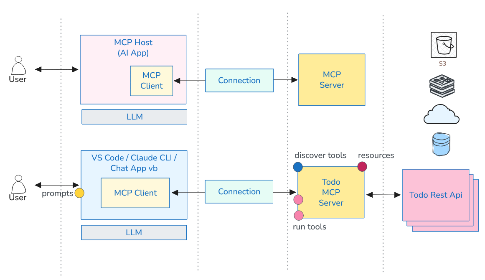

Konuyu bir örnek üzerinden irdelediğimizde her şey daha kolay anlaşılacaktır diye düşünüyorum.

## Senaryo

Kobay olarak bir **todo** listesi ile ilintili API servisi kullanan bir **MCP server** yazıp kullanmayı deneyelim. Todo listemizi postgresql'da duran bir veritabanı üzerinde düşünelim. Pahalı oldu ama işe yarar :D Normalde bu veri setinden sorgulama yapmak veya yeni bir todo eklemek, güncelleme veya silmek için standart bir yol izleriz. Kullanıcı dostu bir önyüz uygulaması, onun çağırdığı ve bu bahsedilen hizmetleri yerine getiren kuvvetle muhtemel bir rest servisi. Amacımız bir MCP sunucusu yazıp nasıl kullanıldığını deneyimlemek olduğundan todo listesinin ele alındığı projenin çapı şu an için çok da önemli değil. Ancak aşağıdakilere benzer işleri icra edeceğimiz bir senaryo kurgulamaya çalışacağız.

- Soru sorup bilgi alabilelim:
  - "Todo listemdeki tüm görevleri getir?"
  - "Yapılacaklar listemdeki tamamlanmış görevler neler?"
  - "Yapılacaklar listemdeki tamamlanmamış görevler neler?"
- Veri manipülasyonları:
  - "Yapılacaklar listeme 'çalışma odasını temizle' görevini ekle. Bu görev 20 Haziran 2024 tarihine kadar tamamlanmalı. Küçük bir zorluk derecesine sahip"
  - "Süresi geçmiş olan görevleri undone olarak güncelle."
  - "Yapılacaklar listemdeki 'çalışma odasını temizle' görevini yapıldı olarak güncelle."
  - "'MCP Server Nasıl Çalışır?' başlıklı makale yazma görevimi inprogress olarak güncelle."

## Önce Arka Plan Hazırlıkları

Veritabanı tarafı ile olan iletişim **rust** ile yazılmış bir api servisi ile karşılayacağız. Postgresql için aşağıdaki içeriğe sahip bir **docker-compose** kullanılabilir.

```yaml
services:

  postgres:
    image: postgres:latest
    container_name: fnp-postgres
    environment:
      POSTGRES_USER: johndoe
      POSTGRES_PASSWORD: somew0rds
      POSTGRES_DB: postgres
    ports:
      - "5432:5432"
    volumes:
      - postgres_data:/var/lib/postgres/data
    networks:
      - fnp-network

  pgadmin:
    image: dpage/pgadmin4:latest
    container_name: fnp-pgadmin
    environment:
      PGADMIN_DEFAULT_EMAIL: scoth@tiger.com
      PGADMIN_DEFAULT_PASSWORD: 123456
    ports:
      - "5050:80"
    depends_on:
      - postgres
    networks:
      - fnp-network

volumes:
  postgres_data:

networks:
    fnp-network:
        driver: bridge
```

Bu servisleri ayağa kaldırmak komut satırından aşağıdaki gibi ilerleyebiliriz.

```bash
docker compose up -d
# Eğer docker compose dosyası benimki gibi kalabalık ve sadece bu servisleri ayağa kaldırmak isterseniz
docker compose up -d postgres pgadmin
```

Bu yazımızla çok alakalı olmadığı ve konuyu dağıtacağı için Rust ile yazılmış servis kodlarına burada girmeye gerek yok ancak [şuradan](https://github.com/buraksenyurt/friday-night-programmer/tree/main/src/todo-api) kaynak kodlarını inceleyebilirsiniz.

## MCP Server Tarafı

Gelelim ana mevzuya. Derme çatma da olsa todo listesini yönetebildiğimiz basit bir rest servisimi bulunuyor. Bu servis en azından yukarıdaki senaryoda belirtilen işlevleri sağlamakta *(Gerçek bir saha kurgusunu hazırlarken ilk olarak soruları ve görevleri içerecek bir metin çalışması yapmak, mcp araç setinden sunulacak fonksiyonellikleri doğru şekilde tasarlamak adına önemli olacaktır)*

Şimdi bir dotnet projesi oluşturarak işe başlayalım. Bu bir **console** uygulaması olacak ve bazı yardımcı **nuget** paketlerine ihtiyacımız olacak.

```bash
dotnet new console -n TodoMCPServer
cd TodoMCPServer
# Gerekli paketlerin eklenmesi
dotnet add package Microsoft.Extensions.Hosting
dotnet add package Microsoft.Extensions.Http
dotnet add package ModelContextProtocol
```

Console uygulamasının **Rust** ile yazılmış API servisini çağrıması gerekiyor. Bu çağrı ile ilişkili olarak farklı endpoint adreslerine de gidebilmeli. Genel bir yaklaşım olarak api servisi, api key vb bilgilerin appsettings dosyasında tutulup, build sonrasında da exe'nin yanına kopyalanması iyi olabilir. Bu sayede uygulama çalışırken bu bilgilere erişebiliriz. Bizim örneğimizde **appsettings** içeriği oldukça sade.

```json
{
    "TodoApiUrl":"http://localhost:3000/"
}
```

Buna bağlı olarak todo servis çağrılarını gerçekleştirecek olan **TodoApiService** isimli sınıf kodlarını aşağıdaki gibi geliştirebiliriz.

```csharp
using System.Net.Http.Json;

public class TodoApiService(IHttpClientFactory httpClientFactory, string baseUrl)
{
    private readonly IHttpClientFactory _httpClientFactory = httpClientFactory;
    private readonly string _baseUrl = baseUrl.TrimEnd('/');

    public async Task<string> GetAllTodosAsync()
    {
        var client = _httpClientFactory.CreateClient();
        var response = await client.GetAsync($"{_baseUrl}/api/todos");
        response.EnsureSuccessStatusCode();
        return await response.Content.ReadAsStringAsync();
    }

    public async Task<string> GetCompletedTodosAsync()
    {
        var client = _httpClientFactory.CreateClient();
        var response = await client.GetAsync($"{_baseUrl}/api/todos/completed");
        response.EnsureSuccessStatusCode();
        return await response.Content.ReadAsStringAsync();
    }

    public async Task<string> GetIncompleteTodosAsync()
    {
        var client = _httpClientFactory.CreateClient();
        var response = await client.GetAsync($"{_baseUrl}/api/todos/incomplete");
        response.EnsureSuccessStatusCode();
        return await response.Content.ReadAsStringAsync();
    }

    public async Task<string> GetTodoByIdAsync(string id)
    {
        var client = _httpClientFactory.CreateClient();
        var response = await client.GetAsync($"{_baseUrl}/api/todos/{id}");
        response.EnsureSuccessStatusCode();
        return await response.Content.ReadAsStringAsync();
    }

    public async Task<string> CreateTodoAsync(string title, string? difficulty = null, string? deadline = null)
    {
        var payload = new Dictionary<string, object?> { ["title"] = title };
        if (difficulty is not null) payload["difficulty"] = difficulty;
        if (deadline is not null) payload["deadline"] = deadline;

        var client = _httpClientFactory.CreateClient();
        var response = await client.PostAsJsonAsync($"{_baseUrl}/api/todos", payload);
        response.EnsureSuccessStatusCode();
        return await response.Content.ReadAsStringAsync();
    }

    public async Task<string> UpdateTodoAsync(string id, string? title = null, string? status = null, string? difficulty = null, string? deadline = null)
    {
        var payload = new Dictionary<string, object?>();
        if (title is not null) payload["title"] = title;
        if (status is not null) payload["status"] = status;
        if (difficulty is not null) payload["difficulty"] = difficulty;
        if (deadline is not null) payload["deadline"] = deadline;

        var client = _httpClientFactory.CreateClient();
        var response = await client.PutAsJsonAsync($"{_baseUrl}/api/todos/{id}", payload);
        response.EnsureSuccessStatusCode();
        return await response.Content.ReadAsStringAsync();
    }

    public async Task DeleteTodoAsync(string id)
    {
        var client = _httpClientFactory.CreateClient();
        var response = await client.DeleteAsync($"{_baseUrl}/api/todos/{id}");
        response.EnsureSuccessStatusCode();
    }

    public async Task<string> UpdateOverdueTodosAsync()
    {
        var client = _httpClientFactory.CreateClient();
        var response = await client.PatchAsync($"{_baseUrl}/api/todos/overdue", content: null);
        response.EnsureSuccessStatusCode();
        return await response.Content.ReadAsStringAsync();
    }
}
```

Tahmin edeceğiniz üzere bu sınıf, **todo API**'sine gidecek olan tüm çağrıları yönetmekle sorumlu. Her bir fonksiyon, API'nin farklı bir **endpoint**'ine karşılık geliyor. Bu sınıfı kullanarak **todo** listemizle ilgili çeşitli sorgulamalar yapabilir, yeni görevler ekleyebilir, var olan görevleri güncelleyebilir veya silebiliriz. Sıradaki adım, bu servisin sunduğu fonksiyonellikleri yapay zeka araçlarının da anlayabilmesi için gerekli araç setinin oluşturulması. Bunun için projeye **TodoTools** isimli yeni bir sınıf ekleyip içeriğini aşağıdaki metotlarla donatabiliriz.

```csharp
using ModelContextProtocol.Server;
using System.ComponentModel;

[McpServerToolType]
public class TodoTools
{
    [McpServerTool, Description("Returns all todo items in the list regardless of their status. Use this to get a full overview of all tasks.")]
    public static async Task<string> GetAllTodos(TodoApiService todoApiService)
    {
        return await todoApiService.GetAllTodosAsync();
    }

    [McpServerTool, Description("Returns only the completed (done) todo items. Use this when the user asks which tasks have been finished or marked as done.")]
    public static async Task<string> GetCompletedTodos(TodoApiService todoApiService)
    {
        return await todoApiService.GetCompletedTodosAsync();
    }

    [McpServerTool, Description("Returns only the incomplete (undone) todo items. Use this when the user asks which tasks are still pending or not yet started.")]
    public static async Task<string> GetIncompleteTodos(TodoApiService todoApiService)
    {
        return await todoApiService.GetIncompleteTodosAsync();
    }

    [McpServerTool, Description("Returns a single todo item by its unique ID. Use this when the user asks about a specific task and you already know its ID.")]
    public static async Task<string> GetTodoById(
        TodoApiService todoApiService,
        [Description("The unique UUID of the todo item to retrieve.")] string id)
    {
        return await todoApiService.GetTodoByIdAsync(id);
    }

    [McpServerTool, Description("Creates a new todo item. Use this when the user wants to add a task to the todo list. Difficulty must be one of: easy, medium, hard. Deadline must be an ISO 8601 UTC datetime string (e.g. '2025-06-20T00:00:00Z').")]
    public static async Task<string> CreateTodo(
        TodoApiService todoApiService,
        [Description("The title or description of the task to create.")] string title,
        [Description("Difficulty level of the task. Accepted values: easy, medium, hard. Defaults to medium if omitted.")] string? difficulty = null,
        [Description("Optional deadline for the task in ISO 8601 UTC format, e.g. '2025-06-20T00:00:00Z'.")] string? deadline = null)
    {
        return await todoApiService.CreateTodoAsync(title, difficulty, deadline);
    }

    [McpServerTool, Description("Updates an existing todo item. Only the fields that are provided will be changed; omitted fields keep their current values. Status must be one of: done, undone, inprogress. Difficulty must be one of: easy, medium, hard. Deadline must be an ISO 8601 UTC datetime string.")]
    public static async Task<string> UpdateTodo(
        TodoApiService todoApiService,
        [Description("The unique UUID of the todo item to update.")] string id,
        [Description("New title for the task. Leave null to keep the current title.")] string? title = null,
        [Description("New status for the task. Accepted values: done, undone, inprogress. Leave null to keep the current status.")] string? status = null,
        [Description("New difficulty level. Accepted values: easy, medium, hard. Leave null to keep the current value.")] string? difficulty = null,
        [Description("New deadline in ISO 8601 UTC format, e.g. '2025-06-20T00:00:00Z'. Leave null to keep the current deadline.")] string? deadline = null)
    {
        return await todoApiService.UpdateTodoAsync(id, title, status, difficulty, deadline);
    }

    [McpServerTool, Description("Permanently deletes a todo item by its ID. Use this when the user explicitly asks to remove or delete a specific task. This action is irreversible.")]
    public static async Task DeleteTodo(
        TodoApiService todoApiService,
        [Description("The unique UUID of the todo item to delete.")] string id)
    {
        await todoApiService.DeleteTodoAsync(id);
    }

    [McpServerTool, Description("Finds all tasks whose deadline has passed and are not yet marked as done, then sets their status to 'undone'. Use this when the user asks to reset or flag overdue tasks. Returns the list of affected todo items.")]
    public static async Task<string> UpdateOverdueTodos(TodoApiService todoApiService)
    {
        return await todoApiService.UpdateOverdueTodosAsync();
    }
}
```

Dikkat edileceği üzere her bir metot bazı nitelikler *(attribute)* kullanıyor. Sınıfın kendisi **McpServerTooType** niteliğ ile donatıldı. Dolayısıyla çalışma zamanı bu sınıfın yapay zeka araçlarının keşfedeceği araç setini içereceğini bilecek. Metotlarda ise **McpServerTool** ve **Description** nitelikleri yer alıyor. Aracın adı ve ne işe yaradığının burada tariflendiğini belirtelim. Yapay zeka istemcilerinin kullanacağı **context** yapılarında bu açıklamaların kalitesi de öne çıkıyor. Bazı metot parametrelerinde de **Description** niteliğinin kullanıldığına dikkat edelim. Bu sayede yine yapay zeka araçlarına bu argümanlar hakkında detay bilgi vermiş oluyoruz.

> **Hatırlayalım;** Nitelikler *(Attributes)* çalışma zamanına ekstra bilgi *(metadata)* taşımak için biçilmiş kaftandır. Bu sayede çalışma zamanı, niteliğin kazandırıldığı enstrümanla ilgili olarak ne yapacağına karar verebilir.

Artık program.cs tarafındaki kodları tamamlayabiliriz. Burada çalışma zamanı için gerekli olan bağımlılıkların yüklenmesi ve MCP ortamının ayağa kaldırılması ile ilgili işlemler yer alır.

```csharp
using Microsoft.Extensions.Hosting;
using Microsoft.Extensions.DependencyInjection;
using Microsoft.Extensions.Logging;
using ModelContextProtocol;
using Microsoft.Extensions.Configuration;

var builder = Host.CreateApplicationBuilder(args);

builder.Logging.AddConsole(options =>
{
    options.LogToStandardErrorThreshold = LogLevel.Trace;
});

builder.Configuration.Sources.Clear();
builder.Configuration
    .SetBasePath(AppContext.BaseDirectory)
    .AddJsonFile("appsettings.json", optional: false, reloadOnChange: false);

var todoApiBaseUrl = builder.Configuration["TodoApiUrl"];

if (string.IsNullOrEmpty(todoApiBaseUrl))
{
    Console.WriteLine("TodoApiUrl is missing in configuration.");
    return;
}

builder.Services.AddHttpClient();
builder.Services.AddSingleton(sp =>
{
    var httpClientFactory = sp.GetRequiredService<IHttpClientFactory>();
    return new TodoApiService(httpClientFactory, todoApiBaseUrl);
});

builder.Services
    .AddMcpServer()
    .WithStdioServerTransport()
    .WithToolsFromAssembly();

await builder.Build().RunAsync();
```

Eğer her şey yolunda gitmişse projenin başarılı şekilde derleniyor olması gerekir.

## MCP Sunucusunu Yayına Alma

Yazdığımız MCP server'ın çalıştığını kontrol etmek için işi kolaylaştıran bir **npm** aracını kullanabiliriz de. Özellikle geliştirme ve test safhasında kullanabileceğimiz bu teknikte **npx** komutunu kullanarak doğrudan terminal üzerinden **MCP Server** başlatılabilir. Söz konusu komutu **dotnet** uygulamamızın olduğu klasörde çalıştırmamız yeterli olacaktır *(Sistemde node ve npx kullanılabilir diye varsayıyorum)* **@modelcontextprotocol/inspector** paketi yüklü değilse de çalıştırılan **npx** komutu bunu otomatik olarak yapacaktır.

```bash
npx @modelcontextprotocol/inspector dotnet run
```

Komut başarılı şekilde çalıştığında tarayıcı üzerinde otomatik olarak bir arabirim açılır. Bu arabirim üzerinden **MCP Server**'a bağlanabilir, sağladığı araç setlerini görebilir ve test edebiliriz.

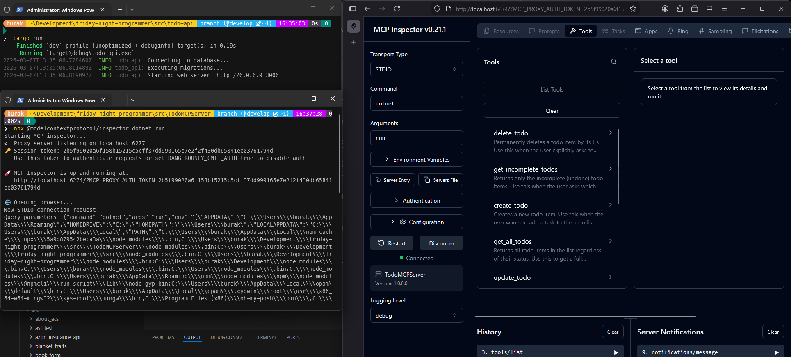

Artık bir **MCP** sunucumuz olduğundan eminiz fakat bunu ortamdaki yapay zeka araçları nasıl kullanacak. Örneğin şu anda editör olarak kullandığımız **Visual Studio Code**'un **Copilot** penceresinde **Todo** hizmetini nasıl kullanabiliriz? Genellikle MCP sunuculara ait bilgiler en azından VS Code yüklü sistemlerde **mcp.json** isimli bir dosya içerisinde yer alır. Bu sayede Visual Studio Code'a ilgili MCP Server bir **extension** olarak eklenebilir. İlk olarak bu şekilde ilerlemeye çalışalım. Şimdilik çalıştığımız **workspace** üzerinde **.vscode** isimli bir klasör oluşturup buraya aşağıdaki içeriğe sahip bir **mcp.json** dosyası ekleyerek devam edebiliriz.

```json
{
    "servers": {
        "todo-mcp-server": {
            "type": "stdio",
            "command": "dotnet",
            "args": [
                "run",
                "--project",
                "${workspaceFolder}/src/TodoMCPServer"
            ]
        }
    }
}
```

> Makine seviyesinde MCP server tanımı yapmak için genelde `C:\Users\[UserName]\AppData\Roaming\Code\User\mcp.json` dosyası kullanılır.

Bu işlemin ardından **VS Code Extension** kısmında mcp server'ımız otomatik olarak görünecektir. Extension arabiriminden **MCP Server**'ı başlatabiliriz ama pek tabii öncesinde **todo-api** isimli api servisinin de çalıştırılması gerektiğini hatırlatalım :D Sonuçta kendi sistemimde aşağıdaki ekran görüntüsünde yer alan sonuçlara ulaştım.

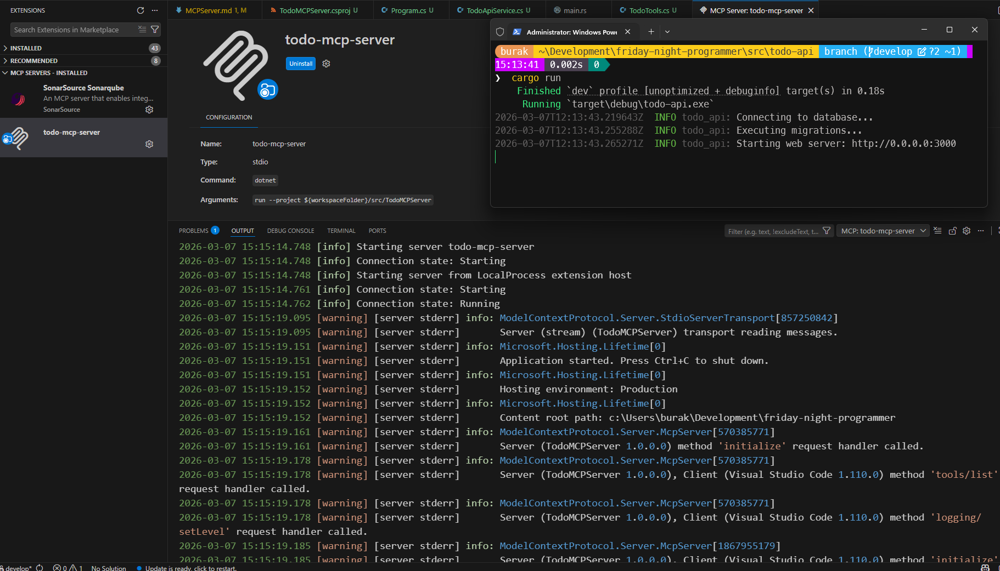

## Denemeler

Şimdi VS Code'daki **Copilot** penceresini açarak bazı denemeler yapabiliriz. Hemen birkaç deneme **prompt** ile başlayıp sonuçlara bakalım. Özellikle merak ettiğim nokta, araçların açıklamalarının yapay zeka tarafından ne kadar iyi anlaşıldığı ve doğru şekilde çağrılıp çağrılmadığı. Zira dil farkı da var, araç açıklamaları İngilizce iken denemeler Türkçe yapılacak.

```text
Yapılacaklar listeme 'Bir RAG pipeline kurmak konusunda araştırma yap' görevini ekle. Bu görev 1 Nisan 2026 tarihine kadar tamamlanmalı. Orta zorluk derecesine sahip olsun.

Yapılacaklar listeme 'proje sunumunu hazırla' adında bir görev ekle. Az zaman olduğu için zor bir görev ve 20 Mart 2026'ya kadar tamamlanmalı.
```

Karmaşık bir **prompt** eklemeyi de deneyebiliriz. Örneğin;

```text
Aşağıdaki üç görevi todo listeme ekle:

1.'Egzersiz rutini oluştur' — kolay, 15 Mart 2026 son tarih
2.'Evrenin Askerleri kitabını oku' — orta, son tarih yok
3.'Gündemdeki teknoloji başlıklarını toparla' — zor, 31 Mart 2026 son tarih"
```

ve sonuçlar;

İlk olarak çalıştırdığım prompt için **Claude Sonnet 4.6**'yı **Agent** modda kullandım.

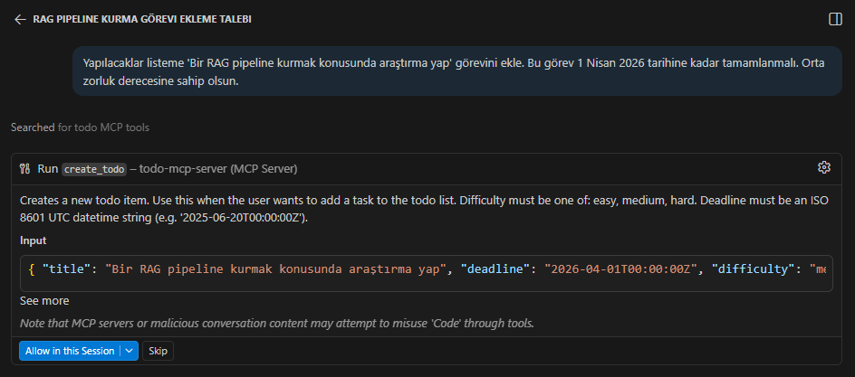

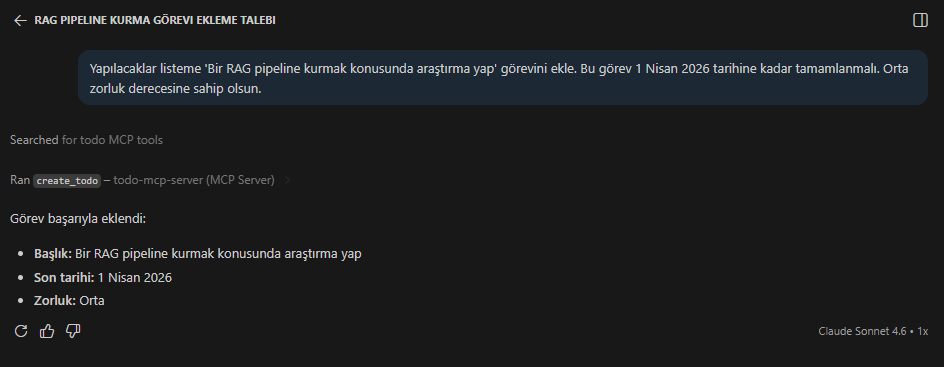

ve hatta **pgadmin** arabiriminde sql tablosunu kontrol ettiğimde eklenen görevi de görebildim.

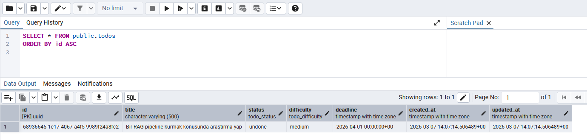

ve hatta diğer görev ekleme promopt'ları da başarılı şekilde çalıştı.

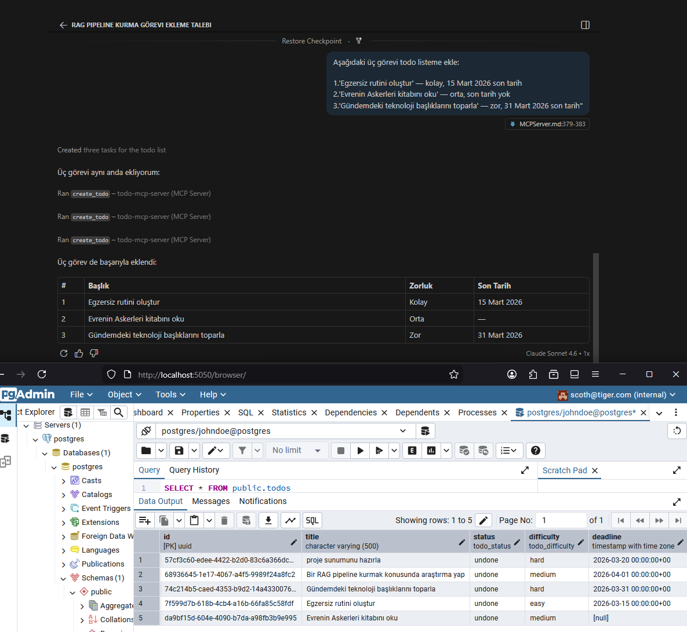

Son olarak şu promptu denedim

```text
Yapılacaklar listemdeki görevleri son tarihlerine göre sırala ve en yakın zamanlı üçünü göster.
```

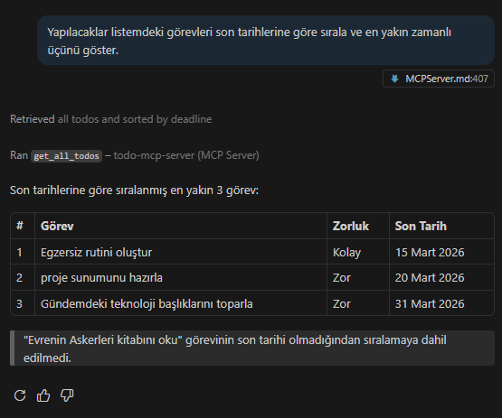

E ben daha ne diyeyim :D Bundan sonraki aşamada belki de bir chatbot uygulaması geliştirip onun üzerinden de bu araçları kullanmayı deneyebiliriz ya da örneğin sistemde yüklü olan bir CLI aracına bu MCP Server'ı entegre edip benzer görevleri bu kez oradan da deneyebiliriz.

## Update: MCP Server ile SSE Destekli İletişim

MCP standardı güncel olarak iki tip veri taşıma *(Transport)* mekanizmasını destekler: Standard Input/Output *(Stdio)* ve SSE *(Server-Sent Events)*.

- **Stdio:**
  - **Çalışma şekli;** İstemci taraf (Vs Code, Copilot CLI vb.) ile MCP sunucusu arasında veri alışverişi, standart giriş/çıkış akışları üzerinden gerçekleşir. MCP sunucusu arka planda bir alt process olarak çalışır ve veri iletimi JSON-RPC mesajları ile gerçekleşir.
  - **Avantajları;** Kurulumu ve entegrasyonu genellikle daha basittir, özellikle yerel geliştirme ortamlarında hızlıca test etmek için idealdir, ağ yapılandırması gerektirmez, port çakışması olmaz veya güvenlik duvarı sorunları yaşanmaz.
  - **Dezavantajları;** Sadece yerel kullanım için uygundur, uzak sunucularla iletişim kurmak mümkün değildir, ölçeklenebilirlik sınırlıdır, yüksek trafik altında performans sorunları yaşanabilir.
  - **Kullanım senaryoları;** Sunucu ve istemcinin aynı makinede çalıştığı durumlar, hızlı prototipleme ve geliştirme süreçleri, basit araç entegrasyonları.
- **SSE (Server-Sent Events):**
  - **Çalışma şekli;** MCP sunucusu bir Web API olarak çalışır. İstemci sunucuya HTTP üzerinden bir bağlantı açar ve sunucu, SSE protokolünü kullanarak istemciye asenkron mesajlar gönderir.
  - **Avantajları;** Ağ üzerinden çalışır. Dil modeli nerede olursa olsun internet veya intranet üzerinden bağlanabilir.
  - **Dezavantajları;** Kurulumu ve entegrasyonu daha karmaşıktır. Araya bir ağ katmanı girdiğinden gecikmeler (latency) olabilir ve daha da önemlisi authentication/authorization eklemek gerejir, çünkü aksi halde herhangi biri sunucuya bağlanıp araçları kullanabilir.
  - **Kullanım senaryoları;** Internet veya intranet üzerinden merkezi bir MCP sunucusuna ihtiyaç duyulan durumlar, birden fazla istemcinin aynı MCP sunucusunu kullanacağı senaryolar.

Bu çalışmadaki örnekte **stdio** iletişim mekanizması kullanıldı. Eğer **SSE** destekli bir yapı kurmak istersek bir **WebApi** projesi oluşturabiliriz. Aşağıdaki gibi hareket edelim.

```bash
dotnet new web -n TodoMCPServerSSE

# Gerekli Nuget paketlerinin eklenmesi
dotnet add package ModelContextProtocol.AspNetCore
```

Bu uygulamada da TodoApiService ve TodoTools sınıflarını aynı şekilde kullanabiliriz. Farklı olan taraf program.cs kodları.

```csharp
using ModelContextProtocol.Protocol;

var builder = WebApplication.CreateBuilder(args);

builder.Logging.AddConsole(options =>
{
    options.LogToStandardErrorThreshold = LogLevel.Trace;
});

builder.Configuration.Sources.Clear();
builder.Configuration
    .SetBasePath(AppContext.BaseDirectory)
    .AddJsonFile("appsettings.json", optional: false, reloadOnChange: false);

var todoApiBaseUrl = builder.Configuration["TodoApiUrl"];

builder.Services.AddHttpClient();
builder.Services.AddSingleton(sp =>
{
    var httpClientFactory = sp.GetRequiredService<IHttpClientFactory>();
    return new TodoApiService(httpClientFactory, todoApiBaseUrl);
});

builder.Services
    .AddMcpServer(options =>
    {
        options.ServerInfo = new Implementation
        {
            Name = "TodoMCPServer_SSE",
            Version = "1.0.0"
        };
    })
    .WithHttpTransport()
    .WithToolsFromAssembly();

var app = builder.Build();

app.MapMcp("/sse");
app.Run();
```

Durumu bir özetleyelim. Todo işlemleri ile ilgili web api servisimiz rust ile yazılmış bir uygulama idi. Bu servisin her durumda çalışır olmasını bekliyoruz. Yeni MCP sunucu uygulamamız ise bir öncekinden farklı olarak bir WebApi projesi. Bununla birlikte **MapMcp** isimli metotla otomatik olarak bir yapay zeka aracının iletişim kurabileceği bir endpoint haline geliyor. **AddMcpServer** metodu arkasından çağırılan **WithHttpTransport** metodu ise bu iletişim için SSE destekli bir mekanizma kullanılacağını belirtiyor. Artık bu sunucuyu başlattığımızda, yapay zeka araçları belirtilen endpoint'e bağlanarak araç setimizi keşfedebilir ve kullanabilirler.

Bunu deneyimlemek için öncelikle **rust** ile yazılmış todo-api servisinin çalışır durumda olduğundan emin olalım. Ardından dotnet projemizi çalıştırarak **MCP** sunucusunu ayağa kaldıralım. Sonrasında istersek **VS Code** tarafındaki **mcp.json** dosyasını aşağıdaki gibi güncelleyerek yeni sunucumuzu etkinleştirebiliriz.

```json
{
    "servers": {
        "Todo MCP Server V2": {
            "type": "sse",
            "url": "http://localhost:5055/sse"
        }
    }
}
```

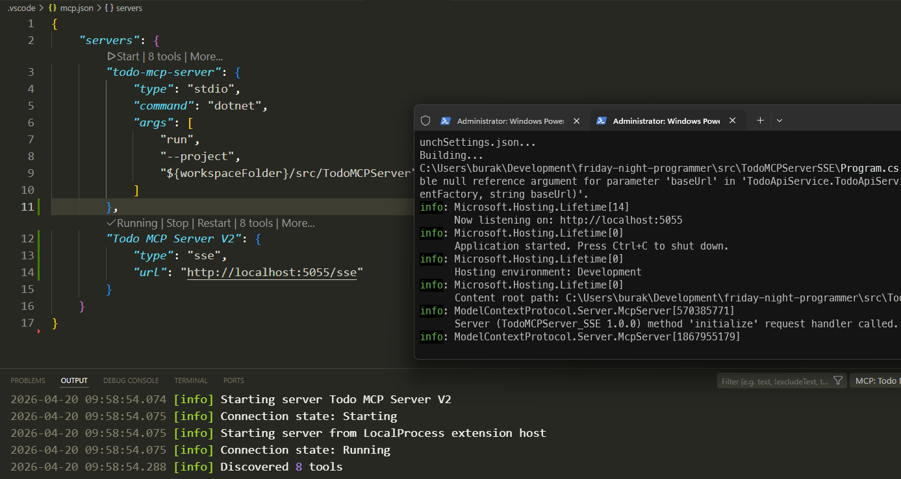

Ekran görüntüsünden de görüldüğü üzere yeni MCP sunucusundan sunulan araçlar başarılı şekilde keşfedilmiştir.

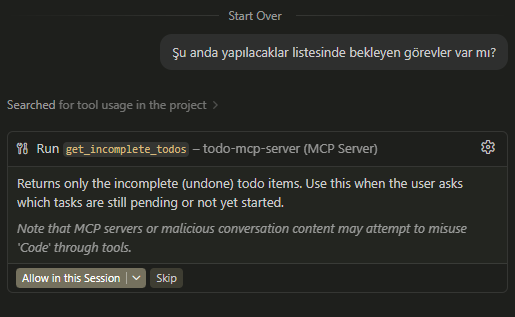

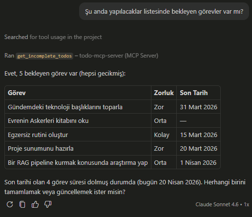
