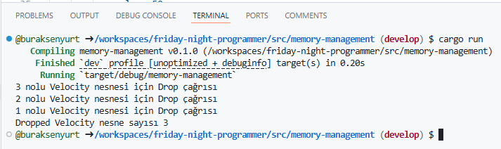

# Bellek Yönetimi Üzerine Notlar

**Unmanaged** ortamlarda gezinmek birçok yeni veya unutulmuş bilgiyi de karşıma çıkarıyor. Geçtiğimiz günlerde devasa boyutlarda JSON tabanlı logları işlerken **Interning** stratejisi ile belleğe alınan verinin nasıl optimize edilebileceğini öğrendim. Belli senaryolarda _(her zaman da avantajlı olmayabiliyor)_ çok sık tekrar eden string içeriklere heap'de yer ayırılırken gereksiz alan ayırmak yerine, bunları refere eden tekil pointer'lardan yararlanmak ve hatta benzersiz sayısal değerlerle _(örneğin pozitif bir tam sayı ile)_ bir vektör içerisinde tutup _(Intern havuzu olarak da ifade ediliyor)_ erişimi hızlandırmak mümkün. Tam anlamıyla bellek seviyesinde optimizasyon ve performans kazanımı söz konusu. Biraz karışık bir cümle oldu ama refere edeceğim [şu yazının uzunluğu](https://gendignoux.com/blog/2025/03/03/rust-interning-2000x.html) düşünülünce elden bu kadar geldi. Yazıda Paris'in herkese açık otoyol verilerinden yararlanılıyor. Veriler çok büyük ve yazarın iddiasına göre 2bin kata kadar küçültülebiliyor. Örneğin sadece String veriler üzerine yapılan Interning tekniğinin **%47** oranında yer kazanımı sağladığı belirtiliyor. Tabii olay bellek yönetimi, bellek operasyonlarında optimizasyon ve performans işlemleri denince karşımıza daha birçok kavram da çıkıyor. Örneğin **Region-Based Management** konseptinde yer bulan **Area Allocators** ve diğer şeyler... **Copy on Write(CoW)**, **Zero Cost Abstraction**, **Memory/Object Pooling**, **Cache-Aware Programming**, **Enum'larda Padding ve Allignment** kullanımı vs

Rust, zaten sahip olduğu bazı özellikleri ile _(Ownership, borrow-checker- lifetimes vb)_ belleği güvenli noktada tutmak için imkanlar sağlıyor _(Bilindiği üzere Rust'ta bir Garbage Collector mekanizması yok)_ Ne var ki yine de bazı senaryolarda belleği efektif kullanmak için az önce saydığım yaklaşımlara da değinmek gerekiyor. Söz gelimi Interning konusunda yazılmış duruma göre tercih edilebilecek birçok crate mevcut. Bu yazıda amacım diğer konulara ait kısa kısa notlar tutmak.

## CoW _(Copy on Write)_

Sadece gerektiği zaman veri kopyalanmasını öneren bir teknik olduğu ifade ediliyor. Bunu şöyle de ifade edebiliriz; Koypalama işlemini ilk yazma anına kadar geciktirmek. Rust içerisinde bu felsefe ile donatılmış Cow isimli bir enum türü bulunuyor _(ki ayrıca bir Smart Pointer türüdür)_ Diğer yandan resmi kaynaklarda açılımı **Clone on Write** şeklindedir. Bu enum türü içerdiği veriyi ya ödünç alır _(borrow)_ ya da yeni bir kopyası ile sahipliğini alır _(ownership)_ Dolayısıyla veriyi değiştirme ihtiyacı yoksa referansını kullanır ama değişiklik gerekirse de ilk değişiklik gerektiği noktada verinin bir klonu hazırlanıp sahipliği ele alınır. Bu noktada aşağıdaki örnek kod parçasını göz önüne alabiliriz.

```rust
use std::borrow::Cow;

fn main() {
    let user_one = "Super Mario";
    let player_two = "Ready Player One";
    let length = 16;

    println!("{}", padding_end(user_one, length));
    println!("{}", padding_end(player_two, length));
}

fn padding_end<'a>(input: &'a str, target_len: usize) -> Cow<'a, str> {
    if input.len() < target_len {
        // Yeni string oluşturur ve target_len'e göre belli sayıda _ karakteri ekler
        Cow::Owned(format!("{:_<width$}", input, width = target_len))
    } else {
        // Yeterli uzunlukta olduğu için yeni bir versiyon oluşturmadan orijinal referansı döndürür
        Cow::Borrowed(input)
    }
}
```

Burada neler oluyor!? Son derece anlamsız bir fonksiyon olan **padding_end**, parametre olarak gelen literalın sonuna target_len ile belirtiliği kadar _ işareti ekliyor ancak gelen içeriğin uzunluğu zaten o kadar ise eklemiyor. Yalnız bu ekleme ve eklememe arasında önemli bir fark var. İfade sonunda boşluklar kalmışsa yeni bir string oluşturuluyor ve sahipliği fonksiyondan geriye dönüyor _(Owned çağrısı)_ . Diğer durumda ise orjinal referans geri dönüyor _(Borrowed çağrısı)_ 

Copy on Write işletim sistemlerinde ortak page kullanımlarında ya da immutable veritabanı yapılarından yaygın olarak kullanılıyormuş. Gözle görmedim o yüzden ispat edemem ancak Rust'ın Clone on Write özelliğinin daha çok programlama dili ile ilgili olduğu da belirtilmekte. Genel ve yaygın adı **Copy on Write** olsa da Rust tarafındaki **CoW** doğrudan mutasyona izin vermediği için daha çok **Clone on Write** olarak ifade edilmektedir ama özünde benzer bir felsefeye sahip olduklarını ifade edebiliriz diye düşünüyorum.

Farklı bir örnek daha ekleyelim.

```rust
fn remove_ellipsis_dots(input: &str) -> String {
    input.to_string().replace('`', "")
}
```

Yukarıdaki fonksiyon gelen literal içerisindeki üsten virgül işaretlerini bulup kaldırıyor. Burada yeni bir String türünün oluşturulması söz konusu ve bu her seferinde yapılıyor. Bir başka deyişle gelen input içerisinde üstten virgül işaret yoksa bile bir String üretimi söz konusu. İşte tam bu noktada eğer üstten virgül yoksa aynı referansı kullanmaya devam et diyebiliriz. Cow kullanarak tabii. Yani fonksiyon aşağıdaki hale getirilebilir.

```rust
fn remove_ellipsis_dots(input: &str) -> Cow<str> {
    if input.contains('`') {
        Cow::Owned(input.to_string().replace('`', ""))
    } else {
        Cow::Borrowed(input)
    }
}
```


Manupilasyon sadece gerektiği zamanlarda yapılmış olur. Cow kullanımı ile ilgili halen daha kafamı karıştıran birçok örnek var. Bunları iyice araştırmak lazım.

### Dirty Cow Mevzusu _(Pis İnek :P)_

**Dirty Cow** olarak isimlendirilen [bir güvenlik zafiyeti](https://cve.mitre.org/cgi-bin/cvename.cgi?name=cve-2016-5195) var. Copy on Write'ın yanlış kullanımı neticesinde salt okunur veri alanına çeşitli ayrıcalıklar _(privilages)_ eklenmesi sonucu böyle bir zafiyet oluşmuş ve 2018 öncesi sürüme sahip birçok Linux sistemi durumdan etkilenmiş. Aslında durumun vehameti [Wikipedia' da](https://en.wikipedia.org/wiki/Dirty_COW) özetlenmiş. Söz konusu güvenlik zafiyetine konu olan Copy on Write stratejisinin Rust tarafındaki CoW kullanımı ile bir ilişkisi olmayabilir zira Rust’taki Cow, Linux çekirdeği seviyesindeki Copy-on-Write mekanizmasıyla aynı değildir. Rust’taki Cow türü tamamen kullanıcı seviyesi _(user-space)_ işleyen bir veri yapısıdır ve işletim sistemi seviyesinde process bazlı sayfa _(page)_ paylaşımı yapmaz. Tabii söz konusu güvenlik zafiyeti Data Races oluşması halinden, doğru zamanlama ile salt okunur bellek sayfalarına ayrıcalıklar _(privilages)_ eklenmesinden ve uzaktan root kullanıcı ayrıcalıklarına sahip olunabilmesinden bahseder ki bunlara sebebiyet veren durumlar Rust'ın ownership, borrow checker gibi mekanizmaları sayesinde henüz derleme aşamasından engellenirler. Yine de unsafe alanlarda çalışırken veya Arc kullanımlarında dikkatli olmakta yarar var diye düşünüyorum.

## Arena Allocators

N sayıda nesne için bellekte baştan bir yer ayırıp bunları bu alanda toplamak ve sonrasında hepsini tek seferde düşürmek istediğimiz senaryolarda kullanılan bir teknik olarak ifade edilmektedir. Temel çalışma prensibine göre program ayağa kalkarken bellekte belli bir bölge bu iş için tahsis edilir ve gerekli nesneler söz konusu alana ardışık olarak dizilir. Bölgenin serbest bırakılması nesnelerin de topluca ve tek seferde bellekten düşürülmesi anlamına gelir. Bir arena oluşturulduğunda işaretçi _(pointer)_ başlangıç konumuna alınır ve diğer nesnelere ardışıl olarak ulaşılması da kolaylaşır ki bunun da performans açısından önemli bir artısı olduğu söylenebilir. Hatta bu alanlar işletim sistemlerinin kullandığı ön belleklere de benzetilir. Bu stratejide tüm bellek bölgesinin tek seferde düşmesi en önemli noktalardan birisidi ancak zamanı geldiğinde tek tek düşürülmesi gereken nesneler söz konusu ise bunları arena içerisinde ele almak mümkün değildir ya da tam tersi nesneler topluca serbest kalırken yaşaması gerekenler varsa bu yöntem kullanışlı olmaz. Bir başka deyişle aynı yaşam ömrüne sahip ya da birlikte sona eren ve çok büyük boyutlu olmayan nesnelerin organizasyonu için daha idealdir. Rust'ta bu amaçla kullanabilecek birçok küfe de bulunuyor. Bunlardan birisi de [bumpalo](https://crates.io/crates/bumpalo) ve işte basit kullanım örneği.

```rust
use bumpalo::Bump;

#[derive(Debug)]
struct Position {
    x_value: u32,
    y_value: u32,
    z_value: u32,
}

pub fn run() {
    let bump = Bump::new();

    let player_one = bump.alloc(Position {
        x_value: 10,
        y_value: 20,
        z_value: 0,
    });
    let player_two = bump.alloc(Position {
        x_value: 15,
        y_value: 5,
        z_value: 30,
    });
    let john_doe = bump.alloc(Position {
        x_value: 3,
        y_value: 5,
        z_value: 8,
    });

    println!("Player One Adresi {:p}", player_one);
    println!("Player Two Adresi {:p}", player_two);
    println!("John Doe Adresi {:p}", john_doe);

    let player_one_addr = player_one as *const _ as usize;
    let player_two_addr = player_two as *const _ as usize;
    let john_doe_addr = john_doe as *const _ as usize;

    println!(
        "Gerçek Player Two - Player One adres farkı: {} byte",
        address_diff(player_two_addr, player_one_addr)
    );
    println!(
        "Gerçek John Doe - Player Two adres farkı: {} byte",
        address_diff(john_doe_addr, player_two_addr)
    );
    
    // Arena burada scope'dan çıkarken içindeki tüm Player nesneleri de tek seferde düşürülecektir
}

fn address_diff(a: usize, b: usize) -> usize {
    if a > b { a - b } else { b - a }
}
```

Örnekte bump nesnesi oluşturulduktan sonra içerisine üç farklı Position nesne örneği ekleniyor. Sadece bu örnek özelinde bunların kodlama sırası ile olmasa da ardışıl olarak dizildiklerini ispat edebilmek için adres bilgileri arasındaki farklar hesaplanıyor. Position yapısı 4 byte'tan 3 alan içermekte ve dolayısıyla 12 byte yer kaplamakta. Dolayısıyla nesnelerin başlangıç adresleri arasında 12 byte mesafe olmalı. Elbette bunu çok daha büyük boyutlu bir nesne kümesi için kontrol etmek lazım, tam bir ispattır diyemeyiz.

Rust programlama dili çalışma zamanında nesnelerin temizlenmesi için **Resource Acquisition is Initialization _(RAII)_** prensibini kullanır. Buna göre bir değer scope dışında çıktığında düşer ve hatta referans türlü yani heap bazlı bir nesne ise _(Box edilmiş bir tür, Vector gibi)_ drop trait davranışı çalıştırılır. Area Allocator teorisinde ise bu bellek alanının tek seferde düşürülmesi söz konusudur. Dolayısıyla bölgeye atılan nesneler için drop implementasyonlarının çalışmaması gerekir. Bumpalo kütüphanesi açısından bakarsak aşağıdaki örnek kodla durumu özetleyebilir.

```rust
use bumpalo::Bump;
use std::sync::atomic::{AtomicUsize, Ordering};

#[derive(Debug)]
struct Position {
    id: u32,
    x_value: u32,
    y_value: u32,
    z_value: u32,
}

static DROPPED_COUNT: AtomicUsize = AtomicUsize::new(0); // Threads-Safe olarak veriyi kitlemeden (lock-free) değişikliğe izin vermek için AtomicUsize kullanıldı

impl Drop for Position {
    fn drop(&mut self) {
        println!("{} nolu position için Drop çağrısı", self.id);
        DROPPED_COUNT.fetch_add(1, Ordering::SeqCst);
    }
}

pub fn run() {
    let bump = Bump::new();

    { // Kasıtlı olarak scope açıldı
        let player_one = bump.alloc(Position {
            id: 1,
            x_value: 10,
            y_value: 20,
            z_value: 0,
        });
        let player_two = bump.alloc(Position {
            id: 2,
            x_value: 15,
            y_value: 5,
            z_value: 30,
        });
        let john_doe = bump.alloc(Position {
            id: 3,
            x_value: 3,
            y_value: 5,
            z_value: 8,
        });

        println!("Player One Adresi {:p}", player_one);
        println!("Player Two Adresi {:p}", player_two);
        println!("John Doe Adresi {:p}", john_doe);

        let player_one_addr = player_one as *const _ as usize;
        let player_two_addr = player_two as *const _ as usize;
        let john_doe_addr = john_doe as *const _ as usize;

        println!(
            "Gerçek Player Two - Player One adres farkı: {} byte",
            address_diff(player_two_addr, player_one_addr)
        );
        println!(
            "Gerçek John Doe - Player Two adres farkı: {} byte",
            address_diff(john_doe_addr, player_two_addr)
        );
    } // Scope dışındayız ama nesne drop'ları çalışmaz Area Allocation sebebiyle

    println!(
        "Dropped Position nesne sayısı {}",
        DROPPED_COUNT.load(Ordering::SeqCst)
    );

    // Arena burada scope'dan çıkarken içindeki tüm Player nesneleri de tek seferde düşürülecektir
}

fn address_diff(a: usize, b: usize) -> usize {
    if a > b {
        a - b
    } else {
        b - a
    }
}
```

Var olan örnek kodumuza birkaç ekleme yaptık. En önemlisi Poistion türü için **Drop** trait davranışını eklememiz. Hatta içerisinde **AtomicUsize** türünden bir sayaç kullanıyoruz. Eğer teorimiz doğruysa program sonlanırken scope dışında kalan **Position** nesneleri için Drop trait'inin çalışmaması ve dolayısıyla **DROOPED_COUNT** değişkeninin 0 olarak kalması gerekiyor. Kendi yaptığım çalışmada bu sonuca ulaştığımı söyleyebilirim. 


Dokümantasyona göre Bumpalo söz konusu bellek bölgelerini kendisi oluşturup yönetmekte ve toplu serbest bırakma _(ya da Batch Deallocation)_ işlemi icra etmekte. Yani tek tek nesneleri drop etmek yerine ayrılan tüm bellek bloğu için tek seferde boşaltma işlemi uygulamakta. İşte bu noktada Rust'ın RAII modelini ezdiği düşünülebilir ki bu normaldir zira kütüphane stack yerine kendi bellek bölgesini yönetir. Aslında burada Drop için de bir parantez açmak lazım. Aynı Position veri yapılarını heap üzerinde tahsis ederek deneyelim. İşte örnek kod,

```rust
use std::sync::atomic::{AtomicUsize, Ordering};

#[derive(Debug)]
struct Velocity {
    id: u32,
    value: u32,
    direction: i32,
}

static DROPPED_COUNT: AtomicUsize = AtomicUsize::new(0); // Threads-Safe olarak veriyi kitlemeden (lock-free) değişikliğe izin vermek için AtomicUsize kullanıldı

impl Drop for Velocity {
    fn drop(&mut self) {
        println!("{} nolu Velocity nesnesi için Drop çağrısı", self.id);
        DROPPED_COUNT.fetch_add(1, Ordering::SeqCst);
    }
}

pub fn run() {
    { // Kasıtlı olarak Scope açıldı
        let _p1 = Box::new(Velocity {
            id: 1,
            value: 10,
            direction: 1,
        });
        let _p2 = Box::new(Velocity {
            id: 2,
            value: 20,
            direction: -1,
        });
        let _p3 = Box::new(Velocity {
            id: 3,
            value: 50,
            direction: 1,
        });
    } // Drop'lar çalışır

    println!(
        "Dropped Velocity nesne sayısı {}",
        DROPPED_COUNT.load(Ordering::SeqCst)
    );
}
```

Bu sefer Velocity isimli struct'lardan birkaç nesne örnekliyoruz ancak dikkat edileceği üzere bunların Box ediyoruz yani Heap üzerine yerleştiriyoruz. Buna göre Drop trait'lerinin otomatik olarak çalışması ve sayaç değerimizin de 3 olması gerekiyor. İşte sonuçlar.



## Struct/Enum Türlerinde Padding ve Allignment

Bir struct belleğe açıldığında alanları _(fields)_ nasıl yerleştiriliyor hiç düşündünüz mü? Ya da bir enum sabitinin alanları. Normal şartlarda alanların düzenli bir sırada hizalanması _(alignment)_ ve alanlar arasında sadece gerektiği kadar boşluk bırakılması _(padding minimizasyonu deniyor) bu veri yapısına ulaşan program parçaları için kolay ve hızlı erişilebilirlik anlamına gelir. Rust genellikle bu tip ayarlamaları bizim yerimize zaten yapar ancak bazı hallerde, örneğin FFI _(Foreign Function Interface)_ hattı üzerinde harici C kütüphaneleri ile çalışıldığında belki bu ayarlamaları elle yapmak gerekebilir.

Bu bilgiye ek olarak rust derleyicisinin **niche optimization** _(Friedrich Nietzsche' in nişi değil :P)_ adı verilen bir tekniği kullanarak bazı **enum** türlerini bellek açısından verimli hale getirdiği de ifade ediliyor. Option<u32> türünü ele alalım. Pozitif sayılardan oluşan bu 32bitlik değişken bellekte 8 byte yer kaplar _(4 byte içerdiği değer için + 4 byte None olma hali için)_ Zira u32 için **None** durumunu ifade etmek ek bir flag gerektirmektedir. Lakin **NonZeroU32** da kullanabiliriz. NonZeroU32, 0 hariç tüm 32-bit değerleri taşıyabilir ve 0 değeri **None** durumunu ifade etmek için kullanılır. Bu durumda Option< NonZeroU32 > sadece 4 byte yer kaplar; None değeri altta yatan 0 değeriyle temsil edilir, Some(value) ise value’nun kendi değerleriyle temsil edilir​. Daha fazla etay için [buradaki blog yazısını](https://www.0xatticus.com/posts/understanding_rust_niche/) ziyaret edebilirsiniz. Ben öğrendiklerimle aşağıdaki kodu tatbik etmeye çalıştım.

```rust
use std::num::NonZero;
use std::num::NonZeroU32;

pub fn run() {
    println!("Baştan söyleyelim...");
    println!("u32 {} byte yer tutar", size_of::<u32>());
    println!(
        "Option<u32> ise {} byte yer tutar. Diğer 4 byte None içindir.",
        size_of::<Option<u32>>()
    );
    println!("NonZero32 {} byte yer tutar", size_of::<NonZeroU32>());
    println!(
        "Option<NonZero32> ise yine {} byte yer tutar. Zira 0, None olarak ifade edilir.",
        size_of::<Option<NonZeroU32>>()
    );

    let nan = give_me_a_none();
    match nan {
        None => println!("There is no spoon!"),
        Some(v) => println!("{}", v),
    }

    let transmuted: u32 = unsafe { std::mem::transmute(nan) };
    println!("NonZeroU32 için None : {transmuted:b}");

    let nan = give_me_another_none();
    match nan {
        None => println!("There is no spoon!"),
        Some(v) => println!("{}", v),
    }

    let transmuted: u64 = unsafe { std::mem::transmute(nan) };
    println!("U32 için None : {transmuted:b}");

    let number = give_me_a_number();
    match number {
        None => println!("There is no spoon!"),
        Some(v) => println!("{}", v),
    }

    let transmuted: u32 = unsafe { std::mem::transmute(number) };
    println!("NonZero için Number 23 : {transmuted:b}");

    let number = give_me_another_number();
    match number {
        None => println!("There is no spoon!"),
        Some(v) => println!("{}", v),
    }

    let transmuted: u64 = unsafe { std::mem::transmute(number) };
    println!("U32 için Number 23 : {transmuted:b}");
}

fn give_me_a_none() -> Option<NonZeroU32> {
    NonZero::new(0)
    // None
}

fn give_me_another_none() -> Option<u32> {
    None
}

fn give_me_a_number() -> Option<NonZeroU32> {
    NonZero::new(23)
}

fn give_me_another_number() -> Option<u32> {
    Some(23)
}
```

**NonZeroU32** kullandığımız durumlarda None ve gerçek bir sayının bellekteki binary tutuluş şekilleri çok farklı dikkat edeceğiniz üzere. Örneğin None bilgisi **NonZerou32** için sadece 0 ile ifade edilirken **U32** kullanıldığında çok daha uzun bir içerik söz konusu. Çalışma zamanı çıktısını şöyle ifade edebiliriz.


Elbette hangisinin hangi durumlarda kullanabiliriz sorusu ortaya çıkıyor değil mi? Belki gözden kaçırmış olabiliriz ama şöyle bir durum var. NonZeroU32 adı üstünde 0 değerini taşıyamaz. Sıfır değerini None olarak kabul eder. Bu nedenle yaygın görüş U32'nin kullanıldığı bir senaryoda hiçbir şekilde 0 değerinin kullanılmayacağı garanti ise NonZerou32 tercih edilebilir zira her bir sayısal değer için 8 byte yerine 4 byte ayırabiliriz. 

Niche _(niş)_ optimizasyonu denmesinin bir nedeni de None yerine geçebilecek ayrıcalıklı yani niş bir değeriniz bulunmasıdır. U32 senaryosunda 0'dan feragat edilmesi garanti ise 0 bir niş değer olarak ifade edilir ve None yerine kullanılır ve bu da size büyük bir bellek tasarrufu olarak dönebilir.

Bir örnek daha verelim. Özellikle referans kullanılan senaryolarda niş optimizasyon da ele alınabilir. **None** durumu için **null pointer (0x0)** kullanıldığından tahsis edilen bellek miktarı aynıdır.

```rust
println!("&u32 türü için de {} byte yer ayrılır.", size_of::<&u32>());
println!(
    "ve Option<&u32> içinde {} byte söz konusudur.",
    size_of::<Option<&u32>>()
);
```


## Memory/Object Pooling

_"NOT YET IMPLEMENTED"_

## Cahce Aware Programming

_"NOT YET IMPLEMENTED"_

## Zero Cost Abstraction

_"NOT YET IMPLEMENTED"_
