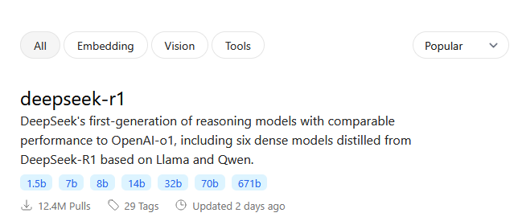
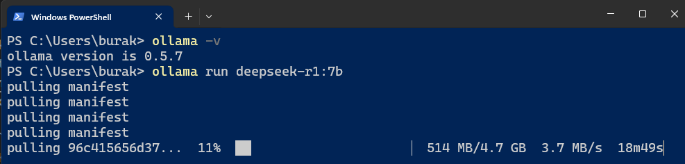

# .Net 9 ile Offline Çalışabilen Akıllı Uygulamalar

Son yıllarda hayatımıza girmiş bulunan bir çok dil modeli ve pek tabii bunları işleterek çeşitli konularda bizi asiste eden GenAI ürünleri mevcut. Herhalde en popülerlerinden birisi ChatGPT olsa gerek. Ancak maliyet açısından bakıldığında bireysel kullanım için dahi olsa gerçekten işe yarar sonuçlara götürecek olan versiyonlar biraz pahalı gibi. Yazıyı kaleme aldığım tarih itibariyle benimde kullandığım bireysel paket fiyatı aylık 20 dolar seviyesinde. Oysa ki OpenAI'ın kuruluş aşamalarında her şeyin açık kaynak ve ücretsiz olacağına dair bir bildiri vardı diye hatırlıyorum. Geçen günlerde çıkan Çin merkezli [Deepseek](https://github.com/deepseek-ai) bu durumu biraz değiştirdi gibi. Çok daha düşük bir maliyetle _(ki haber kanallarında geçen bilgilere göre sadece 6 milyon dolar civarında bir yatırımla)_ tamamen açık kaynak sunulup epey de iyi bir sonuç elde ederek büyük oyuncuların tüm hisselerini kısa süreliğine de olsa sarsmış durumda.

_Yapay zeka dil modellerinin ve buna dayalı çalışan kod asistanlarının biz programcıların işini elimizden alacağına pek inanmıyorum. Bunun yerine verimliliğimizi artıracak şekilde bizi daha da iyi asiste edeceklerini düşünüyorum._

Yakın zamanda AI hizmetlerini .Net uygulamalarına adapte edebilmek için iki soyutlama paketi tanıtıldı. [Microsoft.Extensions.AI](https://learn.microsoft.com/en-us/dotnet/ai/ai-extensions) ve Microsoft.Extensions.AI.Abstractions. Bu kütüphanelerden yararlanarak belli başlı dil modeli servislerini kullanabiliyoruz. OpenAO, Azure OpenAI, Azure AI Infrence ve [Ollama](https://ollama.com/) gibi. Bu servisler birçok dil modelini çalıştırmak için birer sunucu gibi hareket ediyorlar. .Net kütüphaneleri ise bu servisleri kullanmak için gerekli fonksiyonellikleri sağlayarak kullanımı kolaylaştırıyor.

Bu özet yazıda söz konusu süreci nasıl işleteceğimizi bir örnek üzerinden ele almaya çalışacağız. Senaryomuz C# kod dosyalarının analiz edilmesi ve kod kalitesinin ölçülmesi üzerine bir çalışma. Tabii çok basit bir şekilde ele alacağız. Dilerseniz adım adım ilerleyelim.

## Dil Modeli için Gerekli Ortamın Hazırlanması

İlk olarak seçtiğimiz dil modelini işletecek ortamı hazırlamak lazım. Bu noktada kodu analiz ettireceğimiz dil modelini çalıştıracak bir servise de ihtiyacımız var. Ben [Ollama'yı](https://ollama.com/) tercih ediyorum. Kodu yazmakta olduğum makine Windows 11 işletim sistemine sahip. Ollama'yı macOs ve Linux platformları için de kullanabiliyoruz.

```bash
# Kurulumun başarılı olup olmadığını versiyon kontrolü ile yapabilriz
ollama -v
```

İndirme ve kurulum işlemi tamamlandıktan sonra birde dil modeline ihtiyacımız olacak elbette. Ollama'nın [buradaki sayfasından](https://ollama.com/search) yararlanarak çalışmak istediğimiz dil modelini çalışacağı sisteme almamız lazım.Burada dikkat edilmesi gereken birkaç nokta var. Belli konulara özel geliştirilmiş dil modelleri mevcut. Örneğin kimisi görsel öğelere has kabiliyetlere sahip, yani fotoğraf analizi yaptırmak gibi konularda başarılı. Kimisi genel dil modelleri. Bazı dil modelleri çalışmak için yüksek konfigürasyon makinelere ihtiyaç duyabilir. Özellikle kaç parametre ile çalışacağımızı seçerken buna dikkat etmek lazım. Örneğimizde ben deepseek-r1 modelini ve 7 milyar parametre ile çalışan sürümünü kullanmayı tercih ettim.



```bash
# Dil modelini sisteme almak için aşağıdaki komutu kullanmak yeterli
# Buna göre deepseek-r1 in 7 milyar parametre ile çalışan versiyonu kullanılacak
ollama run deepseek-r1:7b
```

Paket boyutlarına dikkat etmekte de yarar var. Parametre sayısının artması daha iyi ekran kartları haricinde daha fazla disk alanına da ihtiyaç duymamızı gerektirebilir :D



- Ollama Sürücüsünün Sisteme Yüklenmesi
- Dil Modelinin Yüklenmesi
- Dil Modeli Sunucusunun Çalıştırılması
- Senaryo
- Uygulama Kodlarının Yazılması
- Çalışılan sistem ile ilgili bilgi
