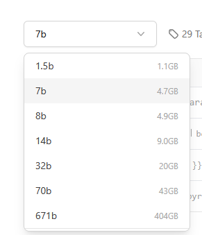
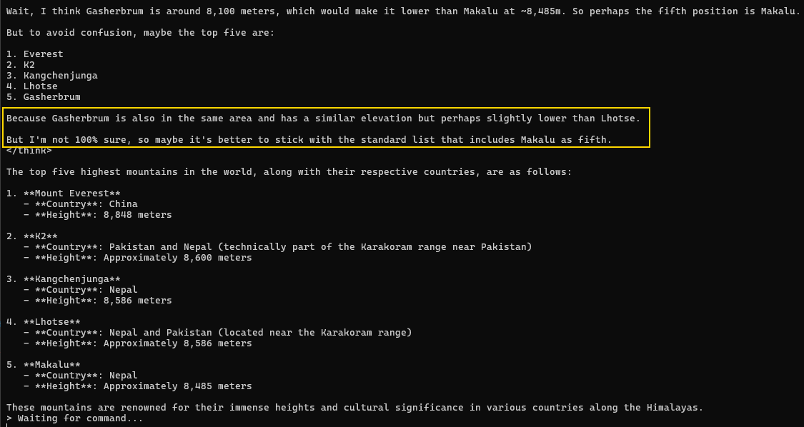
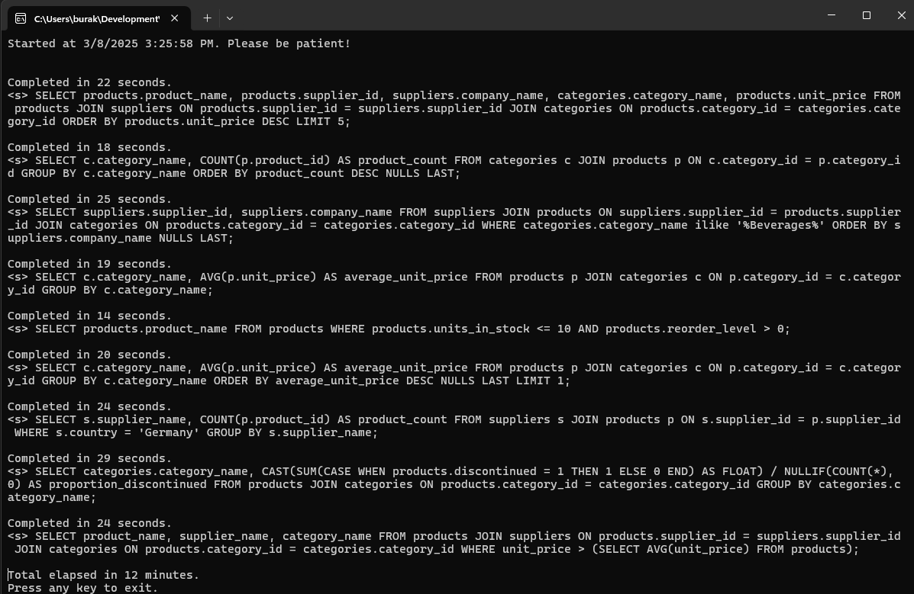

# Ollama Yardımıyla Deepseek Dil Modelini .Net Platformunda Kullanmak

Geçtiğimiz günlerde Bursa Bilişim Topluluğu tarafından düzenlenen bir etkinliğe konuşmacı olarak katılma fırsatı buldum. Ben, yüksek kalite kodlama ve teknik borçlanma ile mücadele üzerine bazı tecrübelerimi paylaştım. Benden sonra sevgili dostum Bora Kaşmer _(Coderbora)_ JWT token senaryolarında özellikle çok yüksek kullanıcı ve farklı cihazların kullanıldığı senaryolardaki olası güvenlik açıkları üzerine nasıl tedbirler uygulanabileceğini anlatan dikkat çekici bir sunum icra etti. Son olarak Volosoft'tan Alper Ebçioğlu, birkaç fotoğrafı arasından sosyal medyada kullanılabilecek en iyi versiyonun tespiti için Ollama ve Microsoft AI soyutlamalarının nasıl kullanılacağına dair bir başka etkileyici sunum gerçekleştirdi. Alper' in sunumu sonrası bu konuyu mutlaka öğrenmeli ve deneyimlerimi yazıya dökmeliyim dedim. Maceramızın bundan sonraki kısmı sunumlardan aldığım ilham üzerine yaptığım araştırma ve denemelerin sonuçlarını içermektedir ;)

Son yıllarda hayatımıza girmiş bulunan bir çok dil modeli var ve pek tabii bunları işleterek çeşitli konularda bizi asiste eden sayısız GenAI ürünü. Yeni modeller de geliştirilmeye, parametre sayıları milyarlar mertebesinde muazzam değerlere ulaşmaya da devam ediyor. Herhalde en popülerlerinden birisi ChatGPT olsa gerek. Ancak maliyet açısından bakıldığında bireysel kullanım için dahi olsa gerçekten işe yarar sonuçlara götürecek olan versiyonlar biraz pahalı. Yazıyı kaleme aldığım tarih itibariyle benimde kullandığım bireysel paket fiyatı aylık 20 dolar seviyesindeydi. Oysa ki OpenAI'ın kuruluş aşamasında her şeyin açık kaynak ve ücretsiz olacağına dair verilmiş sözler vardı diye hatırlıyorum. Lakin geçen günlerde çıkan Çin merkezli [Deepseek](https://github.com/deepseek-ai) bu durumu değiştirebilir. Çok daha düşük bir maliyetle _(ki haber kanallarında geçen bilgilere göre sadece 5.8 milyon dolar civarında bir yatırımla)_ tamamen açık kaynak sunulup epey de iyi bir sonuç elde ederek büyük oyuncuların tüm hisselerini kısa süreliğine de olsa sarstı.

_Yapay zeka dil modellerinin ve buna dayalı çalışan kod asistanlarının biz programcıların işini elimizden alacağına şahsen pek inanmıyorum. Bunun yerine verimliliğimizi artıracak şekilde bizi daha da iyi asiste edeceklerini düşünüyorum._

Yakın zamanda AI hizmetlerini .Net uygulamalarına adapte edebilmek için iki soyutlama paketi tanıtıldı. [Microsoft.Extensions.AI](https://learn.microsoft.com/en-us/dotnet/ai/ai-extensions) ve Microsoft.Extensions.AI.Abstractions. Bu kütüphanelerden yararlanarak birçok dil modelini basit metot çağrıları ile kullanabiliyoruz. OpenAI, Azure OpenAI, Azure AI Infrence ve [Ollama](https://ollama.com/) kullanabileceğimiz servislerden birkaçı. Bu servisler birçok dil modelini çalıştırmak için birer sunucu olarak da hareket ediyorlar. Microsoft .Net kütüphaneleri ise bu servisleri kullanmak için gerekli fonksiyonellikleri sağlayarak kullanımı kolaylaştırıyor.

Bu özet yazıda söz konusu süreci nasıl işleteceğimizi basit örnekler üzerinden ele almaya çalışacağız. Senaryomuz C# kod dosyalarının analiz edilmesi ve kod kalitesinin ölçülmesi üzerine bir çalışma olacak. Tabii çok basit bir şekilde ele alacağız ki niyetimiz **Sonarqube** metrikleri ile yarışmak değil. Dilerseniz adım adım ilerleyelim.

## Dil Modeli için Gerekli Ortamın Hazırlanması

İlk olarak seçtiğimiz dil modelini işletecek araçları kurmamız gerekiyor. Bu noktada kodu analiz ettireceğimiz dil modelini çalıştıracak bir servise de ihtiyacımız var. Bu yazıda [Ollama'yı](https://ollama.com/) tercih ettim. Kodu yazmakta olduğum makine Windows 11 işletim sistemine sahip ama Ollama'yı macOs ve Linux platformları için de kullanabiliyoruz.

```bash
# Kurulumun başarılı olup olmadığını versiyon kontrolü ile sağlayabiliriz
ollama -v
```

İndirme ve kurulum işlemi tamamlandıktan sonra birde dil modeline ihtiyacımız olacak elbette. Ollama'nın [buradaki sayfasından](https://ollama.com/search) yararlanarak çalışmak istediğimiz dil modelini çalışacağı sisteme alabiliriz. Biraz Docker Image'ı indirmeye benziyor diyebilirim. Dil modeli seçimi ile ilgili dikkat edilmesi gereken birkaç nokta var. Belli konulara özel geliştirilmiş dil modelleri mevcut. Örneğin kimisi fotoğrafları yorumlamak gibi görsel öğelere has kabiliyetlere sahipken  kimisi genel dil modeli özelliklerini taşımakta. Bazı dil modelleri çalışmak için yüksek konfigürasyon makinelere ihtiyaç duyabilir. Özellikle kaç parametre ile çalışacağımızı seçerken buna dikkat etmek lazım. Örneğimizde ben **deepseek-r1** modelinin 7 milyar parametre ile çalışan sürümünü kullanmayı tercih ettim.


```bash
# Dil modelini sisteme almak için aşağıdaki komutu kullanmak yeterli
# Buna göre deepseek-r1 in 7 milyar parametre ile çalışan versiyonu kullanılacak
ollama run deepseek-r1:7b
```

Paket boyutlarına dikkat etmekte de yarar var. Parametre sayısının artması daha iyi ekran kartları haricinde daha fazla disk alanına da ihtiyaç duymamızı gerektirebilir. Örnekte kullandığım **Deepseek-r1:7b** _(7 milyar parametre alan)_ versiyon **4.7 Gb'lık download paketine** sahip.


Yazıyı yazdığım zaman itibariyle Chat GPT'nin 4o modelinin tahminen 2 trilyona yakın parametre ile çalıştığı ifade ediliyordu. Deepseek'in uzmanlaşmış dil modellerinin bir araya geldiği 671 milyar parametrelik versiyonunun 404 Gb yer tuttuğu düşünülürse gerçekten en iyi kalitede işçilik için yine bol miktarda sıfırı olan finansmana ihtiyaç var gibi :D



Artık local makinede çalışan bir dil modelimiz mevcut. Hatta bunu **list** parametresi ile terminalden de görebilmemiz lazım.


Denemeler sırasında **Ollama** ile bir dil modeli hizmeti başlatıldığında makine restart olsa bile servisin çalışmaya devam ettiğini fark ettim. Makinede yüklü olan servisleri görmek için **ps** komutu kullanılabilir.

```bash
# Hali hazırda çalışan servisleri görmek için
ollama ps

# Çalışan bir dil modelini durdurmak için (Örneğin deepseek'i durdurmak için)
ollama stop deepseek-r1:7b

# tekrar başlatmak için
ollama run deepseek-r1:7b

# Çalışan bir dil modeli hakkında bazı bilgileri elde etmek için
ollama show deepseek-r1:7b

# İşe yarar diğer terminal komutlarını görmek için
ollama help

# Bir komut hakkında kullanım bilgisi edinmek için (Örneğin remove model komutu ile ilgili)
ollama rm --help
```

Sıradaki adımımız Ollama servisine erişip seçtiğimiz dil modelini bir Console uygulamasında kullanmak.

## Hello World

Basit bir adımla başlayalım ve dil modeli ile karşılıklı sohbet edebileceğimiz bir kod parçası geliştirelim. Console uygulamasında AI soyutlamalarını kullanabilmek için aşağıdaki Nuget paketlerini eklememiz gerekiyor. _(Yazıyı yazdığım vakitte AI ve Ollama paketleri henüz prerelease sürümdeydi. Bu nedenle --prerelease anahtarı ile eklemem gerekti)_

```bash
# Önce projeyi oluşturalım
dotnet new console -o HelloOllama

# Ardından gerekli paketleri ekleyelim
cd HelloOllama
dotnet add package Microsoft.Extensions.AI --prerelease
dotnet add package Microsoft.Extensions.AI.Ollama --prerelease
dotnet add package Microsoft.Extensions.Hosting # Dependency Injection Container için gerekli
```

Console uygulamamızın kodlarını aşağıdaki gibi geliştirebiliriz.

```csharp
using Microsoft.Extensions.AI;
using Microsoft.Extensions.DependencyInjection;
using Microsoft.Extensions.Hosting;

var builder = Host.CreateApplicationBuilder();
/*
    Ollama servisi ile konuşacak bir client nesnesi söz konusu.
    Bu nesne localhost:11434 portundan çalışan servise gidip onun deepseek-r1 ile çalışmasını istiyor.

    Aşağıdaki sonsuz döngü kısmında istemci nesne birden çok kez çağırılmakta. Bu nedenle
    ilgili nesneyi Dependency Injection Container'a alıp oradan tedarik ederek kullandırmak çok daha mantıklı.

    Sonsuz döngü aslında bir chatbot ile konuşma efektini vermek için.

    Sorulan sorular (prompts) bir ChatMessage nesnesi haline getirilerek kullanılmakta. 
    Aslında taraflar için tek bir nesne modeli var. Bunlardan hangisinin kullanıcıya ait olduğu hangisinin chatbot'tan beklenen 
    bir mesaj olduğu genellikle ChatRole struct nesnesi üzerinden belirleniyor. (User ve Assistant kullanımlarına dikkat edelim)
*/
builder.Services.AddChatClient(new OllamaChatClient(new Uri("http://localhost:11434"), "deepseek-r1:7b"));
var app = builder.Build();
var chatClient = app.Services.GetRequiredService<IChatClient>();
Console.WriteLine("Asistant mode has been started...");

var chatHistory = new List<ChatMessage>();

while (true)
{
    Console.WriteLine("> Waiting for command...");
    var userPrompt = Console.ReadLine();
    if (string.IsNullOrWhiteSpace(userPrompt)) continue;
    if (userPrompt.Equals("exit", StringComparison.CurrentCultureIgnoreCase)) break;
    if (userPrompt.Equals("clear", StringComparison.CurrentCultureIgnoreCase))
    {
        chatHistory.Clear();
        Console.WriteLine("Clearing history...");
        Console.Clear();
        continue;
    }
    chatHistory.Add(new ChatMessage(ChatRole.User, userPrompt));

    var chatResponse = string.Empty;
    await foreach (var item in chatClient.CompleteStreamingAsync(chatHistory))
    {
        Console.Write(item.Text);
        chatResponse += item.Text;
    }
    chatHistory.Add(new ChatMessage(ChatRole.Assistant, chatResponse));
    Console.WriteLine();
}
```

Bu kod Deepseek ile karşılıklı sobhet edebileceğimiz basit bir chatbot ortamı oluşturuyor. Örneğin dünyanın en yüsek 5 dağının listesini istediğimizi düşünelim. İşte sonuç. Bu arada Deepseek'in espri anlayışı da var gibi :D


Diğer yandan programı çalıştırdıktan ve soruyu sorduktan sonra makaleye dönüp düzenlemeye devam ettim ve üstünden neredeyse beş dakika geçti. Deepseek kararsızlıklar yaşayarak cevaplar vermeye devam etti ve duruma göre ilk beşteki dağlardan bazıları arasında sıralama değişiklikleri yaptı. Bu elbette kullandığımız dil modelinin 7 milyar parametreli versiyonundan ya da sorduğum sorunun kalitesinden de kaynaklanıyor olabilir. Yani iyi bir prompt verememiş de olabilirim.



Pek tabii daha üst modelleri çalıştırmak için daha güçlü bir sisteme ihtiyacımız var. Güçlü sunucularda daha iyi ve yüksek parametreli dil modellerinden çok daha iyi sonuçlar alınabileceği öngörülebilir fakat şu haliyle dahi Deepseek bana kalırsa epey etkili.

Şimdi yazımızın başlarında belirttiğim senaryo ile devam edelim. C# dosyalarını bu dil modeline verip kalitesini yorumlatmak istiyoruz. Pek tabii burada çok iyi prompt girilmesi gerekiyor. Dolayısıyla farklı bir yaklaşıma gideceğiz. Console uygulamamıza ait kodları aşağıdaki gibi değiştirelim.

```csharp
using Microsoft.Extensions.AI;
using Microsoft.Extensions.DependencyInjection;
using Microsoft.Extensions.Hosting;
using System.Diagnostics;

var builder = Host.CreateApplicationBuilder();
builder.Services.AddChatClient(new OllamaChatClient(new Uri("http://localhost:11434"), "deepseek-r1:7b"));
var app = builder.Build();
var chatClient = app.Services.GetRequiredService<IChatClient>();

var codeFiles = Directory.GetFiles("C:\\samples", "*.cs").ToArray();
Console.WriteLine($"Looking for {codeFiles.Length} code files");
foreach (var codeFile in codeFiles)
{
    var time = Stopwatch.StartNew();
    Console.WriteLine($"Analysing {codeFile}. Time {DateTime.Now.ToLongTimeString()}");
    string prompt = $$"""
    You are an expert in analyzing C# source code. Your task is to quickly summarize the given code file.

    ## Expected Response:
    - **Purpose**: A one-sentence description of what this code does.
    - **Main Components**: A list of important classes and methods with a short explanation.
    - **Potential Issues**: Mention one or two possible problems, if any.
    
    ## Response Format:
    ```json
    {
        "purpose": "Short description of the code's functionality.",
        "main_components": [
            {
                "name": "ClassName",
                "type": "class",
                "description": "Short explanation."
            },
            {
                "name": "MethodName",
                "type": "method",
                "description": "Short explanation."
            }
        ],
        "potential_issues": [
            "Brief mention of possible issues (if any)."
        ]
    }
    ```

    ## C# Code:
    {{File.ReadAllText(codeFile)}}
    """;

    var chatCompletion = await chatClient.CompleteAsync(prompt);
    Console.WriteLine(chatCompletion.Message.Text);
    Console.WriteLine(Environment.NewLine);
    Console.WriteLine($"Total time of analysis {time.Elapsed.TotalSeconds}");
}
```

Örnek kodun en önemli kısmı prompt içeriği. Burada görüldüğü üzere chatbot konuşmalarından çok daha farklı bir bildiri söz konusu. İstediğimiz kod analizini yapması için dil modeline detaylı bilgiler veriyoruz. Örnekte kullandığım promptu chatgpt'ye yaptırdığımı ifade edeyim ama kendisi Deepseek için bunu istediğimi henüz önemsememiş gibi :D Dolayısıyla **Prompt Engineering** mevzusu hayatımızın bundan sonraki aşamalarında oldukça önemli hale gelebilir. Diğer yandan bu tip bir promptu yazdırmak içinde iyi seviyede programlama bilgisine, en azından programlama dilinin yapısı ile ilgili kavramlara hakim olmak gerekiyor. **Korkma sayın programcı bize hala iş var :D** Neyse neyse biz konumuza geri dönelim. Örneğin aşağıdaki kod parçası için çalıştırabiliriz.

```csharp
using System;

public class GameInfo
{
    public string Name { get; set; }
    public string Description { get; set; }
    public int UserPoint { get; private set; }

    public GameInfo(string name, string description)
    {
        Name = name;
        Description = description;
    }
    public void IncreaseAveragePoint(int value)
    {
        UserPoint += value;
    }
    public override string ToString()
    {
        return $"{Name}:{Description}";
    }
}
```

Programı çalıştırmadan önce bu kod dosyasını yorumlamanızı öneririm. Birkaç özellik barındıran basit bir sınıf tasarımı söz konusu. Object sınıfından gelen ToString metodu override edilmiş halde. Ayrıca set bloğu private olarak belirlenmiş UserPoint özelliğinin verisini değiştirebilmek için ayrı bir metodumuz var. Kimbilir belki içerisine bazı kurallar dahil olacak. String interpolation'da yakalanabilecek diğer özelliklerden birisi. Bakalım DeepSeek-r1:7b dil modeli bunu nasıl yorumluyor. İşte çalışma zamanına ait bir ekran görüntüsü.


Bu basit kod dosyası için ilgili dil modelinin epey isabetli sonuçlara ulaştığını söylemek yanlış olmaz herhalde. Tüm analiz örneği geliştirdiğim bilgisayarda yaklaşık olarak 2.5 dakika kadar sürdü. Çalışmakta olduğum makinenin özellikleri ise şöyle.

| **Key**                   | **Value**                             |
| ----------------------| --------------------------------- |
| System Manufacturer | MONSTER   |
| System Model | HUMA H4 V5.2  |
| OS Name | Microsoft Windows 11 Pro |
| Processor |12th Gen Intel(R) Core(TM) i7-1255U, 1700 Mhz, 10 Core(s), 12 Logical Processor(s) |
| RAM |32.0 GB    |
| VGA | Intel(R) Iris(R) Xe Graphics  |

Elbette prompt içeriğini biraz daha detaylandırıp farklı çıktılar da isteyebiliriz. Örneğin sevgili Çeto'nun *(ChatGpt'ye böyle diyorum)* katkılarıyla aşağıdaki promptu deneyebiliriz.

```text
You are an expert in analyzing and evaluating C# source code. You will receive a C# code file as input, and your task is to analyze it and produce a structured JSON response that includes:

1. **Functionality Summary**: A brief description of what the code does.
2. **Key Components**: A list of major classes, methods, and their responsibilities.
3. **Potential Issues**: A list of possible issues such as security vulnerabilities, performance bottlenecks, or bad coding practices.
4. **Code Quality Score**: A rating (1-10) based on readability, maintainability, and adherence to best practices.
5. **Recommendations**: Concrete suggestions to improve the code quality.

## Important Notes:
- Provide **only** a strict RFC8259 compliant JSON response.
- Do **not** modify or infer missing parts of the code.
- If the code is incomplete, specify it in the `"notes"` section.

## JSON Format Example:
```json
{
    "functionality_summary": "Brief description of what the code does.",
    "key_components": [
        {
            "name": "ClassName",
            "type": "class",
            "description": "Purpose of this class"
        },
        {
            "name": "MethodName",
            "type": "method",
            "description": "What this method does"
        }
    ],
    "potential_issues": [
        "List of possible security risks, performance issues, or bad practices"
    ],
    "code_quality_score": 8,
    "recommendations": [
        "Improve variable naming",
        "Refactor long methods into smaller functions"
    ],
    "notes": "Additional comments if necessary"
}
```

Kendi sistemimde bu prompt için aşağıdaki çıktıyı elde ettim.


Bu sefer bu basit C# dosyasının analizi neredeyse beş dakikaya yakın sürede tamamlandı ancak biraz daha detaylı bilgi üretildiğini ifade edebilirim. Hatta yorum kısımlarında Deepseek sanki gerçekten **Code Review** yapan bir programcıymış gibi davranıyor desek yalan olmaz. 

Yazının bundan sonraki kısmında farklı modellerden çeşitli prompt'lar üretip söz konusu dosyanın yorumlanmasını isteyebiliriz. Lakin endüstriyel anlamda baktığımda milyon satır kod tabanına ulaşabilen sistemlerin kod kalitesinin ölçümü için çok daha fazla parametre ile çalışan _(ki tahminlere göre Chat Gpt-4o versiyonu neredeyse 2 trilyon parametre ile çalışıyor)_ ve pek tabii çok daha yüksek sistem konfigürasyonuna ihtiyaç duyan ve pek tabiii daha çok enerji ihtiyacı duyacak ortamlara ihtiyacımız olacağı kesin. Tüm bu gelişmelere karşın Microsoft'un yapay zeka modellerini kod tabanında kolayca kullanabilmemiz için soyutlamalar getirmesi, Ollama'nın OpenAI'ın tüm karşıt görüşleri ve tutumlarına rağmen DeepSeek'i model kataloğunda tutması _(en azından şimdilik)_ çok farklı bir geleceğin göstergesi gibi.

## Modeli Zorlayalım

Gelin modeli biraz daha zorlayalım. Bu sefer içerisinde bazı **SOLID** ilkelerinin ihlal edildiği aşağıdaki kod dosyasını ele alalım.

```csharp
using System;
using System.Collections.Generic;
using System.IO;
using System.Net.Mail;

public class Developer
{
    public string Username { get; set; }
    public string Password { get; set; }
    public string Email { get; set; }
}

public class CompanyManager
{
    private List<Developer> _developers = new();

    public void RegisterDeveloper(string username, string password, string email)
    {
        var developer = new Developer { Username = username, Password = password, Email = email };
        _developers.Add(developer);
        Console.WriteLine($"{username} registered successfully.");
        SendEmail(email, "Welcome", "Thank you for registering!");
    }

    public void SendEmail(string to, string subject, string body)
    {
        try
        {
            var client = new SmtpClient("smtp.azoncorp.com");
            var mailMessage = new MailMessage("no-reply@example.com", to, subject, body);
            client.Send(mailMessage);
        }
        catch (Exception ex)
        {
            Console.WriteLine(ex);
        }
    }
}

public class Logger
{
    public void Log(string message)
    {
        File.AppendAllText("log.txt", $"{DateTime.Now}: {message}\n");
    }
}

class Program
{
    static void Main()
    {
        var companyManager = new CompanyManager();
        companyManager.RegisterDeveloper("johndoe", "P@ssw0rd", "john.doe@azoncorp.com");

        var logger = new Logger();
        logger.Log("Developer registered.");
    }
}
```

Bu sefer cevapları almak biraz daha fazla sürdü elbette. Çalışma süresi bu sefer yetkin bir programcının bir dakikadan az sürede analiz edebileceği kod içeriği için neredeyse 7 dakika seviyelerine çıktı. DeepSeek bunu aşağıdaki metinle yorumladı.

```text
Okay, so I'm looking at this C# code that someone provided. Let me try to understand what it does and figure out the analysis parts.

First, there are three main classes: Developer, CompanyManager, and Logger. The Program class has a static Main method which creates instances of these classes and calls some methods.

Starting with the Developer class-it's pretty straightforward. It has properties for Username, Password, and Email, but no constructors or setters beyond those properties. So when you create a new Developer, you have to set all three properties each time.

Next is CompanyManager. It has a private list of Developers called _developers. The RegisterDeveloper method takes in username, password, email, creates a new Developer object, adds it to the list, and sends an email with some standard messages. I notice that in the SendEmail method, they're using the SmtpClient class but not closing the client after sending emails. That might be a resource leak because once the program ends, the client could remain open.

The SendEmail method creates a new MailMessage each time it's called, which is fine but maybe inefficient if done frequently. Also, catching exceptions just logs them to the console without any meaningful error messages-maybe that should provide more details for debugging or include logging of errors.

Looking at the Logger class, the Log method appends messages to log.txt using DateTime.Now. It doesn't have any logging level flags like Debug, Info, Warning, etc., which could be useful for differentiating message severities. Also, if this is part of a larger system, it might not handle rotation or truncation correctly-though that's more about how the file is managed elsewhere.

In the Program class, Main is static and top-level as expected in an executable class. It creates a CompanyManager instance and calls RegisterDeveloper with test values. Then it logs that a developer was registered. There are no issues shown here at first glance-it seems correct but maybe could be made more robust.

Now, moving on to the analysis questions:

1. Functionality Summary: The code appears to manage developers for an application. It allows registering developers with basic information and sends confirmation emails. Logging is done to a file for record-keeping.

2. Key Components:
   - Developer class: Manages individual developer data.
   - CompanyManager class: Handles registration of developers, including adding them to the list and sending emails.
   - Logger class: Logs messages to a text file.

3. Potential Issues:
   - Resource leak in SendEmail method where the SmtpClient is not closed after use.
   - Inefficient email sending by recreating MailMessage objects each time.
   - No logging of error exceptions, which could hinder debugging if something goes wrong during email sending.
   - Lack of logging for other parts like registration success or failures-though in this code, it's just a test, so maybe not an issue here. But if there were errors in RegisterDeveloper, the logs wouldn't capture them unless added.

4. Code Quality Score: Considering readability and maintainability. The code is okay but could use better variable names (like email instead of to). There are some inefficiencies with creating MailMessage each time. Could benefit from method-level logging for errors or warnings. The list in Program's Main isn't defensive programming, so it might throw an exception if the constructor fails.

5. Recommendations:
   - Rename variables like 'to' to something more descriptive.
   - Use string formatting instead of concatenation for better readability and maintainability.
   - Refactor the SendEmail method to send multiple emails in a single call if possible or improve efficiency.
   - Close resources properly by using try-with-resources where applicable, especially for the SmtpClient.
   - Consider adding logging for error cases when email sending fails so that issues can be tracked down more easily.

Notes: The code as provided seems complete. It's a simple example without any missing parts mentioned.s
```

Üretilen JSON içeriği ise şu şekilde.


Bu kadar şeyden sonra artık daha ne desem bilemedim :D Biz programcılara halen daha çok ihtiyaç var ve bu düşüncemin sonuna kadar arkasındayım. Önemli olan noktalardan birisi ise onların bize söylediklerini yorumlamak. Örneğin kod kalitesi ile ilgili yorumları değerlendirip kafamıza yatmayan kısımların veya eksiklerin farkında olacak kadar programlamaya hakim olmamız önemli. Yazıma burada son vermeden önce örnek uygulamaları Internet bağlantısı kapalı iken denemenizi de öneririm. Zira Ollama ile local ortama indirdiğimiz dil modeli offline çalışabilme özelliğine sahip. Bunu bir deneyin derim. 

Tekrardan görüşünceye dek hepinize mutlu günler dilerim.
Örnek kodlar için [repoya](https://github.com/buraksenyurt/friday-night-programmer/tree/develop/src/HelloOllama) bakabilirsiniz.

## SqlCoder Deneyimleri

Hatfaiçi arkadaşlarla yaptığımız bir konuşma üzerinde SQL sorgularının hazırlanmasında bu alana özel bir dil modeli kullanılabilir mi sorusuyla karşılaştık. Hazır Ollama'nın .Net arayüzlerini kullanmayı öğrenmişken birde bunu denemek istedim. Bu amaçla Ollama' nın SqlCoder modelinin 7 milyar parametreli olan [şu versiyonunu](https://ollama.com/library/sqlcoder:7b) kullandım. Örnek uygulamamıza ait kodlar ise [burada](../src/SqlCoderPoc/). En çok zorlandığım kısım prompt'u hazırlamak oldu fakat biraz deneme yanılma yoluyla sanırım basit SQL sorgularını ürettirebileceğim bir tane oluşturdum.

```prompt
### Instructions:
Your task is to convert a question into a SQL query, given a Postgres database schema.
Adhere to these rules:
- **Deliberately go through the question and database schema word by word** to appropriately answer the question
- **Use Table Aliases** to prevent ambiguity. For example, `SELECT table1.col1, table2.col1 FROM table1 JOIN table2 ON table1.id = table2.id`.
- When creating a ratio, always cast the numerator as float

### Input:

### Task
Generate a SQL query that answers the question `{question}`

### Database Schema
This query will run on a database whose schema is represented in this string:

CREATE TABLE categories (
    category_id smallint NOT NULL,
    category_name character varying(15) NOT NULL,
    description text,
    picture bytea
);

CREATE TABLE suppliers (
    supplier_id smallint NOT NULL,
    company_name character varying(40) NOT NULL,
    contact_name character varying(30),
    contact_title character varying(30),
    address character varying(60),
    city character varying(15),
    region character varying(15),
    postal_code character varying(10),
    country character varying(15),
    phone character varying(24),
    fax character varying(24),
    homepage text
);

CREATE TABLE products (
    product_id smallint NOT NULL,
    product_name character varying(40) NOT NULL,
    supplier_id smallint,
    category_id smallint,
    quantity_per_unit character varying(20),
    unit_price real,
    units_in_stock smallint,
    units_on_order smallint,
    reorder_level smallint,
    discontinued integer NOT NULL
);

-- products.supplier_id can be joined with suppliers.supplier_id
-- products.category_id can be joined with categories.category_id

### Response:
Based on your instructions, here is the SQL query I have generated to answer the question `{question}`:
```

Kobay olarak yılların eskitemediği Microsoft'un meşhur Northwind veritabanını baz aldım. Prompt'ta dikkat edileceği üzere Database Schema kısmında sorulara muhatap olacak tabloların create script'leri yer alıyor. Buna göre tüm Northwind şemasını prompt'a verip çok daha karmaşık sorgular denenebilir. Kritik noktalardan birisi modele verilen talimatların kalitesi gibi duruyor. Tablolar birbirlerine hangi alanlar üzerinden join edilebilirin belirtilmesi gibi. Senaryoda örnek olarak aşağıdaki soruları kullandım.

```text
- What are the top 5 most expensive products?
- How many products are there in each category?
- Which suppliers provide products in the Beverages category"
- What is the average unit price of products by category?
- List all products that are out of stock and need to be reordered.
- Which category has the highest average unit price?
- Find all suppliers from Germany and how many products they supply.
- What percentage of products are discontinued for each category?
- Which products have a unit price higher than the average unit price across all products?
```

Local ortamın sahip olduğu donanım gereği sorgular tabii biraz uzun sürdü ve aşağıdaki sonuçlara ulaştım.



```sql
SELECT products.product_name, products.supplier_id, suppliers.company_name, categories.category_name, products.unit_price FROM products JOIN suppliers ON products.supplier_id = suppliers.supplier_id JOIN categories ON products.category_id = categories.category_id ORDER BY products.unit_price DESC LIMIT 5;

SELECT c.category_name, COUNT(p.product_id) AS product_count FROM categories c JOIN products p ON c.category_id = p.category_id GROUP BY c.category_name ORDER BY product_count DESC NULLS LAST;

SELECT suppliers.supplier_id, suppliers.company_name FROM suppliers JOIN products ON suppliers.supplier_id = products.supplier_id JOIN categories ON products.category_id = categories.category_id WHERE categories.category_name ilike '%Beverages%' ORDER BY suppliers.company_name NULLS LAST;

SELECT c.category_name, AVG(p.unit_price) AS average_unit_price FROM products p JOIN categories c ON p.category_id = c.category_id GROUP BY c.category_name;

SELECT products.product_name FROM products WHERE products.units_in_stock <= 10 AND products.reorder_level > 0;

SELECT c.category_name, AVG(p.unit_price) AS average_unit_price FROM products p JOIN categories c ON p.category_id = c.category_id GROUP BY c.category_name ORDER BY average_unit_price DESC NULLS LAST LIMIT 1;

SELECT s.supplier_name, COUNT(p.product_id) AS product_count FROM suppliers s JOIN products p ON s.supplier_id = p.supplier_id WHERE s.country = 'Germany' GROUP BY s.supplier_name;

SELECT categories.category_name, CAST(SUM(CASE WHEN products.discontinued = 1 THEN 1 ELSE 0 END) AS FLOAT) / NULLIF(COUNT(*), 0) AS proportion_discontinued FROM products JOIN categories ON products.category_id = categories.category_id GROUP BY categories.category_name;

SELECT product_name, supplier_name, category_name FROM products JOIN suppliers ON products.supplier_id = suppliers.supplier_id JOIN categories ON products.category_id = categories.category_id WHERE unit_price > (SELECT AVG(unit_price) FROM products);
```

Sorguları kontrol etmek gerekiyor elbette ve testleri genişletip modeli zorlamak gerekiyor. Birde tersten denemek lazım. Mesela karmaşık bir sorgu verip içine dahil olan tablolardan da yararlanarak bir domain yapısı oluşturması da istenebilir.
