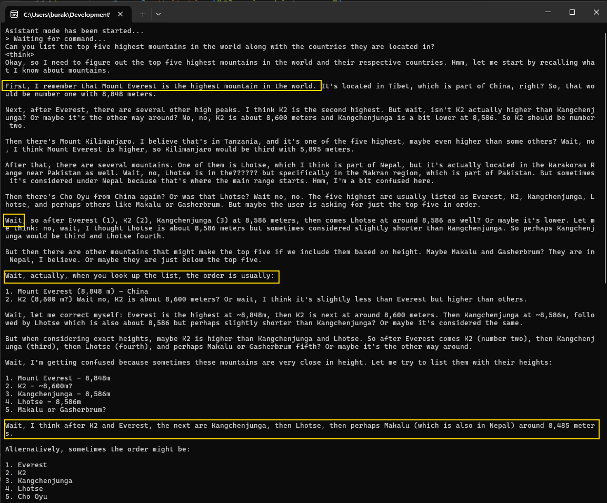

# Ollama Yardımıyla Deepseek Dil Modelini .Net Platformunda Kullanmak

Son yıllarda hayatımıza girmiş bulunan bir çok dil modeli ve pek tabii bunları işleterek çeşitli konularda bizi asiste eden GenAI ürünleri geliştirildi. Yeni modeller de geliştirilmeye, parametre sayıları milyarlar mertebesinde muazzam değerlere de ulaşmaya devam ediyor. Herhalde en popülerlerinden birisi ChatGPT olsa gerek. Ancak maliyet açısından bakıldığında bireysel kullanım için dahi olsa gerçekten işe yarar sonuçlara götürecek olan versiyonlar biraz pahalı gibi. Yazıyı kaleme aldığım tarih itibariyle benimde kullandığım bireysel paket fiyatı aylık 20 dolar seviyesinde. Oysa ki OpenAI'ın kuruluş aşamalarında her şeyin açık kaynak ve ücretsiz olacağına dair bir bildiri vardı diye hatırlıyorum. Geçen günlerde çıkan Çin merkezli [Deepseek](https://github.com/deepseek-ai) bu durumu biraz değiştirdi gibi. Çok daha düşük bir maliyetle _(ki haber kanallarında geçen bilgilere göre sadece 6 milyon dolar civarında bir yatırımla)_ tamamen açık kaynak sunulup epey de iyi bir sonuç elde ederek büyük oyuncuların tüm hisselerini kısa süreliğine de olsa sarsmış durumda.

_Yapay zeka dil modellerinin ve buna dayalı çalışan kod asistanlarının biz programcıların işini elimizden alacağına pek inanmıyorum. Bunun yerine verimliliğimizi artıracak şekilde bizi daha da iyi asiste edeceklerini düşünüyorum._

Yakın zamanda AI hizmetlerini .Net uygulamalarına adapte edebilmek için iki soyutlama paketi tanıtıldı. [Microsoft.Extensions.AI](https://learn.microsoft.com/en-us/dotnet/ai/ai-extensions) ve Microsoft.Extensions.AI.Abstractions. Bu kütüphanelerden yararlanarak belli başlı dil modeli servislerini kullanabiliyoruz. OpenAO, Azure OpenAI, Azure AI Infrence ve [Ollama](https://ollama.com/) gibi. Bu servisler birçok dil modelini çalıştırmak için birer sunucu gibi hareket ediyorlar. .Net kütüphaneleri ise bu servisleri kullanmak için gerekli fonksiyonellikleri sağlayarak kullanımı kolaylaştırıyor.

Bu özet yazıda söz konusu süreci nasıl işleteceğimizi bir örnek üzerinden ele almaya çalışacağız. Senaryomuz C# kod dosyalarının analiz edilmesi ve kod kalitesinin ölçülmesi üzerine bir çalışma. Tabii çok basit bir şekilde ele alacağız. Dilerseniz adım adım ilerleyelim.

## Dil Modeli için Gerekli Ortamın Hazırlanması

İlk olarak seçtiğimiz dil modelini işletecek ortamı hazırlamak lazım. Bu noktada kodu analiz ettireceğimiz dil modelini çalıştıracak bir servise de ihtiyacımız var. Ben [Ollama'yı](https://ollama.com/) tercih ediyorum. Kodu yazmakta olduğum makine Windows 11 işletim sistemine sahip. Ollama'yı macOs ve Linux platformları için de kullanabiliyoruz.

```bash
# Kurulumun başarılı olup olmadığını versiyon kontrolü ile yapabilriz
ollama -v
```

İndirme ve kurulum işlemi tamamlandıktan sonra birde dil modeline ihtiyacımız olacak elbette. Ollama'nın [buradaki sayfasından](https://ollama.com/search) yararlanarak çalışmak istediğimiz dil modelini çalışacağı sisteme almamız lazım.Burada dikkat edilmesi gereken birkaç nokta var. Belli konulara özel geliştirilmiş dil modelleri mevcut. Örneğin kimisi görsel öğelere has kabiliyetlere sahip, yani fotoğraf analizi yaptırmak gibi konularda başarılı. Kimisi genel dil modelleri. Bazı dil modelleri çalışmak için yüksek konfigürasyon makinelere ihtiyaç duyabilir. Özellikle kaç parametre ile çalışacağımızı seçerken buna dikkat etmek lazım. Örneğimizde ben deepseek-r1 modelini ve 7 milyar parametre ile çalışan sürümünü kullanmayı tercih ettim.


```bash
# Dil modelini sisteme almak için aşağıdaki komutu kullanmak yeterli
# Buna göre deepseek-r1 in 7 milyar parametre ile çalışan versiyonu kullanılacak
ollama run deepseek-r1:7b
```

Paket boyutlarına dikkat etmekte de yarar var. Parametre sayısının artması daha iyi ekran kartları haricinde daha fazla disk alanına da ihtiyaç duymamızı gerektirebilir :D Örnekte kullandığım Deepseek-r1:7b _(7 milyar parametre alan)_ versiyon 4.7 Gb'lık bir download paketine sahip.


Artık local makinede çalışan bir dil modelimiz mevcut. Hatta bunu list parametresi ile görebilmemiz lazım.


Ollama ile bir dil modeli hizmeti başlatıldığında makine restart olsa bile servisin çalışmaya devam ettiğini fark ettim. Makinede yüklü olan servisleri görmek için ps komutu kullanılabilir.

```bash
# Hali hazırda çalışan servisleri görmek için
ollama ps

# Çalışan bir dil modelini durdurmak için (Örneğin deepseek'i durdurmak için)
ollama stop deepseek-r1:7b

# tekrar başlatmak için
ollama run deepseek-r1:7b

# Çalışan bir dil modeli hakkında bazı bilgileri elde etmek için
ollama show deepseek-r1:7b

# İşe yarar diğer terminal komutlarını görmek için
ollama help

# Bir komut hakkında kullanım bilgisi edinmek için (Örneğin remove model komutu ile ilgili)
ollama rm --help
```

Sıradaki adımımız Ollama servisini bir Console uygulamasında kullanabilmek.

## Hello World

Basit bir adımla başlayalım ve dil modeli ile karşılıklı sohbet edebileceğimiz bir kod parçası geliştirelim. Console uygulamasında AI soyutlamalarını kullanabilmek için aşağıdaki paketleri eklememiz gerekiyor. _(Yazıyı yazdığımız vakitte AI ve Ollama paketleri henüz prerelease sürümdeydi. Bu nedenle eklerken --prerelease ile eklemem gerekti)_

```bash
# Önce projeyi oluşturalım
dotnet new console -o HelloOllama

# Ardından gerekli paketleri ekleyelim
cd HelloOllama
dotnet add package Microsoft.Extensions.AI --prerelease
dotnet add package Microsoft.Extensions.AI.Ollama --prerelease
dotnet add package Microsoft.Extensions.Hosting # Dependency Injection Container için gerekli
```

İlk kodlarımızı da aşağıdaki gibi geliştirebiliriz.

```csharp
using Microsoft.Extensions.AI;
using Microsoft.Extensions.DependencyInjection;
using Microsoft.Extensions.Hosting;

var builder = Host.CreateApplicationBuilder();
/*
    Ollama servisi ile konuşacak bir client nesnesi söz konusu.
    Bu nesne localhost:11434 portundan çalışan servise gidip onun deepseek-r1 ile çalışmasını istiyor.

    Aşağıdaki sonsuz döngü kısmında istemci nesne birden çok kez çağırılmakta. Bu nedenle
    ilgili nesneyi Dependency Injection Container'a alıp oradan tedarik ederek kullandırmak çok daha mantıklı.

    Sonsuz döngü aslında bir chatbot ile konuşma efektini vermek için.

    Sorulan sorular (prompts) bir ChatMessage nesnesi haline getirilerek kullanılmakta. 
    Aslında taraflar için tek bir nesne modeli var. Bunlardan hangisinin kullanıcıya ait olduğu hangisinin chatbot'tan beklenen 
    bir mesaj olduğu genellikle ChatRole struct nesnesi üzerinden belirleniyor. (User ve Assistant kullanımlarına dikkat edelim)
*/
builder.Services.AddChatClient(new OllamaChatClient(new Uri("http://localhost:11434"), "deepseek-r1:7b"));
var app = builder.Build();
var chatClient = app.Services.GetRequiredService<IChatClient>();
Console.WriteLine("Asistant mode has been started...");

var chatHistory = new List<ChatMessage>();

while (true)
{
    Console.WriteLine("> Waiting for command...");
    var userPrompt = Console.ReadLine();
    if (string.IsNullOrWhiteSpace(userPrompt)) continue;
    if (userPrompt.Equals("exit", StringComparison.CurrentCultureIgnoreCase)) break;
    if (userPrompt.Equals("clear", StringComparison.CurrentCultureIgnoreCase))
    {
        chatHistory.Clear();
        Console.WriteLine("Clearing history...");
        Console.Clear();
        continue;
    }
    chatHistory.Add(new ChatMessage(ChatRole.User, userPrompt));

    var chatResponse = string.Empty;
    await foreach (var item in chatClient.CompleteStreamingAsync(chatHistory))
    {
        Console.Write(item.Text);
        chatResponse += item.Text;
    }
    chatHistory.Add(new ChatMessage(ChatRole.Assistant, chatResponse));
    Console.WriteLine();
}
```

Bu uygulamayı çalıştırdıktan sonra Deepseek ile konuşabiliriz. Örneğin dünyanın en yüsek 5 dağının listesini istediğimizi düşünelim. İşte sonuç. Bu arada Deepseek'in espri anlayışı da var gibi :D



Bu arada kodu çalıştırdıktan ve soruyu sorduktan sonra buraya dönüp makaleyi düzenlemeye devam ettim ve üstünden neredeyse beş dakika geçti. Deepseek kararsızlıklar yaşayarak cevaplar vermeye devam etti ve duruma göre ilk beşteki dağlardan bazıları arasında sıralama değişiklikleri yaptı. Bu elbette kullandığımız dil modelinin 7 milyar parametreli versiyonundan ya da sorduğum sorunun kalitesinden de kaynaklanıyor olabilir.


Pek tabii daha üst modelleri çalıştırmak için daha güçlü bir sisteme ihtiyacım var. Bu noktada güçlü sunucularda daha iyi ve yüksek parametreli dil modellerinden çok daha iyi sonuçlar alınabileceği öngörülebilir fakat şu haliyle dahi Deepseek bana kalırsa epey etkili. 

Şimdi yazımızın başlarında belirttiğim senaryo ile devam edelim. C# dosyalarını bu dil modeline verip kalitesini yorumlatmak istiyoruz. Pek tabii burada çok iyi prompt girilmesi gerekiyor. Dolayısıyla farklı bir yaklaşıma gideceğiz.

**YENİ ÖRNEK EKLENECEK**
