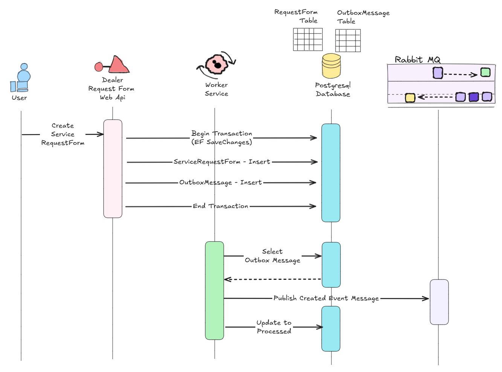

# Outbox Pattern Demo

Bir bayi otomasyon sisteminde servis talep formu sürecinde Outbox Pattern'in nasıl kullanılabileceğine dair basit bir demo hazırlamak istedim. Senaryo gereği bir servis talep formu oluşturulduğunda bunu ele alan modül dışındaki farklı modüllerin de durumdan haberdar olması bekleniyor. Servis talep formunun içeriği bir veri tabanında saklanıyor. İşin içerisinde veritabanı varsa rollback'e neden olabilecek bir transaction hatası da söz konusu olabilir. Böyle bir senaryoda talep formu içeriğinin veri tabanından bir hata nedeniyle oluşamaması ama oluştuğuna dair diğer sistemlere örneğin event yoluyla bilgilendirme geçilmesi doğal olarak veri tutuarsızlığına, sürecin yanlış işletilmesine sebebiyet verecektir. Bu gibi durumlarda kullanılan çözümlerden bir tanesi Outbox Pattern ve bu demodaki amaç en basit haliyle nasıl işletileceğini görmek.

## Akış

Senaryomuza göre servis talep formunun kaydedileceği veritabanında Outbox verisini tutan bir başka tablo daha yer alır. Servis formu verisi ve outbox verisi her iki tabloya aynı transaction içerisinde yazılmaya çalışılır. Aynı veri tabanı üzerinde gerçekleşen bir transaction doğal olarak dağıtık sistem tabanlı bir transaction mekanizmasına göre daha garantidir. Bu sayede veritabanına veri ekleme ve gönderilecek mesajın kaydedilmesi tek bir ACID transaction ile atomik olarak gerçekleşebilir. Eğer transaction işlemi başarılı olursa hem ana veri hem de outbox mesajı kayıt edilmiş olur aksine rollback işlemi söz konusu olursa ikisi de gerçekleşmemiş olur. Sonraki adımda ayrı bir süreç _(arka planda çalışan bir job olabilir)_ Outbox tablosundaki mesajları okur ve RabbitMQ ya da benzeri bir mesajlaşma sistemine servis talep formunun oluşturulduğuna dair bilgi yayınlar. Mesaj başarılı bir şekilde kuyruğa gönderildiğinde ise Outbox tablosunda statü değişikliği yapılır ve hareketin taraflarca ele alındığı bilgisi onaylanmış olur. Sonuç olarak sistemler arası veri tutarlılığı sağlanır ve mesajların en az bir kez iletildiğinden emin olunur.



## Düzenek

Senaryodaki enstrümanları şöyle sıralayabiliriz.

- Servis Talep Formunu oluşturan çok basit bir **Web API** hizmeti
- Veritabanı olarak **Postgresql** 
- **ORM _(Object Relational Mapping)_** aracı olarak **Entity Framework**
- Mesaj kuyruğu olarak **RabbitMQ**
- **Outbox** tablosunu kontrol edecek periyodik iş için Quartz tabanlı bir uygulama
- Postgresql ve Rabbitmq tarafları için Docker-Compose 

Örnek kodları [şu klasörde](../src/OutboxDemo/) bulabilirsiniz.

Bu solution'da;

- RequestFormApi, kullanıcı servis istek formunu oluşturan web api hizmetidir.
- EventWorker ise Outbox tablosunu dinleyip RabbitMQ'ya mesaj gönderimini üstlenir

## Docker Compose

Docker-compose içeriği aşağıdaki gibidir.

```yaml
services:

  postgres:
    image: postgres:latest
    container_name: fnp-postgres
    environment:
      POSTGRES_USER: johndoe
      POSTGRES_PASSWORD: somew0rds
      POSTGRES_DB: postgres
    ports:
      - "5432:5432"
    volumes:
      - postgres_data:/var/lib/postgres/data
    networks:
      - fnp-network

  pgadmin:
    image: dpage/pgadmin4:latest
    container_name: fnp-pgadmin
    environment:
      PGADMIN_DEFAULT_EMAIL: scoth@tiger.com
      PGADMIN_DEFAULT_PASSWORD: 123456
    ports:
      - "5050:80"
    depends_on:
      - postgres
    networks:
      - fnp-network

  rabbitmq:
    image: rabbitmq:3-management
    container_name: fnp-rabbitmq
    environment:
      - RABBITMQ_DEFAULT_USER=guest
      - RABBITMQ_DEFAULT_PASS=guest
    ports:
      - "5672:5672"
      - "15672:15672" 
    networks:
      - fnp-network

volumes:
  postgres_data:

networks:
  fnp-network:
    driver: bridge
```

## Çalıştırma

Örneği test etmek için öncelikle gerekli docker container'larının ayağa kaldırılması gerekir.

```bash
docker-compose up -d
```

Sonrasında örnek bir POST request gönderilmeli ve hem tablo değişiklikleri hem de rabbitmq event kuyruğu kontrol edilmelidir.

//TODO@buraksenyurt Test Sonuçlarını ve Analizi Ekle

```bash

```

## Dezavantajlar

Diğer yazılım prensipleri ve desenlerinde olduğu gibi bu kalıpta da sorgulayıcı yaklaşmakta fayda vardır. Outbox Pattern'in olası dezavantajları aşağıdaki gibi özetlenebilir.

- Oluşan her event için veritabanına bir insert işlemi icra edilir. **Yüksek transaction** sayısı olan sistemlerde veritabanı tarafında ek **I/O yükü** oluşması muhtemeldir. Tablo kontrolsüzce hızla büyüyebilir. Dolayısıyla öncü testler ve tahmini işlem sayıları, büyüme değerleri ve bunun kabul edilebilirliği göz önüne alınarak karar vermekte yarar vardır.
- **Transaction bütünlüğünü** garanti ederken outbox tablosunun yönetimi, log üretimi, retry mekanizmaları ve gereksiz kayıtların temizlemenmesi veya arşivlenmesi gibi farklı operasyonlarında ele alınması gerekir.
- Outbox pattern'de mesajların **At-Least-Once Delivery** metodolojisi gereği en az bir kez gönderimi söz konusudur. Aynı mesajın birden fazla gelme durumunun yan etkiye sebebiyet vermemesinin tasarımının da düşünülmesi gerekebilir.

## Alternatifler

//TODO@buraksenyurt Bunları da bir ara araştırmam lazım

- Inbox Pattern
- Change Data Capture: Bu konuda Debezium aracına bakılması tavsiye ediliyor.
- Transactional Messaging: Veritabanı ve mesaj kuyruğu ürünlerinin birbirileriyle doğrudan entegre çalışabildiği senaryolar.
- Transactional Outbox : Polling tekniği yerine sistemin sağladığı Trigger veya Notification enstrümanlarını kullanmak.
- Two-Phase Commit (Distributed Transaction Coordinator) : Bu çok eski bir yöntem. MSDTC denince birçok deneyimli programcının hatıraları canlanır.

**Sonuç itibariyle,** dağıtık bir sistemde Eventual Consistency kabul ediliyor, kullanılan mesajlaşma sistemi transactional değil, tek bir veritabanından veri ve olay üretimi söz konusu ama en önemlisi veri tabanında bir veri oluştururken başka sistemlerin event yayınlama usulüyle bilgilendirilmesi bekleniyorsa **Outbox Pattern** göz önüne alınabilir. Yine de devasa dağıtık sistem ortamlarında çok iyi test edilerek değerlendirilmesinden fayda vardır. 