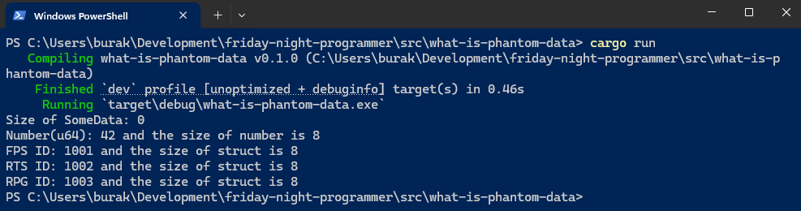

# Rust Dilin Phantom Type Kullanımı: PhantomData

Bazı durumlarda bir tipe ekstra bilgiler dahil ederken bu bilgilerin çalışma zamanında *(runtime)* gerçekten de saklanmasını istemeyiz. Kulağa garip bir cümle olarak geldiği aşikar, farkındayım. Bir örnek üzerinden ilerlersek daha anlaşılır olacaktır ama öncesinde temel bilgileri ele alalım. Rust dilinde `PhantomData<T>` şeklinde generic bir yapı bulunuyor. **PhantomData** yapısı ile tanımlanan bir veri çalışma zamanında saklamaz ama derleyici bu türün kullanıldığını bilir ve buna bağlı olarak ownership, borrowing, lifetimes gibi kuralları işletebilir. Zaten bu türe phantom yani "hayalet" denmesinin sebebi de budur; çalışma zamanında var olmayan ama derleyici tarafından bilinen tür olarak ifade edilebilir.

**PhantomData** türünün en büyük avantajı boyutunun sıfır olmasıdır. Dolayısıyla çalışma zamanında **T** türü için herhangibir bellek tahsisi yapılmaz ve performans açısından herhangi bir ek yük oluşmaz. Bu elbette akıllara `o zaman ne gibi senaryolarda hangi amaçlarla kullanırız?` sorusunu getirir. Temel olarak derleme zamanında bazı doğrulamaların garanti edilmesinin sağlanması istenen senaryoları örnek gösterebiliriz.

## Zero-Sized Types (ZST) Durumu

Devam etmeden önce Zero-Sized Types *(ZST)* kavramına bir açıklık getirelim. Gerçekten de hiçbir öğe içermeyen bir veri yapısı sıfır boyutlu olarak kabul edilebilir mi? Bunun için aşağıdaki kod parçasını göz önüne alabiliriz.

```rust
struct SomeData;

fn main() {
    let _data = SomeData;
    println!("Size of SomeData: {}", std::mem::size_of_val(&_data));
}
```

Bu örnekte SomeData isimli bir **Empty Struct** tanımı yapılmıştır. Program çalıştırıldığında **SomeData** yapısının boyutunun sıfır olduğunu görürüz. Çünkü bu yapı herhangi bir veri içermez. Rust derleyicisi bu tür yapılar için bellek tahsisi yapmaz ve bu nedenle boyutları sıfır olarak kabul edilir. İşte **PhantomData** da benzer şekilde çalışma zamanında veri içermeyen ancak derleyici tarafından tür bilgisi olarak kullanılan bir yapıdır.

## Hello PhantomData

Şimdi çok basit bir örnekle devam edelim. Çeşitli kategorileri ifade eden bir identity yapısı oluşturmak istediğimizi düşünelim. Bu veri türünde PhantomData ile kategorileri ifade edebiliriz.

```rust
struct FirstPersonShooter;
struct RealTimeStrategy;
struct RolePlayingGame;

struct Identity<T> {
    value: u64,
    marker: PhantomData<T>,
}

fn main() {
    let _data = SomeData;
    println!("Size of SomeData: {}", std::mem::size_of_val(&_data));

    let fps_id = Identity::<FirstPersonShooter> {
        value: 1001,
        marker: PhantomData,
    };

    let rts_id = Identity::<RealTimeStrategy> {
        value: 1002,
        marker: PhantomData,
    };

    let rpg_id = Identity::<RolePlayingGame> {
        value: 1003,
        marker: PhantomData,
    };

    let number = 42u64;
    println!(
        "Number(u64): {} and the size of number is {}",
        number,
        std::mem::size_of_val(&number)
    );

    println!(
        "FPS ID: {} and the size of struct is {}",
        fps_id.value,
        std::mem::size_of_val(&fps_id)
    );
    println!(
        "RTS ID: {} and the size of struct is {}",
        rts_id.value,
        std::mem::size_of_val(&rts_id)
    );
    println!(
        "RPG ID: {} and the size of struct is {}",
        rpg_id.value,
        std::mem::size_of_val(&rpg_id)
    );
}
```

Generic **T** türünden tanımlı **Identity** veri yapısı **PhantomData** ile tür bilgisini tutar. Örnekte oyun kategorilerini ifade eden birkaç struct tanımı da vardır. Bir Identity nesnesi tanımlanırken kullanılan struct bilgileri çalışma zamanında saklanmaz. Aşağıdaki çalışma zamanı görüntüsünden de anlaşılacağı üzere **Identity** yapısının boyutu sadece **u64** türünden **value** alanının boyutu kadardır. Bu bir nevi PhantomData'lar için çalışma zamanında yer tahsisi yapılmadığının ispatıdır.



Bazen PhantomData kullanımı ile **trait** kullanımları birbirlerine karıştırılabilir. trait'lerde çeşitli türden nesnelerle çalışacak şekilde soyutlamalar *(Abstractions)* yapabiliriz ve fonksiyonlar yazabiliriz. Ancak trait'ler çalışma zamanında da vardır ve **dynamic dispatch** gibi mekanizmaların getirdiği performans maliyetleri bulunur. Eğer trait'ler ile çalışırken türlerin karışması gibi bir durumun önüne geçmek istiyorsak ve bu tür bilgisi çalışma zamanında kullanılmayacaksa **PhantomData** kullanabiliriz. Kısacası, derleme zamanında type-safe bir yaklaşım sağlarken runtime'a taşımamıza gerek olmayan tür bilgileri için **PhantomData** kullanışlıdır.

Ne zaman trait ne zaman PhantomData sorusu ile ilgili olarak güzel bir cümleyi olduğu gibi paylaşmak isterim,

> Trait'ler **What you can do with a type** sorusuna cevap verirken, PhantomData **What kind of thing it is** sorusuna cevap verir.

Ayrıca **PhantomData** türün ile ilgili aşağıdaki maddeleri de aklımızda tutmakta fayda var.

- Çalışma zamanı verilerini doğrulamazlar.
- Sadece derleme zamanında tür seviyesinde kuralların uygulanmasını sağlarlar.
- Boyutları sıfırdır, dolayısıyla çalışma zamanında herhangi bir bellek tahsisi yapılmaz.
- Örneğe göre söz gelimi "Button" ifadesinin gerçekten bir Button türü olduğunu kontrol etmezler. Sadece derleyiciye bu türün kullanıldığını bildirirler.

## PhantomData ile Tür Güvenliği Sağlama

PhantomData türünün kullanımını biraz daha pekiştirmek için farklı bir örnek ile devam edelim. Bu örnekte farklı platformlara render edilebilecek bir takım UI bileşenlerini simüle ediyoruz. Component'in türü PhantomData ile belirtilirken derleme zamanında tür güvenliğini sağlanıyor ve yanlış türde bileşenlerin kullanılmasının önüne geçiliyor. Çalışma zamanında ise bu tür bilgisi saklanmıyor.

```rust
use std::marker::PhantomData;

fn main() {
    let post_button = create_button("Submit");
    let name_label = create_label("Name:");
    let input_field = create_text_field("Enter your name");
    let desktop_button = create_button_linux("Click Me");

    println!(
        "Created a '{}' with content: '{}'",
        post_button.get_type(),
        post_button.content
    );
    println!(
        "Created a '{}' with content: '{}'",
        name_label.get_type(),
        name_label.content
    );
    println!(
        "Created a '{}' with content: '{}'",
        input_field.get_type(),
        input_field.content
    );
    println!(
        "Created a '{}' with content: '{}'",
        desktop_button.get_type(),
        desktop_button.content
    );

    /*
    Aşağıdaki kullanım çalışma zamanında aşağıdaki gibi bir derleme hatasının üretilmesine sebep olur.

    error[E0308]: mismatched types
    --> src\main.rs:38:19
    |
    38 |     render_button(&input_field);
    |     ------------- ^^^^^^^^^^^^ expected `&Component<Html>`, found `&Component<MobileIos>`
    |     |
    |     arguments to this function are incorrect
    |
    = note: expected reference `&Component<Html>`
                found reference `&Component<MobileIos>`
    */
    // render_button(&input_field);

    render_button(&post_button); // Geçerli Kullanım
}

fn render_button(button: &Component<Html>) {
    println!(
        "Rendering a button into HTML for content: {}",
        button.content
    );
}

struct Html;
struct LinuxDesktop;
struct MobileIos;

struct Component<Render> {
    content: String,
    marker: PhantomData<Render>,
}

impl Component<Html> {
    fn get_type(&self) -> &str {
        "HTML Component"
    }
}

impl Component<LinuxDesktop> {
    fn get_type(&self) -> &str {
        "Linux Desktop Component"
    }
}

impl Component<MobileIos> {
    fn get_type(&self) -> &str {
        "Mobile iOS Component"
    }
}

/*
    Aşağıdaki fonksiyonlar farklı render tipleri için Component örnekleri oluşturuyor.
    PhantomData'yı bileşenin türünü belirtmek için kullanıyoruz ancak bu tür bilgisi çalışma zamanında kullanılmıyor.
    Sıfır maliyet. vtable ve dynamic dispatch kullanılmıyor. Component türü tamamen derleme zamanı için bir takı(tag) olarak işlev görüyor.
*/
fn create_button(content: &str) -> Component<Html> {
    Component {
        content: content.to_string(),
        marker: PhantomData,
    }
}

fn create_button_linux(content: &str) -> Component<LinuxDesktop> {
    Component {
        content: content.to_string(),
        marker: PhantomData,
    }
}

fn create_label(content: &str) -> Component<LinuxDesktop> {
    Component {
        content: content.to_string(),
        marker: PhantomData,
    }
}

fn create_text_field(content: &str) -> Component<MobileIos> {
    Component {
        content: content.to_string(),
        marker: PhantomData,
    }
}
```

Bu örnekte kullanılan `Component<Render>` veri yapısı farklı ortamlara render edilebilecek bileşenleri temsil ediyor. Örneğin **HTML** olarak render edilecek bir **Button** veya **Linux** masaüstü için bir **Label** kontrolü gibi. `PhantomData<Render>` kullanarak bir bileşenin hangi ortam için olduğunu derleme zamanında belirtiyoruz. Ancak bu tür bilgisi çalışma zamanında saklanmlıyor.

## Sonuç

Rust programlama diline başlayan birçok kişi için PhantomData türü kafa karıştırıcıdır. Ancak doğru kullanıldığında derleme zamanında tür güvenliği sağlamak ve çalışma zamanında gereksiz bellek tahsisinden kaçınmak için güçlü bir araçtır. Diğer yandan unsafe kod alanlarında  Özellikle generic veri yapıları ve tür seviyesinde doğrulama gerektiren senaryolarda PhantomData kullanımı oldukça faydalıdır. Yine de konuyu pekiştirmek adına bu türün nasıl kullanıldığına dair açık kaynak projelerdeki örneklere bakmak yerinde olacaktır.
