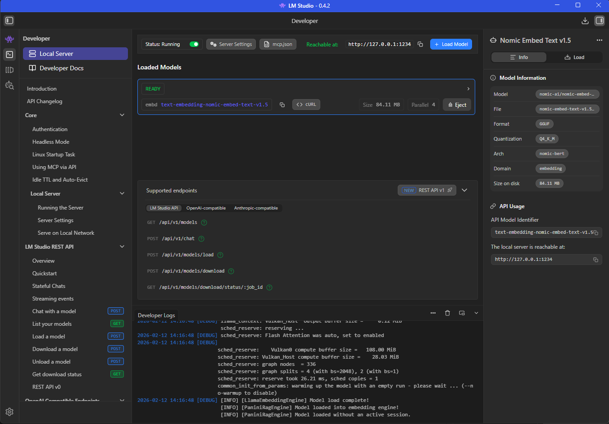

# RAG - Retrieval Augmented Generation İçin Hazırlıklar

Senaryom şöyle; Mimari tasarımı, domain yapısı belli olan bir çözümde Copilot ajanlarını kullanırken yapılan geliştirme/analiz taleplerinde genel dil modelinin RAG ile çizilen çerçeve içerisinde kalmasını sağlamak ve beklentilere en yakın sonuçları yakalamak. Örneğin github üzerinde geliştirdiğimiz büyük çaplı DDD *(Domain Driven Design)* ile uyumlu bir projeye Senior Software Developer/Business Analyst gibi rolleri tanımlanmış vekil botlar tanımladığımızı düşünelim. Bu botlardan Copilot yardımıyla bir şeyler yapmasını istediğimizde bizim belirlediğimiz kapsam içerisinde hareket etmesini sağlamak için bir RAG düzeneğine ihtiyacımız olacak. Bu düzenek içinse bazı ön hazırlıklara ihtiyacımız var.

En önemli kısımlardan birisi terimler arası ilişkilerin tespiti, matematiksel olarak ifade edilebilmesi ve yakınlıklarının tespiti. Özellikle markdown tabanlı içeriklerin olduğu *spec-oriented* temelli içeriklerde Text Embedding mekanizması ile - [ki şurada bir girizgah yapmıştım](Embedding.md) bu ilişkiler kolayca hesaplanabiliyor. Bu çalışmadaki amacım mimari tasarım, domain dili ve semantik bağlamların bulunduğu JSON tabanlı veri içeriklerini embedding hesaplamalarını da yaptırarak vektörel bir veritabanına almak. Bu RAG tesisatı için ilk adım olarak da düşünülebilir.

## Qdrant Veritabanı

Vektör tabanlı veritabanı olarak **Rust** ile yazılmış [Qdrant](https://qdrant.tech/documentation/overview/)'ı tercih ediyorum *(Github reposu da [şurada](https://github.com/qdrant/qdrant)* Rust ile yazılmış olması yüksek performans ve güvenilir bir bellek kullanımı getiriyor. Ayrıca **REST** ve **gRPC** protokollerini destekleyen API hizmeti ve kullanışlı bir arayüzü var. *(Alternatif olarak **Memcached** veritabanı da tercih edilebilir)* Pek tabii sistemimi kirletmek istemediğimden bir docker imajı kullanacağım. Bu yüzden hali hazırda bu repoya tahsis ettiğim [docker-compose](../docker-compose.yml) dosyasına aşağıdaki servis tanımını ekledim.

```yaml
services:

# Diğer servisler...

  qdrant:
    image: qdrant/qdrant
    ports:
      - "6333:6333" # REST API Portu
      - "6334:6334" # GRPC Portu
    volumes:
      - qdrant_storage:/qdrant/storage
    restart: always
    networks:
      - fnp-network

volumes:
  qdrant_storage:
  # Diğer volume tanımları...
networks:
  fnp-network:
    driver: bridge
```

Hemen kendime bir not düşeyim. FNP docker dosyasyında birçok servis tanımlı ama şu anda sadece qdrant servisini çalıştırmak istiyorum. Bunun için aşağıdaki terminal koutunu kullanabiliriz.

```bash
docker compose up -d qdrant
```

## Text Embedding için Local Dil Modeli

Normal şartlarda büyük dil modelleri ile çalışırken API'ler üzerinden ilerliyoruz. Ücretli modellerde API key'leri kullanarak hareket ediyoruz. Ancak bu deneysel ve öğrenme amaçlı çalışmada ücretsiz dil modellerini yerel bilgisayarda çalıştırarak da ilereleyebiliriz. Senaryoda bize **text embedding** için kullanabileceğimiz bir dil modeli lazım. Ben kişisel bilgisayarımda [LM Studio](https://lmstudio.ai/) arabirimini kullanıyorum. Model olarak da **Nomic Embed Text** dil modelini tercih ettim. 85 Megabyte'tan küçük bir dil modeli. Tabii bunu kullanabilmek için LM Studio'da Local Server'ı başlatmak ve Nomic dil modelini yüklemek gerekiyor. Kabaca aşağıdaki gibi bir arabirime ulaşmamız lazım.



## Örnek Veriler

Normal şartlarda projenin daha önceden yazılmış markdown dokümanları yine bir AI modelinden yararlanarak embedding için gerekli girdiye dönüştürülebilir. Yani, Claude Sonnet'den Opus'tan veya Gemini'dan ya da muadillerinden yararlarank dokümanları taraması ve mimari, domain dili ve diğer semantik bağlamlara göre bölümlere ayırarak embedding için hazır hale getirilmesi istenebilir. Ben bu öğreti çerçevesinde örnek üç json dokümanı ile ilerleyeceğim.

Örnekte bir e-ticaret sitesini baz alıyorum. Elbette kocaman domain'i ele almak çok zor. Küçük bir alanı değerlendirmek öğretinin sağlıklı yürümesi açısından kritik. Sadece ürün yönetim sürecini göz önüne alabiliriz mesela. Buna bağlı olarak üç doküman hazırlayacağız. Domain jargonu için büyük önem arz eden [ubiquities-language](../src/domain-ingestion/data/ubiquities-language.json), yazılım mimarisinin temellerini tarifleyen [architecture-rules](../src/domain-ingestion/data/architecture-rules.json) ve kod tarafındaki semantik ilişkilerin tanımlandığı [semantic-code-chunks](../src/domain-ingestion/data/semantic-code-chunks.json).

**ubiquities-language.json:** Projede kullanılan terimlerin tanımlarını ve birbirleriyle ilişkilerini içeren bir json dosyası. Aşağıdaki gibi basit bir içerik düşünebiliriz. Burada terim, terimin açıklaması ve dahil olduğu kapsam belirtilir. Gerçek dünya senaryolarında bu içerik daha da geniş olabilir. İlişkiler detaylandırılabilir ve iş kuralları işlenebilir. Buradan hareketle vektör veritabanına alınacak olan domain bilgisi, AI vekillerinin çizilen çerçeve sınırları içerisinde analizler hazırlayabilmesine de olanak sağlar.

```json
[
  {
    "term": "SKU (Stock Keeping Unit)",
    "definition": "A unique identifier for each distinct product and service that can be purchased. Represents the specific variation (e.g., T-Shirt, Red, Large).",
    "context": "Inventory & Catalog Context"
  },
  {
    "term": "Product Aggregate",
    "definition": "The cluster of domain objects including Product, ProductVariants, and ProductAttributes that are treated as a single unit for data changes.",
    "context": "Domain Core"
  },
  {
    "term": "Backorder",
    "definition": "A retailer order for a product that is temporarily out of stock. The customer can purchase it, but shipment is delayed.",
    "context": "Sales & Inventory"
  },
  {
    "term": "Dynamic Pricing Rule",
    "definition": "Algorithm-based adjustments to product prices based on real-time supply and demand, competitor pricing, or customer segments.",
    "context": "Marketing Context"
  }
]
```

**architecture-rules.json:** Bu veri setinde ise projenin mimari tasarımı ile ilgili bir bağlam işlenir. Mimari model, kullanılan dil, verinin hangi strateji ile depolanacağı, servis haberleşme türleri, domain nesne kurguları gibi AI vekillerinin işini olabildiğince kolaylaştıracak detaylar verilir. Örneğin;

```json
[
  {
    "rule_id": "ARCH-001",
    "category": "Modular Monolith",
    "description": "Modules must be loosely coupled. Cross-module communication must occur only via public contracts or domain events/integration events using MassTransit.",
    "enforcement": "Strict"
  },
  {
    "rule_id": "NET-009",
    "category": "Language Features",
    "description": "Use C# 12/13 Primary Constructors for all Dependency Injection in Controllers and Services to reduce boilerplate code.",
    "enforcement": "Recommended"
  },
  {
    "rule_id": "DATA-002",
    "category": "Persistence",
    "description": "Entity Framework Core DbContexts must be internal to their specific module. No shared DbContext is allowed across modules.",
    "enforcement": "Strict"
  },
  {
    "rule_id": "API-005",
    "category": "REST API",
    "description": "All list endpoints must support cursor-based pagination to handle large datasets efficiently.",
    "enforcement": "Mandatory"
  }
]
```

**semantic-code-chunks:** Burası tamamen kod tabanı ile ilgilidir. Metotların imzaları, servis tanımları, enstrümanların türleri ve onları tanımlayan tag'lara yer verilebilir. Örneğin;

```json
[
  {
    "file_name": "Product.cs",
    "type": "Domain Entity",
    "content": "public class Product : AggregateRoot<ProductId>\n{\n    public string Name { get; private set; }\n    public Money Price { get; private set; }\n    private readonly List<ProductVariant> _variants = new();\n    public IReadOnlyCollection<ProductVariant> Variants => _variants.AsReadOnly();\n\n    // .NET 9 / C# 12 Primary Constructor usage in static factory\n    public static Product Create(string name, Money price)\n    {\n        var product = new Product { Id = new ProductId(Guid.NewGuid()), Name = name, Price = price };\n        product.AddDomainEvent(new ProductCreatedEvent(product.Id));\n        return product;\n    }\n}",
    "tags": ["ddd", "aggregate", "entity-framework"]
  },
  {
    "file_name": "GetProductDetails.razor.cs",
    "type": "Razor Page Model",
    "content": "public class GetProductDetailsModel(IProductService productService) : PageModel\n{\n    [BindProperty(SupportsGet = true)]\n    public Guid Id { get; set; }\n    public ProductDto Product { get; set; }\n\n    public async Task OnGetAsync()\n    {\n        Product = await productService.GetByIdAsync(Id);\n    }\n}",
    "tags": ["frontend", "razor-pages", "primary-constructor"]
  },
  {
    "file_name": "ProductConfiguration.cs",
    "type": "EF Core Config",
    "content": "public class ProductConfiguration : IEntityTypeConfiguration<Product>\n{\n    public void Configure(EntityTypeBuilder<Product> builder)\n    {\n        builder.HasKey(p => p.Id);\n        builder.Property(p => p.Id).HasConversion(id => id.Value, value => new ProductId(value));\n        builder.OwnsOne(p => p.Price, price => \n        {\n            price.Property(m => m.Amount).HasColumnName(\"PriceAmount\");\n            price.Property(m => m.Currency).HasColumnName(\"PriceCurrency\").HasMaxLength(3);\n        });\n    }\n}",
    "tags": ["database", "ef-core", "value-object"]
  }
]
```

### Aktarım Uygulaması

Bu JSON veri setleri JSON veri seti olmak zorunda değil elbette :D Ancak içerideki tanımlamalar kritik. Bağlamları anlamlı şekilde ifade etmenin bir yolu olarak her parçanın kendi içinde farklı nitelikleri *(attribute)* var. Bunlar vektör enstrümanları ile inşa edilen hafifsiklet sinir ağındaki boğumlar arası ilişkilerin kurgulanmasında rol oynayacak. Şimdi bu veri setlerini işleyip, **QDrant** veritabanına alacak uygulamayı yazmaya başlayabiliriz. Ben bunun için **Rust** ile ilerlemeyi düşünüyorum zira oldukça iyi **crate**'lere sahip. Dolayısıyla Rust uygulamasının **toml** içeriği aşağıdaki bağımlılıkları içermeli.

```toml
[dependencies]
anyhow = "1.0.101"
qdrant-client = "1.16.0"
reqwest = { version = "0.13.2", features = ["json"] }
serde = { version = "1.0.228", features = ["derive"] }
serde_json = "1.0.149"
tokio = { version = "1.49.0", features = ["full"] }
```

Hata yönetimini etkili şekilde yapmak için **anyhow**'u, **Qdrant** veritabanı ile iletişim için **qdrant-client**'i, **JSON** verilerini işlemek için **serde** ve **serde_json**'u, asenkron operasyon desteği sağlamak için de **tokio** küfelerini kullanacağız. Ayrıca **embedding** hesaplamaları için de LM Studio'nun API'sine istek atmamız gerekiyor ki bunun amaçla **reqwest** küfesini kullanacağız. Uygulama kodlarımızı da aşağıdaki gibi geliştirebiliriz.

```rust

```
