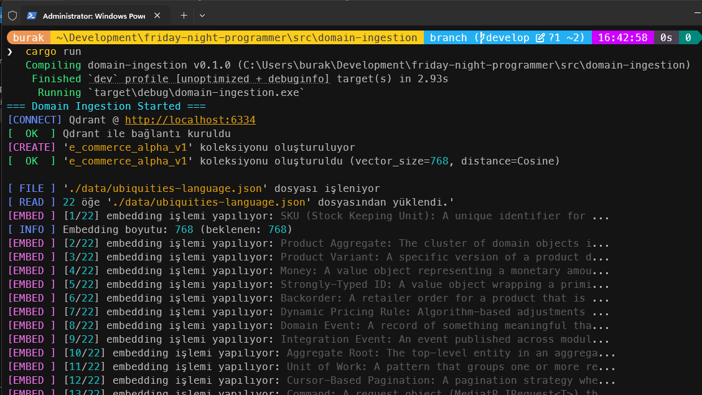
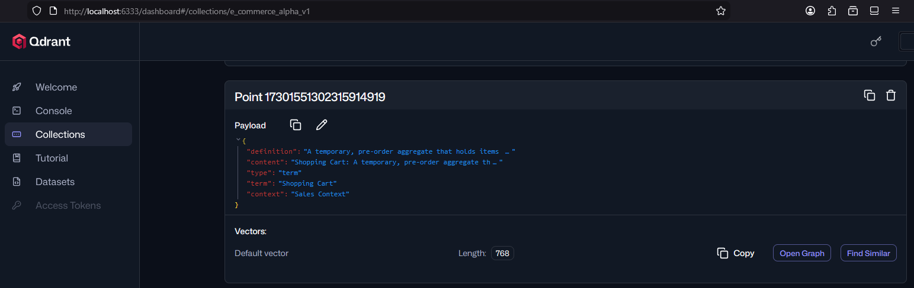
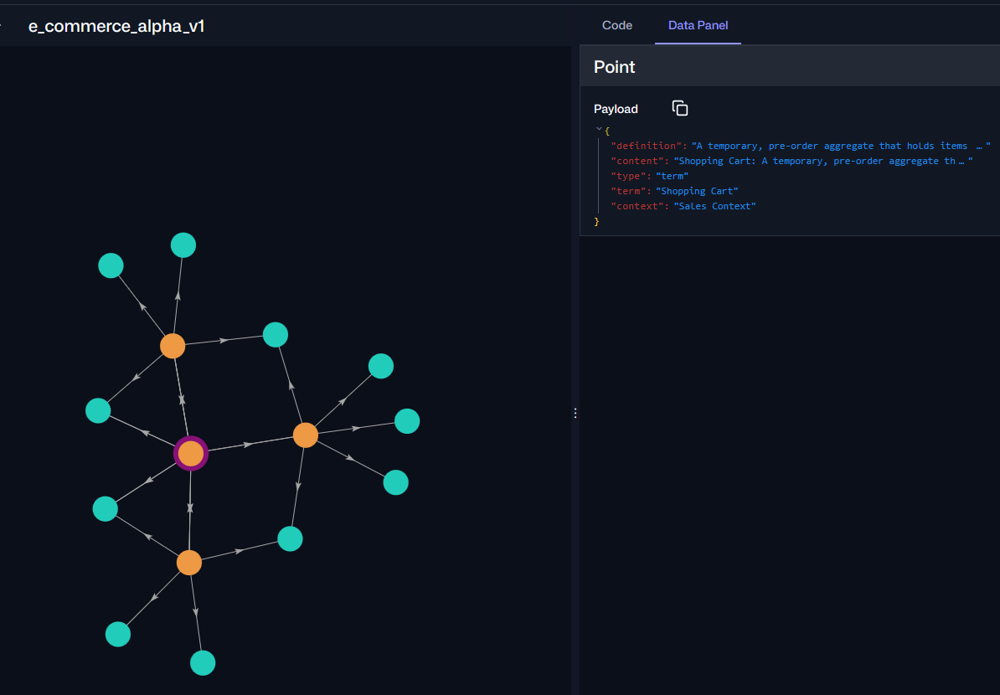

# RAG - Retrieval Augmented Generation İçin Hazırlıklar

Senaryom şöyle; Mimari tasarımı, domain yapısı belli olan bir çözümde Copilot ajanlarını kullanırken yapılan geliştirme/analiz taleplerinde genel dil modelinin RAG ile çizilen çerçeve içerisinde kalmasını sağlamak ve beklentilere en yakın sonuçları yakalamak. Örneğin github üzerinde geliştirdiğimiz büyük çaplı DDD *(Domain Driven Design)* ile uyumlu bir projeye Senior Software Developer/Business Analyst gibi rolleri tanımlanmış vekil botlar tanımladığımızı düşünelim. Bu botlardan Copilot yardımıyla bir şeyler yapmasını istediğimizde bizim belirlediğimiz kapsam içerisinde hareket etmesini sağlamak için bir RAG düzeneğine ihtiyacımız olacak. Bu düzenek içinse bazı ön hazırlıklara ihtiyacımız var.

En önemli kısımlardan birisi terimler arası ilişkilerin tespiti, matematiksel olarak ifade edilebilmesi ve yakınlıklarının tespiti. Özellikle markdown tabanlı içeriklerin olduğu *spec-oriented* temelli içeriklerde Text Embedding mekanizması ile - [ki şurada bir girizgah yapmıştım](Embedding.md) bu ilişkiler kolayca hesaplanabiliyor. Bu çalışmadaki amacım mimari tasarım, domain dili ve semantik bağlamların bulunduğu JSON tabanlı veri içeriklerini embedding hesaplamalarını da yaptırarak vektörel bir veritabanına almak. Bu RAG tesisatı için ilk adım olarak da düşünülebilir.

## Qdrant Veritabanı

Vektör tabanlı veritabanı olarak **Rust** ile yazılmış [Qdrant](https://qdrant.tech/documentation/overview/)'ı tercih ediyorum *(Github reposu da [şurada](https://github.com/qdrant/qdrant)* Rust ile yazılmış olması yüksek performans ve güvenilir bir bellek kullanımı getiriyor. Ayrıca **REST** ve **gRPC** protokollerini destekleyen API hizmeti ve kullanışlı bir arayüzü var. *(Alternatif olarak **Memcached** veritabanı da tercih edilebilir)* Pek tabii sistemimi kirletmek istemediğimden bir docker imajı kullanacağım. Bu yüzden hali hazırda bu repoya tahsis ettiğim [docker-compose](../docker-compose.yml) dosyasına aşağıdaki servis tanımını ekledim.

```yaml
services:

# Diğer servisler...

  qdrant:
    image: qdrant/qdrant
    ports:
      - "6333:6333" # REST API Portu
      - "6334:6334" # GRPC Portu
    volumes:
      - qdrant_storage:/qdrant/storage
    restart: always
    networks:
      - fnp-network

volumes:
  qdrant_storage:
  # Diğer volume tanımları...
networks:
  fnp-network:
    driver: bridge
```

Hemen kendime bir not düşeyim. FNP docker dosyasyında birçok servis tanımlı ama şu anda sadece qdrant servisini çalıştırmak istiyorum. Bunun için aşağıdaki terminal koutunu kullanabiliriz.

```bash
docker compose up -d qdrant
```

## Text Embedding için Local Dil Modeli

Normal şartlarda büyük dil modelleri ile çalışırken API'ler üzerinden ilerliyoruz. Ücretli modellerde API key'leri kullanarak hareket ediyoruz. Ancak bu deneysel ve öğrenme amaçlı çalışmada ücretsiz dil modellerini yerel bilgisayarda çalıştırarak da ilereleyebiliriz. Senaryoda bize **text embedding** için kullanabileceğimiz bir dil modeli lazım. Ben kişisel bilgisayarımda [LM Studio](https://lmstudio.ai/) arabirimini kullanıyorum. Model olarak da **Nomic Embed Text** dil modelini tercih ettim. 85 Megabyte'tan küçük bir dil modeli. Tabii bunu kullanabilmek için LM Studio'da Local Server'ı başlatmak ve Nomic dil modelini yüklemek gerekiyor. Kabaca aşağıdaki gibi bir arabirime ulaşmamız lazım.


## Örnek Veriler

Normal şartlarda projenin daha önceden yazılmış markdown dokümanları yine bir AI modelinden yararlanarak embedding için gerekli girdiye dönüştürülebilir. Yani, Claude Sonnet'den Opus'tan veya Gemini'dan ya da muadillerinden yararlarank dokümanları taraması ve mimari, domain dili ve diğer semantik bağlamlara göre bölümlere ayırarak embedding için hazır hale getirilmesi istenebilir. Ben bu öğreti çerçevesinde örnek üç json dokümanı ile ilerleyeceğim.

Örnekte bir e-ticaret sitesini baz alıyorum. Elbette kocaman domain'i ele almak çok zor. Küçük bir alanı değerlendirmek öğretinin sağlıklı yürümesi açısından kritik. Sadece ürün yönetim sürecini göz önüne alabiliriz mesela. Buna bağlı olarak üç doküman hazırlayacağız. Domain jargonu için büyük önem arz eden [ubiquities-language](../src/domain-ingestion/data/ubiquities-language.json), yazılım mimarisinin temellerini tarifleyen [architecture-rules](../src/domain-ingestion/data/architecture-rules.json) ve kod tarafındaki semantik ilişkilerin tanımlandığı [semantic-code-chunks](../src/domain-ingestion/data/semantic-code-chunks.json).

**ubiquities-language.json:** Projede kullanılan terimlerin tanımlarını ve birbirleriyle ilişkilerini içeren bir json dosyası. Aşağıdaki gibi basit bir içerik düşünebiliriz. Burada terim, terimin açıklaması ve dahil olduğu kapsam belirtilir. Gerçek dünya senaryolarında bu içerik daha da geniş olabilir. İlişkiler detaylandırılabilir ve iş kuralları işlenebilir. Buradan hareketle vektör veritabanına alınacak olan domain bilgisi, AI vekillerinin çizilen çerçeve sınırları içerisinde analizler hazırlayabilmesine de olanak sağlar.

```json
[
  {
    "term": "SKU (Stock Keeping Unit)",
    "definition": "A unique identifier for each distinct product and service that can be purchased. Represents the specific variation (e.g., T-Shirt, Red, Large).",
    "context": "Inventory & Catalog Context"
  },
  {
    "term": "Product Aggregate",
    "definition": "The cluster of domain objects including Product, ProductVariants, and ProductAttributes that are treated as a single unit for data changes.",
    "context": "Domain Core"
  },
  {
    "term": "Backorder",
    "definition": "A retailer order for a product that is temporarily out of stock. The customer can purchase it, but shipment is delayed.",
    "context": "Sales & Inventory"
  },
  {
    "term": "Dynamic Pricing Rule",
    "definition": "Algorithm-based adjustments to product prices based on real-time supply and demand, competitor pricing, or customer segments.",
    "context": "Marketing Context"
  }
]
```

**architecture-rules.json:** Bu veri setinde ise projenin mimari tasarımı ile ilgili bir bağlam işlenir. Mimari model, kullanılan dil, verinin hangi strateji ile depolanacağı, servis haberleşme türleri, domain nesne kurguları gibi AI vekillerinin işini olabildiğince kolaylaştıracak detaylar verilir. Örneğin;

```json
[
  {
    "rule_id": "ARCH-001",
    "category": "Modular Monolith",
    "description": "Modules must be loosely coupled. Cross-module communication must occur only via public contracts or domain events/integration events using MassTransit.",
    "enforcement": "Strict"
  },
  {
    "rule_id": "NET-009",
    "category": "Language Features",
    "description": "Use C# 12/13 Primary Constructors for all Dependency Injection in Controllers and Services to reduce boilerplate code.",
    "enforcement": "Recommended"
  },
  {
    "rule_id": "DATA-002",
    "category": "Persistence",
    "description": "Entity Framework Core DbContexts must be internal to their specific module. No shared DbContext is allowed across modules.",
    "enforcement": "Strict"
  },
  {
    "rule_id": "API-005",
    "category": "REST API",
    "description": "All list endpoints must support cursor-based pagination to handle large datasets efficiently.",
    "enforcement": "Mandatory"
  }
]
```

**semantic-code-chunks:** Burası tamamen kod tabanı ile ilgilidir. Metotların imzaları, servis tanımları, enstrümanların türleri ve onları tanımlayan tag'lara yer verilebilir. Örneğin;

```json
[
  {
    "file_name": "Product.cs",
    "type": "Domain Entity",
    "content": "public class Product : AggregateRoot<ProductId>\n{\n    public string Name { get; private set; }\n    public Money Price { get; private set; }\n    private readonly List<ProductVariant> _variants = new();\n    public IReadOnlyCollection<ProductVariant> Variants => _variants.AsReadOnly();\n\n    // .NET 9 / C# 12 Primary Constructor usage in static factory\n    public static Product Create(string name, Money price)\n    {\n        var product = new Product { Id = new ProductId(Guid.NewGuid()), Name = name, Price = price };\n        product.AddDomainEvent(new ProductCreatedEvent(product.Id));\n        return product;\n    }\n}",
    "tags": ["ddd", "aggregate", "entity-framework"]
  },
  {
    "file_name": "GetProductDetails.razor.cs",
    "type": "Razor Page Model",
    "content": "public class GetProductDetailsModel(IProductService productService) : PageModel\n{\n    [BindProperty(SupportsGet = true)]\n    public Guid Id { get; set; }\n    public ProductDto Product { get; set; }\n\n    public async Task OnGetAsync()\n    {\n        Product = await productService.GetByIdAsync(Id);\n    }\n}",
    "tags": ["frontend", "razor-pages", "primary-constructor"]
  },
  {
    "file_name": "ProductConfiguration.cs",
    "type": "EF Core Config",
    "content": "public class ProductConfiguration : IEntityTypeConfiguration<Product>\n{\n    public void Configure(EntityTypeBuilder<Product> builder)\n    {\n        builder.HasKey(p => p.Id);\n        builder.Property(p => p.Id).HasConversion(id => id.Value, value => new ProductId(value));\n        builder.OwnsOne(p => p.Price, price => \n        {\n            price.Property(m => m.Amount).HasColumnName(\"PriceAmount\");\n            price.Property(m => m.Currency).HasColumnName(\"PriceCurrency\").HasMaxLength(3);\n        });\n    }\n}",
    "tags": ["database", "ef-core", "value-object"]
  }
]
```

### Aktarım Uygulaması

Bu JSON veri setleri JSON veri seti olmak zorunda değil elbette :D Ancak içerideki tanımlamalar kritik. Bağlamları anlamlı şekilde ifade etmenin bir yolu olarak her parçanın kendi içinde farklı nitelikleri *(attribute)* var. Bunlar vektör enstrümanları ile inşa edilen hafifsiklet sinir ağındaki boğumlar arası ilişkilerin kurgulanmasında rol oynayacak. Şimdi bu veri setlerini işleyip, **QDrant** veritabanına alacak uygulamayı yazmaya başlayabiliriz. Ben bunun için **Rust** ile ilerlemeyi düşünüyorum zira oldukça iyi **crate**'lere sahip. Dolayısıyla Rust uygulamasının **toml** içeriği aşağıdaki bağımlılıkları içermeli.

```toml
[dependencies]
anyhow = "1.0.101"
qdrant-client = "1.16.0"
reqwest = { version = "0.13.2", features = ["json"] }
serde = { version = "1.0.228", features = ["derive"] }
serde_json = "1.0.149"
tokio = { version = "1.49.0", features = ["full"] }
```

Hata yönetimini etkili şekilde yapmak için **anyhow**'u, **Qdrant** veritabanı ile iletişim için **qdrant-client**'i, **JSON** verilerini işlemek için **serde** ve **serde_json**'u, asenkron operasyon desteği sağlamak için de **tokio** küfelerini kullanacağız. Ayrıca **embedding** hesaplamaları için de LM Studio'nun API'sine istek atmamız gerekiyor ki bunun amaçla **reqwest** küfesini kullanacağız. Uygulama kodlarımızı da aşağıdaki gibi geliştirebiliriz.

```rust
/*
    Bir e-ticaret projesine ait alan bilgilerin (ubiquitous language,
    mimari kurallar, kod parçacıkları) LM Studio üzerinden embedding vektörlerine
    çevrilerek Qdrant vektör veritabanına yüklenmesini ele alıyoruz.

    Kod akışı tam olarak şöyle;
    JSON dosyası oku -> Her kayıt için embedding hesapla -> Qdrant db'ye ekle
*/

// anyhow: Rust'ta hata yönetimini kolaylaştıran bir kütüphane.
// Result<()> dönüş tipi ile farklı hata türlerini tek bir yerde toplayabiliriz.
use anyhow::Result;

// colored: Terminal çıktılarını renkli hale getirmek için kullanıyoruz.
use colored::Colorize;

// qdrant_client: Qdrant vektör veritabanının Rust istemcisi.
// Qdrant  -> Veritabanı bağlantı nesnesi
// Payload -> Her bir vektör noktasına eklenebilen metadata (JSON benzeri key-value)
use qdrant_client::{Qdrant, Payload};
use qdrant_client::qdrant::{
    CreateCollectionBuilder, 
    Distance,                
    PointStruct,             
    VectorParams,            
    VectorsConfig,           
    vectors_config::Config, 
};

// serde: Serileştirme işlemleri için
use serde::{Deserialize, Serialize};

use std::fs;
use std::collections::hash_map::DefaultHasher;
use std::hash::{Hash, Hasher};

// Qdrant'taki koleksiyon adı. Tüm veri setleri bu koleksiyona yüklenir.
const COLLECTION_NAME :&str = "e_commerce_alpha_v1";
// LM Studio'nun OpenAI uyumlu embedding API adresi.
const LM_STUDIO_API_URL :&str = "http://localhost:1234/v1/embeddings";
// Kullanılan embedding modeli. Bu model metni sayısal vektörlere dönüştürür.
const TEXT_MODEL :&str ="text-embedding-nomic-embed-text-v1.5";

// Modelin ürettiği vektör boyutu. Bu değer modelden modele değişir.
// nomic-embed-text-v1.5 varsayılan olarak 768 boyutlu vektörler üretir.
const VECTOR_SIZE :usize = 768;

#[tokio::main]
async fn main() -> Result<()> {
    println!("{}", "=== Domain Ingestion Started ===".bold().cyan());

    // Qdrant bağlantısı tesis ediliyor.
    // gRPC protokolü üzerinden bağlanıyoruz (port 6334).
    // REST API için 6333 portu kullanılabilir (dashboard vs.)
    println!("{} Qdrant @ {}", "[CONNECT]".bold().blue(), "http://localhost:6334".yellow());
    let client = Qdrant::from_url("http://localhost:6334").build()?;
    println!("{} Qdrant ile bağlantı kuruldu", "[  OK  ]".bold().green());

    /*
        Sırada koleksiyon oluşturma işlemleri var.
        Koleksiyon zaten varsa tekrar oluşturmaya gerek yok.
        Yoksa, vektör boyutu ve mesafe metriği belirterek(ki burada kosinüs hesaplaması) 
        yeni bir koleksiyon oluşturuyoruz.
    */
    if !client.collection_exists(COLLECTION_NAME).await? {
        println!("{} '{}' koleksiyonu oluşturuluyor", "[CREATE]".bold().magenta(), COLLECTION_NAME.yellow());
        client
            .create_collection(
                CreateCollectionBuilder::new(COLLECTION_NAME)
                    .vectors_config(VectorsConfig {
                        // Config::Params tek bir vektör alanı tanımlar.
                        // Birden fazla vektör alanı için Config::ParamsMap kullanılır.
                        config: Some(Config::Params(VectorParams {
                            size: VECTOR_SIZE as u64,
                            // Cosine benzerliği: Metin embedding'leri için en yaygın mesafe ölçümü.
                            // 1.0 = tam benzer, 0.0 = ilişkisiz, -1.0 = tam zıt
                            distance: Distance::Cosine.into(),
                            ..Default::default()
                        })),
                    })
                    .build(),
            )
            .await?;
        println!("{} '{}' koleksiyonu oluşturuldu (vector_size={}, distance=Cosine)",
            "[  OK  ]".bold().green(), COLLECTION_NAME.yellow(), VECTOR_SIZE.to_string().cyan());
    } else {
        println!("{} '{}' koleksiyonu zaten mevcut, oluşturma atlanıyor",
            "[ SKIP ]".bold().yellow(), COLLECTION_NAME.yellow());
    }

    // Son olarak veri dosyalarını sırayla işleme alıyoruz.
    execute_file("./data/ubiquities-language.json", &client).await?;
    execute_file("./data/architecture-rules.json", &client).await?;
    execute_file("./data/semantic-code-chunks.json", &client).await?;

    println!("{}", "=== Tüm veriler işlendi ===".bold().cyan());
    Ok(())
}

/* 
    LM Studio'dan dönen yanıttaki tek bir embedding sonucunu ifade eder
    Her metin için bir embedding vektörü (f32 dizisi) döner.
*/
#[derive(Deserialize)]
struct EmbeddingData {
    embedding: Vec<f32>
}

// LM Studio API'sine gönderilen istek gövdesi. OpenAI /v1/embeddings endpoint ile uyumludur.
#[derive(Serialize)]
struct EmbeddingRequest {
    input:String,   // Embedding'i hesaplanacak metin
    model:String    // Kullanılacak modelin adı
}

// LM Studio API'sinden dönen yanıt. data dizisi içinde bir veya birden fazla EmbeddingData bulunur.
#[derive(Deserialize)]
struct EmbeddingResponse {
    data: Vec<EmbeddingData>
}


/*
    Üç farklı JSON dosyası var. Buradaki veri yapılarını tek bir enum altında birleştiriyoruz.
    untagged flag'i sebebiyle serde, JSON nesnesinin alanlarına bakar ve
    hangi variant için deserialize işlemi yapacağına otomatik karar verir.
*/
#[derive(Deserialize, Debug)]
#[serde(untagged)]
enum DataSource {
    UbiqLang {term:String,definition:String,context:String},
    ArchRule {rule_id:String, category:String,description:String},
    CodeSemantic {file_name:String,content:String,tags:Vec<String>},
}


// LM Studio API'sini çağırarak verilen metnin embedding vektörünü hesaplar.
async fn get_embedding(client:&reqwest::Client, input: &str) -> Result<Vec<f32>> {
    let request_body = EmbeddingRequest {
        input: input.to_string(),
        model: TEXT_MODEL.to_string(),
    };

    let response = client.post(LM_STUDIO_API_URL)
        .json(&request_body)
        .send()
        .await?;

    if response.status().is_success() {
        let embedding_response: EmbeddingResponse = response.json().await?;
        Ok(embedding_response.data.into_iter().next().unwrap().embedding)
    } else {
        let status = response.status();
        eprintln!("{} Embedding API call failed with status: {}",
            "[ FAIL ]".bold().red(), status.to_string().red());
        Err(anyhow::anyhow!("Embedding API çağrısı başarısız oldu: {}", status))
    }
}

/* 
    Veri kaynağı öğesini ayrıştırarak iki şey üretir. 
    Embedding için kullanılacak birleştirilmiş metin ve Qdrant'a kaydedilecek payload (metadata)
    Payload, vektör araması sonucunda dönen noktalardaki ek bilgileri taşır.
    Böylece sadece benzer vektörleri bulmakla kalmaz, her noktanın ne olduğunu (terim mi, kural mı, kod mu) ve detaylarını da görebiliriz.
*/
fn parse_data(item: &DataSource) -> (String, Payload) {
    let mut payload = Payload::new();
    match item {
        // Ubiquitous Language: Terim + tanım birleştirilerek embedding metni oluşturulur
        DataSource::UbiqLang { term, definition, context } => {
            let text = format!("{}: {}", term, definition);
            payload.insert("type", "term");
            payload.insert("term", term.clone());
            payload.insert("definition", definition.clone());
            payload.insert("context", context.clone());
            payload.insert("content", text.clone());
            (text, payload)
        }
        // Architecture Rule: Kural ID + kategori + açıklama birleştirilir
        DataSource::ArchRule { rule_id, category, description } => {
            let text = format!("{} [{}]: {}", rule_id, category, description);
            payload.insert("type", "rule");
            payload.insert("rule_id", rule_id.clone());
            payload.insert("category", category.clone());
            payload.insert("description", description.clone());
            payload.insert("content", text.clone());
            (text, payload)
        }
        // Code Semantic: Kod içeriğinin kendisi doğrudan embedding metni olarak kullanılır
        DataSource::CodeSemantic { file_name, content, tags } => {
            payload.insert("type", "code");
            payload.insert("file_name", file_name.clone());
            payload.insert("content", content.clone());
            payload.insert("tags", tags.clone());
            (content.clone(), payload)
        }
    }
}

/*
    Kaynak dosya adı ve index'ten deterministik (tekrarlanabilir) bir u64 ID üretir
    ve bir Qdrant noktası (PointStruct) oluşturur. Deterministik olduğu için aynı veri 
    tekrar yüklendiğinde aynı ID üretilir. Dolayısıyla Qdrant'taki upsert(update veya insert)
    işlemi mevcut noktayı günceller veri tekrarı yapılmamış olur.
*/
fn create_qdrant_point(
    source: &str,
    index: usize,
    embedding: Vec<f32>,
    payload: Payload,
) -> PointStruct {
    let mut hasher = DefaultHasher::new();
    source.hash(&mut hasher);
    index.hash(&mut hasher); 
    let id = hasher.finish();

    PointStruct::new(id, embedding, payload)
}

// JSON dosyasını okur, her kaydı embedding'e çevirir ve Qdrant db'ye toplu olarak yükler.
async fn execute_file(file_name: &str, client: &Qdrant) -> Result<()> {
    println!("\n{} '{}' dosyası işleniyor", "[ FILE ]".bold().blue(), file_name.yellow());

    let file_content = fs::read_to_string(file_name)?;
    let data_items: Vec<DataSource> = serde_json::from_str(&file_content)?;
    println!("{} {} öğe '{}' dosyasından yüklendi.'",
        "[ READ ]".bold().blue(), data_items.len().to_string().cyan(), file_name.yellow());

    let http_client = reqwest::Client::new();
    let mut points = Vec::new();
    let total = data_items.len();

    for (i, item) in data_items.iter().enumerate() {
        let (text_to_embed, payload) = parse_data(item);
        let preview: String = text_to_embed.chars().take(50).collect();
        println!("{} [{}/{}] embedding işlemi yapılıyor: {}...",
            "[EMBED ]".bold().magenta(), (i + 1).to_string().cyan(), total.to_string().cyan(), preview.dimmed());
        let embedding = get_embedding(&http_client, &text_to_embed).await?;

        if i == 0 {
            println!("{} Embedding boyutu: {} (beklenen: {})",
                "[ INFO ]".bold().blue(),
                embedding.len().to_string().cyan(),
                VECTOR_SIZE.to_string().cyan());
            if embedding.len() != VECTOR_SIZE {
                eprintln!("{} Embedding boyutu uyuşmuyor! Model {} boyut döndürdü ama koleksiyon {} boyut bekliyor.",
                    "[ WARN ]".bold().red(),
                    embedding.len().to_string().red(),
                    VECTOR_SIZE.to_string().red());
            }
        }
        let point = create_qdrant_point(file_name, i, embedding, payload);
        points.push(point);
    }

    // Upsert: Insert + Update birleşimi. Aynı ID'ye sahip nokta varsa günceller, yoksa yeni ekler.
    println!("{} {} points '{}' koleksiyonuna ekleniyor",
        "[UPSERT]".bold().blue(), total.to_string().cyan(), COLLECTION_NAME.yellow());
    client
        .upsert_points(
            qdrant_client::qdrant::UpsertPointsBuilder::new(
                COLLECTION_NAME.to_string(),
                points,
            )
            .build(),
        )
        .await?;
    println!("{} '{}' işlendi ve yüklendi ({} points)",
        "[  OK  ]".bold().green(), file_name.yellow(), total.to_string().cyan());
    
    Ok(())
}
```

## Çalışma Zamanı

Programı aşağıdaki gibi çalıştırabiliriz.

```bash
cargo run
```

Her şey yolunda giderse terminalde aşağıdaki gibi bir çıktı görmeliyiz.



Bu işlemlerin ardından [Qdrant web arayüzüne](http://localhost:6334/dashboard) geçebiliriz. Ben sistemde aşağıdaki sonuçlara ulaştım.

Koleksiyonun başarılı şekilde oluştuğunu gözlemleyebiliriz.


Detayına girip eklenen vektörlerin detaylarına bakabiliriz. Bizim eklediğimiz içerikler yer alacaktır.



İşin güzel ve etkileyici kısmı ise bu vektörlerin birbirleriyle olan ilişkilerinin de ortaya çıkmasıdır. Böylece birbirlerine yakın ilişkide olan kavramların domain, kod ve mimari bağlamda daha net görebiliriz.



Artık elimizde çok ilkel de olsa AI vekilleri tarafından kullanılabilecek bir vektör veritabanı bulunuyor. Sonraki süreçte bu veritabanını da işin içerisine katıp bir RAG düzeniği kurarak AI vekillerinin bu veritabanından yararlanarak analizler yapmasını sağlayabiliriz. Ama önce o kısımları öğrenmem gerekiyor.

## Notlar

Denemeler sırasında var olan koleksiyonu silmem icap etti. QDrant bir API noktası sağladı için bu oldukça kolay. Aşağıdaki **curl** komutu ile yapabiliriz.

```bash
curl -X DELETE http://localhost:6333/collections/e_commerce_alpha_v1
```
