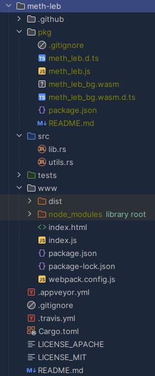

# Rust ile WASM Kullanımı

WASM ya da WebAssembly enstrümanının yüksek performanslı web uygulamaları geliştirilmesinde önemli bir yeri var. Bu dokümanda basit bir örnek üzerinden Rust ve WASM kullanımlarını ele alacağız. Örnek senaryomuzda bir web sayfasında parabol çizimi gerçekleştireceğiz. Takriben aşağıdaki ekran görüntüsündekine benzer bir uygulama oluşacak.


Ekran görüntüsünden de fark edileceği üzere kullanıcı isterse hazır formüllerden seçebilir ya da kendi değerlerini girerek bir çizim gerçekleştirebilir. Örnekte girilen değerlere göre verilen aralıktaki x,y çiftlerini hesaplayan formül Rust tarafındaki bir fonksiyonda yer alır. Web uygulaması bu rust fonksiyonunu içeren modülün WASM için derlenmiş versiyonunu kullanır.

---

## Ön Gereklilikler _(Prerequisites)_

Sistemimizde Rust'ın yüklü olduğunu varsayarak devam edebiliriz ama değilse [şuraya](https://rust-lang.org) uğramakta yarar var.

1. **wasm-pack:** Bu araç wasm paketlerinin oluşturulması ve wasm uyumlu rust projesi oluşturulmasında yardımcı olacak bir araç. cargo aracı ile sistemimize kurabiliriz.

   ```bash
   cargo install wasm-pack
   ```

2. **Node.js and npm:** Sonuçta bir web arayüzü var ve bunun servis edilmesi için bir runtime gerekiyor. Burada node.js ve npm işimize yarar. Bunların kurulumları içinse nereye bakmanız gerektiğini biliyorsunuz ;) [İşte buraya](https://nodejs.org).
3. **Webpack:** Birde web paketlerinin build edilmesi, sunucunun başlatılması gibi işlerde bize yardımcı olacak webpack aracına ihtiyacımız var. Bunu projede www klasörünü oluşturduktan sonra kuracağız. Yani aşağıdaki adımları takip etmeye devam edelim.

---

## Proje Kurulumu

### Adım 1: WASM destekli yeni bir Rust projesi oluşturarak işe başlıyoruz.

```bash
wasm-pack new meth-leb
cd meth-leb
```

Bu işlemin ardından Cargo.toml dosyasını kontrol etmekte yarar var. Özellikle dependencies kısmında wasm-bindgen modülünün eklenmiş olması gerekiyor. Bu modül wasm ve js arasındaki iletişimde önemli bir role de sahip.

```toml
[dependencies]
wasm-bindgen = "0.2"
```

### Adım 2: Gerekli Rust fonksiyonunun oluşturulması

Bunun için lib.rs dosyasına aşağıdaki fonksiyonu ekleyebiliriz.

```rust
use wasm_bindgen::prelude::*;

#[wasm_bindgen]
pub fn calculate_parabola(
    a: f64,
    b: f64,
    c: f64,
    x_min: f64,
    x_max: f64,
    steps: usize,
) -> Vec<f64> {
    let mut points = Vec::new();
    let step_size = (x_max - x_min) / steps as f64;
    let mut x = x_min;

    for _ in 0..=steps {
        let y = a * x * x + b * x + c;
        points.push(x);
        points.push(y);
        x += step_size;
    }

    points
}
```

Kodlarımızı tamamladıktan sonra ise wasm-pack ile gerekli paketleri oluşturabiliriz.

```bash
wasm-pack build --target web
```

Bu işlem sonrasında pkg isimli bir klasör oluşur ve içeriği takriben aşağıdaki gibidir.


Gayet iyi gidiyoruz, haydi devam ;)

---

### Adım 3: Frontend Tarafının İnşaası

WASM modüllerini kullanacak önyüz tarafının geliştirilmesine başlayabiliriz. Bunun için root klasör altında www isimli başka bir klasör oluşturup içerisinde nodejs ortamının hazırlanması gerekiyor.

```bash
mkdir www
cd www

# node initialize işlemleri (Bir Package.json oluşturur)
npm init -y

# Webpack modüllerinin yüklenmesi
npm install --save-dev webpack webpack-cli webpack-dev-server copy-webpack-plugin
```

Bu adımlardan sonra package.json dosyasının aşağıdaki gibi olmasini sağlayalım.

```json
{
  "name": "parabola-math",
  "version": "1.0.0",
  "description": "Rust + WASM ile parabol çizimi örneği",
  "main": "index.js",
  "scripts": {
    "start": "webpack serve --open",
    "build": "webpack"
  },
  "author": "Burak Selim Senyurt",
  "license": "MIT",
  "devDependencies": {
    "webpack": "^5.97.1",
    "webpack-cli": "^5.0.1",
    "webpack-dev-server": "^5.2.0"
  },
  "dependencies": {
    "copy-webpack-plugin": "^12.0.2"
  }
}

```

---

### Adım 4: Webpack Konfigurasyon Ayarları

www klasörü altında webpack.config.js isimli bir dosya oluşturup içeriğini aşağıdaki gibi tamamlayalım. Bu çok standart bir içeriktir ama dikkat edilmesi gereken bazı noktalar vardır. Örneğin belli bir sürümden sonra WASM kullanımı varsayılan olarak kapalıdır ve bu yüzden experiments isimli bölümün eklenmiş olması gerekir. Modül çıktıları module.exports bölümünde ayarlanır ve biraz sonra oluşturacağımız index.js' in bundle.js içerisine alınması söz konusudur. Genellikle birden fazla javascript dosyası söz konusu ise tek bir bundle.js içerisine konuşlandırılması önerilmektedir. HTML dosyalarının deployment ortamına taşınması işinide CopyWebpackPlugin üstlenir. Örneğimize development ortamında geliştirilmekte olup 5555 nolu porttan yayın yapacaktır.

```javascript
const path = require("path");
const CopyWebpackPlugin = require("copy-webpack-plugin");

module.exports = {
    entry: "./index.js",
    output: {
        path: path.resolve(__dirname, "dist"),
        filename: "bundle.js",
    },
    mode: "development",
    plugins: [
        new CopyWebpackPlugin({
            patterns: [{from: "index.html", to: "index.html"}],
        }),
    ],
    devServer: {
        static: "./dist",
        port: 5555,
        open: true,
    },
    experiments: {
        asyncWebAssembly: true,
    },
};
```

---

### Adım 5: HTML Dosyasının Oluşturulması

Yine www klasörü içerisinde index.html isimli bir dosya oluşturulur.

```html
<html>
<head>
    <title>Parabola Drawer</title>
    <style>
        body {
            font-family: "Times New Roman", sans-serif;
            margin: 25px;
        }

        form {
            margin-bottom: 25px;
        }

        canvas {
            border: 2px solid black;
        }
    </style>
</head>
<body>
<h1>Parabola Drawer</h1>
<h2>y = ax² + bx + c</h2>
<p>Fun with math :) Select a predefined parabola or use your values to draw your own parabola.</p>

<form id="form">
    <p>
        <label for="examples">Practical Samples:</label>
        <select id="examples">
            <option value="default" disabled selected>Some parabolas</option>
            <option value="1,0,0,-10,10,100">y = x²</option>
            <option value="2,0,0,-5,5,100">y = 2x²</option>
            <option value="-1,0,0,-10,10,100">y = -x²</option>
            <option value="1,-6,9,-1,7,100">y = (x-3)²</option>
            <option value="1,0,-4,-3,3,100">y = x² - 4</option>
            <option value="1,3,2,-4,1,100">y = x² + 3x + 2</option>
            <option value="-0.5,2,-1,-2,6,100">y = -0.5x² + 2x - 1</option>
            <option value="1,4,4,-6,2,100">y = (x+2)²</option>
        </select>
    </p>

    <p>
        <label for="a">a:</label>
        <input type="number" id="a" step="any" required>
        <label for="b">b:</label>
        <input type="number" id="b" step="any" required>
        <label for="c">c:</label>
        <input type="number" id="c" step="any" required>
    </p>
    <p>
        <label for="x_min">x_min:</label>
        <input type="number" id="x_min" step="any" required>
        <label for="x_max">x_max:</label>
        <input type="number" id="x_max" step="any" required>
        <label for="steps">Steps:</label>
    </p>
    <p>
        <input type="number" id="steps" value="100" required>
        <button type="submit">Draw</button>
    </p>
</form>

<canvas id="canvas" width="800" height="600"></canvas>

<script type="module" src="bundle.js"></script>
</body>
</html>
```

---

### Adım 6: Javascript Dosyasının Oluşturulması

index.html, çizim işlemlerinin yapılması ve gerekli fonksiyon çağrıları için index.js dosyasını kullanır. Bu dosyayı da www klasörü içerisinde oluşturmamız gerekir. İçeriğini aşağıdaki gibi kodlayabiliriz. Burada dikkat edilmesi gereken noktalardan birisi meth_leb.js isimli modülün eklenmiş olması ve içerisindeki calculate_parabola fonksiyonunun kullanılmasıdır.

```javascript
import init, {calculate_parabola} from "../pkg/meth_leb.js";

async function main() {

    await init();

    const form = document.getElementById("form");
    const canvas = document.getElementById("canvas");
    const context = canvas.getContext("2d");
    const dropdown = document.getElementById("examples");

    function draw(a, b, c, x_min, x_max, steps) {

        const points = calculate_parabola(a, b, c, x_min, x_max, steps);

        context.clearRect(0, 0, canvas.width, canvas.height);
        context.beginPath();
        context.moveTo((points[0] - x_min) * 50, 300 - points[1] * 50);

        for (let i = 2; i < points.length; i += 2) {
            const x = (points[i] - x_min) * 50;
            const y = 300 - points[i + 1] * 50;
            context.lineTo(x, y);
        }

        context.stroke();
    }

    dropdown.addEventListener("change", (event) => {
        const [a, b, c, x_min, x_max, steps] = event.target.value.split(",").map(Number);
        draw(a, b, c, x_min, x_max, steps);
    });

    form.addEventListener("submit", (event) => {
        event.preventDefault();

        const a = parseFloat(document.getElementById("a").value);
        const b = parseFloat(document.getElementById("b").value);
        const c = parseFloat(document.getElementById("c").value);
        const x_min = parseFloat(document.getElementById("x_min").value);
        const x_max = parseFloat(document.getElementById("x_max").value);
        const steps = parseInt(document.getElementById("steps").value);

        draw(a, b, c, x_min, x_max, steps);
    });
}

main().catch((error) => console.error("Error on loading wasm module.", error));
```

meth_leb.js içerisine üretilmiş olan calculate_parabola fonksiyonu aşağıdaki gibi otomatik olarak üretilmiştir. wasm-pack derleme adımlarımızı hatırlayalım. Burada dikkat edileceği üzere wasm modülü üstünden calculate_parabola metodu çağırılır ki bu metot rust tarafında yazmış olduğumuz metottur.

```javascript
export function calculate_parabola(a, b, c, x_min, x_max, steps) {
    const ret = wasm.calculate_parabola(a, b, c, x_min, x_max, steps);
    var v1 = getArrayF64FromWasm0(ret[0], ret[1]).slice();
    wasm.__wbindgen_free(ret[0], ret[1] * 8, 8);
    return v1;
}
```

---

### Adım 7: Build İşlemleri ve Projenin Çalıştırılması

Bu ana kadar yapılan işlemlere göre proje klasör yapısı aşağıdaki şekilde görüldüğü gibi olmalıdır.



```bash
# www klasöründeyken
# build işlemi
npm run build

# Projenin çalıştırılması
npm run start
```

Eğer build aşamasında bir sorun olmadıysa [localhost:5555](http://localhost:5555) adresine gidilebilir ve parabol çizimlerine bakılabilir.

---

Proje tabii ki daha da iyileştirilebilir. Örneğin denklem değerleri değiştikçe parabölün anlık olarak değişmesi, farklı denklem türlerine göre Rust tarafında farklı metotların entegre edilmesi, önyüzde bir x,y koordinat ekseninin eklenmesi, bootstrap ile önyüzün daha kullanıcı dostu haline getirilmesi düşünülebilir.
