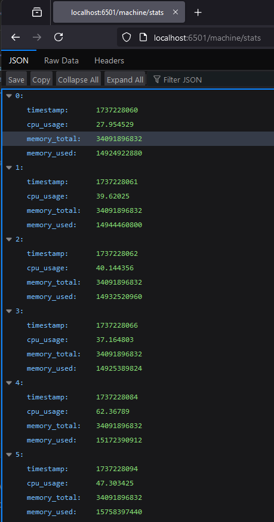

# Rust ile WASM Kullanımı Round II

Bu sefer farklı bir senaryomuz var. Sonuçta WASM'ın avantajlarından yararlanmak için tarayıcıda yüksek performans gerektiren hesaplamaları içeren bir takım işlemlerin yapılması bekleniyor. Örneğin sunucularda yer alan CPU ve Memory kullanımlarına ait geriye dönük verileri sağlayan bir servisimiz olduğunu düşünelim. Bu servis işlemci ve bellek kullanımları ile ilgili ileriye dönük tahminlerde bulunmak ya da kullanımı analiz etmek gibi işler yerine sadece ham veriyi sağlıyor. İstemci uygulama esasında bir dashboard sağlıyor. Başlangıçta sadece kurulduğu makinenin işlemci ve bellek kullanımlarına ait bilgileri sağladığını düşünebiliriz. WASM kullanan taraf bu servisten gelen veri kümesini alıp üzerinde bir takım tahminleme hesaplamaları yapıyor. Burada konu regresyon analizi gibi yüksek hesaplama gerektirebilecek fonksiyonları WASM içerisinden destekleyip istemci tarayıcısında çalıştırmak. Aslında kulağa biraz mantıksız gibi geliyor. Sonuçta commodity türünden sunucular dahi olsa istemcilerden daha çok işlemci ve bellek miktarına sahip olabilirler. Ancak başta da belirttiğim gibi WASM'ın avantajlarından birisini anlamak için bu örneği iyi bir giriş senaryosu olarak görebiliriz. Öyleyse başlayalım.

## CPU / Memory Veri Toplama Servisi

Öncelikle işlemci ve bellek kullanımı bilgilerini toplayan bir servis yazalım. Bu servisi de Rust dilini kullanarak geliştirebiliriz. 

```shell
cargo new cpu-mem-service

# Gerekli Crate'lerin yüklenmesi
cargo add actix-web sysinfo serde_json chrono
cargo add serde -F derive
```

Sunucu tarafı kodlarımızı aşağıdaki gibi geliştirebiliriz.

```rust
use actix_web::{web, App, HttpServer, Responder};
use serde::Serialize;
use std::sync::Mutex;
use sysinfo::System;

#[actix_web::main]
async fn main() -> std::io::Result<()> {
    let app_state = web::Data::new(AppState {
        history: Mutex::new(Vec::new()),
    });

    let address = "0.0.0.0:8080";
    println!("Starting server on {}", address);

    HttpServer::new(move || {
        App::new()
            .app_data(app_state.clone())
            .route("/machine/stats", web::get().to(get_sys_stats))
    })
    .bind(address)?
    .run()
    .await?;

    Ok(())
}

struct AppState {
    history: Mutex<Vec<SystemStats>>,
}

#[derive(Serialize, Clone)]
struct SystemStats {
    timestamp: u64,
    cpu_usage: f32,
    memory_total: u64,
    memory_used: u64,
}

async fn get_sys_stats(data: web::Data<AppState>) -> impl Responder {
    let mut system = System::new_all();
    system.refresh_all();

    let cpu_usage = system.global_cpu_usage();
    let memory_total = system.total_memory();
    let memory_used = memory_total - system.available_memory();
    let timestamp = chrono::Utc::now().timestamp() as u64;

    let stats = SystemStats {
        timestamp,
        cpu_usage,
        memory_total,
        memory_used,
    };

    let mut history = data.history.lock().unwrap();
    history.push(stats.clone());
    if history.len() > 50 {
        history.remove(0);
    }

    web::Json(history.clone())
}
```

Servis tarafını tamamladıktan sonra en azından bir kere test etmekte yarar var. Bunun için tarayıcıdan localhost:6501/machine/stats adresine gidebiliriz. Sayfayı her yenilediğimizde JSON içeriğinin artması (max 50 kayıt tutar) gerekiyor. Aynen aşağıdaki şekilde görüldüğü gibi.



---

Pek tabii veriler servis çalıştığı sürece tutulur zira bellekte mutex ile koruma altına alınmış bir vector ele alınmıştır. Kalıcı olmasını sağlamak adına fiziki bir depolama alanı _(dosya, veritabanı veya cloud provider)_ düşünülebilir.

### Opsiyonel Adım _(Servisin Dockerize Edilmesi)_

Deneysel amaçla geliştirilmiş bu servis istenirse Dockerize edilerek de işletilebilir. Bunun için projeye aşağıdaki Dockerfile ve docker-compose.yml içeriklerini eklemek yeterlidir.

```Dockerfile
FROM rust:1.84.0 as builder

WORKDIR /app
COPY . .
RUN cargo build --release

FROM debian:bookworm-slim
RUN apt-get update && apt-get install -y libssl-dev ca-certificates && rm -rf /var/lib/apt/lists/*

WORKDIR /app
COPY --from=builder /app/target/release/cpu-mem-service /app/

CMD ["./cpu-mem-service"]
```

ve docker-compose.yml dosyamız. Buna göre docker çalışma zamanında localhost:6501 portuna gelen istekler, container içindeki 8080 portuna doğru yönlendirilecektir.

```yml
services:
  cpu-mem-service:
    build: .
    ports:
      - "6501:8080"
```

---

```shell
# Docker build işlemi
docker-compose build

# Çalıştırmak içinse
docker-compose up
```

Bu değişiklik sonrası servisimize yine aynı şekilde erişebiliriz. _(Docker Container senaryosuna göre kod tarafındaki adres bilgisi 0.0.0.0:8080 şeklinde değiştirilmiştir)_


## WASM Uygulamasının Geliştirilmesi

Bu örnekte de wasm-pack aracını kullanarak ilerleyebiliriz.

```shell
wasm-pack new machine-dashboard-app
cd machine-dashboard-app
```

Bu işlemin ardından Cargo.toml dosyasını kontrol etmekte yarar var. Özellikle dependencies kısmında wasm-bindgen modülünün eklenmiş olması gerekiyor. Bu modül wasm ve js arasındaki iletişimde önemli bir role de sahip.

```toml
[dependencies]
wasm-bindgen = "0.2"
```

---

lib.rs dosyas içeriğini aşağıdaki gibi oluşturabiliriz.

```rust

```

Kodlarımızı tamamladıktan sonra ise wasm-pack ile gerekli paketleri oluşturabiliriz.

```bash
wasm-pack build --target web
```

## Frontend Geliştirmeleri

WASM modüllerini kullanacak önyüz tarafının geliştirilmesi ile devam edelim. Bu amaçla root klasör altında www isimli başka bir alt klasör oluşturup içerisinde nodejs ortamının hazırlanması gerekiyor.

```bash
mkdir www
cd www

# node initialize işlemleri (Bir Package.json oluşturur)
npm init -y

# Webpack modüllerinin yüklenmesi
npm install --save-dev webpack webpack-cli webpack-dev-server copy-webpack-plugin
```

Bu adımlardan sonra package.json dosyasının aşağıdaki gibi olmasini sağlayalım.

```json
{
  "name": "machine-dashboard-app",
  "version": "1.0.0",
  "description": "Machine CPU Memory Measurement Dashboard",
  "main": "index.js",
  "scripts": {
    "start": "webpack serve --open",
    "build": "webpack"
  },
  "author": "Burak Selim Senyurt",
  "license": "MIT",
  "devDependencies": {
    "webpack": "^5.97.1",
    "webpack-cli": "^5.0.1",
    "webpack-dev-server": "^5.2.0"
  },
  "dependencies": {
    "copy-webpack-plugin": "^12.0.2"
  }
}

```

---

Şimdi www klasörü altında webpack.config.js isimli bir dosya oluşturup içeriğini aşağıdaki gibi tamamlayalım. 

```javascript
const path = require("path");
const CopyWebpackPlugin = require("copy-webpack-plugin");

module.exports = {
    entry: "./index.js",
    output: {
        path: path.resolve(__dirname, "dist"),
        filename: "bundle.js",
    },
    mode: "development",
    plugins: [
        new CopyWebpackPlugin({
            patterns: [{from: "index.html", to: "index.html"}],
        }),
    ],
    devServer: {
        static: "./dist",
        port: 6001,
        open: true,
    },
    experiments: {
        asyncWebAssembly: true,
    },
};
```

Artık önyüz tarafını tasarlayabiliriz. Bu amaçla index.html içeriğine geçelim.

```html

```

---

Artık derleme ve çalıştırma aşamasına geçebiliriz.

```bash
# www klasöründeyken
# build işlemi
npm run build

# Projenin çalıştırılması
npm run start
```

Eğer build aşamasında bir sorun olmadıysa [localhost:6001](http://localhost:6001) adresine gittiğimizde aşağıdaki ekran görüntüsüne benzer şekilde işlemci ve bellek kullanım oranlarının yakalandığı bir ekran görüntüsü alabilmeliyiz.

_EKRAN GELECEK_