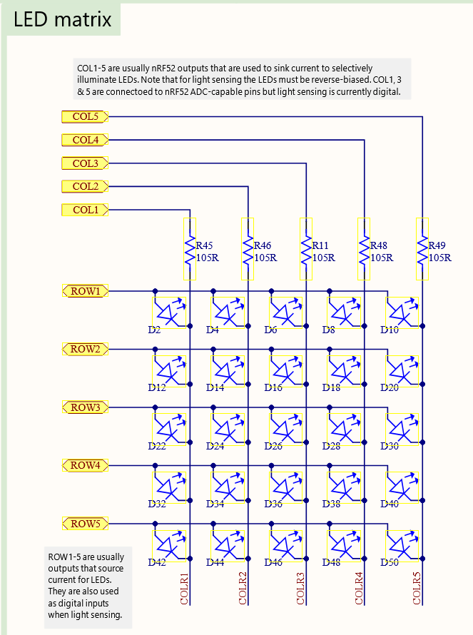
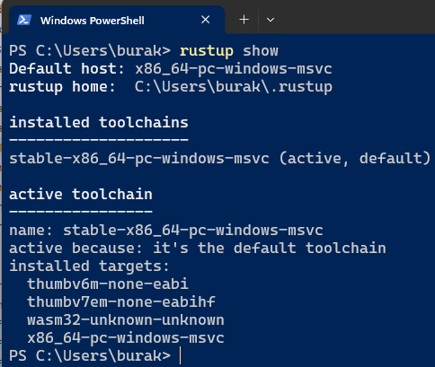
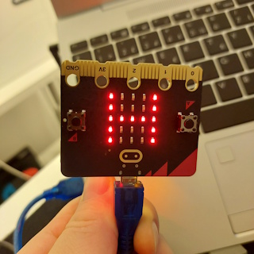
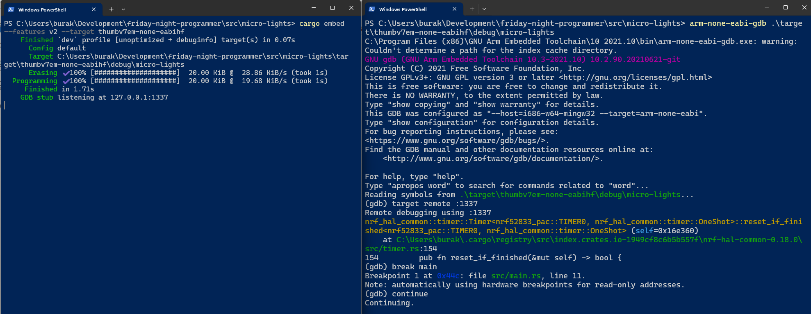

# BBC Micro:bit - Rust ile Hello Light

Daha önceden **Raspberry PI** üzerinde Python programlama dilini kullanarak tekerlek döndürmüş birkaç Led yakmıştım ancak Python ve kütüphanelerinin sunduğu soyutlamalar ve RasPi'nin yetenekleri işi epeyce kolaylaştırmıştı _(Üzerinde Linux tabanlı işletim sistemi koşabiliyordu, elimdeki Raspi'de 4Gb Ram vardı, kitap vs kaynak da oldukça fazlaydı)_ Diğer yandan çok uzun zamandır Rust ile kodlama yapıyorum ve onu asıl sahasında deneyimlemeye çalışıyorum. Şu anda eksik kaldığımı hissettiğimi önemli bir kısım var; **Bare Metal Programming**. Kabaca, işletim sistemi olmayan ortamlarda sadece core kütüphaneyi kullanarak geliştirme yapmak olarak özetleyebilirim. Bu felsefe ile bir işletim sistemi yazabilir ya da buna uygun çeşitli mikrodenetleyiciler _(Microcontroller)_ üzerinde geliştirmeler yapılabilir. Bu cihazları hedefleyen strateji daha çok Embedded Programming olarak da geçiyor. Bu özet yazıda kısa süre önce tedarik ettiğim **BBC Micro:bit** kartı üzerindeki tecrübelerimi paylaşmaya çalışacağım.

- [Giriş](#bbc-microbit---rust-ile-hello-light)
    - [Kurulumlar ve Kodlama Safhası](#kurulumlar-ve-kodlama-safhası)
        - [LED Matrix Hakkında](#led-matrix-hakkında)
    - [Lakin, ama, ancak](#lakin-ama-ancak)
        - [config.toml İçeriği](#configtoml-i̇çeriği)
        - [Embed.toml İçeriği](#embedtoml-i̇çeriği)
        - [memory.x İçeriği](#memoryx-dosyası)
    - [Target Kurulumu](#target-kurulumu)
    - [Çalışma Zamanı](#çalışma-zamanı)
    - [Çalışma Zamanından Notlar](#çalışma-zamanından-notlar)
    - [Farklı Kod Örnekleri](#farklı-kod-örnekleri)
    - [En Basit Hello World](#en-basit-hello-world)
    - [Debug Modda Çalışmak](#debug-modda-çalıştırmak)
    - [Mini Sözlük](#mini-sözlük)
    - [Kaynaklar](#kaynaklar)

Internet dünyasında gömülü sistemlerde Rust ile kodlama için sınırsız kaynak var ve hatta birincil kaynak olarak [The Embedded Rustacean](https://www.theembeddedrustacean.com/) sitesini tavsiye etmek isterim. Haftalık bir bültenleri var ve oldukça sıkı makalelere yer veriyorlar. Lakin derli toplu ve kısa yoldan bir giriş yapmak isteyenler için bana göre birincil kaynak **Rust Embedded** organizasyonun [şu adresteki ücretsiz keşif kitabı](https://docs.rust-embedded.org/discovery/microbit/index.html). Bende bu kitabı baz alarak ilermeye çalıştım. Saf zihnim ilk etapta bir emulator üzerinden hareket edebilirim yönündeydi. Hatta bu konuda oldukça güzel bir [çevrimiçi simülator siteside](https://wokwi.com/rust) bulunuyor. En azından neler yapılabiliyoru görmek açısından faydalı olabileceğini düşünüyorum. Takip etmekde olduğum **Discovery** kitabı konuyu [BBC micro:bit](https://microbit.org/) üzerinden ele almakta. Bende yakın zamanda heyecanla bu karttan bir tane aldım. **ARM** tabanlı bu mikrodenetleyici için iki fotoğrafı da şöyle bırakayım.


ve


Bu ufacık kart öğrendiğim kadarıyla **STEM** müfredatında 7-14 yaş arası çocukların eğitimlerinde de kullanılıyor. Kart üzerinde Pyhton, Scratch ve Microsoft MakeCode ile geliştirme yapılabiliyor. Ben hiçbir ekstra sensör veya genişletme yuvası almadım. Buna rağmen kartın üstünde programlanabilir led'ler _(ki ilk açıldğında kırmızı bir kalp şeklini aldılar)_, yerleşik bir hoparlör _(ki açıldığında sevimli bir ikaz sesi çıkarıp selam veriyor)_, iki düğme, bluetooth, hareket sensörü vs yer alıyor. Benim tedarik ettim **v2.2** modelinde **512 Kb Flash** ve **128 Kb RAM** var. **nRF52833** kodlu işlemci ise **Nordic Semiconductor** üretimi. Bilgisayara kolayca USB kablosu ile bağlanabiliyor ve hatta harici güç üniteleri ile seyyar hale de gelebiliyor. Normalde üzerinde bir işletim sistemi bulunmuyor dolayısıyla yazılan kodu Flash belleğe aldığımız andan itibaren cihaz üzerinde çalışmaya başlıyor _(Karşılaştığınızda niye sonsuz bir loop var şaşırmayın)_

## Kurulumlar ve Kodlama Safhası

En çok zorlandığım kısım cihaza uygun kod geliştirmek, yazılım taşımak ve hata ayıklamak için gerekli ortam araçlarını kurmak oldu. Öncelikle rust ile yazılan çıktının **ARM** tabanlı bu işlemci modeli için build edilmesi, cihaz üzerine bir şekilde aktarılması gerekiyor. Ayrıca yer yer debug etmek de gerekebilir ki bunun için de bazı araçlara ve kurulumlara ihtiyaç var. Burada tavsiyem [kitaptaki ilgili bölümü](https://docs.rust-embedded.org/discovery/microbit/03-setup/index.html) harfiyen takip edip kendi ortamınız için gerekli kurulumları yapmanız olacak. Neler neler çektim bi bilseniz :D

İlk uygulamada amacım kartın arkasında yer alan led ışıklardan herhangi birisinin alarm ikazı gibi yanım sönmesini sağlamak. Her şeyden önce normal bir rust projesi oluşturarak işe başlayabiliriz.

```bash
cargo new micro-lights
```

Her ne kadar standart kütüphane olmadan geliştirme yapsak da bize yardımcı olacak bazı crate' ler de mevcut. Bu amaçla Cargo.toml dosyasını aşağıdaki gibi düzenleyebiliriz. Genelde yararlandığım kaynaklardaki örnekler **rust 2018** sürümü ve eski crate'lere bağlı olduklarından **2024** sürümü için biraz araştırma yapmam gerekti diyebilirim.

```toml
[package]
name = "micro-lights"
description = "A simple hello world app for micro:bit v2.2."
authors = ["Burak Selim Şenyurt"]
version = "0.1.0"
edition = "2024"

[dependencies.microbit-v2]
version = "0.15.1"
optional = true

[dependencies.microbit]
version = "0.15.1"
optional = true

[dependencies]
cortex-m = "0.7.7"
cortex-m-rt = "0.7.5"
embedded-hal = "1.0.0"
panic-halt = "1.0.0"

[features]
v2 = ["microbit-v2"]
v1 = ["microbit"]
```

**cortex-m** küfesini mikrodenetleyicinin işlemcisi ile **low-level** iletişim kurmak için, **cortex-m-rt**'yi runtime ortamı için, **embedded-hal**'ı donanım unsurlarına _(led'ler, GPIO'lar gibi)_ ulaşmayı sağlamak için, **panic-halt**'ı ise panic implementasyonunu kolaylaştırmak için kullanıyoruz. Bu arada HAL _(Hardware Abstraction Layer)_ olarak geçen genel bir kavram var ve gömülü sistemlerde donanımla haberleşmeyi kolaylaştıran soyutlamaları ifade ediyor diyebiliriz. Burada kullanılan embedded-hal işimizi önemli ölçüde kolaylaştırmakta. Normalde donanım ile doğrudan konuşmamız da mümkün. **Microcontroller Unit** ile ya da **peripherals**'e ulaşıp iletişim kurmamızı sağlayan paketler de bulunuyor. Bu benim için biraz daha zorlayıcı zira cihaz üzerindeki örneğin **GPIO**'ların register adreslerini bilmeyi bazen bit kaydırma işlemi yapmayı ve hatta **unsafe** kod blokları ile çalışmayı gerektiriyor. İlerleyen kısımlarda bununla ilgili bir örnekte bulabilirsiniz. 

İşletim sistemi olmayan ortamlarda kodlama yaparken **NoStd** ve **NoMain** direktiflerine sıkça rastlıyoruz. Özellikle NoStd ile standart kütüphaneyi terk etmiş oluyoruz. Burada karşımıza çıkan sorunlardan birisi **panic macro** implementasyonu. Normalde bunu aşağıdaki gibi bir fonksiyon ile koda eklemek gerekiyor.

```rust
use core::panic::PanicInfo;

#[panic_handler]
fn panic(_info: &PanicInfo) -> ! {
    loop {}
}
```

Kaynaklara göre bunun yerine **panic-halt** kütüphanesi de kullanılabilir. No Standard kullanımı az önce de belirttiğim gibi rust std kütüphanesini devre dışı bırakmak demektir. Buna göre **I/O, heap, panic, thread, fs** gibi işletim sistemi bazlı çalışan birçok modül ve fonksiyonellik devre dışı kalır. Bunlar yerine elimizde **core** ve **alloc** gibi daha sınırlı kütüphaneler kalır. **panic** enstrümanı konsola hata mesajı basılması, **stack trace** gösterilmesi ve programın anında durdurulması gibi işleri üstlenen bir enstrümandır. Artık elimizde böyle bir imkan olmayacağından derleyici bu gibi hata durumlarında ele alacağı bir **[panic_handler]** tanımlaması arar. Yukarıda bunu ele alan kod parçası esasında hata oluştuğunda sadece sonsuz bir döngü işletmekte ki bu en basit çözüm _(Şşşştt kimseye söyleme der gibi)_ Hataları ele alma şekli değişkenlik gösterebilir. Bir mikrodenetleyici var sonuçta ve demem o ki hata oluştuğunda kırmızı led bile yaktırılabilir. Ancak her farklı durum için böyle handler kodları tariflemek zahmetli olur. Bunu daha sade şekilde ele almanın yolu da panic-halt küfesini kullanmaktır _(Tam bir reklam oldu ama bazı soyutlamalar olmadan olmuyor işte)_

**Toml** dosyasında dikkat çekici noktalardan bir diğeri de iki versiyon için **microbit** tanımlanması içermesidir. Kullanmakta olduğum BBC Micro:bit' in yazıyı hazırladığım tarih itibariyle iki ana versiyonu bulunuyor. Yazdığımız kodu hangisine göre derlemek istiyorsak seçim yapmamızı kolaylaştırması için **feature** bildirimleri kullanmaktayız. Şimdi biraz da kod tarafına geçelim. İlk örnek kodlar için çok uzağa gitmedim ve github kaynaklarında genel olarak verilen örneği ele almaya çalıştım.

```rust
#![deny(unsafe_code)]
#![no_main] // klasik rust giriş fonksiyonuna bağlı çalışmayacak
#![no_std] // rust standart kütüphanesi kullanılmayacak

use cortex_m_rt::entry;
use embedded_hal::delay::DelayNs;
use embedded_hal::digital::OutputPin;
use microbit::{board::Board, hal::timer::Timer};
use panic_halt as _;

#[entry] // entry point olduğunu belirtir
fn start() -> ! { // ! dönüyor. Bu fonksiyonun hiç sonlanmayacağını belirtmekte
    let mut board = Board::take().unwrap(); // Board'un sahipliğini alıyoruz
    let _ = board.display_pins.col3.set_low();
    let mut row3 = board.display_pins.row3;
    let mut timer = Timer::new(board.TIMER0);

    loop {
        let _ = row3.set_low(); // Işığı kapatıyor
        timer.delay_ms(1_500); // 1.5 saniye gecikme
        let _ = row3.set_high(); // Işığı açıyor
        timer.delay_ms(1_500); // 1.5 saniye gecikme
    }
}
```

Genel rust programlama pratiklerine göre biraz farklı bir kurgu olduğunu ifade edebilirim. **start** fonksiyonu programın çalışmaya başladığı yer. Mikrodenetleyici üzerinde bir işletim sistemi bulunmadığından ve doğal olarak rust'ın klasik main fonksiyonunu yürütecek çalışma zamanı olmayacağından farklı bir yöntemle gidiliyor diye düşünebiliriz _(Bunu biraz daha derinlemesine araştırmam lazım)_ Bana göre **no_main** ve **no_std** direktifleriyle rust derleyicisinin beklediği main fonksiyonunun olmadığını ve standart kütüphaneye bağlamadan _(linkleme)_ derlemenin yapılması gerektiğini belirtiyoruz. Tabii programın bir yerden çalışmaya başlayacağının da belirtilmesi lazım. Bu, **[entry]** direktifinin görevi. start fonksiyonu geriye **!** dönüyor gibi duruyor ancak bunun anlamı fonksiyonun hiç sonlanmayacak olması.

Diğer yandan kodda gördüğünüz üzere koşulsuz çalışan sonsuz bir **loop** var. Bu döngüde **5x5** matris şeklindeki dizilime göre tam ortadaki **LED** ışığı ile ilgili bir işlem yapıyoruz. Bir **LED** ışığı kapatıp açmak demek o bölgedeki **GPIO pin**'leri iki noktadan ayarlamakla mümkün oluyor. Dikkat ederseniz döngüden önce **col3** isimli pin'i **low** konumuna çeiyoruz. Aynı konuma gelen **row pin** değerini ise döngü sırasında önce **low** pozisyonuna sonra da **high** pozisyonuna çekiyoruz ve aralarda 1.5 saniyelik bekletmeler yapıyoruz. Bunun sonucu ışığın yanıp sönmesi oluyor. _(Şu anda tam ortadaki LED yanıp sönmeye devam ediyor. Aradan dakikalar geçti. Kastettiğim bu)_ Sonuçta elimizde bir devre kartı var ve üzerinde sunulan led'lere erişmek istiyoruz hatta tam ortadakini yakıp söndüreceğiz ve bunu devamlı yapacağız. Bununla ilgili soyutlamaları kullanıyoruz. Board'un sahipliğini alıp onun üzerinden satır ve sütun yönlendirmeleri ile led'lere ulaşıp set_low ve set_hihg çağrıları ile gerekli yakıp söndürme işlemlerini icra ediyoruz.

### Led Matrix Hakkında

**Micro:bit** kartının [şu adreste](https://github.com/microbit-foundation/microbit-v2-hardware/blob/main/V2.00/MicroBit_V2.0.0_S_schematic.PDF) oldukça detaylı bir devre şeması yer alıyor. Örnek kodda 3ncü satır ve sütundaki LED yakılıyor. Nasıl bir LED matrisi ile karşı karşıya olduğumuzu aşağıdaki grafikten de görebilirsiniz.


_Kaynak: Microbit Foundation_

Dolayısıyla microbit küfesi üzerinden erişebildiğimiz birçok soyutlama bu şemada belirtilen adreslere erişmemizi kolaylaştırmakta.

## Lakin, Ama, Ancak

Kodları bu şekilde yazmak onu çalıştırmak için yeterli değil ne yazık ki. Her şeyden önce normal bir cargo build operasyonu işimizi görmeyecek. Bu koddan **ARM** tabanlı mikro denetliyici için bir çıktı üretilmesi gerekiyor. Araştırdığım örnekler bunun için genel olrak şöyle bir yol izlemekte.

- **src** klasörü altında **.cargo/config.toml** dosyası
- **root** klasörde **Embed.toml** dosyası
- yine **root** klasörde **memory.x** dosyası _(Bazen de link.x dosyası gerekiyor)_

### config.toml İçeriği

**.cargo** klasöründe yer alan bu konfigurasyon dosyası aslında **cargo** aracının **build**, **run** ve **check** komutları çalıştırıldığında sürece özel ayarlar eklemel için kullanılmakta. Örneğin aşağıdaki içeriğe göre eğer derleme işlemi **ARM** tabanlı ve işletim sistemi olmayan _(bare metal)_ bir hedef için yapılıyorsa derleyiciye **-C link-arg=-TLink.x** şeklinde bir parametre daha ekleniyor. **TLink.x** genelde içinde **memory.x**'i tarifleyen bir dosya olarak belirtilmekte ancak bizim projemizde yer almıyor zira kullandığımız **cortex-m-rt** crate'i bunu kendi içerisinde belirtmekte.

İlerleyen kısımlarda belirteceğiz ama şimdiden bahsetmekte yarar var. **cargo embed** işleminde özel bir target kullanacağız _(thumbv7em-none-eabihf)_ ve bu aşağıdaki dosyada belirtilen parametrelerin devreye girmesine ve memory.x içerisindeki bellek talimatlarına göre hareket edilmesine neden olacak.

```toml
[target.'cfg(all(target_arch = "arm", target_os = "none"))']
rustflags = [
    "-C", "link-arg=-Tlink.x",
]
```

### Embed.toml İçeriği

Gömülü sistemlerde geliştirme yapılırken özellikle debug işlemleri için **probe-rs** isimli bir toolkit kullanılıyor. Bu araç setindeki unsurlar genellikle **Embed.toml** içeriğini baz alıyor. Söz konusu dosya içeriği genelde aşağıdaki gibi ve **debug**, **reset**, **flash** işlemleri için ortama bilgi sağlıyor.

```toml
[default.general]
chip = "nrf52833_xxAA" # uncomment this line for micro:bit V2
# chip = "nrf51822_xxAA" # uncomment this line for micro:bit V1

[default.reset]
halt_afterwards = true

[default.rtt]
enabled = false

[default.gdb]
enabled = false
```

Ben v2 sürümünü kullandığım için ilk satırı etkinleştirdim. Buna göre **probe-rs** aracı belirtilen çipi hedefleyecek ki memory haritasının doğru ayarlanması için bu önemli. **Reset**, **Rtt** ve **Gdb** ise birer flag. Reset flag'i kod yüklendikten sonra cihazın sıfırlanıp sıfırlanmayacağını _(reset)_ belirtir. **true** verdiğimiz için **Flash** işlemi bitince cihaz resetlenir ve doğal olarak program hemen çalışmaya başlamaz. Program start metodumuzda durur. Bu genellikle debug işlemi yapmak istiyorsak o anda bir breakpoint eklememiz için idealdir. False olarak belirlendiğindeyse program hemen çalışmaya başlar ki bu durumda debug yapamayabiliriz. **RTT _(Real-Time Transfer)_** flag'i true olduğunda seri port yerine debug kanalı üzerinden loglama gibi işlemler yapılabilir. **rtt-target** gibi bazı küfeler bu kanalı kullanarak loglama yapabilir örneğin. Kodun ilerleyen kısımlarında bu ayarı deneriz. GDB flag true olduğunda program bir debug sunucusu ile birlikte başlar. Bu durumda başka bir terminalden bir istemci açıp debug sunucusuna bağlanılabilir. Dahası çalışan uygulama buraya attach edilerek kod debug edilebilir. Bu, VS Code gibi araçlarda debug yapacaksak kıymetli bir özellik olabilir.

### memory.x Dosyası

Bu dosyasının içeriği yine internetteki örneklerde aşağıdakine benzer şekilde oluşturulmuş. En yalın halini kullandığımızı belirteyim. Bendeki versiyon **512K FLASH** ve **128K RAM** kullandığından değerleri buna göre ayarladım. Bu dosya linker'a mikrodenetleyicinin bellek yapısı ile ilgili bilgi vermek için kullanımakta. FLASH başlangıç adresi neresi ne kadar yer kaplıyor hangi adresten başlıyor vb. Mikrodenetleyici üzerinde bir işletim sistemi olmadığından bellek haritası linker için önemlidir. **cargo embed** ile bir derleme başlatıldığında programın hangi bölümünün nereye yerleştirileceğine karar verilmesinde rol oynayan önemli bir dosyadır.

```text
MEMORY
{
  /* NOTE K = KiBi = 1024 bytes */
  FLASH : ORIGIN = 0x00000000, LENGTH = 512K
  RAM : ORIGIN = 0x20000000, LENGTH = 128K
}
```

**Not:** Farklı kaynaklarda buradaki birtakım ayarların direkt toml dosyaları içerisinden yönetimi de söz konusu. Örneğin kimi kaynak cargo embed arkasından gelen feature gibi özellikleri toml dosyası içerisine alıyor.

## Target Kurulumu

Yukarıdaki ayarlamalar yeterli değil. Ayrıca rust derleyicisinin bu mikrodenetleyici için çıktı üretmesini sağlayacak enstrümanın yüklenmesi de gerekiyor. Sonuçta farklı bir mikrodenetleyici mimarisi söz konusu. Kullandığım **BBC micro:bit V2.2** denetleyicisi üzerinde **Cortex-M4F** işlemcisi yer alıyor ki bu, rust dünyasında **thumbv7em-none-eabihf** olarak belirtilmiş. Bunu target parametresi ile kullanılabilecek şekilde yüklemek için aşağıdaki terminal komutunu çalıştırmak yeterli.

```bash
rustup target add thumbv7em-none-eabihf

# Bu arada sistemde yüklü target enstrümanlarını görmek için aşağıdaki komut kullanılabilir
# Sistemde yüklü olanlar, yanında installed yazılı olanlardır
rustup target list
```


Veya şu anda sistemde nelerin kurulu olduğunu görmek için show komutu da kullanılabilir.

```bash
rustup show
```



Peki onca target içerisinden hangisini kullanacağımızı nasıl bileceğiz? Bu örnek özelinde ilerleyelim. Öncelikle [Micro:bit resmi kaynaklarından](https://tech.microbit.org/hardware/#nrf52-application-processor) hangi model ile çalıştığımıza bakmamız gerekiyor. Örneğin benim çalıştığım model **Nordic nRF52833** _(ki bu isimle hem [Hardware Abstraction Layer](https://crates.io/crates/nrf52833-hal) hem [Peripheral Access Crate](https://crates.io/crates/nrf52833-pac) türünden küfeler var)_ ve çekirdek bilgisi de **Arm Cortex-M4 32 bit processor with FPU** şeklinde. Buradan hareketle [ARM Developer sitesine](https://developer.arm.com/Processors/cortex-m4) bakıp **Cortex-M4**'ün mimari ve **ISA** bilgilerini not ediyoruz. Örneklerdeki model için **Armv7E-M** mimarisi kullanılıyor ve **ISA** desteği de **Thumb / Thumb-2** şeklinde belirtilmiş. Şimdi buraya kadar elde ettiğimiz anahtar kelimeler **Arm  Cortex-M4 FPU, Armv7E-M, Thumb/Thumb-2** şeklinde. Bu isimlendirmeler hedef platform için önemli. Şimdi [şu adresten](https://doc.rust-lang.org/beta/rustc/platform-support.html) rust'ın desteklediği platformlara baktığımız şu iki isim karşımıza çıkıyor.

- thumbv7em-none-eabi  Bare Armv7E-M
- thumbv7em-none-eabihf  Bare Armv7E-M, hardfloat

Dikkat edileceği üzer **thumb** ve **v7em** ifadeleri var. İşletim sistemi olmayan bir cihaza çıktı alacağımızdan **none** bilgisi de yer alıyor.

## Çalışma Zamanı

Örneği çalıştırmak için aşağıdaki komutu vermemiz yeterli. Dikkat edileceği üzere **cargo run** yerine **cargo embed** şeklinde bir kullanım söz konusu zira **cargo run** gömülü sistemlerde çalışmaz. Unutmayalım ki bilgisayarımızda yazdığımız kodu, işletim sistemi olmayan bir mikro denetleyicinin sabit belleğine gönderen ve başlatan bir düzenek gerekiyor.

```bash
cargo embed --features v2 --target thumbv7em-none-eabihf
```


Şimdi bu komut üzerine birşeyler söylemek lazım. Öncelikle bir gömülü sistem söz konusu ise bir **ELF _(Executable and Linkable Format)_** dosyasının üretilmesi ve mikrodenetleyiciye yüklenmesi _(Flashing olarak geçiyor)_ gerekiyor. Hatta bu işlem, programı cihazın kalıcı belleğine yüklemek olarak da düşünülebilir. Tabii bazı durumlarda bu ELF dosyasının resetlenmesi veya debug için duraklatılarak kullanılması da gerekiyor. Bunlar tabii bir dizi işlem demek. **cargo embed** komutu bunun için **probe-rs** altyapısını kullanmakta ki yazımızın başında referans ettiğimiz doküman tüm bu araçları yüklemeyi anlatıyor. Kısacası **cargo embed**, gerekli derleme işlemini yapar ve oluşan elf dosyasını bulup Embed.toml daki talimatlara göre yükler _(flash)_ diyebiliriz. Komutta **--features v2** kullandığımız için cargo.toml' da belirtilen **microbit-v2** sürümü baz alınır. **--target** 'a göre de az önce yüklediğimiz enstrüman için bir çıktı üretilir. **thumbv7em** ifadesi **ARM Cortex-M4** işlemcisini, **none** kelimesi işletim sistemi olmadığını, **eabihf** ise **Hard Float** özelliği olduğunu _(Floating point'ler ile çalışıyorsak daha hızlı çalışma anlamına geliyor)_ belirtir.

[Runtime](../images/MicroRuntime.mp4)

## Çalışma Zamanından Notlar

Örneği çalıştırdığımda beklediğim gibi _(ve de sürpriz bir şekilde)_ tam ortadaki LED ışığı yanıp sönmeye başladı. Zira akıllarda harika bir soru var; Nasıl duracak? :D Üstelik cihazın gücünü kessem bile tekrar bağladığımda ışık yanıp sönmeye devam etti. Aslında bu son derece doğal zira **cargo embed** operasyonu bu programı cihazın **Flash** belleğine yazar. Klasik bir işletim sisteminde bunun yerine program hard disk gibi bir fiziki depolama alanında durur ve işletim sistemi tarafından kontrol edilir. Program başlatıldığında işletim sistemi tarafında RAM'e alınır. Kapandığındaysa...Kapanır ha ha :D Şu anki senaryomuz ise farklı. **Flash** belleğe yazdığımız program kalıcı olarak orada duruyor. Öğrendiğim kadarı ile mikrodenetleyicilerde kod genellikle Flash bellekte saklanıyor _(Bazen Read Only Memory-ROM diye bahsedildiğini de gördüm)_ Cihazı reset etsek bile cihazın reset vektörü **[entry]** bildirimi ile işaret edilen giriş fonksiyonu _(Bizim örnekt start)_ bulur ve hemen çalıştırır. Programı resetlemek için uygulanabilecek birkaç taktik var. Örneğin bunlardan birisi program kodunu aşağıdaki gibi değişitirip yüklemek. Tam bir hile :D

```rust
#[entry]
fn start() -> ! { 
    loop {

    }
}
```

Bunun dışında cihaz üzerinde gelen düğme kontrolleri ile farklı bir yola da gidilebilir. LED ışığın yanıp söndürülmesi düğmeye basılmasına bağlanabilir. Mikdodenetleyicilerde genelde tek bir program çalıştırıldığını ifade etmekte yarar var. O nedenle Flash edilen program kısıtlı bellek bölgesinde her daim çalışmak üzere tasarlanan bir iş modeline sahip olmakta. Söz gelimi sensörlerinden gelen veriyi değerlendirip uyarı ikazı vermek veya anlık durumu panellerde göstermek gibi. Bunlar sürekli çalışır halde olmayı gerektirir.

## Farklı Kod Örnekleri

Şimdilik ışık yakmaya devam edelim derim :D

### Farklı Bir Hello World _(Unsafe Side)_

Bu seferki yaklaşımda doğrudan donanım seviyesine inip **GPIO _(General Purpose Input Output)_ register** adreslerini kullanarak ortadaki **LED** ışığını yanıp söndürmeye çalışacağız. Çalışmakta olduğumuz **BBC Micro:bit** kartındaki LED matrisi 5x5 boyutlarında. Elektronik ile çok aram yoktur ancak öğrendiğim kadarı ile bir LED'i yakmak için bu LED'e giden **ROW** pinini **LOW**, yine bu LED'e giden **COLUMN** pinini **HIGH** yapmak gerekiyor _(Ya da tam tersi de geçerli olabilir)_ Tabii burada ilgili pinlerin register adreslerine nasıl gideceğimiz de bir soru işareti. Kaynaklarda dolanıp durdum ama anladığım kadarı ile örneğin 21nci pinin adresi aşağıdaki formmülle ifade edilebiliyor _(Aslında kartların üretici kitapçıklarında bu adres bilgilerine detaylıca yer verilmekte)_

```text
0x5000_0700 + 21 * 4 = 0x5000_0700 + 0x54 = 0x5000_0754
```

**PIN register** adreslerini bulmakta yeterli değil. Işıkların yanması için PIN yönünün output yapılması ve OUTCLR/OUTSET gibi registerlarından yararlanarak çıkış seviyelerinin ayarlanması da gerekiyor. Neyse ki [The Rusty Bits kanalında yayınlanan şu video](https://www.youtube.com/watch?v=A9wvA_S6m7Y&t=185s) bu konularda önemli ayrıntılar veriyor. En nihayetinde aşağıdaki gibi bir kodlama ile ışık yanıp söndürülebilir.

```rust
#![no_std]
#![no_main]

use core::ptr::write_volatile;
use cortex_m::asm::nop;
use cortex_m_rt::entry;
use panic_halt as _;

#[entry]
fn start() -> ! {
    const GPIO0_BASE: u32 = 0x5000_0000;
    const PIN_CNF_OFFSET: u32 = 0x700;
    const P0_21: usize = 21;
    const P0_28: usize = 28;
    const GPIO0_PIN_CNF_21_ROW_1_ADDR: *mut u32 =
        (GPIO0_BASE + PIN_CNF_OFFSET + (P0_21 * 4) as u32) as *mut u32;
    const GPIO0_PIN_CNF_28_COL_1_ADDR: *mut u32 =
        (GPIO0_BASE + PIN_CNF_OFFSET + (P0_28 * 4) as u32) as *mut u32;
    const DIRECTION_OUTPUT_POS: u32 = 0;
    const PIN_CNF_DRIVE_LED: u32 = 1 << DIRECTION_OUTPUT_POS;

    unsafe {
        write_volatile(GPIO0_PIN_CNF_21_ROW_1_ADDR, PIN_CNF_DRIVE_LED);
        write_volatile(GPIO0_PIN_CNF_28_COL_1_ADDR, PIN_CNF_DRIVE_LED);
    }
    const GPIO0_OUTPUT_ADDRESS: *mut u32 = (GPIO0_BASE + 4) as *mut u32;
    const GPIO0_OUTPUT_ROW_1_POS: u32 = 21;
    let mut light_is_on: bool = false;
    loop {
        unsafe {
            write_volatile(
                GPIO0_OUTPUT_ADDRESS,
                (light_is_on as u32) << GPIO0_OUTPUT_ROW_1_POS,
            );
            for _ in 0..400_000 {
                nop();
            }
            light_is_on = !light_is_on;
        }
    }
}
```

İlk önce row ve column PIN adresleri hesaplanıp birer Constant olarak tutulmakta. GPIO başlangıç adresine offset değerini ekledikten sonra kaçıncı PIN'e ulaşmak istiyorsak 4 ile çarpıyoruz. Ancak bu formül cihazdan cihaza değişiklik gösterebilir. OUTPUP pin için bir yön belirlenmesi de söz konusu. Registerlar üzerindeki değerlerde değişiklik yapmak içinse write_volatile fonksiyonundan yararlanılıyor. Her ne zaman bir register değerini değiştirmek istersek bu fonksiyonu kullanabiliyoruz. Elimizde bir timer bulunmadığından duraksatma işlemi için bir döngü kullanılıyor ve içerisinde **nop _(No Operations anlamında)_** fonksiyonu çağırılıyor. Ancak dikkat edileceği üzere bu örnek kodlarda **unsafe** kod blokları içerisinde de işlemler yapılmakta. Rust'ın **borrow cheker** mekanizması devre dışı kalacağından bazı riskleri de almış oluyoruz. Ayrıca bu küçük örnek için olmasa bile farklı örneklerde kodlaması epey zahmetli olabilir. Örneğin pusulayı kullanmak istesek sırf pusulanın önden kalibrasyonu için nasıl bir kod yazmamız gerekir pek düşünemiyorum. Zaten bu sebeple **Hardware Abstraction Layer _(HAL)_** kütüphanelerini kullanmak daha anlamlı duruyor gibi.

### RUST Yazdırmak

Sıradaki örnekte amacım LED panelde RUST kelimesini yazdırmak. Ancak öncelikle LED paneldeki ışıkları kullanarak yanıp sönen bir harf görsek de yeterli olur. Mesela aşağıdaki gibi :)



Bunun için aşağıdaki kod parçasını kullanabiliriz.

```rust
#![deny(unsafe_code)]
#![no_main]
#![no_std]

use cortex_m_rt::entry;
use microbit::display::blocking::Display;
use microbit::{board::Board, hal::timer::Timer};
use panic_halt as _;

#[entry]
fn start() -> ! {
    let mut board = Board::take().unwrap();
    // Tüm Led'ler kapalı
    let clear = [
        [0, 0, 0, 0, 0],
        [0, 0, 0, 0, 0],
        [0, 0, 0, 0, 0],
        [0, 0, 0, 0, 0],
        [0, 0, 0, 0, 0],
    ];

    // Belli ledler açık ve H harfi şeklinde yanıyor.
    let H = [
        [1, 0, 0, 0, 1],
        [1, 0, 0, 0, 1],
        [1, 1, 1, 1, 1],
        [1, 0, 0, 0, 1],
        [1, 0, 0, 0, 1],
    ];
    // Matrisleri kullanabilecek bir Display nesnesi
    let mut display = Display::new(board.display_pins);
    let mut timer = Timer::new(board.TIMER0);

    loop {
        // 1 saniye boyunca clear matrisine göre led'ler konumlanacak (Hepsi Kapalı)
        display.show(&mut timer, clear, 1000);
        // 1 saniye boyunca H matrisindeki Led'ler yanacak
        display.show(&mut timer, H, 1000);
        // ve bu böyle sürüp gidecek (Blinky effect)
    }
}
```

Önceden de belirttiğimiz üzere **Micro:bit** üzerinde **5x5** lik bir LED matrisi var. microbit crate ile sunulan **Display** yapısını kullanarak ve iki boyutlu bir dizinin elemanlarını 0 veya 1 olarak değiştirerek istenilen ışıkların yanmasını sağlayabiliriz. İşte kısa aralıklarla ve R, U, S ve T harflerini nasıl gösterebileceğimizin kodu.

```rust
#![deny(unsafe_code)]
#![no_main]
#![no_std]

use cortex_m_rt::entry;
use microbit::display::blocking::Display;
use microbit::{board::Board, hal::timer::Timer};
use panic_halt as _;

#[entry]
fn start() -> ! {
    let board = Board::take().unwrap();
    // Tüm Led'ler kapalı
    let clear = [
        [0, 0, 0, 0, 0],
        [0, 0, 0, 0, 0],
        [0, 0, 0, 0, 0],
        [0, 0, 0, 0, 0],
        [0, 0, 0, 0, 0],
    ];

    // Belli ledler açık ve R harfi şeklinde yanıyor.
    let r = [
        [1, 1, 1, 0, 0],
        [1, 0, 0, 1, 0],
        [1, 1, 1, 0, 0],
        [1, 0, 1, 0, 0],
        [1, 0, 0, 1, 0],
    ];

    let u = [
        [1, 0, 0, 1, 0],
        [1, 0, 0, 1, 0],
        [1, 0, 0, 1, 0],
        [1, 0, 0, 1, 0],
        [1, 1, 1, 1, 0],
    ];

    let s = [
        [1, 1, 1, 1, 0],
        [1, 0, 0, 0, 0],
        [1, 1, 1, 1, 0],
        [0, 0, 0, 1, 0],
        [1, 1, 1, 1, 0],
    ];

    let t = [
        [1, 1, 1, 1, 1],
        [0, 0, 1, 0, 0],
        [0, 0, 1, 0, 0],
        [0, 0, 1, 0, 0],
        [0, 0, 1, 0, 0],
    ];

    // Matrisleri kullanabilecek bir Display nesnesi
    let mut display = Display::new(board.display_pins);
    let mut timer = Timer::new(board.TIMER0);
    const WAIT:u32  = 500;
    loop {
        // 250 milisaniye boyunca clear matrisine göre led'ler konumlanacak (Hepsi Kapalı)
        display.show(&mut timer, clear, WAIT);
        // 250 saniye boyunca R matrisindeki Led'ler yanacak
        display.show(&mut timer, r, WAIT);
        display.show(&mut timer, u, WAIT);
        display.show(&mut timer, s, WAIT);
        display.show(&mut timer, t, WAIT);

        // ve bu böyle sürüp gidecek (Blinky effect)
    }
}
```

Örneğin güncel hali biraz daha efektif esasında. Harfler constant olarak bir enum türü ile ilişkilendirilerek kullanılabilir. Bunun için letter_pipe isimli bir modül oluşturup içeriğini aşağıdaki gibi güncelleyebiliriz.

```rust
#[derive(Debug, Clone, Copy)]
pub enum Letter {
    Clear,
    R,
    U,
    S,
    T,
}

pub const fn get_letter(letter: Letter) -> [[u8; 5]; 5] {
    match letter {
        Letter::Clear => [[0; 5]; 5],
        Letter::R => [
            [1, 1, 1, 0, 0],
            [1, 0, 0, 1, 0],
            [1, 1, 1, 0, 0],
            [1, 0, 1, 0, 0],
            [1, 0, 0, 1, 0],
        ],
        Letter::U => [
            [1, 0, 0, 1, 0],
            [1, 0, 0, 1, 0],
            [1, 0, 0, 1, 0],
            [1, 0, 0, 1, 0],
            [1, 1, 1, 1, 0],
        ],
        Letter::S => [
            [1, 1, 1, 1, 0],
            [1, 0, 0, 0, 0],
            [1, 1, 1, 1, 0],
            [0, 0, 0, 1, 0],
            [1, 1, 1, 1, 0],
        ],
        Letter::T => [
            [1, 1, 1, 1, 1],
            [0, 0, 1, 0, 0],
            [0, 0, 1, 0, 0],
            [0, 0, 1, 0, 0],
            [0, 0, 1, 0, 0],
        ],
    }
}
```

İlgili fonksiyon kod tarafında da aşağıdaki gibi kullanabiliriz.

```rust
display.show(&mut timer, get_letter(Letter::R), WAIT);
```

### Ses Efektleri

// Eklenecek

### Düğmeler ile Etkileşim

// Eklenecek

### En Basit Hello World

Aslında doğrudan LED'lere ulaşmaya çalışmadan önce basit bir örnekle cihazla iletişim kurup kuramadığımızı da anlayabiliriz. Öncelikle program için gerekli crate'leri ekleyerek başlayalım.

```toml

```

Embed parametresi ile çalışacak komutlar için aşağıdaki içeriğe sahip Embed.toml dosyası işimizi görür.

main.rs dosyasını da şu şekilde ayarlayabiliriz.

## Debug Modda Çalıştırmak

Çok doğal olarak yazılan proje kodunun bazı hallerde debug edilmesi de gerekebilir. Esasında iyi bir loglama alt yapısı ve mantıklı log çıktıları işi kolaylaştırabilir ancak bir mikrodenetleyici ile çalışıyoruz. **Log** çıkarmak bile zor. Nereye çıkaracağız, nasıl çıkaracağız, kaç KB atabileceğiz, ne kadar sıklıkla gönderebileceğiz vs. Hiç terminal arabirimi olmayan bir denetleyici söz konusu ise bunu bir iletişim protokolü ile biryere çıkmak düşünülebilir. Aklıma **MQTT** gibi protokoller geliyor ama bunu başka bir araştırmaya bırakalım derim. Bu nedenle debug yapabilme yetisine de sahip olmamız lazım. Öncelikle **GDB** modunu etkinleştirmek gerekiyor. Yani Embed.toml dosyasındaki **default.gdb** değeri aşağıdaki gibi değiştirilmeli.

```toml
[default.gdb]
enabled = true
```

Uygulama kodunu yine aşağıdaki komut satırı ile derleyebiliriz.

```bash
cargo embed --features v2 --target thumbv7em-none-eabihf
```

**gdb** modunu etkinleştirdiğimiz için **localhost 1337** portundan erişilebilen bir **GDB** server ayağa kalkacaktır. Bu debug server'a mikrodenetleyici üzerinde çalışmakta olan programı attach ederek debug işlemleri yapılabilir. Kodda breakpoint konulabilir, step-in gibi aksiyonlar icra edilebilir vb Sunucu tarafı başarılı şekilde çalıştırıldıktan sonra ise **ayrı bir terminal** penceresi açıp debugger aracını başlatmamız ve debug sunucusuna bağlanmamız gerekiyor.

```bash
# İstemci programı debug modda açmak için aşağıdaki komut kullanılır
arm-none-eabi-gdb .\target\thumbv7em-none-eabihf\debug\micro-lights

# Sonrasında debug sunucusuna bağlanmak için de şu komut işletilmelidir
target remote :1337

# Eğer işlem başarılı olursa örneğin aşağıdaki komut ile main dosyası başına breakpoint koyup durabiliriz
# Hatta ilk örnekte bunu denersek bulunduğumuz yere göre ışık yanmayabilir veya sürekli yanar pozisyonda da kalabilir
# Zira kod breakpoint noktasında durmaktadır.
break main

# Aşağıdaki komutu vererek kod akışını devam ettirebiliriz
continue

# Belli bir satıra breakpoint eklemek için (Örneğin 14ncü satıra)
break 14

# Step into için
stepi

# Debugger'dan çıkmak içinse 
quit
```

Kabaca aşağıdaki gibi bir durum deneyimledim diyebilirim. Debugger'ı esasında **VS Code** gibi bir arabirime bağlamak daha iyi bir çözüm olabilir. Zira kalabalık kod kümelerinde bu adımlar işi zorlaştırabilir _(Bu arada Linux tabanlı sistemlerde User Interface Terminal açılabiliyor ve debug işlemleri çok daha kolay icra ediliyor)_ Esasında bu tip mikrodenetleyici çözümlerinde çok karmaşık kodlama yapmak da ne kadar doğru bilemiyorum. Sanki tam anlamıyla **Single Responsibility** ilkesinin Software ve Hardware ekseninde vücut bulmuş haliyle geliştirme yapmak çok daha mantıklı.



## Mini Sözlük

Benim gibi gömülü sistem programcılığına uzak olanlar için gerekli belli başlı terimleri aşağıdaki gibi sıralayabiliriz.

- **GPIO _(General Purpose Input/Output)_ :** Genel amaçlı giriş/çıkış pinleridir. LED yakmak, buton okumak, sensörlerden veri almak vb işlemlerde kullanılır. Hem giriş _(Input)_ hem de çıkış _(output)_ olarak yapılandırılabilir.
- **UART _(Universal Asynchronous Receiver-Transmitter)_:** Mikrodenetleyicilerde sensör verilerinin aktarım işlemlerini tanımlayan bir seri iletişim protokoldür. Sadece mikrodenetleyiciler değil bilgisayarlar içinde geçerlidir.
- **SPI _(Serial Peripheral Interface)_:** Ağırlıklı olarak yine mikrodenetleyicilerde ele alınan bir senkron ve seri haberleşme standardıdır.
- **I2C _(Inter-Integrated Circuit)_:**
- **ADC _(Analog-to-Digital Converter)_:**  Analog sinyali dijitale çeviren dönüştürücüdür. Örneğin mikrofon sensörüne gelen veriyi dijital hale çevirmekte kullanılır.
- **BSP _(Board Support Package)_ :** Donanım kartına özel olarak geliştirilmiş başlangıç için gerekli tüm unsurları içeren paketlerin genel adıdır. Karta özel pin tanımlarını, saat ayarlarını, buton buzzer pin ayarlarını vb içerir. Örneğin Micro:bit için kullandığımız [microbit-v2](https://crates.io/crates/microbit-v2) BSP örneklerindendir. Bu tip paketler kullanılarak HAL katmanları da geliştirilebilir.
- **HAL _(Hardware Abstraction Layer)_ :** Donanım seviyesindeki enstrümanlarla konuşmayı kolaylaştıran bir arayüz olarak düşünülebilir. Örneğin GPIO pinlerine doğrudan erişmek yerine detaylardan uzak ve kolay kullanılabilir bir soyutlama sağlar. Örneğin pin registerlarına doğrudan yazmak yerine pin.set_high gibi anlamlı fonksiyonlar sağlar. Bazen BSP ile karıştırılabilir.[nrf52833-hal](https://crates.io/crates/nrf52833-hal) örnek olarak verilebilir. Bu HAL örneğin belli mikrodenetleyicileri hedefler. Birde daha genel soyutlama sağlayan [embedded-hal](https://crates.io/crates/embedded-hal) gibi küfeler vardır. Bunu şöyle de düşünebiliriz; embedded-hal genel arayüz tanımlamalarını içerir _(traits)_, nrf52833-hal ise nRF52833'e özel olarak ilgil trait'leri gerçekten implemente eder. Dolayısıyla cihaza özgü komutlar da içerebilir.
- **Peripheral :** Mikrodenetleyicinin içinde bulunan **GPIO**, **UART**, **SPI**, **I2C**, **Timer**, **ADC** gibi birimlerdir. Her biri ayrı bir periferik modül olarak kabul edilir.
- **PAC _(Peripheral Access Crate)_ :** Mikrodenetleyici üreticisinin sağladığı register haritalarını, API'leri otomatik olarak Rust koduna çeviren paketlerdir. HAL kütüphaneleri genelde PAC modülleri üzerine kurulur.
- **MCU _(Microcontroller Unit)_ :** İşlemci çekirdeği, flash bellek, RAM ve .eşitli çevresel birimleri tekbir çipte barındıran elektronik birim.
- **Flashing :** Yazılan programın mikrodenetleyici üzerinde çalıştırılması genellikle Flask bellek bölgesine taşınması ile gerçekleştirilir. Bu işlem flashing olarak adlandırılır. probe-rs veya openocd gibi araçlarla yapılır.
- **ELF _(Executable and Linkable Format)_ :** Derlenen programın hedef sistemde çalıştırılabilir hale getirildiği dosya formatıdır.
- **GDB _(GNU Debugger)_ :** GNU ekosisteminde yaygın olarak kullanılan debugger.
- **Bare Metal Programming:** İşletim sistemi olmadan doğrudan donanım üzerinde yazılım geliştirme yaklaşımının adıdır. Yazıda ele aldığımız **BBC micro:bit** gibi cihazlarda **no_std** ile yazılan kodlar bare-metal seviyede olur.
- **SVD _(System View Description)_:** Mikrodenetleyici üzerindeki register ve ilişkili bitleri tarifleyen bir harita dosyası olarak düşünülebilir. [svd2rust](https://crates.io/crates/svd2rust) gibi crate'ler bu dosyaları parse edebilir ve buda **Peripherals Access Create**'lerin oluşturulmasını kolaylaştırır. Genellikle XML tabanlı bir dosyadır.
- **Reset Vector:** Mikrodenetleyici yeniden başlatıldığında _(reset)_ çalışmaya başladığı ilk bellek adresidir. Başlangıç kodu da buradan çalıştırılır. Örneklerde attığımız kodlar bu adresten başlatılır.
- **Debug Probe:** Bilgisayar ile mikrodenetleyici arasındaki fiziksel debug bağlantısını sağlayan araçtır.

## Kaynaklar

- [Embedded Rust Docs - Discovery](https://docs.rust-embedded.org/discovery/microbit/index.html)
- [The Embedded Rust Book](https://docs.rust-embedded.org/book/intro/index.html)
- [A Freestanding Rust Binary](https://os.phil-opp.com/freestanding-rust-binary/#panic-implementation)
- [Ferrous System Embedding Training](https://github.com/ferrous-systems/embedded-trainings-2020)
- [Microbit Examples](https://github.com/nrf-rs/microbit/tree/03e97a2977d22f768794dd8b0a4b6677a70f119a/examples)
- [Microbit.org](https://microbit.org/)
- [The Embedded Rustacean](https://www.theembeddedrustacean.com/)
- [Embedded programming in Rust with Microbit V2](https://www.youtube.com/watch?v=b7zWIKZp4ls)
- [Micro:bit V2 için donanım şeması](https://github.com/microbit-foundation/microbit-v2-hardware/blob/main/V2.00/MicroBit_V2.0.0_S_schematic.PDF)
- [nRF52833 Product Specification](https://docs-be.nordicsemi.com/bundle/ps_nrf52833/attach/nRF52833_PS_v1.7.pdf?_LANG=enus)
