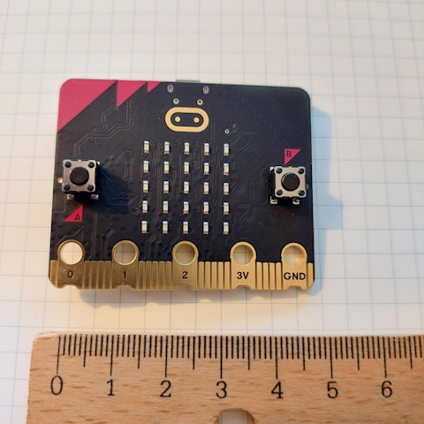
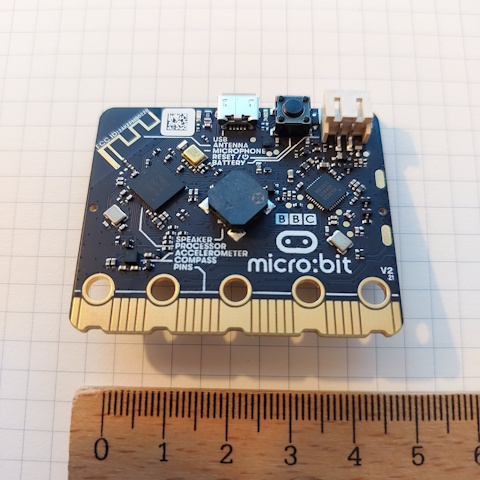
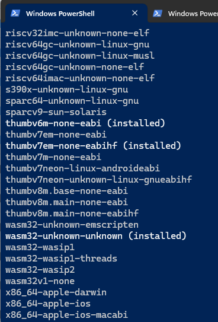
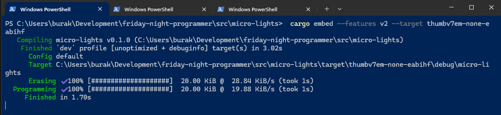

# BBC Micro:bit - Rust ile Hello Light

Daha önceden Raspberry PI üzerinde Python dilini kullanarak tekerlek döndürmüştüm ancak Python ve kütüphanelerin sunduğu soyutlamalar ve RasPi' nin yetenekleri işi epeyce kolaylaştırmıştı. Bir süredir de gömülü sistemlerde Rust ile nasıl programlama yapılıyor merak etmekteydim. Rust dilinin çalışma sahası düşünüldüğünde C++ ile hareket edebileceğimiz her yerde geliştirme yapabileceğimizi söylesem yanılmam sanıyorum ki. Ancak burada bare metal programming konsepti sınırlarına giriliyor. Standart kütüphaneyi dışarıda bırakıp core kütüphane üzerinden ilerlemek ve sınırlı kapasiteye sahip ve hatta işletim sistemi dahi olmayan mikro denetleyicilerin farklılıklarını da göze alarak hareket etmek gerekiyor. Bana epey uzak bir konu olduğunu ifade edebilirim ancak en azından bir Hello World yazmak zorundayım ve hatta buna Hello Light desek daha iyi olabilir.

- [Giriş](#bbc-microbit---rust-ile-hello-light)
    - [Kurulumlar ve Kodlama Safhası](#kurulumlar-ve-kodlama-safhası)
    - [Lakin, ama, ancak](#lakin-ama-ancak)
        - [config.toml İçeriği](#configtoml-i̇çeriği)
        - [Embed.toml İçeriği](#embedtoml-i̇çeriği)
        - [memory.x İçeriği](#memoryx-dosyası)
    - [Target Kurulumu](#target-kurulumu)
    - [Çalışma Zamanı](#çalışma-zamanı)
    - [Çalışma Zamanından Notlar](#çalışma-zamanından-notlar)
    - [Farklı Kod Örnekleri](#farklı-kod-örnekleri)
    - [Debug Modda Çalışmak](#debug-modda-çalıştırmak)
    - [Kaynaklar](#kaynaklar)

Internette gömülü sistemlerde Rust ile kodlama için sınırsız kaynak var ve hatta birincil kaynak olarak [The Embedded Rustacean](https://www.theembeddedrustacean.com/) sitesini tavsiye ederim. Haftalık bir bültenleri var ve oldukça sıkı makalelere yer veriyorlar. Lakin derli toplu ve kısa yoldan bir giriş yapmak isteyenler için bana göre birincil kaynak Rust Embedded organizasyonun [şu adresteki ücretsiz keşif kitabı](https://docs.rust-embedded.org/discovery/microbit/index.html). Bende bu kitabı baz alarak ilermek istedim diyebilirim. Saf zihnim ilk etapta bir emulator üzerinden hareket edebilirim yönündeydi. Hatta bu konuda oldukça güzel bir [çevrimiçi simülator sitesi](https://wokwi.com/rust) var. Takip etmekde olduğum Discovery kitabı konuyu [BBC micro:bit](https://microbit.org/) üzerinden ele alıyor. Bende heyecanla bu karttan bir tane aldım. ARM tabanlı bu mikro denetleyici için iki fotoğrafı da şöyle bırakayım.



ve



Bu ufacık kart öğrendiğim kadarıyla STEM müfredatında 7-14 yaş arası çocuklarımızın eğitimlerinde de kullanılıyor. Pyhton, scratch ve Microsoft MakeCode ile üzerinde geliştirme yapılabiliyor. Ben hiçbir ekstra sensör veya genişletme yuvası almadım. Buna rağmen kartın üstünde programlanabilir led'ler _(ki ilk açıldğında kırmızı bir kalp şekline aldılar)_, yerleşik bir hoparlör, iki yön tuşu, bluetooth, hareket sensörü vs yer alıyor. Benim tedarik ettim v2.2 modelinde 512 Kb Flash ve 128 Kb RAM var. nRF52833 kodlu işlemci ise Nordic Semiconductor üretimi. Bilgisayara kolayca USB kablosu ile bağlanabiliyor.

## Kurulumlar ve Kodlama Safhası

En çok zorlandığım kısım cihaz üzrerinde gerekli geliştirmeleri yapabilmek için gerekli ortam araçlarını kurmak oldu. Öncelikle rust ile yazılan çıktının ARM tabanlı bu işlemci modeli için build edilmesi, cihaz üzerine bir şekilde aktarılması söz konusu. Ayrıca yer yer debug etmek de gerekebilir ki bunun için de bazı araçlara ve kurulumlara ihtiyaç var. Burada tavsiyem [kitaptaki ilgili bölümü](https://docs.rust-embedded.org/discovery/microbit/03-setup/index.html) harfiyen takip edip kendi ortamınız için gerekli kurulumları yapmanız olacak. Neler neler çektim bi bilseniz :D

Ben Windows 11 işletim sistemi üzerinden ilerlediğimi belirteyim. İlk uygulamada amaç kartın arkasında yer alan led ışıklardan herhangi birisinin alark ikazı gibi yanım sönmesini sağlamak. Her şeyden önce normal bir rust projesi oluşturarak işe başlayabiliriz.

```bash
cargo new micro-lights
```

Her ne kadar standart kütüphane olmadan geliştirme yapsak da bize yardımcı olacak bazı crate' ler var. Bu amaçla Cargo.toml dosyasını aşağıdaki gibi düzenleyebiliriz. Genelde yararlandığım kaynaklardaki örnekler rust 2018 sürümü ve eski crate'lere bağlı olduklarından 2024 sürümü için biraz araştırma yapmam gerekti diyebilirim.

```toml
[package]
name = "micro-lights"
description = "A simple hello world app for micro:bit v2.2."
authors = ["Burak Selim Şenyurt"]
version = "0.1.0"
edition = "2024"

[dependencies.microbit-v2]
version = "0.15.1"
optional = true

[dependencies.microbit]
version = "0.15.1"
optional = true

[dependencies]
cortex-m = "0.7.7"
cortex-m-rt = "0.7.5"
embedded-hal = "1.0.0"
panic-halt = "1.0.0"

[features]
v2 = ["microbit-v2"]
v1 = ["microbit"]
```

cortex-m işlemci ile low-level iletişim kurmak için, cortex-m-rt gerekli runtime hazırlığı için, embedded-hal donanım unsurlarına (led'ler, gpio'lar gibi) ulaşmayı sağlamak için, panic-halt ise panic implementasyonunu kolaylaştırmak için. Bu arada HAL _(Hardware Abstraction Layer)_ olarak geçen genel bir kavram ve gömülü sistemlerde donanımla haberleşmeyi kolaylaştıran soyutlamaları ifade etmekte. NoStd kodlama yaptığımızda karşımıza çıkan sorunlardan birisi de panic makro implementasyonu. Normalde bunu aşağıdaki gibi bir fonksiyon ile koda eklemek gerekiyor.

```rust
use core::panic::PanicInfo;

#[panic_handler]
fn panic(_info: &PanicInfo) -> ! {
    loop {}
}
```

Kaynaklara göre bunun yerine panic-halt crate'i de ele alınabilir. Toml dosyasında dikkat çekici noktalardan birisi de microbit create'leri. Bu mikro denetleyicinin iki versiyonu bulunuyor. Yazdığımız kodu hangisine göre derlemek istiyorsak seçim yapmamızı kolaylaştırması için feature bildirimleri ile toml dosyasında tutmaktayız. Şimdi biraz da kod tarafına geçelim. İlk örnek kodlar için çok uzağa gitmedim ve github' da genel olarak verilen şu örneği ele aldım.

```rust
#![deny(unsafe_code)]
#![no_main] // klasik rust giriş fonksiyonuna bağlı çalışmayacak
#![no_std] // rust standart kütüphanesi kullanılmayacak

use cortex_m_rt::entry;
use embedded_hal::delay::DelayNs;
use embedded_hal::digital::OutputPin;
use microbit::{board::Board, hal::timer::Timer};
use panic_halt as _;

#[entry] // entry point olduğunu belirtir
fn start() -> ! { // ! dönüyor. Bu fonksiyonun hiç sonlanmayacağını belirtmekte
    let mut board = Board::take().unwrap(); // Board'un sahipliğini alıyoruz
    let _ = board.display_pins.col3.set_low();
    let mut row3 = board.display_pins.row3;
    let mut timer = Timer::new(board.TIMER0);

    loop {
        let _ = row3.set_low(); // Işığı kapatıyor
        timer.delay_ms(1_500); // 1.5 saniye gecikme
        let _ = row3.set_high(); // Işığı açıyor
        timer.delay_ms(1_500); // 1.5 saniye gecikme
    }
}
```

Genel rust programlama pratiklerine göre biraz farklı bir kurgu olduğunu ifade edebilirim. start fonksiyonu programın çalışmaya başladığı nokta. Mikrodenetleyici üzerinde bir işletim sistemi bulunmadığından ve doğal olarak rust'ın klasik main fonksiyonunu yürütecek çalışma zamanı bulunmayacağından farklı bir yöntemle gidiliyor diye düşünebiliriz belki de _(Bunu biraz daha derinlemesine araştırmam lazım)_ Bana göre no_main ve no_std direktifleriyle rust derleyicisinin beklediği main metodunun olmadığını ve standart kütüphaneye bağlamadan _(linkleme)_ derlemenin yapılması gerektiğini belirtiyoruz. Tabii programın biryerden çalışmaya başlayacağının da belirtilmesi lazım. Bu [entry] direktifinin görevi. start fonksiyonu geriye ! dönüyor gibi duruyor ancak bunun anlamı fonksiyonunu hiç sonlanmayacak olması _(Şu anda tam ortadaki led yanıp sönmeye devam ediyor. Aradan dakikalar geçti. Kastettiğim bu)_ Sonuçta elimizde bir devre kartı var ve üzerinde sunulan led'lere erişmek istiyoruz hatta tam ortadakini yakıp söndüreceğiz ve bunu devamlı yapacağız. Bununla ilgili soyutlamaları kullanıyoruz. Board'un sahipliğini alıp onun üzerinden satır ve sütun yönlendirmeleri ile led'lere ulaşıp set_low ve set_hihg çağrıları ile gerekli yakıp söndürme işlemlerini icra ediyoruz.

## Lakin, ama, ancak

Kodları bu şekilde yazmak onu çalıştırmak için yeterli değil ne yazık ki. Her şeyden önce normal bir cargo build operasyonu işimizi görmeyecek. Bu kodun ARM tabanlı bu mikro denetliyici için üretilmesi gerekiyor. Araştırdığım örnekler bunun için şöyle bir yol izlemekte.

- src klasörü altında .cargo/config.toml dosyası
- root klasörde Embed.toml dosyası
- yine root klasörde memory.x dosyası

### config.toml İçeriği

Bu dosya içeriği genelde aşağıdaki şekilde oluşturuluyor. .cargo klasöründe yer alan bu konfigurasyon dosyası aslında cargo aracının build, run ve check komutlarına çalıştırıldıklarında özel ayarlar vermek için kullanılmakta. Örneğin aşağıdaki içeriğe göre eğer derleme işlemi ARM tabanlı ve işletim sistemi olmayan _(bare metal)_ bir hedef için yapılıyorsa derleyiciye -C link-arg=-TLink.x şeklinde bir parametre daha ekleniyor. TLink.x genelde içinde memory.x'i tarifleyen bir dosya olarak belirtilmekte ancak bizim projemizde yer almıyor zira kullandığımız cortex-m-rt crate'i bunu kendi içerisinde ele almakta.

İlerleyen kısımlarda belirteceğiz ama şimdiden bahsetmekte yarar var. cargo build işleminde özel bir target kullanacağız _(thumbv7em-none-eabihf)_ ve bu aşağıdaki dosyada belirtilen parametrelerin devreye girmesine ve memory.x içerisinde bellek talimatlarına göre hareket edilmesine neden olacak.

```toml
[target.'cfg(all(target_arch = "arm", target_os = "none"))']
rustflags = [
    "-C", "link-arg=-Tlink.x",
]
```

### Embed.toml İçeriği

Gömülü sistemlerde geliştirme yapılırken probe-rs tarafından kullanılan birde proje dosyası oluyor. Bu dosya içeriği genelde aşağıdaki gibi ve debug, reset, flash işlemleri için ortama bilgi sağlıyor.

```toml
[default.general]
chip = "nrf52833_xxAA" # uncomment this line for micro:bit V2
# chip = "nrf51822_xxAA" # uncomment this line for micro:bit V1

[default.reset]
halt_afterwards = true

[default.rtt]
enabled = false

[default.gdb]
enabled = false
```

Ben v2 sürümünü kullandığım için ilk satırı etkinleştirdim. Buna göre probe-rs aracı belirtilen çipi hedefleyecek ki memory haritasının doğru ayarlanması için bu önemli. Reset, Rtt ve Gdb ise birer flag. Reset flag'i kod yüklendikten sonra cihazın sıfırlanıp sıfırlanmayacağını _(reset)_ belirtir. true verdiğimiz için Flash işlemi bitince cihaz resetlenir ama hemen çalışmaya başlamaz. Program start metodumuzda durur. Bu genellikle debug işlemi yapmak istiyorsak o anda bir breakpoint eklememiz için idealdir. False olarak belirlendiğindeyse program hemen çalışmaya başlar ki bu durumda debug yapamayabiliriz. RTT _(Real-Time Transfer)_ flag'i true olduğunda seri port yerine debug kanalı üzerinden loglama gibi işlemler yapılabilir. Bazı loglama create'leri bu bağlantıyı kullanıyor. rtt-target bunlardan birisidir örneğin. Kodun ilerleyen kısımlarında bu ayarı deneriz. GDB flag true olduğunda cargo embed ile örnek çalıştırıldığında bir debug sunucusu da başlatılır. Bu durumda başka bir terminalden bir istemci açıp buraya bağlanabiliriz. Bu VS Code gibi araçlarda debug yapacaksak kıymetli bir özellik olabilir. _(Bunu denemem lazım)_

### memory.x Dosyası

Bu dosyasının içeriğ yine internetteki örneklerde şuna benzer şekilde oluşturulmuş. Bendeki versiyon 512K FLASH ve 128K RAM kullandığından değerleri buna göre ayarladım. Bu dosya linker'a mikro denetleyicinin bellek yapısı ile ilgili bilgi vermekte. FLASH başlangıç adresi neresi ne kadar yer kaplıyor vb. Mikro denetleyici üzerinde bir işletim sistemi olmadığından bellek haritası linker için önemlidir. cargo build ile bir derleme başlatıldığında programın hangi bölümünün nereye yerleştirileceğine karar verilmesinde önemli bir dosyadır.

```text
MEMORY
{
  /* NOTE K = KiBi = 1024 bytes */
  FLASH : ORIGIN = 0x00000000, LENGTH = 512K
  RAM : ORIGIN = 0x20000000, LENGTH = 128K
}
```

## Target Kurulumu

Yukarıdaki ayarlamalar yeterli değil. Ayrıca rust derleyicisinin bu mikro denetleyici için çıktı üretmesini sağlayacak enstrümanın yüklenmesi gerekiyor. Sonuçta farklı bir mikro denetleyici mimarisi söz konusu. Kullandığım BBC micro:bit V2.2 denetleyicisi üzerinde Cortex-M4F işlemcisi yer alıyor ki bu rust dünyasında thumbv7em-none-eabihf olarak belirtilmiş. Bunu target parametresi ile kullanılabilecek şekilde yüklemek için aşağıdaki terminal komutunu çalıştırmak yeterli.

```bash
rustup target add thumbv7em-none-eabihf

# Bu arada sistem yüklü target enstrümanlarını görmek için şu komut çalıştırılabilir
# Sistemde yüklü olanlar yanında installed yazılı olanlardır
rustup target list
```



## Çalışma Zamanı

Örneği çalıştırmak için aşağıdaki komutu vermemiz yeterli. Dikkat edileceği üzere cargo run yerine cargo embed şeklinde bir kullanım söz konusu zira cargo run gömülü sistemlerde çalışmaz. Unutmayalım kodu bilgisayarımızda yazıp, işletim sistemi olmayan  bir mikro denetleyicinin sabit belleğine gönderip, çalışmaya başlamasını söyleyecek bir düzenek gerekiyor.

```bash
cargo embed --features v2 --target thumbv7em-none-eabihf
```



Şimdi bu komut üzerine birşeyler söylemek lazım. Öncelikle bir gömülü sistem söz konusu ise bir ELF dosyasının üretilmesi ve mikro denetleyiciye yüklenmesi _(Flashing olarak geçiyor)_ gerekiyor. Bu hatta cihazın kalıcı belleğine yüklemek olarak da düşünülebilir. Tabii bazı durumlarda bu ELF dosyasının resetlenmesi veya debug için duraklatılarak kullanılması da gerekiyor. Bunlar tabii bir dizi işlem demek. cargo embed komutu bunun için probe-rs altyapısını kullanmakta ki yazımızın başında referans ettiğimiz dokümanı tüm bu araçları yüklemeyi anlatıyor. Kısaca cargo embed, gerekli derleme işlemini yapar, oluşan elf dosyasını bulup Embed.toml daki talimatlara göre yükler _(flash)_ diyebiliriz. Bizim komutumuzada --features v2 kullandığımız için cargo.toml' da belirtilen microbit-v2 sürümü ele alınıyor. --target'a göre de az önce yüklediğimiz enstrüman için bir çıktı üretiliyor. thumbv7em, ARM Cortex-M4 işlemcisini, none işletim sistemi olmadığını, eabihf ise Hard Float özelliği olduğunu _(Floating point'ler ile çalışıyorsak daha hızlı olurmuş)_ belirtiyor.

[Runtime](../images/MicroRuntime.mp4)

## Çalışma Zamanından Notlar

Örneği çalıştırdığımda beklediğim gibi _(ve de sürpriz bir şekilde)_ tam ortadaki led yanıp sönmeye başladı. Zira şöyle bir soru var. Nasıl duracak? :D Üstelik cihazın gücünü kessem bile tekrar bağladığımda ışık yanıp sönmeye devam etti. Aslında bu son derece doğal zira cargo embed operasyonu bu programı cihazın Flash belleğine yazar. Klasik bir işletim sisteminde bunun yerine program hard disk gibi bir fiziki depolama alanında durur ve işletim sistemi kontrol altındadır. Çalıştırıldığında program işletim sistemi tarafında RAM'e alınır. Kapandığında da...Kapanır ha ha :D Buradaki senaryo ise farklı. Flash belleğe yazdığımız program kalıcı olarak orada duruyor. Öğrendiğim kadarı ile mikrodenetleyicilerde kod genellikle Flash' te saklanıyor _(Bazen Read Only Memory-ROM diye bahsedildiğini de gördüm)_ Cihazı reset etsek bile cihazın reset vektörü [entry] bildirimi ile işaret edilen start fonksiyonu buluyor ve hemen çalıştırıyor. Burada aslında birkaç taktik var. Mesela birisi program kodunu aşağıdaki gibi değişitirip yüklemek. Tam bir hile :D

```rust
#[entry]
fn start() -> ! { 
    loop {

    }
}
```

Bunun dışında cihaz üzerinde gelen buton kontrolleri ile farklı bir yola da gidilebilir. Işığın yanıp söndürülmesi buton basılmasına bağlanabilir. Tabii burada mikrokontrolcülerde genelde tek bir program çalıştığını ifade etmekte yarar var. O nedenle Flash edilen program kısıtlı bellek bölgesinde her daim çalışmak üzere tasarlanan bir iş modeline sahip oluyor.

## Farklı Kod Örnekleri

// Eklenecek

## Debug Modda Çalıştırmak

// Eklenecek

## Kaynaklar

- [Embedded Rust Docs - Discovery](https://docs.rust-embedded.org/discovery/microbit/index.html)
- [The Embedded Rust Book](https://docs.rust-embedded.org/book/intro/index.html)
- [A Freestanding Rust Binary](https://os.phil-opp.com/freestanding-rust-binary/#panic-implementation)
- [Ferrous System Embedding Training](https://github.com/ferrous-systems/embedded-trainings-2020)
- [Microbit Examples](https://github.com/nrf-rs/microbit/tree/03e97a2977d22f768794dd8b0a4b6677a70f119a/examples)
- [Microbit.org](https://microbit.org/)
- [The Embedded Rustacean](https://www.theembeddedrustacean.com/)
- [Embedded programming in Rust with Microbit V2](https://www.youtube.com/watch?v=b7zWIKZp4ls)
