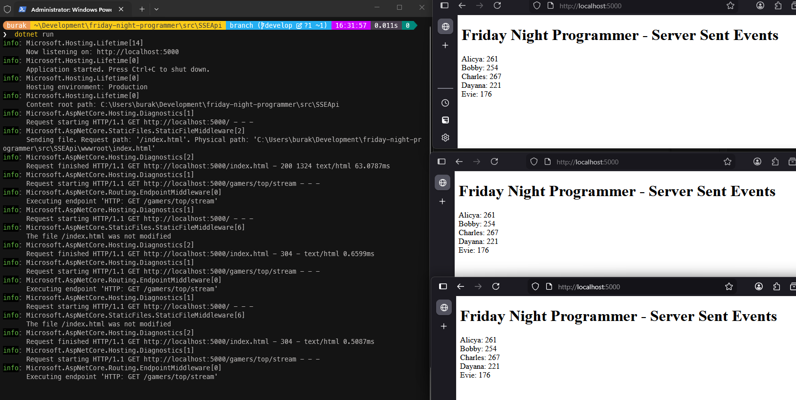

# Server-Sent Events

Microsoft .Net 10 sürümü ile birlikte sunucudan istemci tarafına doğru gerçekleştirilen iletişime yeni bir yaklaşım daha eklendi; **Server-Sent Events *(SSE)*** desteği. Genellikle sunucunun kendisine bağlı istemcilerde gerçek zamanlı *(real-time)* güncellemeler yapması sık rastlanan ihtiyaçlardan birisi. Bunun için çoğunlukla **WebSocket** teknolojisini oldukça başarılı bir şekilde sarmalayıp soyutlayan **SignalR** paketi tercih ediliyor *(Pek tabii istemci açısından bakıldığında araklıklarla veya sürekli olarak sunucuya gidip güncellemeleri çek gibi yöntemlerde mevcut)* Lakin bu teknikler hafifsiklet *(lightweight)* sayabileceğimiz basit *server push* operasyonları düşünüldüğünde yüksek maliyetleri de beraberinde getiriyor. Zira iletişimin çift yönlü olarak tesis edilmesi veya uzun süre açık kalması ya da ağ trafiğinin gereksiz yere artması gibi durumlar söz konusu olabiliyor. Dolayısıyla **Server-Sent Events** yaklaşımının bu tip hafifsiklet iletişim ihtiyaçlarında tercih edilebileceğini söylesek yeridir. Yani tek yönlü gerçek zamanlı veri akışına *(One-Way Real-Time Data Streaming)* ihtiyaç duyulan durumlarda **SSE** kullanımı tercih edilebilir.

> SSE aslında HTML tabanlı bir standardı olarak düşünülebilir. [Mozilla Developer Network](https://developer.mozilla.org/en-US/docs/Web/API/Server-sent_events) üzerinden veya [HTML Living Standard](https://html.spec.whatwg.org/multipage/server-sent-events.html) üzerinden detaylı bilgilere ulaşılabilir.

Son yıllarda yapay zeka araçlarının da sunucu olarak istemci tarafına sürekli veri akışı sağlamasıyla birlikte bu tür bir iletişim modeline olan ihtiyaç daha da artmış durumda. Tabii yine de temkinli olmakta da yarar var. SSE ile sunucudan istemciye doğru sürekli veri akışı sağlayabilsekte, istemci tarafının gelen verileri işleyebilmesi için uygun bir şekilde tasarlanması gerekir. Aksi takdirde istemci tarafında bazı sorunlar yaşanabilir; Örneğin bellek beklenmedik şekilde şişebilir, thread'lar bloke olabilir, ağ trafiğindeki artış bazı gecikmeleri de beraberinde getirebilir. Hatırlamatmakta fayda var burada iletişim sunucudan istemciye doğru tek yönlü akmakta. Bir başka deyişle istemcinin sunucu tarafı uyarması, geri bildirimde buluması ve akışı bir şekilde yönetmesi mümkün değil.

Dikkat edilmesi gereken bir diğer noktada istemci ile sunucu arasındaki iletişimin kesintiye uğrama riski barındırmasıdır. Bu sunucudan akan veride kesinti olması anlamına gelir yani kayıp veriler oluşabilir. Tabii SSE standardında bu tür durumlara karşı bir tedbir mekanizması da vardır. Olaylar *(events)* benzersiz bir ID ile damgalandığından istemciler son kullandıkları ID bilgisini hatırlar ve iletişim tekrar kurulduğunda bu ID bilgisini sunucuya göndererek kayıp verilerin yeniden gönderilmesini sağlayabilirler.

## Senaryo

Konuyu elbette pratik etmeden anlamak çok mümkün değil. Bu yüzden basit bir senaryo düşünelim. Bir oyun platformunda güncel skor bilgilerini ve en becerikli oyuncuların puanlara göre değişen listesini sunan bir minimal web api hizmetimiz olduğunu varsayalım. Bu servise **SSE** desteği ekleyelim ve istemci tarafında bu güncellemeleri gerçek zamanlı olarak görüntüleyelim. Senaryoyu olabildiğince basit tutmakta yarar var. Bu nedenle iletişimin istemdışı kopması gibi durumları şu an için göz ardı edebiliriz.

## Sunucu Tarafı

Çok sade bir şekilde ilerlemek istiyorum. Öncelikle oyuncuların bilgilerini tutacak bir model oluşturalım.

```csharp
public class Gamer
{
    public string Name { get; set; } = string.Empty;
    public int Score { get; set; }
}
```

Bu basit model sadece oyuncu adı ve skor bilgisini tutmak üzere tasarlandı. Pek tabii bir endpoint ve buna bağlı servisimizin olması gerekiyor. GamerService isimli sınıfımızı da aşağıdaki gibi oluşturabiliriz.

```csharp
using System.Runtime.CompilerServices;
using System.Threading.Channels;

namespace SSEApi;

// Asıl işin yapıldığı servis bileşenimiz.
public class GamerService
{
    private readonly Random random = new();
    private readonly List<Gamer> gamers;
    // Abone olan istemcilere güncellemeleri iletmek için kullandığımız kanal listesi 
    private readonly List<Channel<List<Gamer>>> _subscribers = [];
    // Eş zamanlı erişimlerde oluşabilecek sorunları önlemek için basit bir thread kilit mekanizması kullanıyoruz.
    // Bu nedenle bir Lock nesnemiz var.
    private readonly Lock _lock = new();

    public GamerService()
    {
        // Bunlar kobay oyuncularımız :D
        gamers =
        [
            new Gamer { Name = "Alicya", Score = 100 },
            new Gamer { Name = "Bobby", Score = 150 },
            new Gamer { Name = "Charles", Score = 120 },
            new Gamer { Name = "Dayana", Score = 130 },
            new Gamer { Name = "Evie", Score = 110 },
        ];
    }

    /*
        Belkide en kritik metodumuz burası olabilir.
        IAsyncEnumerable<List<Gamer>> türünden sonuç döndüren metotlar server event olarak kullanılabiliyorlar.
        Bu metodumuzun görevi, abone olan istemcilere güncellemeleri iletmek. 
        Abone olan her istemci için bir kanal oluşturulup _subscribers listesine ekleniyor. 
        İstemci bağlantısı kesildiğinde ise ilgili kanal listeden çıkarılıyor.
    */
    public async IAsyncEnumerable<List<Gamer>> SubscribeAsync(
        [EnumeratorCancellation] CancellationToken cancellationToken)
    {
        // Abone olan istemci için yeni bir kanal oluşturur.
        var channel = Channel.CreateUnbounded<List<Gamer>>();

        // thread safe olması için kilit açılır
        lock (_lock)
        {
            // abone eklenir ve mevcut oyuncu listesi iletilir
            _subscribers.Add(channel);
            channel.Writer.TryWrite([.. gamers]);
        }

        try
        {
            // Abone olan istemci için oluşturulan kanaldan güncellemeleri okur ve iletir.
            await foreach (var update in channel.Reader.ReadAllAsync(cancellationToken))
            {
                yield return update;
            }
        }
        finally
        {
            lock (_lock) _subscribers.Remove(channel);
            channel.Writer.Complete();
        }
    }

    // Bu metot, background service tarafından belirli periyotlarda çağırılır.
    // Kendince oyuncu skorlarını rastgele günceller.
    // Buna bağlı olarak gamers listesi de yenileni ve güncellenmiş liste tüm abonelere iletilir.
    public void UpdateStats()
    {
        foreach (var gamer in gamers)
        {
            gamer.Score += random.Next(-10, 20);
        }

        var snapshot = gamers.ToList();

        // thread-safe bir kod bloğu açılır
        lock (_lock)
        {
            // tüm abonelere güncellenmiş skor listesi iletilir
            foreach (var subscriber in _subscribers)
            {
                subscriber.Writer.TryWrite(snapshot);
            }
        }
    }
}
```

Kodda gerekli açıklamalar yer alıyor ancak genel hatları ile abone olanlara güncel skor bilgilerini belirli periyotlarda ulaştırmak üzere tasarlanmış bir servis bileşenimiz olduğunu ifade edebilirim. Oyuncuların skor bilgilerindeki güncellemeleri simüle eden tarafı ise bir **BackgroundService** bileşeni olarak tasarlayabiliriz. İşte kodları.

```csharp
namespace SSEApi;

// Bu bileşenimiz, oyuncu skor bilgilerini belirli periyotlarda güncelleyen
// bir arka plan hizmeti olarak düşünülebilir. Sadece skor değişiklilerini
// anlık simüle etmek için kullanılıyor ve dikkat edileceği üzere gamerService'in
// UpdateStats() metodunu çağırarak bu işlemi yapıyor.
public class GamerServiceWorker(GamerService gamerService) 
    : BackgroundService
{
    protected override async Task ExecuteAsync(CancellationToken stoppingToken)
    {
        // Bir iptal sinyali gelene kadar çalışmaya devam eden döngümüz.
        while (!stoppingToken.IsCancellationRequested)
        {
            gamerService.UpdateStats();
            await Task.Delay(TimeSpan.FromSeconds(5), stoppingToken);
        }
    }
}
```

Bu işçsi servis 5 saniyede bir **GamerService** bileşenindeki **UpdateStats()** metodunu çağırmakta. UpdateStats metodu da tahmin edileceği üzere abonelere güncellenmiş skor bilgilerini iletmektedir. **Program.cs** içeriğini de aşağıdaki şekilde düzenleyebiliriz.

```csharp
using SSEApi;

var builder = WebApplication.CreateBuilder(args);
builder.Services.AddSingleton<GamerService>();
builder.Services.AddHostedService<GamerServiceWorker>();

var app = builder.Build();
app.UseDefaultFiles().UseStaticFiles();
 
// GamerService bileşeninin SubscribeAsync metodunu kullanarak 
// abone olan istemcilere güncellemeleri ileten bir server-sent events endpoint'i olarak tanımlanır.
app.MapGet("/gamers/top/stream", (GamerService gamerService, CancellationToken cancellationToken) =>
{
    // TypedResults.ServerSentEvents() metodu, 
    // SubscribeAsync() metodundan dönen IAsyncEnumerable<List<Gamer>> türündeki sonuçları 
    // SSE formatına dönüştürerek istemcilere iletir.
    return TypedResults.ServerSentEvents(
        gamerService.SubscribeAsync(cancellationToken),
        eventType: "top-gamers" // İsteğe bağlı olarak, her bir SSE mesajına "top-gamers" şeklinde bir flag eklenir.
    );
});

await app.RunAsync();
```

Burada **/gamers/top/stream** şeklinde gelinen bir endpoint tanımı mevcuttur ve bu endpoint'e yapılan isteklerde **GamerService** bileşeninin **SubscribeAsync()** metodundan dönen sonuçlar SSE formatına dönüştürülerek istemcilere iletilir. İsteğe bağlı olarak, her bir SSE mesajına "top-gamers" şeklinde bir flag'de eklenmiştir. Bu sayede istemci tarafında gelen mesajların türünü ayırt etmek mümkün olur. İstemci demişken, pek tabii birde istemci yazmak gerekiyor.

## İstemci Tarafı

Sanırım en basit seçenek bir HTML sayfasında az biraz Javascript kodu kullanarak bunu yapmak. Bunun için **wwwroot** klasöründe **index.html** dosyası oluşturalım ve aşağıdaki içeriği ekleyelim.

```html
<!DOCTYPE html>
<html lang="en">
    <head>
        <meta charset="utf-8" />
        <title>Friday Night Programmer - Server Sent Events</title>
    </head>
    <body>
        <h1>Friday Night Programmer - Server Sent Events</h1>
        <div id="gamers"></div>

        <script>
            const gamersDiv = document.getElementById('gamers');

            // Server Sent Events (SSE) bağlantısı oluşturulur
            const eventSource = new EventSource('/gamers/top/stream');

            // SSE üzerinden gelen "top-gamers" olaylarını dinlemek için addEventListener kullandık
            eventSource.addEventListener('top-gamers', function(event) {
                const gamers = JSON.parse(event.data);
                gamersDiv.innerHTML = '';
                gamers.forEach(gamer => {
                    const gamerInfo = document.createElement('div');
                    gamerInfo.textContent = `${gamer.name}: ${gamer.score}`;
                    gamersDiv.appendChild(gamerInfo);
                });
            });

            // Hata durumunda SSE bağlantısını kapatır
            eventSource.onerror = function() {
                console.error('SSE connection error');
                eventSource.close();
            };
        </script>
    </body>
</html>
```

Ve çalışma zamanına ait bir görüntü. Tabii canlı bir demo olmadığı için sadece statik bir görüntü söz konusu ama oyuncu skorlarının 5 saniyede bir güncellendiğini ve istemci tarafında gerçek zamanlı olarak görüntülendiğini söyleyebilirim.



 İlerleyen zamanlarda bu senaryoyu biraz daha geliştirip, iletişimin kesintiye uğraması durumunda nasıl bir mekanizma izlenebileceği gibi konuları da araştırabiliriz. Örnek kodlar şurada: [SSEApi](../src/SSEApi)
