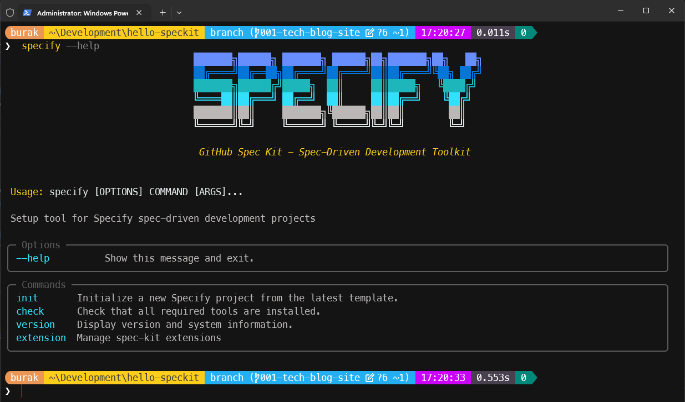
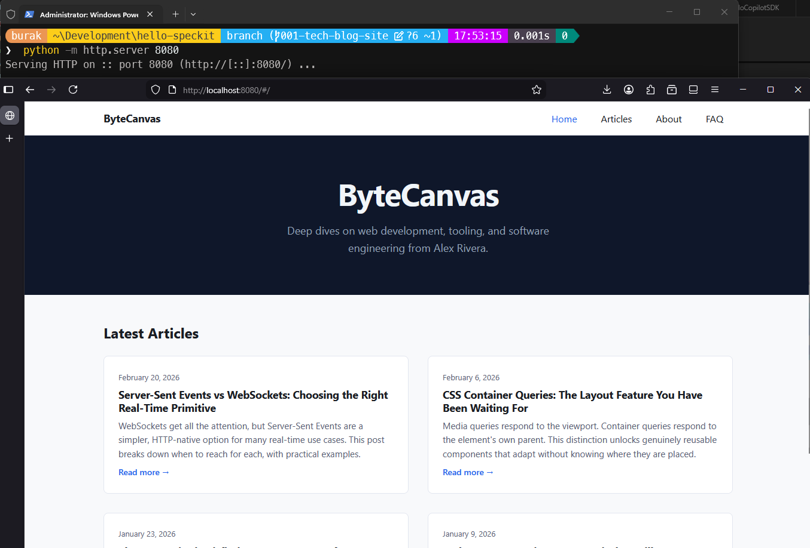
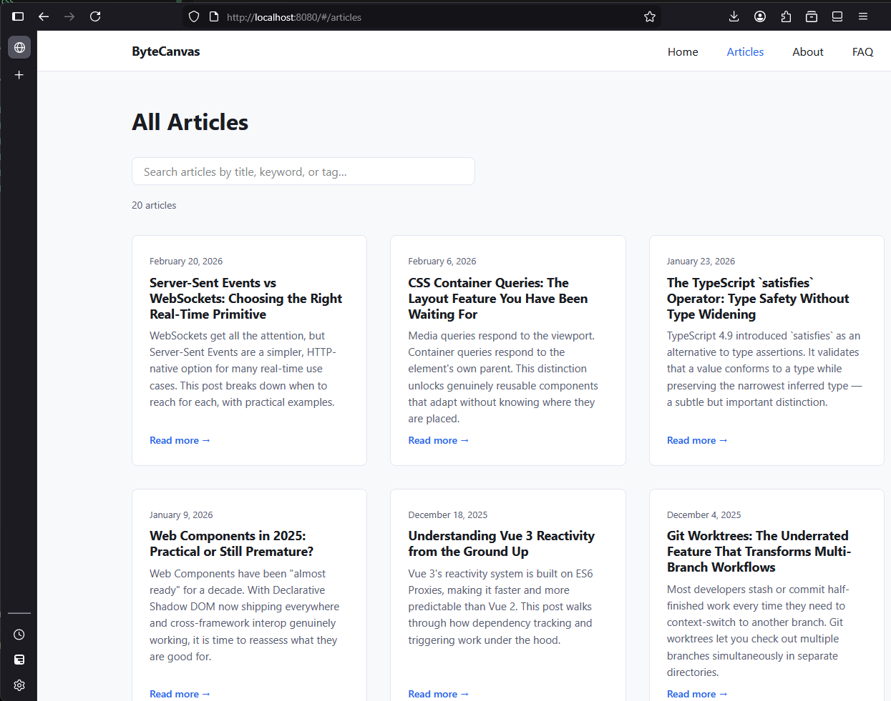
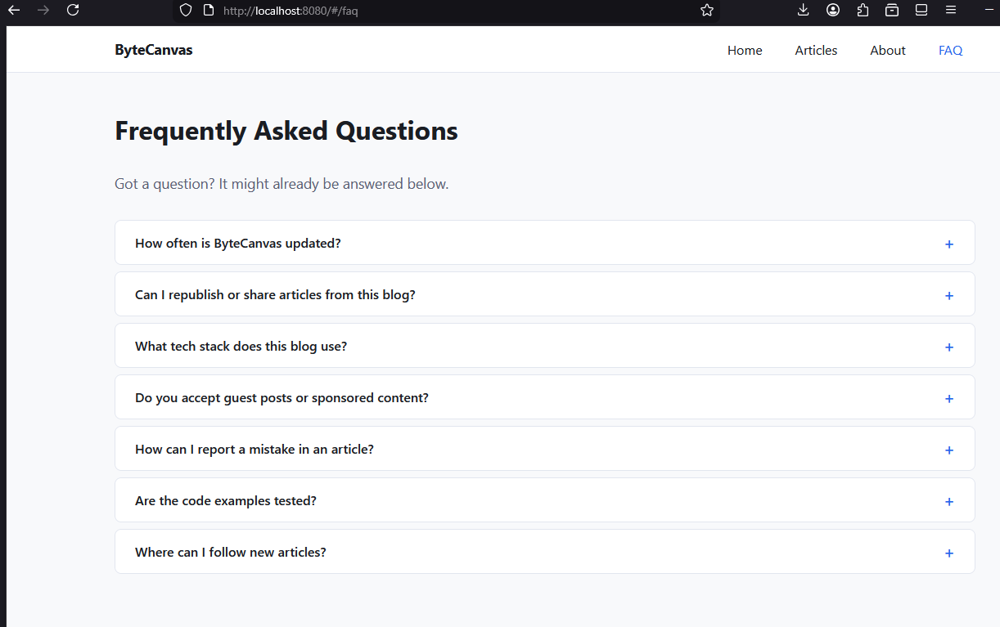

# Spec-kit İlk Karşılaşma

Agentic yazılım geliştirmede bahsedilen veya öne çıkan metodolojilerden birisi de **Spec-Driven Development(Spec-D)** yani **Spesifikasyon Odaklı Geliştirme**. Bu metodoloji, yazılım geliştirme sürecinde spesifikasyonların *(yani gereksinimlerin)* öncelikli olarak ele alınmasını ve bunları baz alarak yazılımın geliştirilmesini öne çıkırıyor. İşin dokümantasyon hazırlanması ve görev icrasi gibi aşamalarında da vekil yapay zeka araçları kullanılıyor.

Şahsen anlamakta güçlük çektiğim bir metodoloji. Tam anlamıyla bir standart var mı emin değilim ancak bunu kolaylaştıran bazı araçlar var. Bunlardan birisi de [Spec-kit](https://github.com/github/spec-kit) Sisteme yüklendikten sonra ortamdaki AI tabanlı `CLI(Command Line Interface)` araçları ile veya `VS Code` gibi editörlerle entegre olabiliyor. Spec odaklı geliştirme için gerekli şablonları ve icra edilebilecek araçları sağlıyor.

## Ortam

Denemeyi **Windows 11** işletim sisteminde yaptım. Makinemde **Copilot CLI** aracı yüklü ve Pro lisans erişimim var. Buna göre geliştirme aşamalarında **Claude Sonnet 4.6** ile ilerlemeyi tercih ettim.

## Kurulumlar

Spec-kit kurulumunu **uv** isimli paket yöneticisi ile gerçekeştirebiliyoruz. Tabii sisteminide bu aracın da yüklü olması gerekiyor. [Şu adreste](https://docs.astral.sh/uv/getting-started/installation/) detaylı kurulum adımları da mevcut. Ben **powershell** üzerinden aşağıdaki komutu çalıştırarak kurulum gerçekleştirdim:

```powershell
powershell -ExecutionPolicy ByPass -c "irm https://astral.sh/uv/install.ps1 | iex"
# Kurulum tamamlandıktan sonra aşağıdaki komut ile kurulumun başarılı olup olmadığını kontrol edebiliriz:
uv --help
```

Uv ortamda python gibi unsurların da yüklü olmasını gerektiriyor. Kurulum başarılı olduktan sonra aşağıdaki komut ile Spec-kit kurulumunu gerçekleştirebiliriz:

```powershell
uv tool install specify-cli --from git+https://github.com/github/spec-kit.git

# Spec-kit'in başarılı şekilde kurulup kurulmadığını görmek içinse
specify --help
```

Aşağıdakine benzer bir ekranla karşılaşmamız muhtemeldir.



Ben ilk projeyi oluşturmak için aşağıdaki komutları kullandım.

```bash
specify init hello-speckit
cd hello-speckit
code .
```

Visual Studio Code ortamında açılan proje içerisinde birçok spec dokümanı yer alır. Bunları detaylıca incelemekte fayda var ancak şu an için en önemlisi tüzüğün belirlendiği `constitution.md` dosyasıdır. Resmi öğretide bu dosyanın içeriği yapay zeka modeline verilen bir prompt ile oluşturuluyordu. Bir podcast yayınına ait web sitesinden esinlenerek bende basit bir blog sitesinin geliştirilmesi ile ilgili bir prompt ekledim.

```text
Fill the constitution with the bare minimum requirements for a static web app based on the template.
```

Bu işlemin ardından `constitution.md` dosyasının içeriğini kontrol edip ilk spesifikasyonların oluşturulmasını sağlayabiliriz. İşte burada spec-kit ile birlikte gelen `specify` komutunu kullanarak yapay zeka modelinin gerekli spesifikasyonları oluşturmasını sağlayabiliriz. Örneğin şu komut;

```text
/speckit.specify I am building a modern tech blog web site. Should have landing page with five last articles. There should be an articles page, an about page and a FAQ page. Should have 20 blog posts and the data is mocked - you do not need to pull anything from any real feed.
```

Güncel olarak kullandığım VS Code bu işlemi tamamladıktan sonra bana iki seçenek daha sundu. `Clarify Spec Requirements` ve `Build Technical Plan`... İlk seçenek spesifikasyonların daha net ve anlaşılır hale getirilmesi ile ilgili. Yani oluşturulan dokümanlarda yer alan `Considering...` kısımlarının üstünden geçmekte yarar olabilir. Ya da aşağıdaki gibi bir prompt ile bu iş yine yapay zeka modelinin muhakeme yeteneklerine bırakılabilir.

```text
For things that need clarification, use the best guess you think is reasonable. Update acceptance checklist after.
```

Artık elimizde bir proje tüzüğü, ve özellik bazlı belli spesifikasyonlar mevcut. Bunlara ait planların oluşturulması ile ilerlenebilir ki yine öğretiden yola çıkarak bu kez spec-kit' in `plan` komutunu kullanabiliriz.

```text
/speckit.plan I am going to use Vue.js with static site configuration, no databases - data is embedded in the content for the mock articles. Site is responsive and ready for mobile.
```

Artık elimizde bir proje tüzüğü, özellik bazlı spesifikasyonlar ve bu spesifikasyonlara ait planlar mevcut. Sırada bu planların icra edilmesi var. Takip eden aşamada VS Code arabirimindeki chat penceresinin sunduğu seçenekleri şu sırayla icra ettim;

Create Tasks -> Implement Project (ki bu aşama neredeyse 10 dakikadan fazla sürdü)

Arada kullanılabilecek iyileştirme adımları da söz konusu. Burada güncel IDE'nin spec-kit ile entegrasyonunun iyi yönlendirmeler yaptığını ifade edebilirim. Sonuç itibariyle `quickstart.md` dosyasındaki talimatları kullanarak web uygulamasını çalıştırdım ve boş bir sayfa ile karşılaştım. Bu nedenle ilave bir prompt ile sorunu çözmeye çalıştım ki burada aslında geliştirici olarak routing yapısının doğru kurgulanıp kurgulanmadığını, CDN üzerinden gelen versiyonların güncel olup olmadığını kontrol etmek daha doğru bir yaklaşım olabilirdi. Yine de bu aşamada yapay zeka modelinin yönlendirmeleriyle ilerlemeye çalıştım.

```text
When I run the python server and then go to the localhost:8080 I see an empty page.
```

Teşhis şöyleydi;

```text
The root cause was that unpkg.com was unreachable from your browser (a firewall, corporate proxy, or network restriction). Vue and Vue Router are now served locally from vendor, so the site works with no internet connection needed.
```

Demek ki CDN üzerinden gelen bazı kaynaklara erişim engellenmişti. Bu nedenle `index.html` dosyasındaki ilgili kaynakların CDN yerine yerel olarak sağlanmasıyla sorun çözülmüş oldu. Peki ya bu ne kadar güvenilir bir çözüm? Ya da CDN'e giderken hiç istemediğimiz bir adresten makineye bir Javascript dosyası gelirse ne olur? Bunlar da ayrı bir tartışma konusu olabilir.

`Sonnet 4.6` hataları tespit edip gerekli düzenlemeleri yaptıktan sonra tekrar bir sunucu başlatıp, index.html içeriğini kontrol ettim.

```bash
python -m http.server 8080
```

İşte düzeltme sonrası oluşan web uygulaması ile ilgili birkaç ekran görüntüsü;







## Sonuçlar

- Öncelikle her adımda oluşturulan dokümanları dikkatlice incelemek ve gerekli değişiklikleri yapmak gerekiyor. Yapay zeka modelleri bazen yanlış veya eksik bilgilerle hareket edebiliyorlar. Bu nedenle oluşturulan spesifikasyonları ve planları gözden geçirmek önemli.
- Spec Driven Development metodolojisinde oldukça fazla doküman söz konusu ve teknik içerik olarak bakıldığında büyük çaplı projelerde epey kafa karıştırıcı veya takip edilmesi (insan tarafından) zor bir havuz oluşturabilir mi merak ediyorum.
- Çıktı ürünün başarımı spesifikasyonlar çok iyi verildiğinde dahi seçilen modelin başarısına bağlı olabilir.
- Ortaya çıkan ürünün mutlaka kod kalite ölçüm araçlarından geçirilmesi, teknik borçlarının hesaplanması gerekir diye düşünüyorum. Aksi takdirde ortaya çıkan ürünün kalitesiyle ilgili ciddi soru işaretleri olabilir.
