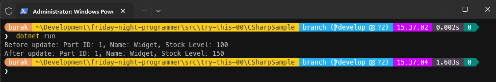
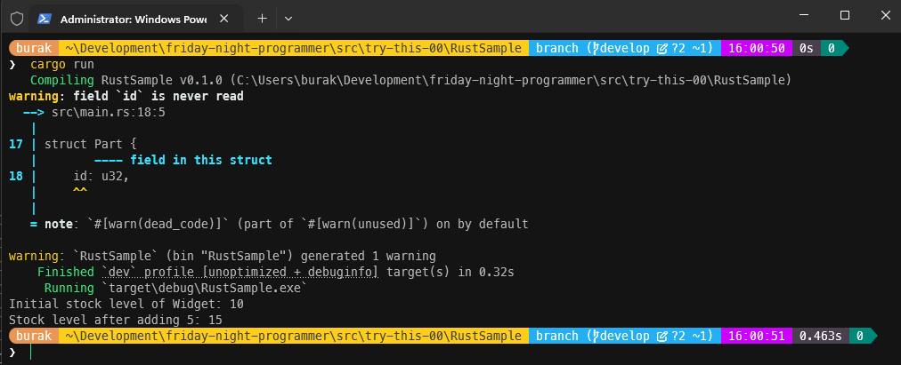
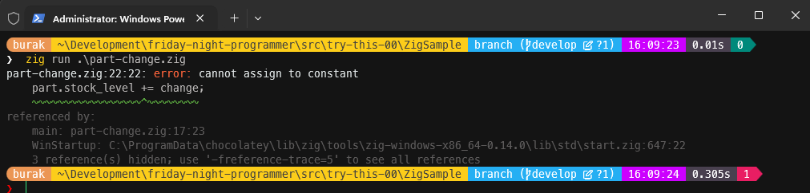
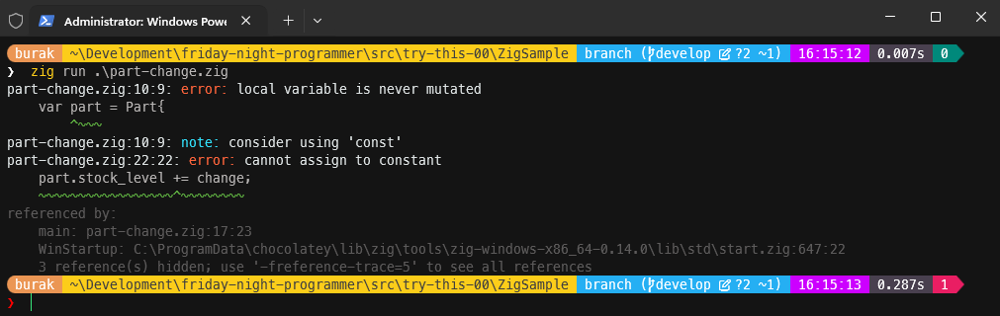
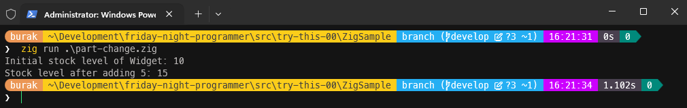

# Metot Parametrelerinden Gelen Değerleri Değiştirmek

C# programlama dilinde sınıf nesne örnekleri *(Class Object Instance)* metotlara varsayılan olarak referans türü *(reference type)* olarak iletilir. Bu, metot içinde yapılan değişikliklerin çağıran tarafı etkileyebileceği anlamına gelir. Bu çalışmada söz konusu senaryonun Rust ve Zig gibi programlama dillerinde nasıl ele alındığını incelemeye çalışıyorum.

> Şu notu düşmek isterim: Bu çalışmada amaç üç dili birbiriyle kıyaslamak değil, her bir dilin bu tip senaryoya yaklaşımını incelemektir. Normal koşullarda bir stok takip programını Rust ve Zig ile geliştirmeyi tercih etmem.

## C# Kod Örneği

İlk olarak C# tarafında bir kurgu hazırlayalım. Bu amaçla basit bir Console uygulaması açıp içerisine aşağıdaki kodları ekleyelim.

```csharp
namespace CSharpSample;
public class Program
{
    static void Main(string[] args)
    {
        Part part = new()
        {
            Id = 1,
            Name = "Widget",
            StockLevel = 100
        };

        Console.WriteLine($"Before update: Part ID: {part.Id}, Name: {part.Name}, Stock Level: {part.StockLevel}");
        UpdateStockLevel(part, 150);
        Console.WriteLine($"After update: Part ID: {part.Id}, Name: {part.Name}, Stock Level: {part.StockLevel}");
    }

    static void UpdateStockLevel(Part part, int newStockLevel)
    {
        part.StockLevel = newStockLevel;
    }
}

public class Part
{
    public uint Id { get; set; }
    public string? Name { get; set; }
    public int StockLevel { get; set; }
}
```

Yukarıdaki gibi bir kodlamayı kuvvetle muhtemel yapmayız. En azından Part isimli veri yapısının state'ini dışarıdan bir fonksiyon ile değiştirmeyi pek tercih etmeyiz. Ancak buradaki amaç için ele alabiliriz. Çalışma zamanındaki çıktı aşağıdaki gibi olacaktır.

```bash
# Program kodunu dotnet ile çalıştırabiliriz
dotnet run
```



Senaryoyu kısaca ele alalım. Main metodu içerisinde tanımladığımız Part isimli nesne örneğini, UpdateStockLevel metoduna parametre olarak gönderiyoruz. Bu bir sınıf olduğundan varsayılan olarak referans türü şeklinde iletiliyor. Dolayısıyla UpdateStockLevel metodu içerisinde yapılan değişiklikler, Main metodundaki orijinal nesneyi de doğrudan etkiliyor. Önceden de belirttiğim üzere bu şekilde state değiştirmeyi pek tercih etmem. En azından nesne örneğinin kendi üzerinden yapılmasının ya da değişiklik sonrası yeni bir Part nesnesinin geriye döndürülmesinden yanayım diyebilirim. Neyse neyse. Bunu bir kenara bıraklım. Şimdi aynı senaryoyu Rust dilinde ele almak istediğimizi düşünelim.

> Sevdiğim bir Rust programcısının şöyle bir sözü vardır; "Bu projede dot netçi gibi düşünerek Rust kodlaması yapmak istemedim" :D

## Rust Kod Örneği

Malum Rust ve Zig gibi dillerde class, struct, record gibi sayrımlar yoktur. Veri yapısı genel bir kavramdır ancak bunun taşınma, kullanılma şekli farkılılklar gösterir ve buna göre belleğin farklı konumlarında tutulmaları söz konusudur. Şunu da unutmayalım ki her iki dilde Managed ortamlar içermez. Rust bellek güvenliğini ön planda tutan tedbirleri derleme zamamında ele alırken Zig daha çok C'ye yakın bir yerde konumlanan modern bir dildir. Şimdilik bu derin detayları bir kenara bırakmak istiyorum zira Güney Kore bir Go ustası gibi Rust ve Zig'i kavramam tüm ömrümü alabilir :)

Öyleyse laf kalabalığını bir kenara bırakıp rust tarafındaki kodları geliştirerek devam edelim. İlk olarak aynı yaklaşımı benimseyelim.

```rust
fn main() {
    let mut part = Part {
        id: 1,
        name: String::from("Widget"),
        stock_level: 10,
    };

    println!("Initial stock level of {}: {}", part.name, part.stock_level);
    change_stock_level(part, 5);
    println!("Stock level after adding 5: {}", part.stock_level);
}

fn change_stock_level(part: Part, change: i32) {
    part.stock_level += change;
}

struct Part {
    id: u32,
    name: String,
    stock_level: i32,
}
```

Rust dilinde değişkenler varsayılan olarak immutable *(yani değeri değiştirilemez)* olarak kabul edilir. Bende **main** metodunun kapsama alanındaki **Part** nesnesini değiştirmek istediğimden onu **mut** anahtar kelimesi ile birlikte tanımladım. DotNetçi gibi düşünmememiz gerekse de velev ki düşündük ve programının beklediğimiz şekilde çalışacağını hayal ettik. Ne mi olur? Neredeyse kod satırı sayısından da fazla satırdan oluşan bir hatalar ve uyarılar listesi ile karşılaşırız. Aynen aşağıdaki ekran görüntüsünde olduğu gibi.


Olay main metodu içerisinde değişkenin sadece mutable olarak tanımlayıp her şeyin pürüzsüz bir şekilde çalışacağını zannetmemiz olacaktır. Rust dilinde bir değişkeni mutable olarak tanımlamak, o değişkenin sahip olduğu değerin başka bir metoda aktarılması durumunda orada da **mutable** olarak kabul edileceği anlamına gelmez. Rust dilindeki sahiplik *(ownership)* kavramı, bir değişkenin değerinin başka bir fonksiyona aktarılması durumunda orada yeni bir sahiplik oluşturulmasını gerektirir. Bu durumda, orijinal değişkenin sahipliği kaybolur ve artık orijinal değişkene de erişilemez hale gelir. Yani programcı olarak metoda aktardığım değişkenin referans üzerinden aktarılacağını ve açık bir şekilde bu referansın işaret ettiği değerin değiştirileceğini belirtmem söyleniyor. O halde kodları aşağıdaki gibi revize edelim.

```rust
fn main() {
    let mut part = Part {
        id: 1,
        name: String::from("Widget"),
        stock_level: 10,
    };

    println!("Initial stock level of {}: {}", part.name, part.stock_level);
    change_stock_level(&mut part, 5);
    println!("Stock level after adding 5: {}", part.stock_level);
}

fn change_stock_level(part: &mut Part, change: i32) {
    part.stock_level += change;
}

struct Part {
    id: u32,
    name: String,
    stock_level: i32,
}
```

id alanının hiç kullanmadığım için aldığım bir uyarı mesajı var ama onu şimdilik görmezden geliyorum. Programı tekrar çalıştırdığımızda beklediğimiz davranışın gerçekleştirildiğini görürüz.

```bash
# Program kodunu cargo ile çalıştırabiliriz
cargo run
```



> Burada ikinci kısımda ele almak üzere bir soru bırakayım; Ya birden fazla Thread bu parçanın stok seviyesini değiştirmek isterse? C# ne yapar, Rust ne kadar zorluk çıkartır, Zig'den ne haber?

## Zig Kod Örneği

Gelelim yeni yeni öğrenmeye çalıştığım Zig diline. Zig dilinde Rust'ta olduğu gibi immutable/mutable ayrımları söz konusu ancak ifade edilme şekilleri biraz daha farklı. Özellikle değerlerinde değişiklik yapılmasını istediğimiz değişkenler **var** anahtar kelimesi ile birlikte tanımlanmak zorundalar. Bunların dışındakiler ise **const** anahtar kelimesi ile tanımlanıyorlar. Üstelik Zig dilinde fonksiyon parametreleri gerçekten de değiştirilemez *(immutable)* olarak kabul edilmekteler. Yine bir DotNetçi gibi düşünerek zig tarafı kodlarını da aşağıdaki gibi geliştirerek ilerleyelim.

```zig
const std = @import("std");

const Part = struct {
    id: u32,
    name: []const u8,
    stock_level: i32,
};

pub fn main() void {
    const part = Part{
        .id = 1,
        .name = "Widget",
        .stock_level = 10,
    };

    std.debug.print("Initial stock level of {s}: {d}\n", .{ part.name, part.stock_level });
    change_stock_level(part, 5);
    std.debug.print("Stock level after adding 5: {d}\n", .{part.stock_level});
}

fn change_stock_level(part: Part, change: i32) void {
    part.stock_level += change;
}
```

Yine aynı mantıkta part isimli değişkeni bodoslama change_stock_level fonksiyonuna aktarıyoruz. Programı derleyip çalıştırdığımızda az önce söylediğim **immutable/mutable** ayrımına dair bir hata mesajı ile karşılaşırız.



Yani demem o ki ille değerini değiştireceğimiz bir değişken söz konusu ise, onu **var** ile bir **variable** olarak tanımamamız gerekir. Pekala, kodu bu hata mesajı doğrultusunda aşağıdaki gibi değiştirerek ilerleyelim.

```zig
const std = @import("std");

const Part = struct {
    id: u32,
    name: []const u8,
    stock_level: i32,
};

pub fn main() void {
    var part = Part{
        .id = 1,
        .name = "Widget",
        .stock_level = 10,
    };

    std.debug.print("Initial stock level of {s}: {d}\n", .{ part.name, part.stock_level });
    change_stock_level(part, 5);
    std.debug.print("Stock level after adding 5: {d}\n", .{part.stock_level});
}

fn change_stock_level(part: Part, change: i32) void {
    part.stock_level += change;
}
```

Her şeyin sorunsuz şekilde ilerleyeceğini düşünebilirsiniz ama bu sefer de şu kuralı hatırlamamız gerekir; Zig dilinde fonksiyon parametreleri varsayılan olarak immutable *(değiştirilemez)* kabul edilirler. main fonksiyonunun kapsama alanında yer alan part değişkenini var ile işaretlemiş olsak bile, metoda bu şekilde aktaramıyoruz. Sonuç olarak aşağıdaki gibi bir hata mesajı ile karşılaşırız.



İşte bu noktada başka bir çözümümüz var. Değişkeni fonksiyona referans olarak aktarmak. Aslında referans olarak aktarmaktan kastımız değişkenin bellekteki adresini fonksiyona iletmek. Yani **pointer** kullanarak adresi fonksiyona almak, fonksiyon içerisinde de pointer üzerinden değere erişip değiştirmek. Buna göre zig tarafındaki kodları aşağıdaki gibi değiştirerek ilereyelim.

```zig
const std = @import("std");

const Part = struct {
    id: u32,
    name: []const u8,
    stock_level: i32,
};

pub fn main() void {
    var part = Part{
        .id = 1,
        .name = "Widget",
        .stock_level = 10,
    };

    std.debug.print("Initial stock level of {s}: {d}\n", .{ part.name, part.stock_level });
    change_stock_level(&part, 5);
    std.debug.print("Stock level after adding 5: {d}\n", .{part.stock_level});
}

fn change_stock_level(part: *Part, change: i32) void {
    // part.*.stock_level += change; // Aşağıdaki kullanım ile aynı
    part.stock_level += change;
}    
```

Bu sefer beklediğimiz gibi fonksiyon içerisinde stok seviyesinde yapılan değişikliğin main fonksiyonundaki orijinal değişkeni de etkilediğini görürüz.



## Peki Ya İdel Yollar Hangisi?

Programcıdan programcıya veya senaryodan senaryoya değişmekle birlikte benim tercihim, eğer bir veri yapısına ait nesne örneğinin state'ini değiştirmek istiyorsak bunu o veri yapısına ait metotlar üzerinden yapmak yönünde. Tabii söz konusu değişiklikler bir takım kurallar barındıran dış bağımlılıklar içerisindeki fonksiyonlarda yapılacaksa o nesne örneğinden yararlanarak yeni bir nesne örneği oluşturmak, yeni nesne örneği verisinde gerekli değişiklikleri yapıp geriye döndürmek de düşünülebilir. Her ikisinde de veri yapısının muhteviyatı önemli olabilir. Büyük bir nesne yapısında sadece ufak bir state değişikliği için yeni örnekleme ile geriye dönmek de çok mantıklı olmayabilir. Ama en azından senaryomuzdaki veri yapısını Rust ve Zig taraflarında belki yeni örnekler üretme yoluyla nasıl kullanabileceğimizi gösterebilirim.

Yani, **change_stock_level** metodumuz yeni bir Part değişkeni oluşturup geriye döndürecek ve bunu main kapsamındaki var olan part değişkenine atayacağız. Hımm, oldukça makul görünüyor. Buna göre zig tarafındaki kodları aşağıdaki gibi değiştirsem sanırım kimsenin itirazı olmaz.

```zig
const std = @import("std");

const Part = struct {
    id: u32,
    name: []const u8,
    stock_level: i32,
};

pub fn main() void {
    var part = Part{
        .id = 1,
        .name = "Widget",
        .stock_level = 10,
    };

    std.debug.print("Initial stock level of {s}: {d}\n", .{ part.name, part.stock_level });
    part = change_stock_level(part, 5);
    std.debug.print("Stock level after adding 5: {d}\n", .{part.stock_level});
}

fn change_stock_level(part: Part, change: i32) Part {
    const new_part = Part{
        .id = part.id,
        .name = part.name,
        .stock_level = part.stock_level + change,
    };
    return new_part;
}
```

Program sorunsuz şekilde çalışır ve beklediğimiz çıktıyı üretir. Dilerseniz birde Rust tarafında aynı yaklaşımı deneyelim.

```rust
struct Part {
    id: u32,
    name: String,
    stock_level: i32,
}

fn main() {
    let mut part = Part {
        id: 1,
        name: String::from("Widget"),
        stock_level: 10,
    };

    println!("Initial stock level of {}: {}", part.name, part.stock_level);
    part = change_stock_level(part, 5);
    println!("Stock level after adding 5: {}", part.stock_level);
}

fn change_stock_level(part: Part, change: i32) -> Part {
    Part {
        stock_level: part.stock_level + change,
        ..part
    }
}
```

**Mutable** olarak tanımladığımız part değişkeninin sahipliği önce **change_stock_level** metoduna aktarılır, orada yeni bir **Part** nesnesi oluşturulur ve geriye döndürülür. **main** metodunun kapsamındaki part değişkeni de bu yeni nesne örneğini sahiplenir. Program bu haliyle sorunsuz şekilde çalışacaktır.

Bunlar fena kodlar değil ama ideal yaklaşımlar da değil. Bir tilki misali kürkçü dükkanına mı döneceğiz yoksa. Aslında üç dilde de bu tip bir state değişikliğini nesne yapısının kendi içerisine sarmalanmış metotlar üzerinden yapmak en ideal olanı. Ancak bu çalışma kapsamında amacımızın bu olmadığını hatırlayalım. Ben yine de ideal yaklaşım da kodları nasıl inşa ederizi göstermek isterim.

En şık kullanımlardan birisi C# tarafında aşağıdaki gibi olabilir. İdeal yaklaşıma göre bir nesnenin durumunu eğer dışarıdan bir bileşen bağımlılığı üzerinden değiştirmek gerekmiyorsa *(yani stok seviyesinin değiştirilme ilkeleri Part sınıfına dışarıdan öğretilecekse ki bu durumda Part sınıfı yerine StockLevelService gibi başka bir sınıf kullanılır)* nesnenin durumunu değiştiren metotları o nesnenin kendi içinde tanımlamaktır.

```csharp
namespace CSharpSample;

public class Program
{
    static void Main(string[] args)
    {
        Part part = new()
        {
            Id = 1,
            Name = "Widget",
        };

        Console.WriteLine($"Before update: Part ID: {part.Id}, Name: {part.Name}, Stock Level: {part.StockLevel}");
        part.UpdateStockLevel(150);
        Console.WriteLine($"After update: Part ID: {part.Id}, Name: {part.Name}, Stock Level: {part.StockLevel}");
    }
}

public class Part
{
    public uint Id { get; set; }
    public string? Name { get; set; }
    public int StockLevel { get; private set; }
    public void UpdateStockLevel(int newStockLevel)
    {
        StockLevel = newStockLevel;
    }
}
```

Tabii Rust ve Zig tarafında da benzer yaklaşımlar mümkün. Örneğin Rust tarafında aynı yaklaşım aşağıdaki kodlarda olduğu gibi ele alınabilir.

```rust
struct Part {
    id: u32,
    name: String,
    stock_level: i32,
}

impl Part {
    fn change_stock_level(&mut self, change: i32) -> () {
        self.stock_level += change;
    }
}

// CASE03: Nesne içeriğine nesneye ait metot ile değiştirme
fn main() {
    let mut part = Part {
        id: 1,
        name: String::from("Widget"),
        stock_level: 10,
    };

    println!("Initial stock level of {}: {}", part.name, part.stock_level);
    part.change_stock_level(5);
    println!("Stock level after adding 5: {}", part.stock_level);
}
```

Zig programlama tarafı için de aşağıdaki gibi bir kodlama düşünülebilir.

```zig
const std = @import("std");

const Part = struct {
    id: u32,
    name: []const u8,
    stock_level: i32,
    pub fn change_stock_level(self: *Part, change: i32) void {
        self.stock_level += change;
    }
};

// //CASE02 Nesne durumunu kendi metodu ile değiştirme
pub fn main() void {
    var part = Part{
        .id = 1,
        .name = "Widget",
        .stock_level = 10,
    };

    std.debug.print("Initial stock level of {s}: {d}\n", .{ part.name, part.stock_level });
    part.change_stock_level(5);
    std.debug.print("Stock level after adding 5: {d}\n", .{part.stock_level});
}
```

## Ne Öğrendim?

Peki ya tüm bunlar bana ne öğretti *(neleri hatırlattı?)* Şöyle özetleyebilirim;

- **C#** dilinde sınıf nesne örnekleri metotlara varsayılan olarak referans türü olarak taşınır. Bu nedenle metot içinde yapılan değişiklikler çağıran taraftaki orjinal nesneyi de doğrudan etkiler. Derleyici bu konuda herhangi bir uyarı vermez ya da alınmaz. Atıl kalan referanslar olsa bile bu sorun değildir zira **Garbage Collector** devrededir.
- **Rust** tarafında değişkenler varsayılan olarak immutable *(değiştirilemez)* olarak kabul edilir. Bir değişkenin değerini değiştirmek istiyorsak onu **mutable** olarak tanımlamamız gerekir. Ancak bunu yapsak dahi o değişkenin sahip olduğu değerin başka bir metoda aktarılması durumunda taşındığı yerde de değiştirilebilir olarak kabul edileceği anlamına gelmez. Sahiplik *(ownership)* kavramı, bir değişkenin değerinin başka bir fonksiyona aktarılması durumunda orada yeni bir sahiplik oluşturulmasını gerektirir. Bu durumda, orijinal değişkenin sahipliği kaybolur ve artık orijinal değişkene de erişilemez hale gelir. Eğer bir değişkenin değerini başka bir fonksiyonda değiştirmek istiyorsak, o değişkeni referans olarak *(& operatörü ile ve hatta mut & şeklinde)* aktarması beklenir.
- **Zig** dilinde fonksiyon parametreleri immutable *(değiştirilemez)* kabul edilirler. Eğer bir fonksiyonun parametresinde gelen değişken değerini/içeriğini değiştirmek istiyorsak, o parametreyi pointer *(işaretçi)* olarak tanımlamamız gerekir. Böylece fonksiyon, parametrenin bellekteki adresine erişebilir ve bu adres üzerinden gerekli değişikliği yapabilir.
- Dil bağımsız düşünürsek bir veri yapısına ait nesne örneğinin muhteviyatını değiştirmek için söz konusu veri yapısına ait metotları kullanmak daha doğru bir yaklaşımdır *(Tartışmaya açık)*. Eğer değişiklikler bir takım kurallar barındıran dış bağımlılıklar içerisindeki metotlarda yapılacaksa o nesne örneğinden yararlanarak yeni bir nesne örneği oluşturmak, yeni nesne örneği verisinde gerekli değişiklikleri yapıp geriye döndürmek de düşünülebilir *(ki bu da tartışmaya açıktır)*. Ancak ideal olan yöntem kullanılan dilin amaçlarına göre değişir. Sevgili meslektaşımın dediği gibi Rust veya Zig içinde DotNetçi gibi düşünmemek gerekir ve tam tersi de geçerlidir.

Böylece küçük bir merakla başlayan deneysel çalışmamın bir bölümünü tamamlamış oldum. Umarım faydalı olmuştur. Diğer yandan buradaki uygulama pratiklerinde **Single-Thread** çalışan bir ortamda çok sorun yaşamadan ilerledik. Ancak birden fazla iş parçacığının *(multi-thread)* aynı veri yapısına ait nesne örneğinde değişiklik yapmaya çalıştığı durumlarda işin rengi değişecektir. Bu tip senaryoları da ilerleyen zamanlarda ele almaya çalışacağım.
