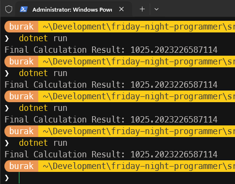
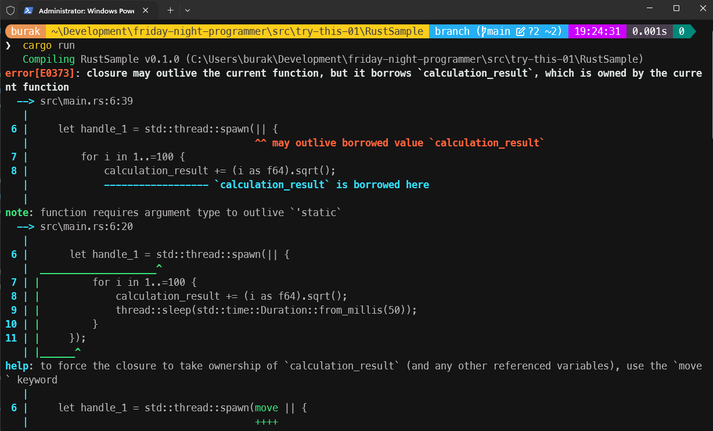
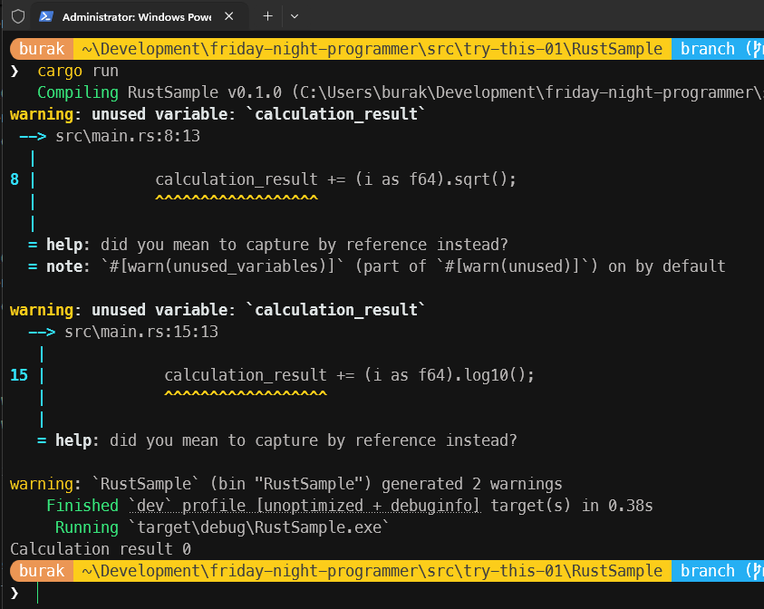
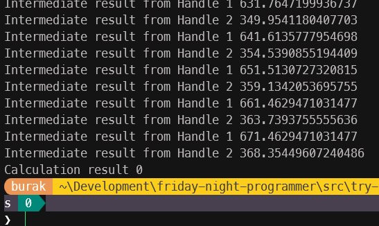
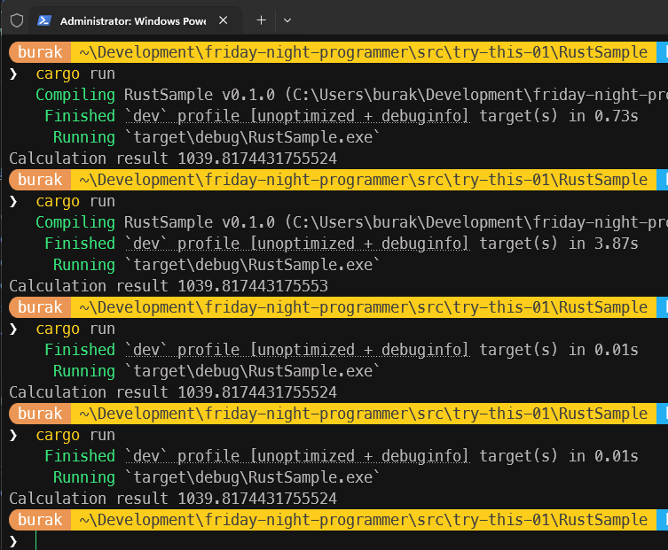

# Çoklu Thread Ortamlarında Ortak Veriyi Değiştirmek

[Try This 00](/documents/TryThis00.md) dokümanında, bir metoda aktarılan parametre üzerinden değişklik yapmak istediğimizde bunun C#, Rust ve Zig programlama dilleri tarafındaki ele alınış biçimlerini farklı örneklerle incelemeye çalışmıştık. Nihayetinde ulaştığımız noktada bir nesnenin kendisini tanımlayan değerlerin değiştirilmesinde dil bazında ve hatta kullanılacak yazılım mimarisi bazında farklı yaklaşımlar olduğunu görmüştük. Merak ettiğim bir başka konu da ise, çoklu thread (çoklu iş parçacığı) ortamlarında ortak veriyi değiştirmek. Aynı veri üzerinde birden fazla thread okuma ve yazma işlemi yapması çok sık karşılaşılan bir durum. Şu anda elimde managed ortamı olan, yerleşik framework kütüphanelerinde üst düzey soyutlamalar sunan C#, bellek güvenliği ve sahiplik (ownership) kavramlarıyla öne çıkan Rust ve C'nin modern bir versiyonu olarak gördüğüm düşük seviyeli sistem programlama dili olan Zig var.

## Önce C# Tarafı

Konuyu olabildiğince basit ele almak istiyorum. Söz gelimi aynı veri üzerine birden fazla thread'in yazmaya çalıştığı bir örnek düşünelim. Aşağıdaki kod parçası ile ilerleyebiliriz.

```csharp
public class Program
{
    static double CalculationResult = 0;

    static void Main(string[] args)
    {
        Thread threadA = new(PerformCalculationsA);
        Thread threadB = new(PerformCalculationsB);

        threadA.Start();
        threadB.Start();

        threadA.Join();
        threadB.Join();

        Console.WriteLine($"Final Calculation Result: {CalculationResult}");
    }

    static void PerformCalculationsA()
    {
        for (int i = 0; i < 100; i++)
        {
            CalculationResult += Math.Sqrt(i);
            Thread.Sleep(50);
        }
    }

    static void PerformCalculationsB()
    {
        for (int i = 0; i < 100; i++)
        {
            CalculationResult += Math.Log(i + 1);
            Thread.Sleep(50);
        }
    }
}
```

Bu programda CalculationResult isimli bir değişkene iki farklı thread tarafından yazma işlemi yapılıyor. Thread'ler tarafından işletilen etotlar kendi içlerinde açtıkları döngülerde hesaplama maliyeti yüksek sayılabilecek bir takım işlemler yapıyor. Karekök alma ve logaritma hesaplamaları sırasında olayı daha da dramatize etmek için Sleep çağrıları ile gecikmeler oluşturuyoruz. Kendi sistemim de bu örneğin çalışma zamanı çıktıları aşağıdaki gibi oldu.


Aslında her seferinde aynı değerin oluşmasını beklerdik. Ortada herhangi bir hata mesajı yok ama sonuçlar her seferinde farklı çıkıyor. Burada bir tahmin yürütüp bir thread söz konusu değişkene yazma işlemi yaparken diğer thread'in onu beklemesi sağlayabiliriz. Kodu aşağıdaki şekilde değiştirerek ilerleyelim.

```csharp
using System.Threading;
public class Program
{
    static double CalculationResult = 0;
    static readonly Lock calculationLock = new();

    static void Main(string[] args)
    {
        Thread threadA = new(PerformCalculationsA);
        Thread threadB = new(PerformCalculationsB);

        threadA.Start();
        threadB.Start();

        threadA.Join();
        threadB.Join();

        Console.WriteLine($"Final Calculation Result: {CalculationResult}");
    }

    static void PerformCalculationsA()
    {
        for (int i = 0; i < 100; i++)
        {
            double partialResult = Math.Sqrt(i);
            lock (calculationLock)
            {
                CalculationResult += partialResult;
            }
            Thread.Sleep(50);
        }
    }

    static void PerformCalculationsB()
    {
        for (int i = 0; i < 100; i++)
        {
            double partialResult = Math.Log(i + 1);
            lock (calculationLock)
            {
                CalculationResult += partialResult;
            }
            Thread.Sleep(50);
        }
    }
}
```

Bu sefer sonuçlar beklediğimiz gibi oluyor. Her seferinde aynı toplam değerini yakalıyoruz.



Yeni örneğimizde en basit kilit mekanizması olarak gördüğüm Lock nesnesini kullanıyoruz. Her iki thread'in de ortak veriye erişmeden önce bu kilidi alması gerekiyor. Bir thread kilidi aldıktan sonra diğer thread'in kilit serbest bırakılana kadar beklemesi gerekiyor. Bu sayede aynı anda sadece bir thread ortak veriye erişip üzerinde değişiklik yapabiliyor. Bu da veri tutarlılığını sağlıyor. Bu zaten Mutual Exclusion *(Karşılıklı Dışlama)* prensibinin temel çalışma mantığı. Elbette farklı kilit mekanizmaları ve dolayısıyla stratejileri de var. Örneğin, Reader-Writer Lock mekanizması ile birden fazla thread'in aynı anda okuma yapmasına izin verilip, yazma işlemi yapılacağı zaman tüm okuma işlemlerinin bitmesi beklenebilir. Bu tür stratejiler performans açısından önemli olabilir. Ancak burada temel prensip olarak ortak veriye erişim sırasında veri tutarlılığını sağlamak için bir tür senkronizasyon mekanizması kullanılması gerektiği aşikardır. Interlocked sınıfı gibi daha düşük seviyeli atomik işlemler sunan yapılar da var. Aynı örneği birde Interlocked sınıfı kullanarak ele alalım.

```csharp
using System.Threading;
public class Program
{
    static double CalculationResult = 0;

    static void Main(string[] args)
    {
        Thread threadA = new(PerformCalculationsA);
        Thread threadB = new(PerformCalculationsB);

        threadA.Start();
        threadB.Start();

        threadA.Join();
        threadB.Join();

        Console.WriteLine($"Final Calculation Result: {CalculationResult}");
    }

    static void PerformCalculationsA()
    {
        for (int i = 0; i < 100; i++)
        {
            double partialResult = Math.Sqrt(i);
            double initialValue, computedValue;
            do
            {
                initialValue = CalculationResult;
                computedValue = initialValue + partialResult;
            } while (Interlocked.CompareExchange(ref CalculationResult, computedValue, initialValue) != initialValue);
            Thread.Sleep(50);
        }
    }

    static void PerformCalculationsB()
    {
        for (int i = 0; i < 100; i++)
        {
            double partialResult = Math.Log(i + 1);
            double initialValue, computedValue;
            do
            {
                initialValue = CalculationResult;
                computedValue = initialValue + partialResult;
            } while (Interlocked.CompareExchange(ref CalculationResult, computedValue, initialValue) != initialValue);
            Thread.Sleep(50);
        }
    }
}
```

## Peki ya Rust tarafı?

Rust, sahiplik (ownership) ve borçlanma (borrowing) ilkeleri ile zaten bellek güvenliğini sıkı sıkıya denetlemeye çalışıyor. Benzer şekilde çoklu thread ortamlarında da veri yarışlarını önlemek için güçlü mekanizmalar da sunuyor. Ancak senaryoya ve ortak değişkene erişim şekline bağlı olarak (sadece okuma amaçlı, çok okuyucu tek yazıcı vb.) farklı stratejiler izlemek gerekebiliyor. Bu durumda karşımıza çıkan en yaygın çözümlerden biri Arc (Atomic Reference Counting) ve Mutex (Mutual Exclusion) kombinasyonu oluyor. İlk olarak önceki yazımızda da vurguladığımız gibi dotNetçi kafası ile düşünerek hareket edelim. Bu noktada kodu pekala aşağıdaki gibi yazsak olur.

```rust
use std::thread;

fn main() {
    let mut calculation_result: f64 = 0.0;

    let handle_1 = std::thread::spawn(|| {
        for i in 1..=100 {
            calculation_result += (i as f64).sqrt();
            thread::sleep(std::time::Duration::from_millis(50));
        }
    });

    let handle_2 = std::thread::spawn(|| {
        for i in 1..=100 {
            calculation_result += (i as f64 + 1.0).ln();
            thread::sleep(std::time::Duration::from_millis(50));
        }
    });

    handle_1.join().unwrap();
    handle_2.join().unwrap();

    println!("Calculation result {}", calculation_result);
}
```

Syntax vs farklılaşsa da benzer bir işleyiş olduğunu söyleyebilirim. handle_1 ve handle_2 isimliye yumurtlanan thread'ler ortak değişken olan calculation_result üzerinde yazma işlemi yapıyor. Ne varki bu kodu çalıştıramayacağız zira derleyici bizi aşağıdaki gibi üzecek.



Bu son derece doğaldır zira oluşturulan thread'ler kendi kapsamlarında bir üst thread olan main'deki bir değişkeni kullanma niyetindedir. Bunu açıkça ifade etmemiz beklenir ve bunun yolu da move operatörünü kullanmaktır. Dolayısıyla söz konusu kodları aşağıdaki gibi değiştirerek ilerleyebiliriz.

```rust
use std::thread;

fn main() {
    let mut calculation_result: f64 = 0.0;

    let handle_1 = std::thread::spawn(move || {
        for i in 1..=100 {
            calculation_result += (i as f64).sqrt();
            thread::sleep(std::time::Duration::from_millis(50));
        }
    });

    let handle_2 = std::thread::spawn(move || {
        for i in 1..=100 {
            calculation_result += (i as f64 + 1.0).ln();
            thread::sleep(std::time::Duration::from_millis(50));
        }
    });

    handle_1.join().unwrap();
    handle_2.join().unwrap();

    println!("Calculation result {}", calculation_result);
}
```

Bu sefer program sorunsuz şekilde çalışacaktır ancak sonuçlar hiç de beklediğimiz gibi olmayacaktır. Programı kaç kez çalıştırırsak çalıştıralım her seferin 0 *(yazıyla sıfır)* sonucunu elde ederiz :D Üstelik Rust derleyicisi calculation_result değişkeninin hiç kullanılmadığını bile iddia eder.



Bunu bir açıklayalım. move operatörü ile main thread içerisindeki calculation_result değişkeni açılan thread scope'larına kopyalanarak taşınıyor. Yani her thread kendi calculation_result kopyasına sahip olarak çalışıyor. Dolayısıyla += operatörünü main thread içerisindeki calculation_result değişkenine uyguluyor gibi görünsek de bu aslında o scope içerisine alınmış kopya üzerinde yapılan bir işlem. Gelin bu teoriyi ispat etmeye çalışalım. Bu amaçla kodu aşağıdaki gibi değiştirelim.

```rust
use std::thread;

fn main() {
    let mut calculation_result: f64 = 0.0;

    let handle_1 = std::thread::spawn(move || {
        for i in 1..=100 {
            calculation_result += (i as f64).sqrt();
            thread::sleep(std::time::Duration::from_millis(50));
            println!("Intermediate result from Handle 1 {}", calculation_result);
        }
    });

    let handle_2 = std::thread::spawn(move || {
        for i in 1..=100 {
            calculation_result += (i as f64 + 1.0).ln();
            thread::sleep(std::time::Duration::from_millis(50));
            println!("Intermediate result from Handle 2 {}", calculation_result);
        }
    });

    handle_1.join().unwrap();
    handle_2.join().unwrap();

    println!("Calculation result {}", calculation_result);
}
```



Tabii bu benim bakış açımdan bir ispat. Her handle scope'u kopyalayarak aldığı calculation_result değişkeni üzerinde işlemler yapıyor ve kendi ara sonuçlarını yazdırıyor. Ama aynı şey main thread içindeki calculation_result değeri için geçerli değil. Burada calculation_result değişkeninin f64 türünden olduğunu ve Copy trait'ini implemente ettiğini hatırlatayım. O halde bu işi Rust tarafında istediğimiz şekilde nasıl yapabileceğimize bir bakalım. Her şeyden önce ortak verinin iki thread içerisinde de kullanılabiliyor olması lazım. Bunun için Atomic Reference Counting (Arc) yapısını kullanabiliriz.

Arc, bir verinin birden fazla sahip tarafından paylaşılmasına olanak tanır ve referans sayımı yaparak belleğin doğru şekilde yönetilmesini sağlar. Ancak Arc tek başına yeterli değildir çünkü aynı anda birden fazla thread'in veriyi değiştirmesine izin vermez. Bu nedenle Mutex (Mutual Exclusion) yapısını da kullanmamız gerekir. Mutex, aynı anda sadece bir thread'in veriye erişmesine izin verir ve böylece data races durumunu önler. Bu kombinasyonun uygulanışı aşağıdaki kod parçasında olduğu gibidir.

```rust
use std::thread;
use std::sync::Arc;

fn main(){
    let calculation_result = Arc::new(std::sync::Mutex::new(0.0_f64));

    let calc_res_clone_1 = Arc::clone(&calculation_result);
    let handle_1 = thread::spawn(move || {
        for i in 1..=100 {
            let mut result = calc_res_clone_1.lock().unwrap();
            *result += (i as f64).sqrt();
            thread::sleep(std::time::Duration::from_millis(50));
        }
    });

    let calc_res_clone_2 = Arc::clone(&calculation_result);
    let handle_2 = thread::spawn(move || {
        for i in 1..=100 {
            let mut result = calc_res_clone_2.lock().unwrap();
            *result += (i as f64 + 1.0).ln();
            thread::sleep(std::time::Duration::from_millis(50));
        }
    });

    handle_1.join().unwrap();
    handle_2.join().unwrap();

    println!("Calculation result {}", *calculation_result.lock().unwrap());
}
```

İşte çalışma zamanı çıktısı.



Ay now, ay now... Tuhaf bir durum söz konusu. Yüksek hassasiyetli 64 bit floating point değer her deneme için %100 tutarlı değil gibi. İkinci denememde örneğin bir üst değere yuvarlanmış gibi. Alt alta yazınca fark daha net görülebiliyor.

```text
1039.8174431755524
1039.817443175553
```

Üstelik .net tarafındaki gibi iki thread ve her birisinde 100er iterasyon içeren döngülerde çalışırken. Buradaki farkın karekök ve logaritma işlemlerinden kaynaklanan küçük yuvarlama hatalarından mı yoksa Mutex kilitlenmesi sırasında ortaya çıkan performans etkilerinden mi kaynaklandığını bilmiyorum. Belki de her ikisi birden. Ancak sonuçların her seferinde aynı olmaması dikkat çekici. Belki de Rust tarafında floating point işlemlerinin deterministik olmaması ile ilgili bir durumdur bu. Bunu araştırmak lazım.

## Zig Tarafı

Gelelim yeni yeni öğrenemye çalıştığım Zig tarafına.

> DEVAM EDECEK AMA ÖNCE ZİG'DE THREAD KONUSUNU ÖĞRENMEM LAZIM :)
