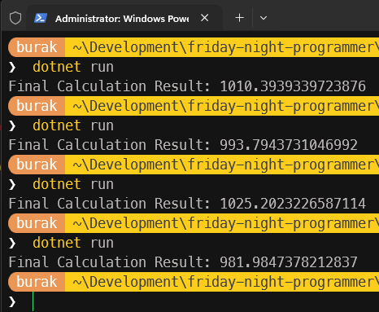

# Çoklu Thread Ortamlarında Ortak Veriyi Değiştirmek

[Try This 00](/documents/TryThis00.md) dokümanında, bir metoda aktarılan parametre üzerinden değişklik yapmak istediğimizde bunun C#, Rust ve Zig programlama dilleri tarafındaki ele alınış biçimlerini farklı örneklerle incelemeye çalışmıştık. Nihayetinde ulaştığımız noktada bir nesnenin kendisini tanımlayan değerlerin değiştirilmesinde dil bazında ve hatta kullanılacak yazılım mimarisi bazında farklı yaklaşımlar olduğunu görmüştük. Merak ettiğim bir başka konu da ise, çoklu thread (çoklu iş parçacığı) ortamlarında ortak veriyi değiştirmek. Aynı veri üzerinde birden fazla thread okuma ve yazma işlemi yapması çok sık karşılaşılan bir durum. Şu anda elimde managed ortamı olan, yerleşik framework kütüphanelerinde üst düzey soyutlamalar sunan C#, bellek güvenliği ve sahiplik (ownership) kavramlarıyla öne çıkan Rust ve C'nin modern bir versiyonu olarak gördüğüm düşük seviyeli sistem programlama dili olan Zig var.

Konuyu olabildiğince basit ele almak istiyorum. Söz gelimi aynı veri üzerine birden fazla thread'in yazmaya çalıştığı bir örnek düşünelim. Konuya C# tarafı ile başlamakta yarar var.

```csharp
namespace CSharpSample;

public class Program
{
    static double CalculationResult = 0;

    static void Main(string[] args)
    {
        Thread threadA = new(PerformCalculationsA);
        Thread threadB = new(PerformCalculationsB);

        threadA.Start();
        threadB.Start();

        threadA.Join();
        threadB.Join();

        Console.WriteLine($"Final Calculation Result: {CalculationResult}");
    }

    static void PerformCalculationsA()
    {
        for (int i = 0; i < 100; i++)
        {
            CalculationResult += Math.Sqrt(i);
            Thread.Sleep(50);
        }
    }

    static void PerformCalculationsB()
    {
        for (int i = 0; i < 100; i++)
        {
            CalculationResult += Math.Log(i + 1);
            Thread.Sleep(50);
        }
    }
}
```

Bu programda CalculationResult isimli bir değişkene iki farklı thread tarafından yazma işlemi yapılıyor. Thread'ler tarafından işletilen etotlar kendi içlerinde açtıkları döngülerde hesaplama maliyeti yüksek sayılabilecek bir takım işlemler yapıyor. Karekök alma ve logaritma hesaplamaları sırasında olayı daha da dramatize etmek için Sleep çağrıları ile gecikmeler oluşturuyoruz. Kendi sistemim de bu örneğin çalışma zamanı çıktıları aşağıdaki gibi oldu.



Aslında her seferinde aynı değerin oluşmasını beklerdik. Ortada herhangi bir hata mesajı yok ama sonuçlar her seferinde farklı çıkıyor. Burada bir tahmin yürütüp bir thread söz konusu değişkene yazma işlemi yaparken diğer thread'in onu beklemesi sağlayabiliriz. Kodu aşağıdaki şekilde değiştirerek ilerleyelim.

```csharp

```
