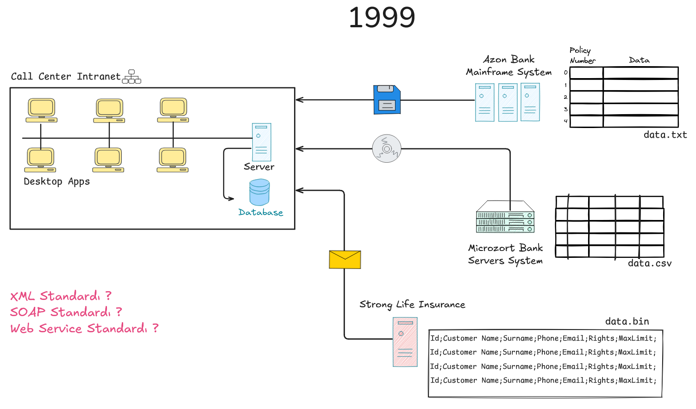
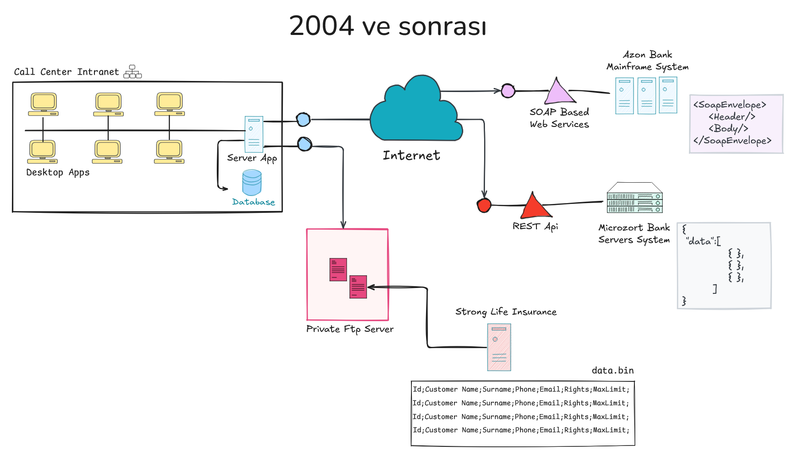
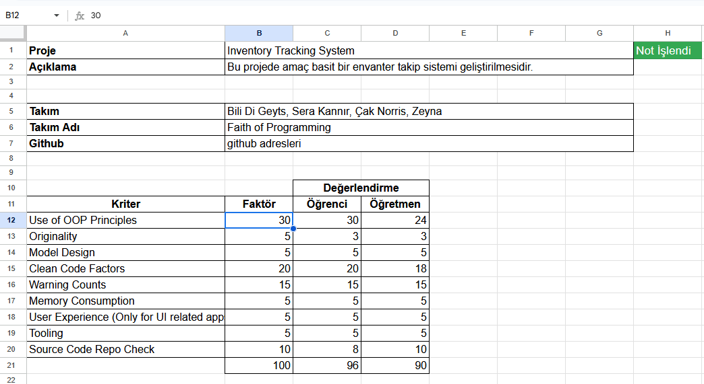
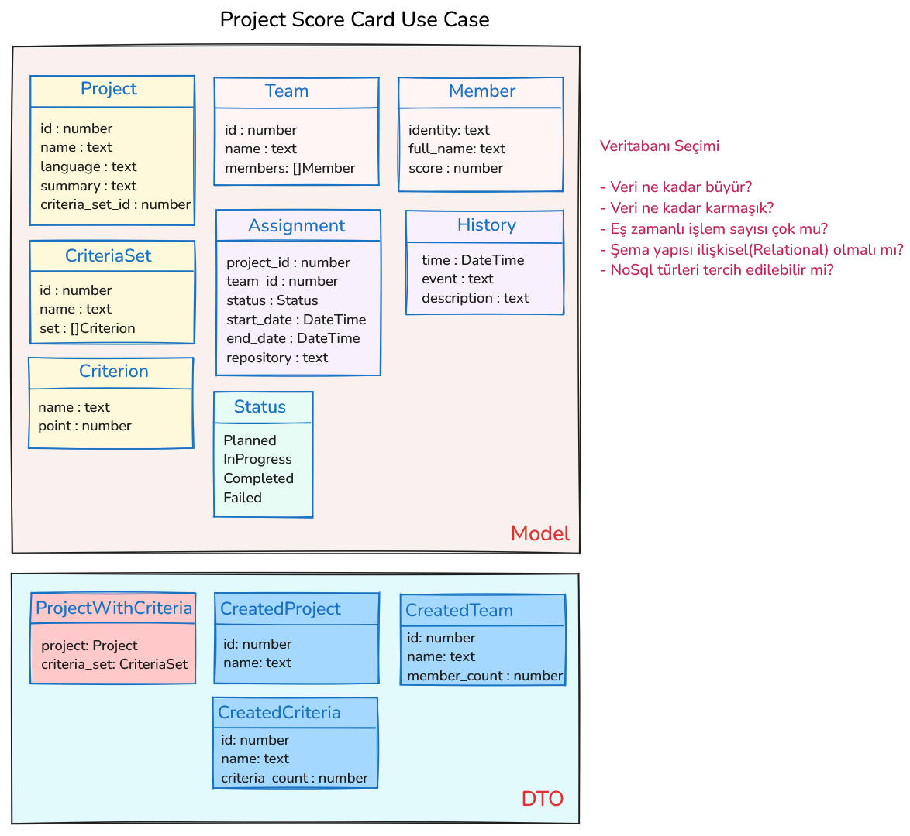
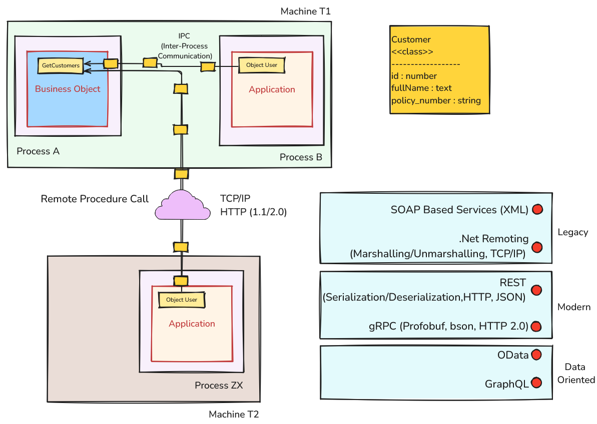

# Use Cases

Burada sezon boyunca üzerinde durulabilecek örnek senaryolara ait detaylar yer almaktadır. Senaryolar UC kodları ile işaretlenmiştir.

## UC00 : Çağrı Merkezi Çözümleri için SDK

Bir çağrı merkezinin işleyişini düşünelim. Operatörlerin kullandığı uygulamanın ilk sürümü geliştiriliyor. Tarihler milenyuma bir kalayı göstermekte. Çağrı merkezindeki operatörler windows işletim sistemi için yazılmış bir masaüstü uygulama kullanıyorlar. Müşteri verileri farklı firmalardan farklı zaman dilimlerinde ve farklı depolama cihazları üzerinden geliyorlar. Örneğin müşteri portföyü nispeten küçük olan bir sigorta firması verisini diskete alıp mektupla gönderiyor ve bunu ayda bir gerçekleştiriyor. Bir başka finans kurumu ise yüksek müşteri portföyünü ayda bir olmak suretiyle CD ile yolluyor. Hatta farklı bir firma nispeten ilk sisteme aktarılan müşterilerinde gerçekleşen güncellemeleri içeren bir e-postayı firmaya gönderiyor. Her kurumsal müşterinin yolladığı bilgiler farklı formatlarda ve farklı şema yapılarına sahip. Program ilk yıllarında büyük müşteri verilerini dBase, Paradox ve benzeri veri tabanlarında yönetebiliyor ancak zamanla sisteme yeni kurumsal müşteriler dahil oluyor ve kullanılacak veri boyutu giderek büyüyor. Sonuçta Oracle veri tabanına geçilmesine karar veriliyor. Bu senaryoyu 1999 yılı itibariyle aşağıdaki gibi hayal edelim.



Sistem migration planlarından sonra birkaç yıl daha sorunsuz çalışıyor. Çağrı merkezindeki operatör sayısı üç katına çıkıyor ancak tüm sistem aynı kattaki bir network üzerinden yürümeye devam ediyor. Ne yazık ki bir süre sonra korkunç salgın başlıyor ve pandemi ilan ediliyor. İnsanlar evlere kapanırken çağrı merkezi personelinin operasyonu evdeki bilgisayarlarından yürütmesi gerekiyor. Kısa süre içerisinde tüm uygulamanın web tabanlı bir sisteme geçmesine karar veriliyor. Çağrı merkezinin anlaşmalı olduğu kurumsal müşteriler modern teknolojilerden yararlanarak portföylerini artık servisler aracılığıyla iletebileceklerini belirtiyor ancak veri boyutları oldukça büyük ve bu nedenle sadece değişen ve yeni eklenen müşteri verilerinin çekileceği bir sisteme ihtiyaç var gibi duruyor. O vakitlerde firmalar bazı müşteri bilgilerini XML Web servisler ve hatta REST tabanlı api'ler araclığı ile de vermeye başlıyorlar. Arada yine işi farklı şekillerde çözen örneğin iki kurum arasında güvenli olarak kullanılabilen bir FTP sunucusuna dosya bırakanlar da var. Bu yeni duruma göre çağrı merkezinde müşteri verilerinin tutulmasına da gerek olmayabilir lakin bu birazda iş modelinin yürütülüşüne bağlı. Neyse ki biz bu detayları çok fazla kurcalamıyoruz ve senaryomuz aşağıdaki şekline bürünmeye başlıyor.



Zamanla uygulamadaki teknik borç yükünün arttığı fark ediliyor. Şirket oldukça şanslı ki kendilerine ürünü yenilemeleri için iyi bir bütçe ve kaynak ayrılıyor. Var olan sistemi günümüz teknolojileri ile yeniden yazmamız bekleniyor.

En başında itibaren yeni sürüme kadar çıkabilecek sadece ufak değişiklilerle yeni teknolojilere adapte edilebilecek bir çatı _(Framework)_ geliştirilebilir miydi? Müşteri verilerinin çağrı merkezi uygulaması tarafından ele alınmasında ne tür senaryolar ele alınabilirdi?

## UC01 : Üniversite Dönem Projelerinin Yönetimi için Uygulama

Üniversitede ders verdiğimizi düşünelim. Dönem boyunca öğrenciler belli konu başlıklarında projeler alıyor olsun. Projelerde konular belli ve eğitmen tarafından giriliyor. Öğrencilerin en az iki kişilik takımlar oluşturarak havuzdan bir proje seçmesi isteniyor. Projelerin github veya muadili bir kod reposunda tutulması isteniyor. Proje notu takımdaki tüm öğrenciler için geçerli. Proje notunun 100 üzerinden hesap edildiğini düşünürsek belli başlı kriterleri sağlaması bekleniyor. Örneğin mutlak bir kaynak kod reposunda tutulması, detaylı bir Readme dosyası içermesi, Clean Code kriterlerini sağlaması, seçilmiş olan dile göre belli prensipleri içermesi _(Örneğin C# ile ilgili bir proje ise OOP temellerini barındırması, SOLID ilkelerine uygun olması)_ iyi bir model tasarımına sahip olması ve benzer birçok kriter sayılabilir. Normalde aşağıdaki gibi bir Excel tablosu pekala bu iş için oldukça idealdir ki ben bunu kullanıyorum. İTÜ Matematik Mühendisliği bölümüne verdiğim C# ile Nesne Yönelimli Programlamanın temelleri konulu derse ait proje ödevlerinden birisini aşağıdaki Google Sheet tablosunda olduğu gibi tutmuştum.



Aslında Excel/Google Sheet bu tip çözümlerde son derece kullanışlı araçlar. Gerçekten başka hiçbir programa ihtiyaç duymadan her şeyi Excel gibi ürünlerde halletmek pekala mümkün olabilir :) Ancak biz bunun için bir program yazmaya çalışabiliriz. Senaryomuzu baz alarak proje, takım ve öğrenci girişlerinin yapılabildiği, proje takım eşleştirmelerinin gerçekleştirildiği, proje gelişim tarihçesinin izlenebildiği web tabanlı bir uygulama ele alınabilir. Başlangıçta proje içerisindeki enstrümanlara ait model yapısı aşağıdaki çizelgede olduğu gibi düşünülebilir ancak ihtiyaçlara göre bu zamanla değişebilir.



Gerçekten de günler ilerledikçe ve ilgili proje üzerinde düşünmeye devam ettikçe hem model içerikleri değişiyor hem de DTO _(Data Transfer Objects)_ gibi yeni ihtiyaçlar ortaya çıkıyor. Örneğin ilişkisel bir veritabanı modeli seçildiğinde tablolar arasındaki ilişkileri genellikle foreing key değerleri üzerinden kurmak çok sık yaptığımız bir iş. Örneğin bir proje ve buna bağlı kriter seti ve bu kriter setine bağlı kriterler birbirleri ile bire-çok ilişki üzerinden yorumlanabilirler. Ancak servis tarafına geldiğimizde, bir projenin bilgisini veren API noktası, aynı JSON içeriğinde proje, kriter set, ve kriterleri döndürmek durumundadır. Bu var olan model nesneleri düşünüldüğünde aslında API noktası için gerekli farklı bir yapının kullanılmasını da gerektirir. İşte bu noktada ProjectWithCriteria gibi DTO yapıları devreye girer. Bakalım projede ilerledikçe model ve DTO tarafında ne gibi ihtiyaçlar ortaya çıkacak.

## UC02 : İzole Edilmiş SMTP Server

Çalıştığımız ürünün kabalık iş süreçlerinde yer yer e-posta gönderimi yapıldığını düşünelim. Hatta belli konulara ait e-posta'lar şablon olarak tutulmakta ve içeriğindeki birçok değer veri tabanından beslenmekte. Çok doğal olarak üretim ortamında e-posta gönderimleri için bir mail server gerekli. Ancak geliştirme, test ortamları ve hatta üretim öncesi UAT _(User Acceptence Test)_ senaryolarının işletildiği PreProduction ortamlarının bu e-posta sunucularına erişimi bulunmuyor. Dolayısıyla iş süreçlerinin uçtan uca testleri için sanki gerçekten bir e-posta sunucusu varmış gibi geliştirme yapabilmek lazım. Bu tip bir durumda arada e-posta sunucusunun görevlerini taklit edecek izole bir katman geliştirilebilir. Bu senaryo için Mail Server uygulamasını rust ile yazıp istemci tarafını da basit bir console uygulaması olarak geliştirmeyi deneyebiliriz.

Bir mail sunucusu doğal olarak SMTP _(Simple Mail Transfer Protocol)_ iletişimini baz alır. Bununla ilgili Internet Engineering Task Force'taki [şu dokümana](https://datatracker.ietf.org/doc/html/rfc5321) bakılabilir. Temel olarak elektronik mail içeriklerinin IP ağları üzerinden transfer edilmesinde kullanılır. Client-Sever mimari yaklaşımını benimsenir. İstemciler sunucu ile bir iletişim başlatır ve el sıkıştıktan sonra mesaj gönderir, sunuc bu mesajları alır, işler ve alıcılarına ulaştırır. İstemci sunucu arasındaki iletişimi basitçe adımlarsak aşağıdaki akıştan söz edebiliriz.

1. TCP üzerinden bir iletişim tesis edilir. Sunucu genellikle 25, 587 veya 2525 portlarını kullanır.
2. HELO, EHLO gibi SMTP'te özel protokol komutları yollanarak istemci ve sunucu arasında tokalaşma sağlanır. Tokalaşma diye çevirdim ama Handshake olarak ifade etmek daha güzel olabilir.
3. MAIL FROM, RCPT TO, DATA gibi komutlarla da mail süreci başlatılır.
4. QUIT komutu ile aradaki iletişim sonlandırılır.

Yani görüldüğü üzere istemci ve mail sunucusu arasında belli komutların değerlendirildiği bir iletişim söz konusudur. STMP bu iletişim protokolünün standartlarını belirler. Pek tabii programlama dillerin çoğu SMTP protokolünü hem istemci iletişimi hem de sunucu karşılaması açısından soyutlayan kütüphane ve fonksiyonlara sahiptir. Repoda yer alan light_mail_server isimli Rust uygulaması SMTP sunucusu görevini görmektedir. LightMailClient isimli C# uygulaması da bunun tüketicisi konumundadır. Senaryo basit olarak bu iki uygulama üzerinde çalıştırılır.

## UC03 : Servisler Arası İletişim içim gRPC Kullanımı

Bu seferki senaryomuzda özellike servisler arası iletişimde tercih edilen, HTTP 2.0 protokolünün avantajlarına sahip, bidirectional stream desteği gibi performans odaklı kabiliyetleri bulunan gRPC _(google Remote Procedure Call)_ mevzusuna bakacağız. Bu servis çeşidi binary formatta veri transferi yaptığından _(Protobuf)_, paket boyutları oldukça minimaldir.Bu nedenle ağ genişliğindeki kısıtlar elimizi kolumuzu bağladığı hallerde sıkıkla tercih edilirler. Ayrıca binary format sebebiyle serileştirme hızları da yüksektir. JSON verilerde nitelik değerlerini almak için oraya kadar gitmek gereksede protobuf türünde sıra numarası ilgili niteliklere çok daha hızlı ulaşılmasını sağlar. Aslında gRPC bana hep Microsoft'un geçmiş yıllardaki .Net Remoting özelliğini hatırlatır. O da, TCP protokolü üzerinden binary formatta serileştirmeyi kullanarak Remote Procedure Call yapılmasına izin veren bir yapıdır. Üstelik aynen gRPC'de olduğu gibi her iki tarafta da aynı mesaj sözleşme tanımlarının var olmasını ister.

Aslında servis iletişimi üzerine biraz konuşmak gerekir. Her şey farklı process'lerde yer alan fonksiyonların çağrılma ihtiyacı ile başlamıştır. Aynı makinedeki farklı process'ler birbirlerinin alanlarına müdahale etmezler. Daha doğrusu işletim sistemi buna pek müsade etmez. Ne var ki bazı durumlarda bu process'ler arasında mesaj transferi yapılması gerekebilir. Bunun günümüzde farklı yolları da var elbette. Aradaki farklı bir katman pekala kendisine abone olanların mesajlarını tutup birbirlerine transfer edilmesinde kullanılabilir ancak bahsettiğimiz durum tamamen farklı. Başka bir process'den metot çağırmak.



Tabii zamanla bu senaryonun içerisine intranet, internet ve doğal olarak birçok ağ protokolü girmiştir. Yukarıdaki şekilde bunun bir özetini görebilirsiniz. Günümüzde SOAP _(Simple Object Access Protocol)_ bazlı XML web servisleri ve .Net Remoting'den ziyade, REST tabanlı Api'ler , gRPC hizmetleri, veri odaklı çalışan OData ile GraphQL ve hatta Web Socket'leri de işin içerisine katarsak SignalR vb enstrümanlar mevcuttur.

Konuyu uzattık o yüzden senaryomuza gelelim. Bu senaryoda üç gRPC servisi yer alıyor. Her biri farklı bir iş için tasarlanacak. Ana hedef legacy sistemlerden gelen CSV tabanlı dosyaları JSON'a çeviren bir kurgu. Tüm CSV dosyalarının ilk satırının kolon adlarını tuttuğunu ve tüm verileri | işareti ile ayrıldığını varsayacağız. Bir servisimize CSV dosyasını Upload etmek için, diğeri onu dönüştürmek için sonuncusu da sunmak için kullanılacak. Amaçlarımızdan birisi de gRPC servislerinde yüksek performans sunan stream özelliğini kullanmak. Çözüm ile ilgili kodlar GrpcScenario içerisinde yer almaktadır.

Proje ile ilgili birkaç önemli notuda burada paylaşmak isterim. Grpc servisleri csv dosyasını yükleme ve json olarak dönüştürülen dosyayı saklama yeri olarak bir ftp container kullanıyor. [Roottaki docker compose](../docker-compose.yml) dosyasında bir FTP imajı yer almakta. Ancak bu tek başına yeterli olmayabilir. Nitekim ilgili kullanıcı için _(userone)_ uploads ve processed klasörlerinin oluşturulması ve bu yazma/okuma haklarının verilmesi lazım. Şimdilik manuel bir işlem ile bunu çözebiliriz. Öncelikle container çalışırken içerisine girmeliyiz ve aşağıdaki gibi ilerlemeliyiz.

```bash
# Docker container'a terminal açılır
docker exec -it fnp-ftp-server sh

# Ftp kullanıcısı eklenir ve şifresi belirlenir
adduser -D -h /home/ftpuser userone
echo "userone:123" | chpasswd

# Senaryoda geçerli olan uploads klasörü oluşturulur
mkdir -p /home/ftpuser/uploads

# Ftp kullanıcısı için yetkiler verilir (yazma,okuma,silme)
chmod -R 755 /home/ftpuser/uploads
chown -R userone:userone /home/ftpuser/uploads
chmod -R 775 /home/ftpuser/uploads

# CSV dosyalarının dönüştürüldüğü JSON dosyalar processed klasörüne alınır
mkdir -p /home/ftpuser/processed

# Bu klasör için de ttp kullanıcısına gerekli yetkiler verilir (yazma,okuma,silme)
chmod -R 755 /home/ftpuser/processed
chown -R userone:userone /home/ftpuser/processed
chmod -R 775 /home/ftpuser/processed
```

## UC04 : Bir Class'dan Interface Üretmek

Elimizde yılların eskitemediği bir proje olduğunu düşünelim. Öyle büyük bir projeki içerisinde iş akışları içeren yüzlerce sınıf barındırıyor. Projenin modernizasyonu kapsamında da var olan fonksiyonellikler için birim testler yazılması isteniyor. Ayrıca bu iş birimlerinin bileşen olarak _(component)_ şeklinde DI Container'larda kullanılabilmesi ve böylece yapılacak servis tabanlı geçişin kolaylaştırılması arzu ediliyor. Bunun için iş sınıflarının her birinin Interface karşılıklarının üretilmesi lazım. Dolayısıyla projedeki sınıfları tarayan, AST _(Abstract Syntax Tree)_ yi de kullanarak gerekli Interface'leri üretip istenen Solution içerisine entegre eden bir araca ihtiyacımız var.

Tahmin edileceği üzere burada kullanılabilecek en iyi araçlardan birisi Roslyn kod adıyla da bilinen .Net enstrümanı. Ancak bunu farklı bir dille yapmayı isteyebilirsiniz. Projedeki dosya sayısının fazlalığı düşünüldüğünde az bellek tüketen ve yüksek performanslı bir aracın geliştirilmesi de ele alınabilir. Pek tabii çoğumuz bu senaryoda Roslyn ile devam ediyor ki zamanında edilmiştir. src klasöründe yer alan [ast-test](../src/ast-test/) isimli proje bu işi Rust dilini kullanarak yapmaya çalışıyor. [InterfaceExtractor](../src/InterfaceExtractor/) ise bunu **Microsoft.CodeAnalysis.CSharp** ve **Microsoft.CodeAnalysis.CSharp.Workspaces** paketlerini kullanarak gerçekleştiriyor. Her ikisi de esasında sınıf kodlarını bir **AST** üzerine oturtup ileri yönlü iterasyonlarla tarama yapıyor _(Hoş bu tip kod yazan kodları günümüzün yetenekli AI araçları kolayca geliştirmekte ancak nasıl çalıştığını anlamak ve böyle bir kod yazdırmak istersek ne isteyeceğimizi ifade edebilmek işi etraflıca bilmekten geçiyor)_
