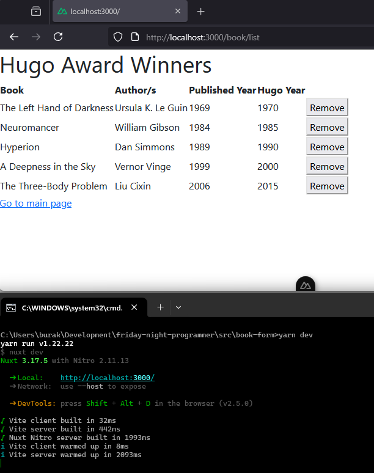
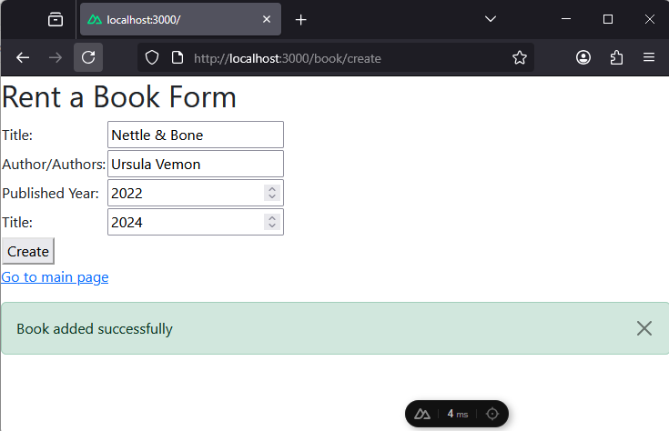

# Nuxt Hello World

Projeyi oluşturmak için Windows 11 ortamında yarn ile aşağıdaki şekilde ilerledim.

```bash
yarn create nuxt book-form

# Projeyi çalıştırmak için(dev mode)
cd book-form
yarn dev --open

# Harici paket yüklemek için (örneğin bootstrap)
yarn add bootstrap
```

## Development Server

Eğer ayarlar değiştirilmezse uygulama `http://localhost:3000`: adresinden ayağa kalkar.

## Production

Production hazırlıkları için,

```bash
yarn build
```

Ve üretime çıkan sürümü test etmek için

```bash
yarn preview
```

## Notlar

Senaryoda Hugo ödülleri almış bilim kurgu eserlerinin girildiği, listelendiği veya silindiği iki basit Vue formu söz konusu. Uygulamada yapılanları şöyle özetleyebiliriz.

- Bilgileri in-memory olarak bir array'de tutulmakta.
- Sayfa bazlı yönlendirmeler söz konusu. Her operasyon ayrı bir sayfaya yönlendirildi.
- Kod tekrarını azaltmak için components, composable, types gibi klasörlerdeki enstrümanlar oluşturuldu.
- Veri okuma, ekleme ve silme işlemleri api klasöründeki servis fonksiyonları ile karşılandı.
- Servis ve sayfa habeleşmesi services içerisindeki bookService nesnesi üzerinden sağlandı.
- CSS framework olarak bootstrap adapte edildi.

Örnek ekran görüntüleri.

İlk açılış;


Listeleme sayfası (/book/list)



Listeye kitap ekleme sayfası



Listeden kitap çıkarma


