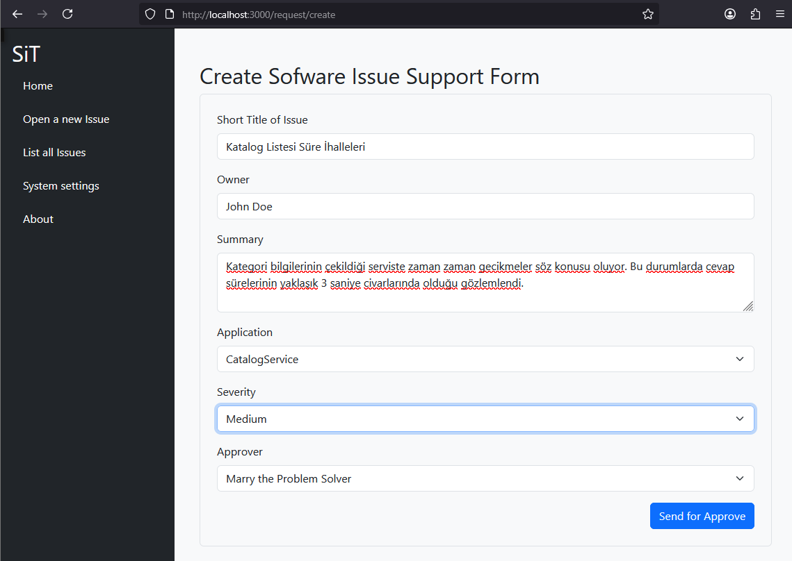
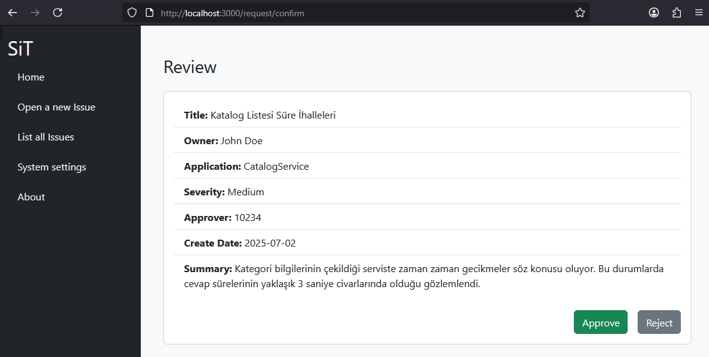

# Yazılım Destek Formu Senaryosu

Senaryoda asıl amaç sayfalar arası veri taşıma yöntemlerinin incelenmesi. Kök senaryoda yazılım destek formu oluşturulması, oluşturulan formun bir onay ekranına gönderilmesi ele alınıyor. Veriyi sayfalar arasında taşımak için ilk etapta in-memory bir array kullanılacak. Bu noktada server side çalışan **pinia** paketi ile ilerlenildi. Onay sayfasında da onaylama durumuna göre verinin SQLite veritabanına yazımı söz konusu. Senaryonun Windows 11 işletim sisteminde, Visual Studio Code kullanılarak yazılıyor ve paket yöneticisi olarak yarn kullanılıyor.

## Projenin Oluşturulması

```bash
yarn create nuxt issue-app

cd issue-app
# Bootstrap CSS desteği için
yarn add bootstrap
# SSR-Server Side Rendering tabanlı state yönetimi için pinia paketinin eklenmesi
yarn add pinia
# SQLite veritabanı kullanımı için
yarn add -D prisma
yarn add @prisma/client
npx prisma init --datasource-provider sqlite
# Dikkat! prisma/schema.prisma içerisinde tablo şemalarını oluşturduktan sonra
# migration planını çalıştırmak için aşağıdaki komut kullanılır
npx prisma migrate dev --name init-db
# Bir ihtimal generate işlemi de gerekebilir
npx prisma generate
# veya
yarn prisma generate

# Projeyi dev modda başlatıp doğrudan tarayıcıyı açmak için
yarn dev --open

# Form onaycıları içinse IssueApproverService'in çalıştırılması gerekiyor.
dotnet run
```

## Projede Kullanılanlar

- Sayfalar arası veri taşıması için in-memory çalışan pinia paketi kullanıldı.
- Çoklu seçim kontrolleri için SelectBox isimli ayrı bir component tasarlandı.
- Çoklu seçim kontrolünün verileri, enum sabitinden (Severity), api router'dan(api/applications) ve IssueApproverService isimli minimal .net API'sinden karşılanır. _(localhost:5099/api/approvers/1 gibi bir taleple sabit onaycı listesi çekilir)_
- Onaylanan form SQLite veritabanına yazılır.

## Çalışma Zamanı

Yeni bir talep formu açılması.



Gözden geçirme ve onaya gönderme ekranı.



Beklenen işlem Approve düğmesine basıldıktan sonra ilgili talebin SQLite veritabanına yazılmasıdır.
