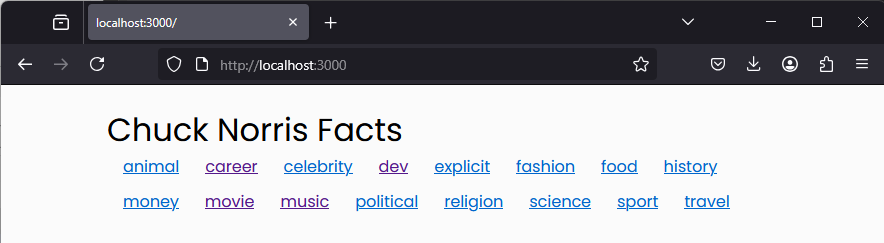
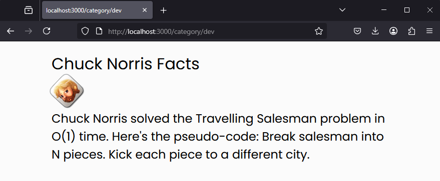
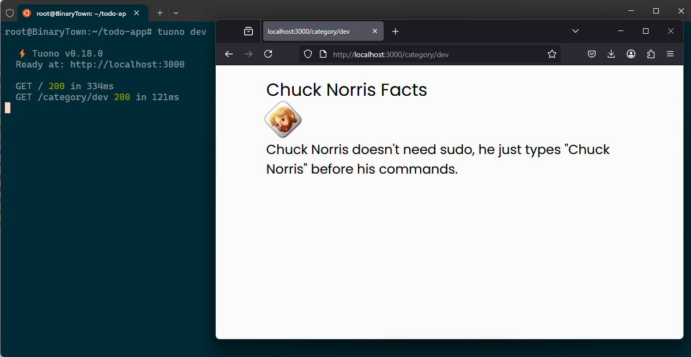

# Norris Facts :D

Tuono' nun 0.18 sürümü ile Windows makinede çalışırken npm install adımlarından sonra hatalar aldım. Bu nedenle örneği WSL tarafına geçirerek Ubuntu platform üzerinde denedim. Kabaca aşağıdaki ekran görüntülerine sahip bir şeyler ortaya çıktı diyebilirim.





Index sayfası [şu](https://api.chucknorris.io/jokes/categories) adreste Chuck Norris şakaları ile ilgili kategorileri çekiyor. Kategoriler esasında routes/category klasörüne yönleniyor. Buradaki dosya adlar [name] ile başlıyor ve aslında bu alias kategori adını temsil ediyor. Eğer category klasöründeki rs dosyasını incelersek

```rust
let category = req.params.get("name").unwrap();
```

ile route' tan gelen kategori adını aldığımız görebiliriz. Sonrasında bu kez bu kategoriden rastgele bir Norris şakası çekmek için farklı bir servis çağrısına gidiyoruz. Örneğin geliştirme kategorisinde bir şakası için [şuraya](https://api.chucknorris.io/jokes/random?category=dev) talep gönderiyoruz. Dönen JSON içerikleri de tsx dosyalarında ele alınıp render işlemlerinde kullanılıyor.

```sh
# Projeyi açmak için
tuono new norris-facts

cd norris-facts

# gerekli Node paketlerini yüklemek için
npm install

# Bu örnekte kullanılan crate'ler
# web api requestleri için reqwest
# backend tarafta bazı problemler oldu terminal logları için log ve env_logger
cargo add reqwest log env_logger

# development ortamını ayağa kaldırmak için
tuono dev

# bu adımdan sonra localhost:3000 ile index sayfasına erişebildim
```


